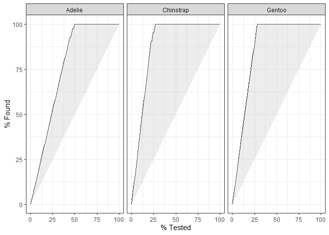

Intro
=====

This notebook tells the basic steps to ML pipeline using
[`{tidymodels}`](https://www.tidymodels.org/) packages, this is a
continuation of [Tidymodels Regression
Walkthrough](./tidymodels_regression_walkthrough.md), but we’ll do a
classification in this case.

The traditional (without tunning) step for a ML pipeline are:

1.  Split the dataset between Training and Testing subsets
    ([`{rsample}`](https://rsample.tidymodels.org/))
2.  Preprocessing and Feature Eng
    [`{recipes}`](https://recipes.tidymodels.org/)
3.  Train a model ([`{parsnip}`](https://parsnip.tidymodels.org/)) using
    training dataset
4.  Predict the outcome using the test dataset
5.  Eval the model performance
    ([`{yardstick}`](https://yardstick.tidymodels.org/))

In this notebook we won’t use the
[`{workflow}`](https://workflows.tidymodels.org/) package, to understand
the building blocks of [`{tidymodels}`](https://www.tidymodels.org/).

(1) training and testing datasets
=================================

``` r
# dataset

# remotes::install_github("allisonhorst/palmerpenguins")
library(palmerpenguins)
library(skimr)
skim(penguins)
```

|                                                  |          |
|:-------------------------------------------------|:---------|
| Name                                             | penguins |
| Number of rows                                   | 344      |
| Number of columns                                | 8        |
| \_\_\_\_\_\_\_\_\_\_\_\_\_\_\_\_\_\_\_\_\_\_\_   |          |
| Column type frequency:                           |          |
| factor                                           | 3        |
| numeric                                          | 5        |
| \_\_\_\_\_\_\_\_\_\_\_\_\_\_\_\_\_\_\_\_\_\_\_\_ |          |
| Group variables                                  | None     |

Data summary

**Variable type: factor**

| skim_variable | n_missing | complete_rate | ordered | n_unique | top_counts                  |
|:--------------|----------:|--------------:|:--------|---------:|:----------------------------|
| species       |         0 |          1.00 | FALSE   |        3 | Ade: 152, Gen: 124, Chi: 68 |
| island        |         0 |          1.00 | FALSE   |        3 | Bis: 168, Dre: 124, Tor: 52 |
| sex           |        11 |          0.97 | FALSE   |        2 | mal: 168, fem: 165          |

**Variable type: numeric**

| skim_variable     | n_missing | complete_rate |    mean |     sd |     p0 |     p25 |     p50 |    p75 |   p100 | hist  |
|:------------------|----------:|--------------:|--------:|-------:|-------:|--------:|--------:|-------:|-------:|:------|
| bill_length_mm    |         2 |          0.99 |   43.92 |   5.46 |   32.1 |   39.23 |   44.45 |   48.5 |   59.6 | ▃▇▇▆▁ |
| bill_depth_mm     |         2 |          0.99 |   17.15 |   1.97 |   13.1 |   15.60 |   17.30 |   18.7 |   21.5 | ▅▅▇▇▂ |
| flipper_length_mm |         2 |          0.99 |  200.92 |  14.06 |  172.0 |  190.00 |  197.00 |  213.0 |  231.0 | ▂▇▃▅▂ |
| body_mass_g       |         2 |          0.99 | 4201.75 | 801.95 | 2700.0 | 3550.00 | 4050.00 | 4750.0 | 6300.0 | ▃▇▆▃▂ |
| year              |         0 |          1.00 | 2008.03 |   0.82 | 2007.0 | 2007.00 | 2008.00 | 2009.0 | 2009.0 | ▇▁▇▁▇ |

``` r
# tidymodel package to split datasets (tr/ts, CV,...)
library(rsample) 

# 1. train/test sets
penguins_split <- rsample::initial_split(penguins)
penguins_split
```

    ## <Analysis/Assess/Total>
    ## <258/86/344>

(2) Preprocessing and Feature Eng
=================================

``` r
# tidymodel package to specify a sequence of transformation steps
library(recipes)

# transform/recipe
penguins_rec <- penguins_split %>%   # origim dataset
  training() %>%                     # training split
  recipe(species ~ ., data=.) %>%    # recipe template
  step_knnimpute(sex) %>%            # fill NA values of colum sex (factor)
  step_knnimpute(all_numeric()) %>%  # fill NA values of all numerical vars
  step_center(all_numeric()) %>%     # normalize to mean = 0
  step_scale(all_numeric()) %>%      # normalize to sd = 1
  step_mutate(year = factor(year, ordered=T)) %>%  # factor in to ordered
  step_dummy(c(island, sex)) %>%    # one hot encoding island and sex factors vars
  prep()                            # calculates recipe parameters

# datasets
penguins_test <- bake(penguins_rec, testing(penguins_split))
penguins_train <- juice(penguins_rec)
```

(3) Training a model
====================

``` r
# tidymodel package the uniforms the machine learnings algorithm interface
library(parsnip) # parsnip is the caret successor

# fit the model
penguins_model <- rand_forest(trees = 100, mode="classification") %>% 
  set_engine("ranger") %>% 
  fit(species ~ ., data=penguins_train)

penguins_model
```

    ## parsnip model object
    ## 
    ## Fit time:  20ms 
    ## Ranger result
    ## 
    ## Call:
    ##  ranger::ranger(x = maybe_data_frame(x), y = y, num.trees = ~100,      num.threads = 1, verbose = FALSE, seed = sample.int(10^5,          1), probability = TRUE) 
    ## 
    ## Type:                             Probability estimation 
    ## Number of trees:                  100 
    ## Sample size:                      258 
    ## Number of independent variables:  8 
    ## Mtry:                             2 
    ## Target node size:                 10 
    ## Variable importance mode:         none 
    ## Splitrule:                        gini 
    ## OOB prediction error (Brier s.):  0.01761894

(4) Prediction
==============

``` r
# predict
predict(penguins_model, penguins_test)
```

    ## # A tibble: 86 x 1
    ##    .pred_class
    ##    <fct>      
    ##  1 Adelie     
    ##  2 Adelie     
    ##  3 Adelie     
    ##  4 Adelie     
    ##  5 Adelie     
    ##  6 Adelie     
    ##  7 Adelie     
    ##  8 Adelie     
    ##  9 Adelie     
    ## 10 Chinstrap  
    ## # ... with 76 more rows

(5) Evaluate Model Performance
==============================

``` r
# tidymodel package for measuring model performances
library(yardstick)

# eval
penguins_pred <- predict(penguins_model, penguins_test) %>%  # class outcome
  bind_cols(predict(penguins_model, penguins_test, type = "prob")) %>% # class probs
  bind_cols(penguins_test) %>% # true value
  relocate(species, everything())

head(penguins_pred)
```

    ## # A tibble: 6 x 13
    ##   species .pred_class .pred_Adelie .pred_Chinstrap .pred_Gentoo bill_length_mm
    ##   <fct>   <fct>              <dbl>           <dbl>        <dbl>          <dbl>
    ## 1 Adelie  Adelie             1              0           0               -0.844
    ## 2 Adelie  Adelie             0.964          0.005       0.0306          -0.899
    ## 3 Adelie  Adelie             1              0           0               -1.83 
    ## 4 Adelie  Adelie             1              0           0               -1.78 
    ## 5 Adelie  Adelie             0.990          0.0004      0.00923         -1.08 
    ## 6 Adelie  Adelie             0.968          0.0297      0.0025          -0.661
    ## # ... with 7 more variables: bill_depth_mm <dbl>, flipper_length_mm <dbl>,
    ## #   body_mass_g <dbl>, year <ord>, island_Dream <dbl>, island_Torgersen <dbl>,
    ## #   sex_male <dbl>

``` r
# metrics
penguins_pred %>% 
  metrics(truth=species, estimate=.pred_class)
```

    ## # A tibble: 2 x 3
    ##   .metric  .estimator .estimate
    ##   <chr>    <chr>          <dbl>
    ## 1 accuracy multiclass     0.965
    ## 2 kap      multiclass     0.945

``` r
# checking AUC metrics
penguins_pred %>% 
  roc_auc(species, .pred_Adelie:.pred_Gentoo)
```

    ## # A tibble: 1 x 3
    ##   .metric .estimator .estimate
    ##   <chr>   <chr>          <dbl>
    ## 1 roc_auc hand_till      0.999

``` r
# plotting ROC curve
penguins_pred %>% 
  roc_curve(species, .pred_Adelie:.pred_Gentoo) %>% 
  tune::autoplot() # tune is a tidymodel package to find hyper-parameters
```


``` r
# checking gain
penguins_pred %>% 
  gain_curve(species, .pred_Adelie:.pred_Gentoo) %>% 
  tune::autoplot() # tune is a tidymodel package to find hyper-parameters
```


\# full code

``` r
# dataset

# remotes::install_github("allisonhorst/palmerpenguins")
library(palmerpenguins)
library(skimr)
skim(penguins)


# tidymodel package to split datasets (tr/ts, CV,...)
library(rsample) 

# 1. train/test sets
penguins_split <- rsample::initial_split(penguins)
penguins_split


# tidymodel package to specify a sequence of transformation steps
library(recipes)

# 2. transform/recipe
penguins_rec <- penguins_split %>%   # origim dataset
  training() %>%                     # training split
  recipe(species ~ ., data=.) %>%    # recipe template
  step_knnimpute(sex) %>%            # fill NA values of colum sex (factor)
  step_knnimpute(all_numeric()) %>%  # fill NA values of all numerical vars
  step_center(all_numeric()) %>%     # normalize to mean = 0
  step_scale(all_numeric()) %>%      # normalize to sd = 1
  step_mutate(year = factor(year, ordered=T)) %>%  # factor in to ordered
  step_dummy(c(island, sex)) %>%    # one hot encoding island and sex factors vars
  prep()                            # calculates recipe parameters

# datasets
penguins_test <- bake(penguins_rec, testing(penguins_split))
penguins_train <- juice(penguins_rec)

# tidymodel package the uniforms the machine learnings algorithm interface
library(parsnip) # parsnip is the caret successor

# 3. fit the model
penguins_model <- rand_forest(trees = 100, mode="classification") %>% 
  set_engine("ranger") %>% 
  fit(species ~ ., data=penguins_train)

penguins_model

# 4. predict
predict(penguins_model, penguins_test)

# tidymodel package for measuring model performances
library(yardstick)

# 5. eval
penguins_pred <- predict(penguins_model, penguins_test) %>%  # class outcome
  bind_cols(predict(penguins_model, penguins_test, type = "prob")) %>% # class probs
  bind_cols(penguins_test) %>% # true value
  relocate(species, everything())

head(penguins_pred)

# metrics
penguins_pred %>% 
  metrics(truth=species, estimate=.pred_class)

# checking AUC metrics
penguins_pred %>% 
  roc_auc(species, .pred_Adelie:.pred_Gentoo)

# plotting ROC curve
penguins_pred %>% 
  roc_curve(species, .pred_Adelie:.pred_Gentoo) %>% 
  tune::autoplot() # tune is a tidymodel package to find hyper-parameters

# checking gain
penguins_pred %>% 
  gain_curve(species, .pred_Adelie:.pred_Gentoo) %>% 
  tune::autoplot() # tune is a tidymodel package to find hyper-parameters
```
