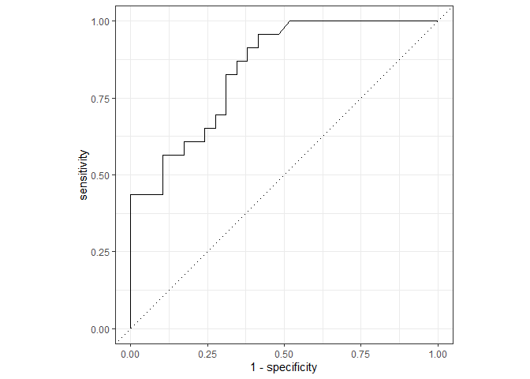

Intro
=====

This notebook tells the basic steps to build ML XGBoost pipeline with
hyperparametrization using [`{tidymodels}`](https://www.tidymodels.org/)
packages, this is a continuation of [Tidymodels Regression
Walkthrough](./tidymodels_regression_walkthrough.md), but we’ll do a
classification in this case.

The traditional steps for a ML pipeline are, with hyperparameter tunning
are:

1.  Split the dataset between Training and Testing subsets
    ([`{rsample}`](https://rsample.tidymodels.org/))
2.  Preprocessing and Feature Eng
    ([`{recipes}`](https://recipes.tidymodels.org/))
3.  Define a model to perform hyperparameter tunning
    ([`{parsnip}`](https://parsnip.tidymodels.org/) +
    [`{tune}`](https://tune.tidymodels.org/))
4.  Create a Cross Validation Folds
    ([`{rsample}`](https://rsample.tidymodels.org/)) from training
    dataset and the hyperparameter grid
    ([`{dials}`](https://dials.tidymodels.org/).
5.  Train a model cross CV and hyperparmeters grid
    ([`{workflow}`](https://workflows.tidymodels.org/))
6.  Eval the hyperparameters performance
    ([`{tune}`](https://tune.tidymodels.org/)), choose the best and
    re-traning the model in the whole training set
    ([`{workflow}`](https://workflows.tidymodels.org/)).
7.  Predict the outcome using the test dataset
8.  Eval the model performance
    ([`{yardstick}`](https://yardstick.tidymodels.org/))

1. split
========

Using the
[{mlbench}](https://cran.r-project.org/web/packages/mlbench/index.html)’s
Sonar dataset. This is the data set used by Gorman and Sejnowski in
their study of the classification of sonar signals using a neural
network \[1\]. The task is to train a network to discriminate between
sonar signals bounced off a metal cylinder and those bounced off a
roughly cylindrical rock. Each pattern is a set of 60 numbers in the
range 0.0 to 1.0. Each number represents the energy within a particular
frequency band, integrated over a certain period of time. The
integration aperture for higher frequencies occur later in time, since
these frequencies are transmitted later during the chirp. The label
associated with each record contains the letter “R” if the object is a
rock and “M” if it is a mine (metal cylinder). The numbers in the labels
are in increasing order of aspect angle, but they do not encode the
angle directly

``` r
# Sonar Database
library(mlbench)
data(Sonar)

# overview
library(skimr)
skim(Sonar)
```

|                                                  |       |
|:-------------------------------------------------|:------|
| Name                                             | Sonar |
| Number of rows                                   | 208   |
| Number of columns                                | 61    |
| \_\_\_\_\_\_\_\_\_\_\_\_\_\_\_\_\_\_\_\_\_\_\_   |       |
| Column type frequency:                           |       |
| factor                                           | 1     |
| numeric                                          | 60    |
| \_\_\_\_\_\_\_\_\_\_\_\_\_\_\_\_\_\_\_\_\_\_\_\_ |       |
| Group variables                                  | None  |

Data summary

**Variable type: factor**

| skim_variable | n_missing | complete_rate | ordered | n_unique | top_counts    |
|:--------------|----------:|--------------:|:--------|---------:|:--------------|
| Class         |         0 |             1 | FALSE   |        2 | M: 111, R: 97 |

**Variable type: numeric**

| skim_variable | n_missing | complete_rate | mean |   sd |   p0 |  p25 |  p50 |  p75 | p100 | hist  |
|:--------------|----------:|--------------:|-----:|-----:|-----:|-----:|-----:|-----:|-----:|:------|
| V1            |         0 |             1 | 0.03 | 0.02 | 0.00 | 0.01 | 0.02 | 0.04 | 0.14 | ▇▃▁▁▁ |
| V2            |         0 |             1 | 0.04 | 0.03 | 0.00 | 0.02 | 0.03 | 0.05 | 0.23 | ▇▂▁▁▁ |
| V3            |         0 |             1 | 0.04 | 0.04 | 0.00 | 0.02 | 0.03 | 0.06 | 0.31 | ▇▂▁▁▁ |
| V4            |         0 |             1 | 0.05 | 0.05 | 0.01 | 0.02 | 0.04 | 0.06 | 0.43 | ▇▁▁▁▁ |
| V5            |         0 |             1 | 0.08 | 0.06 | 0.01 | 0.04 | 0.06 | 0.10 | 0.40 | ▇▃▁▁▁ |
| V6            |         0 |             1 | 0.10 | 0.06 | 0.01 | 0.07 | 0.09 | 0.13 | 0.38 | ▇▇▂▁▁ |
| V7            |         0 |             1 | 0.12 | 0.06 | 0.00 | 0.08 | 0.11 | 0.15 | 0.37 | ▃▇▃▁▁ |
| V8            |         0 |             1 | 0.13 | 0.09 | 0.01 | 0.08 | 0.11 | 0.17 | 0.46 | ▆▇▂▁▁ |
| V9            |         0 |             1 | 0.18 | 0.12 | 0.01 | 0.10 | 0.15 | 0.23 | 0.68 | ▇▆▂▁▁ |
| V10           |         0 |             1 | 0.21 | 0.13 | 0.01 | 0.11 | 0.18 | 0.27 | 0.71 | ▇▇▃▁▁ |
| V11           |         0 |             1 | 0.24 | 0.13 | 0.03 | 0.13 | 0.22 | 0.30 | 0.73 | ▆▇▂▁▁ |
| V12           |         0 |             1 | 0.25 | 0.14 | 0.02 | 0.13 | 0.25 | 0.33 | 0.71 | ▇▇▆▂▁ |
| V13           |         0 |             1 | 0.27 | 0.14 | 0.02 | 0.17 | 0.26 | 0.35 | 0.71 | ▅▇▅▂▁ |
| V14           |         0 |             1 | 0.30 | 0.16 | 0.03 | 0.18 | 0.28 | 0.39 | 1.00 | ▇▇▃▁▁ |
| V15           |         0 |             1 | 0.32 | 0.21 | 0.00 | 0.16 | 0.28 | 0.45 | 1.00 | ▇▇▅▂▁ |
| V16           |         0 |             1 | 0.38 | 0.23 | 0.02 | 0.20 | 0.30 | 0.54 | 1.00 | ▇▇▅▃▁ |
| V17           |         0 |             1 | 0.42 | 0.26 | 0.03 | 0.21 | 0.31 | 0.66 | 1.00 | ▇▇▃▅▃ |
| V18           |         0 |             1 | 0.45 | 0.26 | 0.04 | 0.24 | 0.37 | 0.68 | 1.00 | ▆▇▂▅▃ |
| V19           |         0 |             1 | 0.50 | 0.26 | 0.05 | 0.30 | 0.43 | 0.73 | 1.00 | ▃▇▃▅▅ |
| V20           |         0 |             1 | 0.56 | 0.26 | 0.07 | 0.35 | 0.54 | 0.81 | 1.00 | ▅▇▆▆▇ |
| V21           |         0 |             1 | 0.61 | 0.26 | 0.05 | 0.40 | 0.62 | 0.82 | 1.00 | ▃▅▆▇▇ |
| V22           |         0 |             1 | 0.62 | 0.26 | 0.02 | 0.41 | 0.66 | 0.83 | 1.00 | ▂▅▃▇▇ |
| V23           |         0 |             1 | 0.65 | 0.25 | 0.06 | 0.45 | 0.70 | 0.85 | 1.00 | ▂▃▃▆▇ |
| V24           |         0 |             1 | 0.67 | 0.24 | 0.02 | 0.54 | 0.70 | 0.87 | 1.00 | ▂▂▅▇▇ |
| V25           |         0 |             1 | 0.68 | 0.24 | 0.02 | 0.53 | 0.72 | 0.87 | 1.00 | ▁▂▃▆▇ |
| V26           |         0 |             1 | 0.70 | 0.24 | 0.09 | 0.54 | 0.75 | 0.89 | 1.00 | ▂▂▃▅▇ |
| V27           |         0 |             1 | 0.70 | 0.25 | 0.05 | 0.53 | 0.75 | 0.92 | 1.00 | ▁▂▃▃▇ |
| V28           |         0 |             1 | 0.69 | 0.24 | 0.03 | 0.53 | 0.73 | 0.90 | 1.00 | ▁▂▃▅▇ |
| V29           |         0 |             1 | 0.64 | 0.24 | 0.01 | 0.46 | 0.68 | 0.85 | 1.00 | ▁▃▆▅▇ |
| V30           |         0 |             1 | 0.58 | 0.22 | 0.06 | 0.41 | 0.61 | 0.74 | 1.00 | ▂▆▇▇▅ |
| V31           |         0 |             1 | 0.50 | 0.21 | 0.05 | 0.35 | 0.49 | 0.64 | 0.97 | ▂▇▇▅▃ |
| V32           |         0 |             1 | 0.44 | 0.21 | 0.04 | 0.28 | 0.43 | 0.58 | 0.93 | ▅▇▇▅▂ |
| V33           |         0 |             1 | 0.42 | 0.21 | 0.05 | 0.26 | 0.39 | 0.56 | 1.00 | ▅▇▆▃▁ |
| V34           |         0 |             1 | 0.40 | 0.23 | 0.02 | 0.22 | 0.35 | 0.60 | 0.96 | ▆▇▅▅▂ |
| V35           |         0 |             1 | 0.39 | 0.26 | 0.02 | 0.18 | 0.31 | 0.59 | 1.00 | ▇▇▃▅▂ |
| V36           |         0 |             1 | 0.38 | 0.26 | 0.01 | 0.15 | 0.32 | 0.56 | 1.00 | ▇▆▅▃▂ |
| V37           |         0 |             1 | 0.36 | 0.24 | 0.04 | 0.16 | 0.31 | 0.52 | 0.95 | ▇▆▅▂▂ |
| V38           |         0 |             1 | 0.34 | 0.21 | 0.04 | 0.17 | 0.31 | 0.44 | 1.00 | ▇▇▃▂▁ |
| V39           |         0 |             1 | 0.33 | 0.20 | 0.04 | 0.17 | 0.28 | 0.43 | 0.99 | ▇▇▃▂▁ |
| V40           |         0 |             1 | 0.31 | 0.18 | 0.01 | 0.19 | 0.28 | 0.42 | 0.93 | ▅▇▃▂▁ |
| V41           |         0 |             1 | 0.29 | 0.17 | 0.04 | 0.16 | 0.26 | 0.39 | 0.90 | ▇▇▃▂▁ |
| V42           |         0 |             1 | 0.28 | 0.17 | 0.01 | 0.16 | 0.25 | 0.38 | 0.82 | ▆▇▅▂▁ |
| V43           |         0 |             1 | 0.25 | 0.14 | 0.00 | 0.16 | 0.22 | 0.32 | 0.77 | ▃▇▃▁▁ |
| V44           |         0 |             1 | 0.21 | 0.13 | 0.00 | 0.13 | 0.18 | 0.27 | 0.78 | ▇▇▂▁▁ |
| V45           |         0 |             1 | 0.20 | 0.15 | 0.00 | 0.09 | 0.15 | 0.23 | 0.70 | ▇▆▁▂▁ |
| V46           |         0 |             1 | 0.16 | 0.13 | 0.00 | 0.07 | 0.12 | 0.20 | 0.73 | ▇▃▁▁▁ |
| V47           |         0 |             1 | 0.12 | 0.09 | 0.00 | 0.06 | 0.10 | 0.15 | 0.55 | ▇▅▁▁▁ |
| V48           |         0 |             1 | 0.09 | 0.06 | 0.00 | 0.05 | 0.08 | 0.12 | 0.33 | ▇▇▃▁▁ |
| V49           |         0 |             1 | 0.05 | 0.04 | 0.00 | 0.03 | 0.04 | 0.07 | 0.20 | ▇▆▂▁▁ |
| V50           |         0 |             1 | 0.02 | 0.01 | 0.00 | 0.01 | 0.02 | 0.03 | 0.08 | ▇▇▂▁▁ |
| V51           |         0 |             1 | 0.02 | 0.01 | 0.00 | 0.01 | 0.01 | 0.02 | 0.10 | ▇▃▁▁▁ |
| V52           |         0 |             1 | 0.01 | 0.01 | 0.00 | 0.01 | 0.01 | 0.02 | 0.07 | ▇▃▁▁▁ |
| V53           |         0 |             1 | 0.01 | 0.01 | 0.00 | 0.01 | 0.01 | 0.01 | 0.04 | ▇▆▂▁▁ |
| V54           |         0 |             1 | 0.01 | 0.01 | 0.00 | 0.01 | 0.01 | 0.01 | 0.04 | ▇▇▂▂▁ |
| V55           |         0 |             1 | 0.01 | 0.01 | 0.00 | 0.00 | 0.01 | 0.01 | 0.04 | ▇▃▁▁▁ |
| V56           |         0 |             1 | 0.01 | 0.01 | 0.00 | 0.00 | 0.01 | 0.01 | 0.04 | ▇▅▁▁▁ |
| V57           |         0 |             1 | 0.01 | 0.01 | 0.00 | 0.00 | 0.01 | 0.01 | 0.04 | ▇▅▁▁▁ |
| V58           |         0 |             1 | 0.01 | 0.01 | 0.00 | 0.00 | 0.01 | 0.01 | 0.04 | ▇▃▁▁▁ |
| V59           |         0 |             1 | 0.01 | 0.01 | 0.00 | 0.00 | 0.01 | 0.01 | 0.04 | ▇▃▁▁▁ |
| V60           |         0 |             1 | 0.01 | 0.01 | 0.00 | 0.00 | 0.01 | 0.01 | 0.04 | ▇▂▁▁▁ |

``` r
# Full load 
library(tidymodels)

# 1. splits
sonar_split <- initial_split(Sonar)
sonar_split
```

    ## <Analysis/Assess/Total>
    ## <156/52/208>

2. Preprocessing and Feature Eng
================================

``` r
sonar_recip <- sonar_split %>% 
  training() %>% 
  recipe(Class ~ .) %>%             # try to predict the class
  step_nzv(all_predictors()) %>%    # remove near zero variation
  step_center(all_predictors()) %>% # normalize do mean = 0
  step_scale(all_predictors()) %>%  # normalize do sd = 1
  prep()                            # calculate the transformation parameters
```

3 Define a model to perform hyperparameter tunning
==================================================

``` r
# define the tunable model
xgb_tune_eng <- boost_tree(
    mode = "classification", 
    trees = tune(), # tune acts like a "placeholder mark" to fill later 
    min_n = tune(),
    tree_depth = tune(),
    learn_rate = tune(),
    loss_reduction = tune()
  ) %>% 
  set_engine("xgboost")
```

4 CV and Hyperparameters Grid
=============================

``` r
# create a CV from transformed training set
sonar_cv <- sonar_split %>% 
  training() %>% 
  vfold_cv(5)

# define the tune grid
xgb_grid <- grid_max_entropy(
  trees(), min_n(), tree_depth(), learn_rate(), loss_reduction(),
  size=60
)
xgb_grid
```

    ## # A tibble: 60 x 5
    ##    trees min_n tree_depth learn_rate loss_reduction
    ##    <int> <int>      <int>      <dbl>          <dbl>
    ##  1   722     9          7   1.48e- 7 0.0316        
    ##  2   343    16          2   3.18e-10 0.000000000305
    ##  3   109     7          6   1.02e- 4 0.00000184    
    ##  4  1512    30          6   1.84e- 7 0.0398        
    ##  5   453    19          3   6.09e- 9 2.47          
    ##  6    39    39          1   2.09e- 3 7.97          
    ##  7  1954    38         12   1.23e-10 0.000518      
    ##  8  1133    25         15   9.28e- 7 5.96          
    ##  9  1879     5         13   1.00e- 2 0.0000103     
    ## 10   157    38         11   4.01e- 2 0.0000617     
    ## # ... with 50 more rows

5 Train a model cross CV and hyperparmeters grid
================================================

``` r
# speed up computation with parallel processing (optional)
library(doParallel)
all_cores <- parallel::detectCores(logical = FALSE)
registerDoParallel(cores = all_cores)

# WF
xgb_wf <- workflow() %>% 
  add_model(xgb_tune_eng) %>% 
  add_formula(Class ~ .)

# Perform the CV x Par Grid training
# gets the performance 
xgb_tune_res <- xgb_wf %>% 
  tune_grid(resamples=sonar_cv, grid=xgb_grid)

xgb_tune_res
```

    ## # Tuning results
    ## # 5-fold cross-validation 
    ## # A tibble: 5 x 4
    ##   splits           id    .metrics           .notes          
    ##   <list>           <chr> <list>             <list>          
    ## 1 <split [124/32]> Fold1 <tibble [120 x 9]> <tibble [0 x 1]>
    ## 2 <split [125/31]> Fold2 <tibble [120 x 9]> <tibble [0 x 1]>
    ## 3 <split [125/31]> Fold3 <tibble [120 x 9]> <tibble [0 x 1]>
    ## 4 <split [125/31]> Fold4 <tibble [120 x 9]> <tibble [0 x 1]>
    ## 5 <split [125/31]> Fold5 <tibble [120 x 9]> <tibble [0 x 1]>

6 Eval the hyperparameters performance
======================================

``` r
# what are the results
xgb_tune_res %>% 
  collect_metrics()
```

    ## # A tibble: 120 x 11
    ##    trees min_n tree_depth learn_rate loss_reduction .metric .estimator  mean
    ##    <int> <int>      <int>      <dbl>          <dbl> <chr>   <chr>      <dbl>
    ##  1  1727     3          3   1.35e- 6 0.0000130      accura~ binary     0.712
    ##  2  1727     3          3   1.35e- 6 0.0000130      roc_auc binary     0.788
    ##  3  1253     4          9   1.75e- 7 0.000000562    accura~ binary     0.744
    ##  4  1253     4          9   1.75e- 7 0.000000562    roc_auc binary     0.823
    ##  5  1971     5         12   4.65e-10 0.000000000731 accura~ binary     0.743
    ##  6  1971     5         12   4.65e-10 0.000000000731 roc_auc binary     0.831
    ##  7  1139     5         12   2.05e- 3 0.00000000800  accura~ binary     0.801
    ##  8  1139     5         12   2.05e- 3 0.00000000800  roc_auc binary     0.878
    ##  9  1879     5         13   1.00e- 2 0.0000103      accura~ binary     0.827
    ## 10  1879     5         13   1.00e- 2 0.0000103      roc_auc binary     0.902
    ## # ... with 110 more rows, and 3 more variables: n <int>, std_err <dbl>,
    ## #   .config <chr>

``` r
# show the best results (in ROC AUC metric)
xgb_tune_res %>% 
  show_best(metric = "roc_auc")
```

    ## # A tibble: 5 x 11
    ##   trees min_n tree_depth learn_rate loss_reduction .metric .estimator  mean
    ##   <int> <int>      <int>      <dbl>          <dbl> <chr>   <chr>      <dbl>
    ## 1  1879     5         13    1.00e-2  0.0000103     roc_auc binary     0.902
    ## 2  1157     6          6    3.86e-2  0.0000000114  roc_auc binary     0.897
    ## 3  1139     5         12    2.05e-3  0.00000000800 roc_auc binary     0.878
    ## 4    21     8          4    8.51e-2  0.00276       roc_auc binary     0.868
    ## 5  1162     5         15    4.85e-9  0.0000150     roc_auc binary     0.834
    ## # ... with 3 more variables: n <int>, std_err <dbl>, .config <chr>

``` r
# prepare the workflow with the best parameter
xgb_wf <- xgb_wf %>% 
  finalize_workflow(select_best(xgb_tune_res,"roc_auc")) 

xgb_wf
```

    ## == Workflow ====================================================================
    ## Preprocessor: Formula
    ## Model: boost_tree()
    ## 
    ## -- Preprocessor ----------------------------------------------------------------
    ## Class ~ .
    ## 
    ## -- Model -----------------------------------------------------------------------
    ## Boosted Tree Model Specification (classification)
    ## 
    ## Main Arguments:
    ##   trees = 1879
    ##   min_n = 5
    ##   tree_depth = 13
    ##   learn_rate = 0.0100250099418767
    ##   loss_reduction = 1.03063541744557e-05
    ## 
    ## Computational engine: xgboost

``` r
# final fit
xgb_fit <- xgb_wf %>% 
  fit(training(sonar_split))
```

    ## [08:30:31] WARNING: amalgamation/../src/learner.cc:1095: Starting in XGBoost 1.3.0, the default evaluation metric used with the objective 'binary:logistic' was changed from 'error' to 'logloss'. Explicitly set eval_metric if you'd like to restore the old behavior.

7 Predit on Testing set
=======================

``` r
# make the prediction 
xgb_pred <- predict(xgb_fit, testing(sonar_split)) %>% 
  bind_cols(select(testing(sonar_split), Class))
```

8. Eval performance result
==========================

``` r
# confusion matrix
xgb_pred %>% 
  conf_mat(truth=Class, estimate=.pred_class)
```

    ##           Truth
    ## Prediction  M  R
    ##          M 24 10
    ##          R  4 14

``` r
# performance metrics
xgb_pred %>% 
  metrics(truth=Class, estimate=.pred_class)
```

    ## # A tibble: 2 x 3
    ##   .metric  .estimator .estimate
    ##   <chr>    <chr>          <dbl>
    ## 1 accuracy binary         0.731
    ## 2 kap      binary         0.448

``` r
# ROC AUC Stats
predict(xgb_fit, bake(sonar_recip, testing(sonar_split)), type="prob") %>% 
  bind_cols(select(testing(sonar_split), Class)) %>% 
  roc_auc(truth=Class, .pred_M )
```

    ## # A tibble: 1 x 3
    ##   .metric .estimator .estimate
    ##   <chr>   <chr>          <dbl>
    ## 1 roc_auc binary         0.759

``` r
#Seem ROC curve
predict(xgb_fit, bake(sonar_recip, testing(sonar_split)), type="prob") %>% 
  bind_cols(select(testing(sonar_split), Class)) %>% 
  roc_curve(truth=Class, .pred_M ) %>% 
  autoplot()
```


\# Full Code

``` r
# 1. split

# Sonar Database
library(mlbench)
data(Sonar)

# overview
library(skimr)
skim(Sonar)

# Full load 
library(tidymodels)

# 1. splits
sonar_split <- initial_split(Sonar)
sonar_split

# 2. Preprocessing and Feature Eng

sonar_recip <- sonar_split %>% 
  training() %>% 
  recipe(Class ~ .) %>%             # try to predict the class
  step_nzv(all_predictors()) %>%    # remove near zero variation
  step_center(all_predictors()) %>% # normalize do mean = 0
  step_scale(all_predictors()) %>%  # normalize do sd = 1
  prep()                            # calculate the transformation parameters


# 3 Define a model to perform hyperparameter tunning

# define the tunable model
xgb_tune_eng <- boost_tree(
    mode = "classification", 
    trees = tune(), # tune acts like a "placeholder mark" to fill later 
    min_n = tune(),
    tree_depth = tune(),
    learn_rate = tune(),
    loss_reduction = tune()
  ) %>% 
  set_engine("xgboost")


# 4 CV and Hyperparameters Grid

# create a CV from transformed training set
sonar_cv <- sonar_split %>% 
  training() %>% 
  vfold_cv(5)

# define the tune grid
xgb_grid <- grid_max_entropy(
  trees(), min_n(), tree_depth(), learn_rate(), loss_reduction(),
  size=60
)
xgb_grid


# 5 Train a model cross CV and hyperparmeters grid

# speed up computation with parallel processing (optional)
library(doParallel)
all_cores <- parallel::detectCores(logical = FALSE)
registerDoParallel(cores = all_cores)

# WF
xgb_wf <- workflow() %>% 
  add_model(xgb_tune_eng) %>% 
  add_formula(Class ~ .)

# Perform the CV x Par Grid training
# gets the performance 
xgb_tune_res <- xgb_wf %>% 
  tune_grid(resamples=sonar_cv, grid=xgb_grid)

xgb_tune_res


# 6 Eval the hyperparameters performance

# what are the results
xgb_tune_res %>% 
  collect_metrics()

# show the best results (in ROC AUC metric)
xgb_tune_res %>% 
  show_best(metric = "roc_auc")

# prepare the workflow with the best parameter
xgb_wf <- xgb_wf %>% 
  finalize_workflow(select_best(xgb_tune_res,"roc_auc")) 

xgb_wf

# final fit
xgb_fit <- xgb_wf %>% 
  fit(training(sonar_split))

# 7 Predit on Testing set

# make the prediction 
xgb_pred <- predict(xgb_fit, testing(sonar_split)) %>% 
  bind_cols(select(testing(sonar_split), Class))


# 8. Eval performance result

# confusion matrix
xgb_pred %>% 
  conf_mat(truth=Class, estimate=.pred_class)

# performance metrics
xgb_pred %>% 
  metrics(truth=Class, estimate=.pred_class)

# ROC AUC Stats
predict(xgb_fit, bake(sonar_recip, testing(sonar_split)), type="prob") %>% 
  bind_cols(select(testing(sonar_split), Class)) %>% 
  roc_auc(truth=Class, .pred_M )
  
#Seem ROC curve
predict(xgb_fit, bake(sonar_recip, testing(sonar_split)), type="prob") %>% 
  bind_cols(select(testing(sonar_split), Class)) %>% 
  roc_curve(truth=Class, .pred_M ) %>% 
  autoplot()
```
