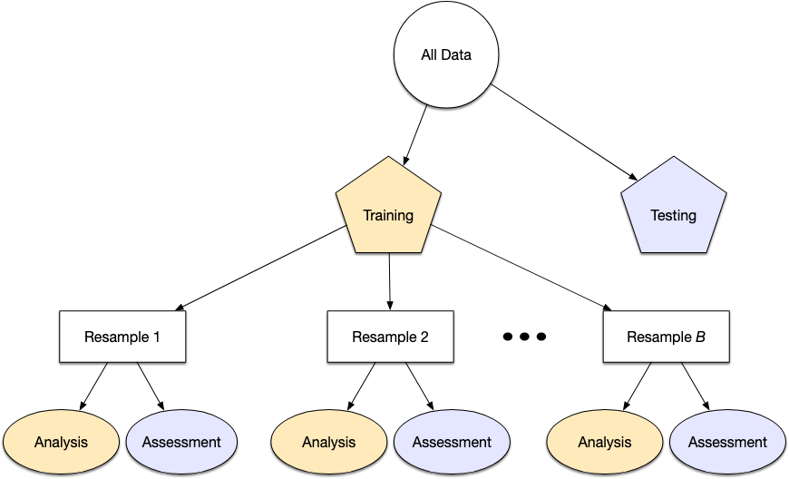

# Performance

We usually need to understand the performance of a model or even multiple models before using the _test set_. 

> The _test set_ can be used only one time, for final evaluation, the fine tunning must be made in training set.

## Substitution Methods

```{r}
library(tidymodels)
data(ames)
ames <- mutate(ames, Sale_Price = log10(Sale_Price))

set.seed(502)
ames_split <- initial_split(ames, prop = 0.80, strata = Sale_Price)
ames_train <- training(ames_split)
ames_test  <-  testing(ames_split)

ames_rec <- 
  recipe(Sale_Price ~ Neighborhood + Gr_Liv_Area + Year_Built + Bldg_Type + 
           Latitude + Longitude, data = ames_train) %>%
  step_log(Gr_Liv_Area, base = 10) %>% 
  step_other(Neighborhood, threshold = 0.01) %>% 
  step_dummy(all_nominal_predictors()) %>% 
  step_interact( ~ Gr_Liv_Area:starts_with("Bldg_Type_") ) %>% 
  step_ns(Latitude, Longitude, deg_free = 20)
  
lm_model <- linear_reg() %>% set_engine("lm")

lm_wflow <- 
  workflow() %>% 
  add_model(lm_model) %>% 
  add_recipe(ames_rec)

lm_fit <- fit(lm_wflow, ames_train)
```

Let`s fit a _Random Forest_:

```{r}
rf_model <- 
  rand_forest(trees=1000) |> 
  set_engine("ranger") |> 
  set_mode("regression")

rf_model

rf_wflow <- 
  workflow() |> 
  add_formula(
    Sale_Price ~ Neighborhood + Gr_Liv_Area + Year_Built + Bldg_Type + Latitude + Longitude) |> 
  add_model(rf_model
  )

rf_wflow

rf_fit <- rf_wflow |> fit(data=ames_train)
rf_fit
```

How should we campare the linear and random forest models?


For demonstration, we will predict the training set to produce what is known as an apparent metric or resubstitution metric. This function creates predictions and formats the results:

```{r}

estimate_perf <- function(model, dat) {
  cl <- match.call()
  obj_name <- as.character(cl$model)
  data_name <- as.character(cl$dat)
  data_name <- gsub("ames_","", data_name)
  
  reg_metrics <- metric_set(rmse, rsq)
  
  model |> 
    predict(dat) |> 
    bind_cols(dat |>select(Sale_Price)) |> 
    reg_metrics(Sale_Price, .pred) |> 
    select(-.estimator) |> 
    mutate(object = obj_name, data=data_name)
}

```

Both _RMSE_ and _Rˆ2_ are computed. The resubstitution statistics are:

```{r}
estimate_perf(rf_fit, ames_train)
estimate_perf(lm_fit, ames_train)
```

Based on these results, the RF Model is much more capable of predicting the sale price. RF is two-fold better in RMSE. The next step is apply the RF model to the test set for final verification:

```{r}
estimate_perf(rf_fit, ames_test)
estimate_perf(lm_fit, ames_test)
```

In the test set, the RMSE estimate if much worse than the training set. RF is a _low bias model_, models that are capable to learning complex trends from the data, and can sometimes result in a model nearly memorizing the training set


```{r}
bind_rows(
estimate_perf(rf_fit, ames_train),
estimate_perf(lm_fit, ames_train),
estimate_perf(rf_fit, ames_test),
estimate_perf(lm_fit, ames_test)) |> 
  filter(.metric == "rmse" ) |> 
  pivot_wider(id_cols=object, names_from = data, values_from = .estimate) |> 
  arrange(object)
```
 
> Repredicting the training set will result in a artificially optimistic estimate of performance.

Resampling methods, such as cross-validation or validation sets, are the soluctino

## Resampling methods



Resampling is conducted only on the training set. The test set is not involved:

 + The model is fit with the analysis set
 + The model is evaluated with the assessment set
 
Suppose 20 iterations of resampling are conducted. This means that 20 separate models are fit on the analysis sets, and the corresponding assessment sets produce 20 sets of performance statistics. The final estimate of performance for a model is the average of the 20 replicates of the statistics. This average has very good generalization properties and is far better than the resubstitution estimates.


### Cross-Validation

Cross-validation is a well established resampling method. While there are a number of variations, the most common cross-validation method is V-fold cross-validation. The data are randomly partitioned into V sets of roughly equal size (called the folds). For illustration, V = 3 is shown in Figure 10.2 for a data set of 30 training set points with random fold allocations. The number inside the symbols is the sample number.


For each iteration, one fold is held out for assessment statistics and the remaining folds are substrate for the model. This process continues for each fold so that three models produce three sets of performance statistics.


> What are the effects of changing V? Larger values result in resampling estimates with small bias but substantial variance. Smaller values of V have large bias but low variance. We prefer 10-fold since noise is reduced by replication, but bias is not.


```{r}

set.seed(1001) 
ames_fold <- vfold_cv(ames_train, v=10)
ames_fold

```

The column named `splits` contains the information on how to split the data (similar to the object used to create the initial training/test partition). While each row of splits has an embedded copy of the entire training set, R is smart enough not to make copies of the data in memory.

The print method inside of the tibble shows the frequency of each: `[2107/235]` indicates that about two thousand samples are in the analysis set and `235` are in that particular assessment set.

To manually retrieve the partitioned data, the `analysis()` and `assessment()` functions return the corresponding data frames:

```{r}
ames_fold$splits[[1]] |> 
  analysis()
```

### Repeated Cross-Validation

Depending on data size or other characteristics, the resampling estimate produced by V-fold cross-validation may be excessively noisy. As with many statistical problems, one way to reduce noise is to gather more data. For cross-validation, this means averaging more than V statistics.

To create R repeats of V-fold cross-validation, the same fold generation process is done R times to generate R collections of V partitions. Now, instead of averaging V statistics, V × R statistics produce the final resampling estimate.

To create repeats, invoke `vfold_cv()` with an additional argument `repeats`:

```{r}
vfold_cv(ames_train, v=10, repeats = 5)
```

## Estimating Performance

The process to use resampling to evaluate the modeling process is:

1. During resampling, the analysis set is used to preprocess the data, apply the pre processing to itself, and use these processed data to fit the model
1. The preprocessing statistics produced by the analysis set are applied to the asessment set. The predictions from the assessment set estimate performance on new data.

This sequence reapeats for every resample. This sequence repeats for every resample. If there are B resamples, there are B replicates of each of the performance metrics. The final resampling estimate is the average of these B statistics. 

The `fit_resamples()` functions is analogous to `fit()`, but instead of having a `data` argument, `fit_resamples()` has `resamples`, which expects an `rset` object.

```{r eval=FALSE}
# possible interfaces
model_spec |> fit_resamples(foruma, resamples, ...)
model_spec |> fit_resamples(recipe, resamples, ...)
workflow   |> fit_resamples(        resamples, ...)
```

There are a number of other optional arguments, such as: 
+ `metrics`, 
+ `control` (created by `control_resamples()`)
++ `vebose`
++ `extract`
++ `save_pred`

Example:

```{r}
keep_pred <- control_resamples(save_pred = T, save_workflow = T)

set.seed(1003)
rf_res <- rf_wflow |> 
  fit_resamples(resamples = ames_fold, control = keep_pred)

rf_res
```

The return value is a tibble similiar to the inpute samples, along extra columns:

+ `.metrics`
+ `.notes`: is another list column of tibbles cataloging any warning or errors generated during resampling. Note that error will not stop subsequent execution of resampling
+ `.predictions`

```{r}
rf_res |> 
  unnest(.predictions) |> 
  ggplot(aes(x=Sale_Price, y=.pred, color=id)) +
  geom_point(alpha=.2) +
  stat_smooth(method = "lm", formula = y ~ x, se=F) +
  coord_obs_pred() +
  theme_light()
```

There are two houses in the training set with a low observed sale price that are significantly overpredicted by the model. Which houses are these? Let’s find out from the `assess_res` result:

```{r}
over_predicted <-
  rf_res |> 
  collect_predictions() |> 
  mutate(residual = Sale_Price - .pred) |> 
  slice_max(abs(residual), n=2)

over_predicted

ames_train |> 
  slice(over_predicted$.row) |> 
  select(Gr_Liv_Area, Neighborhood, Year_Built, Bedroom_AbvGr, Full_Bath)

```

Identifying examples like these with especially poor performance can help us follow up and investigate why these specific predictions are so poor.

How can we use a validation set instead of cross-validation? 


```{r}
set.seed(52) 
ames_val_split <- initial_validation_split(ames, prop=c(0.6, 0.2))
ames_val_split

val_set <- validation_set(ames_val_split)
val_set

val_res <- 
  rf_wflow |> 
  fit_resamples(resample=val_set)

val_res
collect_metrics(val_res)
```

# Saving the Resampled Objects

```{r}
# rebuild the workflow

# a recipe
ames_rec <- recipe( Sale_Price ~ Neighborhood + Gr_Liv_Area + Year_Built + Bldg_Type +
                      Latitude + Longitude, data = ames_train) |> 
  step_other(Neighborhood, threshold = .01) |> 
  step_dummy(all_nominal_predictors()) |> 
  step_interact(~Gr_Liv_Area:starts_with("Bldg_Type_")) |> 
  step_ns(Latitude, Longitude, deg_free=20)

ames_rec

# a specification
lm_spec <- linear_reg() |> 
  set_engine("lm")

lm_spec

# a workflow
lm_wflow <- 
  workflow() |> 
  add_recipe(ames_rec) |> 
  add_model(lm_spec)

lm_wflow

# fit
lm_fit <- lm_wflow |> fit(data=ames_train)

# example of extraction...
extract_recipe(lm_fit, estimated = T)
```

Saving the model in resample to extract the coefs

```{r}
# function to extract things from workflow during resamples
get_model <- function(x) {
  extract_fit_parsnip(x) |> # extract the model from the workflow
    tidy() # get coefs
}

lm_fit |> class()
get_model(lm_fit)
```

apply this function during fit resamples

```{r}
ctrl <- control_resamples(extract = get_model)
lm_res <- lm_wflow |> fit_resamples(resamples = ames_fold, control=ctrl)

lm_res
```


```{r}
lm_res[1,]$.extracts
lm_res[1,]$.extracts[[1]]$.extracts[[1]]
```

calculating a conf range from coefs... 

```{r}
lm_res |> 
  mutate(coefs = map(.extracts, ~.x[[1]][[1]])) |> 
  select(coefs) |> 
  unnest(coefs) |> 
  nest(coefs=estimate, .by=term) |> 
  mutate(ttest = map(coefs, ~tidy(t.test(.x$estimate)))) |> 
  unnest(ttest) |> 
  filter(term!="(Intercept)") |> 
  mutate(term = forcats::fct_reorder(term, estimate)) |> 
  ggplot(aes(x=term, y=estimate, color=term)) +
  geom_errorbar(aes(ymin=conf.low, ymax=conf.high), width=.6, show.legend = F) +
  geom_point(size=1, show.legend = F) +
  theme_light() +
  theme(axis.text.x = element_text(angle = 45, hjust = 1)) +
  coord_flip() +
  labs(title="Liner Regression Coeficients")

```


