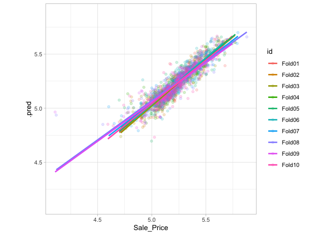
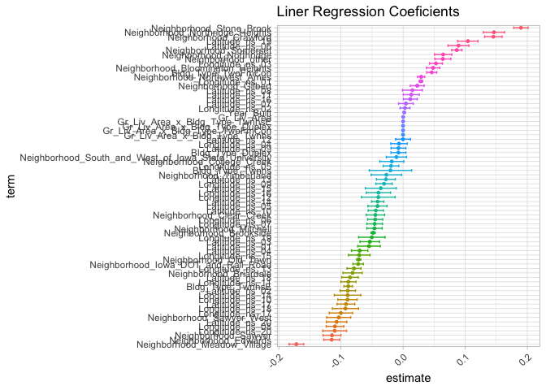

-   [Performance](#performance)
    -   [Substitution Methods](#substitution-methods)
    -   [Resampling methods](#resampling-methods)
        -   [Cross-Validation](#cross-validation)
        -   [Repeated Cross-Validation](#repeated-cross-validation)
    -   [Estimating Performance](#estimating-performance)
-   [Saving the Resampled Objects](#saving-the-resampled-objects)
-   [Reference](#reference)

# Performance

We usually need to understand the performance of a model or even
multiple models before using the *test set*.

> The *test set* can be used only one time, for final evaluation, the
> fine tunning must be made in training set.

## Substitution Methods

    library(tidymodels)

    ## ── Attaching packages ────────────────────────────────────── tidymodels 1.1.1 ──

    ## ✔ broom        1.0.5     ✔ recipes      1.0.9
    ## ✔ dials        1.2.0     ✔ rsample      1.2.0
    ## ✔ dplyr        1.1.3     ✔ tibble       3.2.1
    ## ✔ ggplot2      3.4.4     ✔ tidyr        1.3.0
    ## ✔ infer        1.0.4     ✔ tune         1.1.2
    ## ✔ modeldata    1.2.0     ✔ workflows    1.1.3
    ## ✔ parsnip      1.1.1     ✔ workflowsets 1.0.1
    ## ✔ purrr        1.0.2     ✔ yardstick    1.2.0

    ## ── Conflicts ───────────────────────────────────────── tidymodels_conflicts() ──
    ## ✖ purrr::discard() masks scales::discard()
    ## ✖ dplyr::filter()  masks stats::filter()
    ## ✖ dplyr::lag()     masks stats::lag()
    ## ✖ recipes::step()  masks stats::step()
    ## • Dig deeper into tidy modeling with R at https://www.tmwr.org

    data(ames)
    ames <- mutate(ames, Sale_Price = log10(Sale_Price))

    set.seed(502)
    ames_split <- initial_split(ames, prop = 0.80, strata = Sale_Price)
    ames_train <- training(ames_split)
    ames_test  <-  testing(ames_split)

    ames_rec <- 
      recipe(Sale_Price ~ Neighborhood + Gr_Liv_Area + Year_Built + Bldg_Type + 
               Latitude + Longitude, data = ames_train) %>%
      step_log(Gr_Liv_Area, base = 10) %>% 
      step_other(Neighborhood, threshold = 0.01) %>% 
      step_dummy(all_nominal_predictors()) %>% 
      step_interact( ~ Gr_Liv_Area:starts_with("Bldg_Type_") ) %>% 
      step_ns(Latitude, Longitude, deg_free = 20)
      
    lm_model <- linear_reg() %>% set_engine("lm")

    lm_wflow <- 
      workflow() %>% 
      add_model(lm_model) %>% 
      add_recipe(ames_rec)

    lm_fit <- fit(lm_wflow, ames_train)

Let\`s fit a *Random Forest*:

    rf_model <- 
      rand_forest(trees=1000) |> 
      set_engine("ranger") |> 
      set_mode("regression")

    rf_model

    ## Random Forest Model Specification (regression)
    ## 
    ## Main Arguments:
    ##   trees = 1000
    ## 
    ## Computational engine: ranger

    rf_wflow <- 
      workflow() |> 
      add_formula(
        Sale_Price ~ Neighborhood + Gr_Liv_Area + Year_Built + Bldg_Type + Latitude + Longitude) |> 
      add_model(rf_model
      )

    rf_wflow

    ## ══ Workflow ════════════════════════════════════════════════════════════════════
    ## Preprocessor: Formula
    ## Model: rand_forest()
    ## 
    ## ── Preprocessor ────────────────────────────────────────────────────────────────
    ## Sale_Price ~ Neighborhood + Gr_Liv_Area + Year_Built + Bldg_Type + 
    ##     Latitude + Longitude
    ## 
    ## ── Model ───────────────────────────────────────────────────────────────────────
    ## Random Forest Model Specification (regression)
    ## 
    ## Main Arguments:
    ##   trees = 1000
    ## 
    ## Computational engine: ranger

    rf_fit <- rf_wflow |> fit(data=ames_train)
    rf_fit

    ## ══ Workflow [trained] ══════════════════════════════════════════════════════════
    ## Preprocessor: Formula
    ## Model: rand_forest()
    ## 
    ## ── Preprocessor ────────────────────────────────────────────────────────────────
    ## Sale_Price ~ Neighborhood + Gr_Liv_Area + Year_Built + Bldg_Type + 
    ##     Latitude + Longitude
    ## 
    ## ── Model ───────────────────────────────────────────────────────────────────────
    ## Ranger result
    ## 
    ## Call:
    ##  ranger::ranger(x = maybe_data_frame(x), y = y, num.trees = ~1000,      num.threads = 1, verbose = FALSE, seed = sample.int(10^5,          1)) 
    ## 
    ## Type:                             Regression 
    ## Number of trees:                  1000 
    ## Sample size:                      2342 
    ## Number of independent variables:  6 
    ## Mtry:                             2 
    ## Target node size:                 5 
    ## Variable importance mode:         none 
    ## Splitrule:                        variance 
    ## OOB prediction error (MSE):       0.005235612 
    ## R squared (OOB):                  0.8306539

How should we campare the linear and random forest models?

For demonstration, we will predict the training set to produce what is
known as an apparent metric or resubstitution metric. This function
creates predictions and formats the results:

    estimate_perf <- function(model, dat) {
      cl <- match.call()
      obj_name <- as.character(cl$model)
      data_name <- as.character(cl$dat)
      data_name <- gsub("ames_","", data_name)
      
      reg_metrics <- metric_set(rmse, rsq)
      
      model |> 
        predict(dat) |> 
        bind_cols(dat |>select(Sale_Price)) |> 
        reg_metrics(Sale_Price, .pred) |> 
        select(-.estimator) |> 
        mutate(object = obj_name, data=data_name)
    }

Both *RMSE* and *Rˆ2* are computed. The resubstitution statistics are:

    estimate_perf(rf_fit, ames_train)

    ## # A tibble: 2 × 4
    ##   .metric .estimate object data 
    ##   <chr>       <dbl> <chr>  <chr>
    ## 1 rmse       0.0365 rf_fit train
    ## 2 rsq        0.960  rf_fit train

    estimate_perf(lm_fit, ames_train)

    ## # A tibble: 2 × 4
    ##   .metric .estimate object data 
    ##   <chr>       <dbl> <chr>  <chr>
    ## 1 rmse       0.0754 lm_fit train
    ## 2 rsq        0.816  lm_fit train

Based on these results, the RF Model is much more capable of predicting
the sale price. RF is two-fold better in RMSE. The next step is apply
the RF model to the test set for final verification:

    estimate_perf(rf_fit, ames_test)

    ## # A tibble: 2 × 4
    ##   .metric .estimate object data 
    ##   <chr>       <dbl> <chr>  <chr>
    ## 1 rmse       0.0704 rf_fit test 
    ## 2 rsq        0.852  rf_fit test

    estimate_perf(lm_fit, ames_test)

    ## # A tibble: 2 × 4
    ##   .metric .estimate object data 
    ##   <chr>       <dbl> <chr>  <chr>
    ## 1 rmse       0.0736 lm_fit test 
    ## 2 rsq        0.836  lm_fit test

In the test set, the RMSE estimate if much worse than the training set.
RF is a *low bias model*, models that are capable to learning complex
trends from the data, and can sometimes result in a model nearly
memorizing the training set

    bind_rows(
    estimate_perf(rf_fit, ames_train),
    estimate_perf(lm_fit, ames_train),
    estimate_perf(rf_fit, ames_test),
    estimate_perf(lm_fit, ames_test)) |> 
      filter(.metric == "rmse" ) |> 
      pivot_wider(id_cols=object, names_from = data, values_from = .estimate) |> 
      arrange(object)

    ## # A tibble: 2 × 3
    ##   object  train   test
    ##   <chr>   <dbl>  <dbl>
    ## 1 lm_fit 0.0754 0.0736
    ## 2 rf_fit 0.0365 0.0704

> Repredicting the training set will result in a artificially optimistic
> estimate of performance.

Resampling methods, such as cross-validation or validation sets, are the
soluctino

## Resampling methods

<figure>

<figcaption aria-hidden="true">Data splitting scheme from the initial
data split to resampling</figcaption>
</figure>

Resampling is conducted only on the training set. The test set is not
involved:

-   The model is fit with the analysis set
-   The model is evaluated with the assessment set

Suppose 20 iterations of resampling are conducted. This means that 20
separate models are fit on the analysis sets, and the corresponding
assessment sets produce 20 sets of performance statistics. The final
estimate of performance for a model is the average of the 20 replicates
of the statistics. This average has very good generalization properties
and is far better than the resubstitution estimates.

### Cross-Validation

Cross-validation is a well established resampling method. While there
are a number of variations, the most common cross-validation method is
V-fold cross-validation. The data are randomly partitioned into V sets
of roughly equal size (called the folds). For illustration, V = 3 is
shown in Figure 10.2 for a data set of 30 training set points with
random fold allocations. The number inside the symbols is the sample
number.

<figure>

<figcaption aria-hidden="true">V-fold cross-validation randomly assigns
data to folds</figcaption>
</figure>

For each iteration, one fold is held out for assessment statistics and
the remaining folds are substrate for the model. This process continues
for each fold so that three models produce three sets of performance
statistics.

<figure>

<figcaption aria-hidden="true">V-fold cross-validation data
usage</figcaption>
</figure>

> What are the effects of changing V? Larger values result in resampling
> estimates with small bias but substantial variance. Smaller values of
> V have large bias but low variance. We prefer 10-fold since noise is
> reduced by replication, but bias is not.

    set.seed(1001) 
    ames_fold <- vfold_cv(ames_train, v=10)
    ames_fold

    ## #  10-fold cross-validation 
    ## # A tibble: 10 × 2
    ##    splits             id    
    ##    <list>             <chr> 
    ##  1 <split [2107/235]> Fold01
    ##  2 <split [2107/235]> Fold02
    ##  3 <split [2108/234]> Fold03
    ##  4 <split [2108/234]> Fold04
    ##  5 <split [2108/234]> Fold05
    ##  6 <split [2108/234]> Fold06
    ##  7 <split [2108/234]> Fold07
    ##  8 <split [2108/234]> Fold08
    ##  9 <split [2108/234]> Fold09
    ## 10 <split [2108/234]> Fold10

The column named `splits` contains the information on how to split the
data (similar to the object used to create the initial training/test
partition). While each row of splits has an embedded copy of the entire
training set, R is smart enough not to make copies of the data in
memory.

The print method inside of the tibble shows the frequency of each:
`[2107/235]` indicates that about two thousand samples are in the
analysis set and `235` are in that particular assessment set.

To manually retrieve the partitioned data, the `analysis()` and
`assessment()` functions return the corresponding data frames:

    ames_fold$splits[[1]] |> 
      analysis()

    ## # A tibble: 2,107 × 74
    ##    MS_SubClass            MS_Zoning Lot_Frontage Lot_Area Street Alley Lot_Shape
    ##    <fct>                  <fct>            <dbl>    <int> <fct>  <fct> <fct>    
    ##  1 One_Story_1946_and_Ne… Resident…           70     8400 Pave   No_A… Regular  
    ##  2 One_Story_1946_and_Ne… Resident…           70    10500 Pave   No_A… Regular  
    ##  3 Two_Story_PUD_1946_an… Resident…           21     1680 Pave   No_A… Regular  
    ##  4 Two_Story_PUD_1946_an… Resident…           21     1680 Pave   No_A… Regular  
    ##  5 One_Story_PUD_1946_an… Resident…           53     4043 Pave   No_A… Regular  
    ##  6 One_Story_PUD_1946_an… Resident…           24     2280 Pave   No_A… Regular  
    ##  7 One_Story_PUD_1946_an… Resident…           55     7892 Pave   No_A… Regular  
    ##  8 One_Story_1945_and_Ol… Resident…           70     9800 Pave   No_A… Regular  
    ##  9 Duplex_All_Styles_and… Resident…           68     8930 Pave   No_A… Regular  
    ## 10 One_Story_1946_and_Ne… Resident…            0     6897 Pave   No_A… Slightly…
    ## # ℹ 2,097 more rows
    ## # ℹ 67 more variables: Land_Contour <fct>, Utilities <fct>, Lot_Config <fct>,
    ## #   Land_Slope <fct>, Neighborhood <fct>, Condition_1 <fct>, Condition_2 <fct>,
    ## #   Bldg_Type <fct>, House_Style <fct>, Overall_Cond <fct>, Year_Built <int>,
    ## #   Year_Remod_Add <int>, Roof_Style <fct>, Roof_Matl <fct>,
    ## #   Exterior_1st <fct>, Exterior_2nd <fct>, Mas_Vnr_Type <fct>,
    ## #   Mas_Vnr_Area <dbl>, Exter_Cond <fct>, Foundation <fct>, Bsmt_Cond <fct>, …

### Repeated Cross-Validation

Depending on data size or other characteristics, the resampling estimate
produced by V-fold cross-validation may be excessively noisy. As with
many statistical problems, one way to reduce noise is to gather more
data. For cross-validation, this means averaging more than V statistics.

To create R repeats of V-fold cross-validation, the same fold generation
process is done R times to generate R collections of V partitions. Now,
instead of averaging V statistics, V × R statistics produce the final
resampling estimate.

To create repeats, invoke `vfold_cv()` with an additional argument
`repeats`:

    vfold_cv(ames_train, v=10, repeats = 5)

    ## #  10-fold cross-validation repeated 5 times 
    ## # A tibble: 50 × 3
    ##    splits             id      id2   
    ##    <list>             <chr>   <chr> 
    ##  1 <split [2107/235]> Repeat1 Fold01
    ##  2 <split [2107/235]> Repeat1 Fold02
    ##  3 <split [2108/234]> Repeat1 Fold03
    ##  4 <split [2108/234]> Repeat1 Fold04
    ##  5 <split [2108/234]> Repeat1 Fold05
    ##  6 <split [2108/234]> Repeat1 Fold06
    ##  7 <split [2108/234]> Repeat1 Fold07
    ##  8 <split [2108/234]> Repeat1 Fold08
    ##  9 <split [2108/234]> Repeat1 Fold09
    ## 10 <split [2108/234]> Repeat1 Fold10
    ## # ℹ 40 more rows

## Estimating Performance

The process to use resampling to evaluate the modeling process is:

1.  During resampling, the analysis set is used to preprocess the data,
    apply the pre processing to itself, and use these processed data to
    fit the model
2.  The preprocessing statistics produced by the analysis set are
    applied to the asessment set. The predictions from the assessment
    set estimate performance on new data.

This sequence reapeats for every resample. This sequence repeats for
every resample. If there are B resamples, there are B replicates of each
of the performance metrics. The final resampling estimate is the average
of these B statistics.

The `fit_resamples()` functions is analogous to `fit()`, but instead of
having a `data` argument, `fit_resamples()` has `resamples`, which
expects an `rset` object.

    # possible interfaces
    model_spec |> fit_resamples(foruma, resamples, ...)
    model_spec |> fit_resamples(recipe, resamples, ...)
    workflow   |> fit_resamples(        resamples, ...)

There are a number of other optional arguments, such as: + `metrics`, +
`control` (created by `control_resamples()`) ++ `vebose` ++ `extract` ++
`save_pred`

Example:

    keep_pred <- control_resamples(save_pred = T, save_workflow = T)

    set.seed(1003)
    rf_res <- rf_wflow |> 
      fit_resamples(resamples = ames_fold, control = keep_pred)

    rf_res

    ## # Resampling results
    ## # 10-fold cross-validation 
    ## # A tibble: 10 × 5
    ##    splits             id     .metrics         .notes           .predictions
    ##    <list>             <chr>  <list>           <list>           <list>      
    ##  1 <split [2107/235]> Fold01 <tibble [2 × 4]> <tibble [0 × 3]> <tibble>    
    ##  2 <split [2107/235]> Fold02 <tibble [2 × 4]> <tibble [0 × 3]> <tibble>    
    ##  3 <split [2108/234]> Fold03 <tibble [2 × 4]> <tibble [0 × 3]> <tibble>    
    ##  4 <split [2108/234]> Fold04 <tibble [2 × 4]> <tibble [0 × 3]> <tibble>    
    ##  5 <split [2108/234]> Fold05 <tibble [2 × 4]> <tibble [0 × 3]> <tibble>    
    ##  6 <split [2108/234]> Fold06 <tibble [2 × 4]> <tibble [0 × 3]> <tibble>    
    ##  7 <split [2108/234]> Fold07 <tibble [2 × 4]> <tibble [0 × 3]> <tibble>    
    ##  8 <split [2108/234]> Fold08 <tibble [2 × 4]> <tibble [0 × 3]> <tibble>    
    ##  9 <split [2108/234]> Fold09 <tibble [2 × 4]> <tibble [0 × 3]> <tibble>    
    ## 10 <split [2108/234]> Fold10 <tibble [2 × 4]> <tibble [0 × 3]> <tibble>

The return value is a tibble similiar to the inpute samples, along extra
columns:

-   `.metrics`
-   `.notes`: is another list column of tibbles cataloging any warning
    or errors generated during resampling. Note that error will not stop
    subsequent execution of resampling
-   `.predictions`

<!-- -->

    rf_res |> 
      unnest(.predictions) |> 
      ggplot(aes(x=Sale_Price, y=.pred, color=id)) +
      geom_point(alpha=.2) +
      stat_smooth(method = "lm", formula = y ~ x, se=F) +
      coord_obs_pred() +
      theme_light()

There are two houses in the training set with a low observed sale price
that are significantly overpredicted by the model. Which houses are
these? Let’s find out from the `assess_res` result:

    over_predicted <-
      rf_res |> 
      collect_predictions() |> 
      mutate(residual = Sale_Price - .pred) |> 
      slice_max(abs(residual), n=2)

    over_predicted

    ## # A tibble: 2 × 6
    ##   id     .pred  .row Sale_Price .config              residual
    ##   <chr>  <dbl> <int>      <dbl> <chr>                   <dbl>
    ## 1 Fold09  4.96    32       4.11 Preprocessor1_Model1   -0.857
    ## 2 Fold08  4.94   317       4.12 Preprocessor1_Model1   -0.819

    ames_train |> 
      slice(over_predicted$.row) |> 
      select(Gr_Liv_Area, Neighborhood, Year_Built, Bedroom_AbvGr, Full_Bath)

    ## # A tibble: 2 × 5
    ##   Gr_Liv_Area Neighborhood           Year_Built Bedroom_AbvGr Full_Bath
    ##         <int> <fct>                       <int>         <int>     <int>
    ## 1         832 Old_Town                     1923             2         1
    ## 2         733 Iowa_DOT_and_Rail_Road       1952             2         1

Identifying examples like these with especially poor performance can
help us follow up and investigate why these specific predictions are so
poor.

How can we use a validation set instead of cross-validation?

<figure>

<figcaption aria-hidden="true">Validation Set</figcaption>
</figure>

    set.seed(52) 
    ames_val_split <- initial_validation_split(ames, prop=c(0.6, 0.2))
    ames_val_split

    ## <Training/Validation/Testing/Total>
    ## <1758/586/586/2930>

    val_set <- validation_set(ames_val_split)
    val_set

    ## # A tibble: 1 × 2
    ##   splits             id        
    ##   <list>             <chr>     
    ## 1 <split [1758/586]> validation

    val_res <- 
      rf_wflow |> 
      fit_resamples(resample=val_set)

    ## Warning in `[.tbl_df`(x, is.finite(x <- as.numeric(x))): NAs introduced by
    ## coercion

    val_res

    ## # Resampling results
    ## #  
    ## # A tibble: 1 × 4
    ##   splits             id         .metrics         .notes          
    ##   <list>             <chr>      <list>           <list>          
    ## 1 <split [1758/586]> validation <tibble [2 × 4]> <tibble [0 × 3]>

    collect_metrics(val_res)

    ## # A tibble: 2 × 6
    ##   .metric .estimator   mean     n std_err .config             
    ##   <chr>   <chr>       <dbl> <int>   <dbl> <chr>               
    ## 1 rmse    standard   0.0727     1      NA Preprocessor1_Model1
    ## 2 rsq     standard   0.823      1      NA Preprocessor1_Model1

# Saving the Resampled Objects

    # rebuild the workflow

    # a recipe
    ames_rec <- recipe( Sale_Price ~ Neighborhood + Gr_Liv_Area + Year_Built + Bldg_Type +
                          Latitude + Longitude, data = ames_train) |> 
      step_other(Neighborhood, threshold = .01) |> 
      step_dummy(all_nominal_predictors()) |> 
      step_interact(~Gr_Liv_Area:starts_with("Bldg_Type_")) |> 
      step_ns(Latitude, Longitude, deg_free=20)

    ames_rec

    ## 

    ## ── Recipe ──────────────────────────────────────────────────────────────────────

    ## 

    ## ── Inputs

    ## Number of variables by role

    ## outcome:   1
    ## predictor: 6

    ## 

    ## ── Operations

    ## • Collapsing factor levels for: Neighborhood

    ## • Dummy variables from: all_nominal_predictors()

    ## • Interactions with: Gr_Liv_Area:starts_with("Bldg_Type_")

    ## • Natural splines on: Latitude, Longitude

    # a specification
    lm_spec <- linear_reg() |> 
      set_engine("lm")

    lm_spec

    ## Linear Regression Model Specification (regression)
    ## 
    ## Computational engine: lm

    # a workflow
    lm_wflow <- 
      workflow() |> 
      add_recipe(ames_rec) |> 
      add_model(lm_spec)

    lm_wflow

    ## ══ Workflow ════════════════════════════════════════════════════════════════════
    ## Preprocessor: Recipe
    ## Model: linear_reg()
    ## 
    ## ── Preprocessor ────────────────────────────────────────────────────────────────
    ## 4 Recipe Steps
    ## 
    ## • step_other()
    ## • step_dummy()
    ## • step_interact()
    ## • step_ns()
    ## 
    ## ── Model ───────────────────────────────────────────────────────────────────────
    ## Linear Regression Model Specification (regression)
    ## 
    ## Computational engine: lm

    # fit
    lm_fit <- lm_wflow |> fit(data=ames_train)

    # example of extraction...
    extract_recipe(lm_fit, estimated = T)

    ## 

    ## ── Recipe ──────────────────────────────────────────────────────────────────────

    ## 

    ## ── Inputs

    ## Number of variables by role

    ## outcome:   1
    ## predictor: 6

    ## 

    ## ── Training information

    ## Training data contained 2342 data points and no incomplete rows.

    ## 

    ## ── Operations

    ## • Collapsing factor levels for: Neighborhood | Trained

    ## • Dummy variables from: Neighborhood, Bldg_Type | Trained

    ## • Interactions with: Gr_Liv_Area:(Bldg_Type_TwoFmCon + Bldg_Type_Duplex +
    ##   Bldg_Type_Twnhs + Bldg_Type_TwnhsE) | Trained

    ## • Natural splines on: Latitude, Longitude | Trained

Saving the model in resample to extract the coefs

    # function to extract things from workflow during resamples
    get_model <- function(x) {
      extract_fit_parsnip(x) |> # extract the model from the workflow
        tidy() # get coefs
    }

    lm_fit |> class()

    ## [1] "workflow"

    get_model(lm_fit)

    ## # A tibble: 73 × 5
    ##    term                             estimate  std.error statistic   p.value
    ##    <chr>                               <dbl>      <dbl>     <dbl>     <dbl>
    ##  1 (Intercept)                      1.54     0.298         5.16   2.61e-  7
    ##  2 Gr_Liv_Area                      0.000163 0.00000446   36.4    2.81e-229
    ##  3 Year_Built                       0.00177  0.000140     12.6    1.93e- 35
    ##  4 Neighborhood_College_Creek       0.00125  0.0350        0.0357 9.72e-  1
    ##  5 Neighborhood_Old_Town           -0.0718   0.0129       -5.55   3.18e-  8
    ##  6 Neighborhood_Edwards            -0.0957   0.0293       -3.27   1.09e-  3
    ##  7 Neighborhood_Somerset            0.0944   0.0199        4.74   2.31e-  6
    ##  8 Neighborhood_Northridge_Heights  0.158    0.0363        4.36   1.37e-  5
    ##  9 Neighborhood_Gilbert             0.0285   0.0330        0.864  3.88e-  1
    ## 10 Neighborhood_Sawyer             -0.0967   0.0275       -3.52   4.36e-  4
    ## # ℹ 63 more rows

apply this function during fit resamples

    ctrl <- control_resamples(extract = get_model)
    lm_res <- lm_wflow |> fit_resamples(resamples = ames_fold, control=ctrl)

    lm_res

    ## # Resampling results
    ## # 10-fold cross-validation 
    ## # A tibble: 10 × 5
    ##    splits             id     .metrics         .notes           .extracts       
    ##    <list>             <chr>  <list>           <list>           <list>          
    ##  1 <split [2107/235]> Fold01 <tibble [2 × 4]> <tibble [0 × 3]> <tibble [1 × 2]>
    ##  2 <split [2107/235]> Fold02 <tibble [2 × 4]> <tibble [0 × 3]> <tibble [1 × 2]>
    ##  3 <split [2108/234]> Fold03 <tibble [2 × 4]> <tibble [0 × 3]> <tibble [1 × 2]>
    ##  4 <split [2108/234]> Fold04 <tibble [2 × 4]> <tibble [0 × 3]> <tibble [1 × 2]>
    ##  5 <split [2108/234]> Fold05 <tibble [2 × 4]> <tibble [0 × 3]> <tibble [1 × 2]>
    ##  6 <split [2108/234]> Fold06 <tibble [2 × 4]> <tibble [0 × 3]> <tibble [1 × 2]>
    ##  7 <split [2108/234]> Fold07 <tibble [2 × 4]> <tibble [0 × 3]> <tibble [1 × 2]>
    ##  8 <split [2108/234]> Fold08 <tibble [2 × 4]> <tibble [0 × 3]> <tibble [1 × 2]>
    ##  9 <split [2108/234]> Fold09 <tibble [2 × 4]> <tibble [0 × 3]> <tibble [1 × 2]>
    ## 10 <split [2108/234]> Fold10 <tibble [2 × 4]> <tibble [0 × 3]> <tibble [1 × 2]>

    lm_res[1,]$.extracts

    ## [[1]]
    ## # A tibble: 1 × 2
    ##   .extracts         .config             
    ##   <list>            <chr>               
    ## 1 <tibble [73 × 5]> Preprocessor1_Model1

    lm_res[1,]$.extracts[[1]]$.extracts[[1]]

    ## # A tibble: 73 × 5
    ##    term                             estimate  std.error statistic   p.value
    ##    <chr>                               <dbl>      <dbl>     <dbl>     <dbl>
    ##  1 (Intercept)                      1.48     0.320         4.62   4.11e-  6
    ##  2 Gr_Liv_Area                      0.000158 0.00000476   33.2    9.72e-194
    ##  3 Year_Built                       0.00180  0.000149     12.1    1.57e- 32
    ##  4 Neighborhood_College_Creek      -0.00163  0.0373       -0.0438 9.65e-  1
    ##  5 Neighborhood_Old_Town           -0.0757   0.0138       -5.47   4.92e-  8
    ##  6 Neighborhood_Edwards            -0.109    0.0310       -3.53   4.21e-  4
    ##  7 Neighborhood_Somerset            0.0832   0.0217        3.83   1.33e-  4
    ##  8 Neighborhood_Northridge_Heights  0.163    0.0401        4.06   5.19e-  5
    ##  9 Neighborhood_Gilbert             0.0304   0.0367        0.827  4.08e-  1
    ## 10 Neighborhood_Sawyer             -0.113    0.0291       -3.88   1.07e-  4
    ## # ℹ 63 more rows

calculating a conf range from coefs…

    lm_res |> 
      mutate(coefs = map(.extracts, ~.x[[1]][[1]])) |> 
      select(coefs) |> 
      unnest(coefs) |> 
      nest(coefs=estimate, .by=term) |> 
      mutate(ttest = map(coefs, ~tidy(t.test(.x$estimate)))) |> 
      unnest(ttest) |> 
      filter(term!="(Intercept)") |> 
      mutate(term = forcats::fct_reorder(term, estimate)) |> 
      ggplot(aes(x=term, y=estimate, color=term)) +
      geom_errorbar(aes(ymin=conf.low, ymax=conf.high), width=.6, show.legend = F) +
      geom_point(size=1, show.legend = F) +
      theme_light() +
      theme(axis.text.x = element_text(angle = 45, hjust = 1)) +
      coord_flip() +
      labs(title="Liner Regression Coeficients")

# Reference

All code and text came from Max Kuhn and Julia Silge\`s book [Tidy
Modeling with R](https://www.tmwr.org/resampling).
