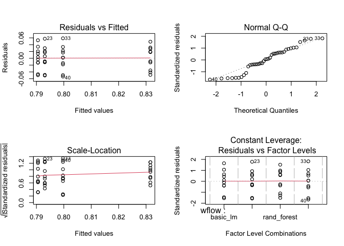
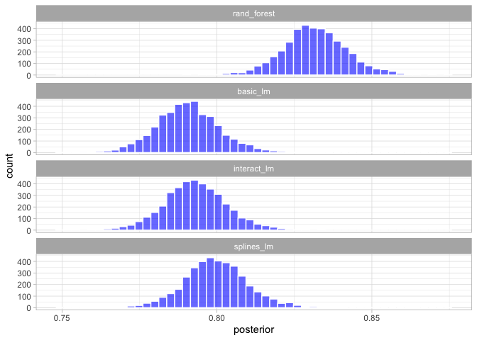
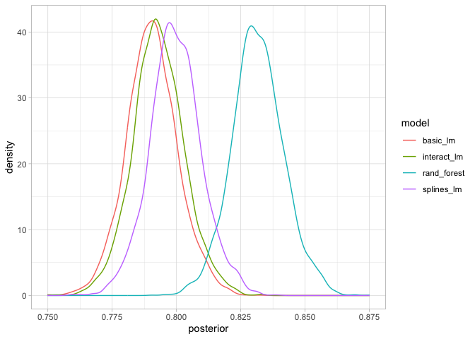
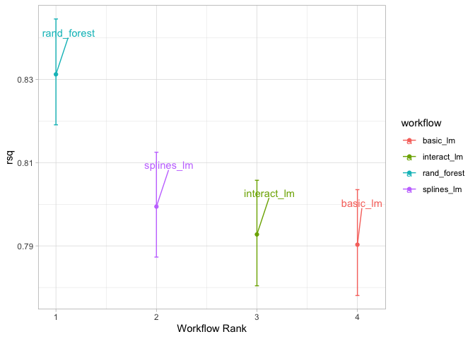
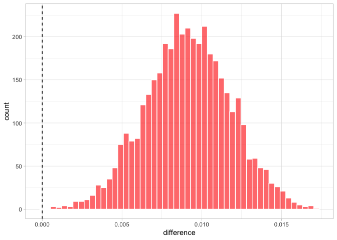

-   [Comparing Models with
    Resampling](#comparing-models-with-resampling)
    -   [CREATING MULTIPLE MODELS WITH WORKFLOW
        SETS](#creating-multiple-models-with-workflow-sets)
    -   [COMPARING RESAMPLED PERFORMANCE
        STATISTICS](#comparing-resampled-performance-statistics)
        -   [ANOVA](#anova)
    -   [SIMPLE HYPOTHESIS TESTING
        METHODS](#simple-hypothesis-testing-methods)
    -   [Bayesian Methods](#bayesian-methods)

# Comparing Models with Resampling

    library(tidymodels)

    ## ── Attaching packages ────────────────────────────────────── tidymodels 1.1.1 ──

    ## ✔ broom        1.0.5     ✔ recipes      1.0.9
    ## ✔ dials        1.2.0     ✔ rsample      1.2.0
    ## ✔ dplyr        1.1.3     ✔ tibble       3.2.1
    ## ✔ ggplot2      3.4.4     ✔ tidyr        1.3.0
    ## ✔ infer        1.0.4     ✔ tune         1.1.2
    ## ✔ modeldata    1.2.0     ✔ workflows    1.1.3
    ## ✔ parsnip      1.1.1     ✔ workflowsets 1.0.1
    ## ✔ purrr        1.0.2     ✔ yardstick    1.2.0

    ## ── Conflicts ───────────────────────────────────────── tidymodels_conflicts() ──
    ## ✖ purrr::discard() masks scales::discard()
    ## ✖ dplyr::filter()  masks stats::filter()
    ## ✖ dplyr::lag()     masks stats::lag()
    ## ✖ recipes::step()  masks stats::step()
    ## • Learn how to get started at https://www.tidymodels.org/start/

    data(ames)
    ames <- mutate(ames, Sale_Price = log10(Sale_Price))

    set.seed(502)
    ames_split <- initial_split(ames, prop = 0.80, strata = Sale_Price)
    ames_train <- training(ames_split)
    ames_test  <-  testing(ames_split)

    ames_rec <- 
      recipe(Sale_Price ~ Neighborhood + Gr_Liv_Area + Year_Built + Bldg_Type + 
               Latitude + Longitude, data = ames_train) %>%
      step_log(Gr_Liv_Area, base = 10) %>% 
      step_other(Neighborhood, threshold = 0.01) %>% 
      step_dummy(all_nominal_predictors()) %>% 
      step_interact( ~ Gr_Liv_Area:starts_with("Bldg_Type_") ) %>% 
      step_ns(Latitude, Longitude, deg_free = 20)

    lm_model <- linear_reg() %>% set_engine("lm")

    lm_wflow <- 
      workflow() %>% 
      add_model(lm_model) %>% 
      add_recipe(ames_rec)

    lm_fit <- fit(lm_wflow, ames_train)

    rf_model <- 
      rand_forest(trees = 1000) %>% 
      set_engine("ranger") %>% 
      set_mode("regression")

    rf_wflow <- 
      workflow() %>% 
      add_formula(
        Sale_Price ~ Neighborhood + Gr_Liv_Area + Year_Built + Bldg_Type + 
          Latitude + Longitude) %>% 
      add_model(rf_model) 

    set.seed(1001)
    ames_folds <- vfold_cv(ames_train, v = 10)

    keep_pred <- control_resamples(save_pred = TRUE, save_workflow = TRUE)

    set.seed(1003)
    rf_res <- rf_wflow %>% fit_resamples(resamples = ames_folds, control = keep_pred)

## CREATING MULTIPLE MODELS WITH WORKFLOW SETS

Ltes create three different linear models that add different
preprocessing steps incrementally, so we can test whether these
additional terms impove the models results

    # three recipes

    # basice one
    basic_rec <- 
      recipe( Sale_Price ~ Neighborhood + Gr_Liv_Area + Year_Built + Bldg_Type +
                Latitude + Longitude, data=ames_train) |> 
      step_log(Gr_Liv_Area, base=10) |> 
      step_other(Neighborhood, threshold=0.01) |> 
      step_dummy(all_nominal_predictors())

    # with interaction terms
    interaction_rec <- 
      basic_rec |> 
      step_interact(~Gr_Liv_Area:starts_with("Bldg_Type"))

    # with splines
    spline_rec <- 
      interaction_rec |> 
      step_ns(Latitude, Longitude, deg_free = 50)

    basic_rec

    ## 

    ## ── Recipe ──────────────────────────────────────────────────────────────────────

    ## 

    ## ── Inputs

    ## Number of variables by role

    ## outcome:   1
    ## predictor: 6

    ## 

    ## ── Operations

    ## • Log transformation on: Gr_Liv_Area

    ## • Collapsing factor levels for: Neighborhood

    ## • Dummy variables from: all_nominal_predictors()

    interaction_rec

    ## 

    ## ── Recipe ──────────────────────────────────────────────────────────────────────

    ## 

    ## ── Inputs

    ## Number of variables by role

    ## outcome:   1
    ## predictor: 6

    ## 

    ## ── Operations

    ## • Log transformation on: Gr_Liv_Area

    ## • Collapsing factor levels for: Neighborhood

    ## • Dummy variables from: all_nominal_predictors()

    ## • Interactions with: Gr_Liv_Area:starts_with("Bldg_Type")

    spline_rec

    ## 

    ## ── Recipe ──────────────────────────────────────────────────────────────────────

    ## 

    ## ── Inputs

    ## Number of variables by role

    ## outcome:   1
    ## predictor: 6

    ## 

    ## ── Operations

    ## • Log transformation on: Gr_Liv_Area

    ## • Collapsing factor levels for: Neighborhood

    ## • Dummy variables from: all_nominal_predictors()

    ## • Interactions with: Gr_Liv_Area:starts_with("Bldg_Type")

    ## • Natural splines on: Latitude, Longitude

    # using workflow set to create workflow with different recipes
    lm_models <-
      workflow_set(
        preproc = list(
          basic = basic_rec,
          interact = interaction_rec,
          splines = spline_rec
        ),
        models = list(lm = linear_reg()),
        cross = F
      )
    lm_models

    ## # A workflow set/tibble: 3 × 4
    ##   wflow_id    info             option    result    
    ##   <chr>       <list>           <list>    <list>    
    ## 1 basic_lm    <tibble [1 × 4]> <opts[0]> <list [0]>
    ## 2 interact_lm <tibble [1 × 4]> <opts[0]> <list [0]>
    ## 3 splines_lm  <tibble [1 × 4]> <opts[0]> <list [0]>

We’d like to resample each of the models in turn.

    lm_models <-
      lm_models |>
      workflow_map(
        "fit_resamples",
        seed = 1101,
        verbose = T,
        resamples = ames_folds,
        control = keep_pred
      )

    ## i 1 of 3 resampling: basic_lm

    ## ✔ 1 of 3 resampling: basic_lm (1.4s)

    ## i 2 of 3 resampling: interact_lm

    ## ✔ 2 of 3 resampling: interact_lm (1.5s)

    ## i 3 of 3 resampling: splines_lm

    ## ✔ 3 of 3 resampling: splines_lm (2.7s)

    lm_models

    ## # A workflow set/tibble: 3 × 4
    ##   wflow_id    info             option    result   
    ##   <chr>       <list>           <list>    <list>   
    ## 1 basic_lm    <tibble [1 × 4]> <opts[2]> <rsmp[+]>
    ## 2 interact_lm <tibble [1 × 4]> <opts[2]> <rsmp[+]>
    ## 3 splines_lm  <tibble [1 × 4]> <opts[2]> <rsmp[+]>

    collect_metrics(lm_models) |> 
      filter(.metric=="rmse")

    ## # A tibble: 3 × 9
    ##   wflow_id    .config      preproc model .metric .estimator   mean     n std_err
    ##   <chr>       <chr>        <chr>   <chr> <chr>   <chr>       <dbl> <int>   <dbl>
    ## 1 basic_lm    Preprocesso… recipe  line… rmse    standard   0.0803    10 0.00264
    ## 2 interact_lm Preprocesso… recipe  line… rmse    standard   0.0799    10 0.00272
    ## 3 splines_lm  Preprocesso… recipe  line… rmse    standard   0.0785    10 0.00282

What about the random forest model?

    # get the workflow and converto to a workflow set, bind with the lms
    four_models <- as_workflow_set(rand_forest = rf_res) |> 
      bind_rows(lm_models)

    # it was fitted using the same ames_fold
    four_models 

    ## # A workflow set/tibble: 4 × 4
    ##   wflow_id    info             option    result   
    ##   <chr>       <list>           <list>    <list>   
    ## 1 rand_forest <tibble [1 × 4]> <opts[0]> <rsmp[+]>
    ## 2 basic_lm    <tibble [1 × 4]> <opts[2]> <rsmp[+]>
    ## 3 interact_lm <tibble [1 × 4]> <opts[2]> <rsmp[+]>
    ## 4 splines_lm  <tibble [1 × 4]> <opts[2]> <rsmp[+]>

    autoplot(four_models)

    #focusing in the Rˆ2 metric
    library(ggrepel) 
    autoplot(four_models, metric="rsq") +
      geom_text_repel(aes(label=wflow_id), 
                      nudge_x = 1/8, nudge_y = 1/100) +
      theme(legend.position = "none")

## COMPARING RESAMPLED PERFORMANCE STATISTICS

Considering the preceding results for the three linear models, it
appears that the additional terms do not profoundly improve the mean
*R**M**S**E* or *R**ˆ*2 statistics for the linear models. The difference
is small, but it might be larger than the experimental noise in the
system, i.e., considered statistically significant. We can formally test
the hypothesis that the additional terms increase *R**ˆ*2.

> Before making between-model comparisons, it is important for us to
> discuss the within-resample correlation for resampling statistics.

let’s gather the individual resampling statistics for the linear models
and the random forest. We will focus on the *R**ˆ*2 statistic for each
mode

    rsq_indiv_estimates <-
      collect_metrics(four_models, summarize = FALSE) |>
      filter(.metric == "rsq")

    rsq_wider <-
      rsq_indiv_estimates |>
      select(wflow_id, .estimate, id) |>
      pivot_wider(id_cols = id,
                  names_from = wflow_id,
                  values_from = .estimate)

    corrr::correlate(rsq_wider |> 
                       select(-id)) |> 
      autoplot() +
      geom_text(aes(label=round(r,3)))

    ## Correlation computed with
    ## • Method: 'pearson'
    ## • Missing treated using: 'pairwise.complete.obs'

These correlations are high, and indicate that, across models, there are
large within-resample correlations. To see this visually, the *R**ˆ*2
statistics are shown for each model with lines connecting the resamples:

    rsq_indiv_estimates |> 
      mutate(wflow_id = reorder(wflow_id, .estimate)) |> 
      ggplot(aes(x=wflow_id, y=.estimate, group=id, color=id)) +
      geom_line(alpha=.5, linewidth=1.25) +
      theme_light() +
      theme(legend.position = "none") 

A statistical test for the correlations evaluates whether the magnitudes
of these correlations are not simply noise.

    rsq_wider |> 
      with( cor.test(basic_lm, splines_lm) ) |> 
      tidy() |> 
      select(estimate, starts_with("conf"))

    ## # A tibble: 1 × 3
    ##   estimate conf.low conf.high
    ##      <dbl>    <dbl>     <dbl>
    ## 1    0.997    0.987     0.999

The results of the correlation test (the estimate of the correlation and
the confidence intervals) show us that the within-resample correlation
appears to be real.

### ANOVA

#### One-way Comparation

We want to know if there is any significant difference between the
average `.estimates` of *R*2 in the different models.

    # one-way
    rsq_indiv_estimates |> 
      select(wflow=wflow_id, id, value=.estimate) |> 
      aov(value ~ wflow, data =_) |> 
      summary()

    ##             Df  Sum Sq  Mean Sq F value Pr(>F)  
    ## wflow        3 0.01079 0.003598   3.131 0.0374 *
    ## Residuals   36 0.04137 0.001149                 
    ## ---
    ## Signif. codes:  0 '***' 0.001 '**' 0.01 '*' 0.05 '.' 0.1 ' ' 1

As the `p-value` is less than the significance level 0.05, we can
conclude that there are significant differences between the groups
highlighted with “\*” in the model summary.

#### Pair Wise Comparation

As the ANOVA test is significant, we can compute Tukey HSD (Tukey Honest
Significant Differences, R function: `TukeyHSD()`) for performing
multiple pairwise-comparison between the means of groups.

The function `TukeyHD()` takes the fitted ANOVA as an argument.

    rsq_indiv_estimates |> 
      select(wflow=wflow_id, id, value=.estimate) |> 
      aov(value ~ wflow, data =_) |>
      TukeyHSD() 

    ##   Tukey multiple comparisons of means
    ##     95% family-wise confidence level
    ## 
    ## Fit: aov(formula = value ~ wflow, data = select(rsq_indiv_estimates, wflow = wflow_id, id, value = .estimate))
    ## 
    ## $wflow
    ##                                 diff           lwr         upr     p adj
    ## interact_lm-basic_lm     0.002504868 -0.0383256219 0.043335359 0.9983647
    ## rand_forest-basic_lm     0.041025236  0.0001947455 0.081855726 0.0485467
    ## splines_lm-basic_lm      0.009131344 -0.0316991466 0.049961834 0.9306667
    ## rand_forest-interact_lm  0.038520367 -0.0023101229 0.079350858 0.0703781
    ## splines_lm-interact_lm   0.006626475 -0.0342040150 0.047456965 0.9716499
    ## splines_lm-rand_forest  -0.031893892 -0.0727243823 0.008936598 0.1712805

It can be seen from the output, that only the difference between
`rand_forest` and `basic_lm` is significant with an adjusted `p-value`
of 0.048.

    # using parwise t-test
    pairwise.t.test(rsq_indiv_estimates$.estimate, 
                    rsq_indiv_estimates$wflow_id, 
                    p.adjust.method = "BH")

    ## 
    ##  Pairwise comparisons using t tests with pooled SD 
    ## 
    ## data:  rsq_indiv_estimates$.estimate and rsq_indiv_estimates$wflow_id 
    ## 
    ##             basic_lm interact_lm rand_forest
    ## interact_lm 0.870    -           -          
    ## rand_forest 0.047    0.047       -          
    ## splines_lm  0.798    0.798       0.085      
    ## 
    ## P value adjustment method: BH

The result is a table of p-values for the pairwise comparisons. Here,
the p-values have been adjusted by the Benjamini-Hochberg method.

#### Check for homoscadeasticity

The ANOVA test assumes that, the data are normally distributed and the
variance across groups are homogeneous. We can check that with some
diagnostic plots.

    par(mfrow=c(2,2))
    rsq_indiv_estimates |> 
      select(wflow=wflow_id, id, value=.estimate) |> 
      aov(value ~ wflow, data =_) |> 
      plot()

    par(mfrow=c(1,1))

## SIMPLE HYPOTHESIS TESTING METHODS

<!--

We can use simple hypothesis testing to make formal comparisons between models. Consider the familiar linear statistical model:

$$y_{ij}=\beta_{0} + \beta_{1}x_{i1} + \dots + \beta_{p}x_{ip} + \epsilon_{ij}$$

This versatile model is used to create regression models as well as being the basis for the popular analysis of variance (ANOVA) technique for comparing groups. With the ANOVA model, the predictors ($x_{ij}$) are binary dummy variables for different groups. From this, the $\beta$ parameters estimate whether two or more groups are different from one another using hypothesis testing techniques.

-->

A simple and fast method for comparing two models at a time is to use
the differences in *R**ˆ*2 values as the outcome data in the ANOVA
model. Since the outcomes are matched by resample, the differences do
not contain the resample-to-resample effect and, for this reason, the
standard ANOVA model is appropriate. To illustrate, this call to `lm()`
tests the difference between two of the linear regression models:

    # using LM
    compare_lm <- rsq_wider |> 
      mutate(difference=splines_lm - basic_lm)

    lm(difference ~ 1, data=compare_lm) |> 
      tidy(conf.int = T) |> 
      select(estimate, p.value, starts_with("conf"))

    ## # A tibble: 1 × 4
    ##   estimate   p.value conf.low conf.high
    ##      <dbl>     <dbl>    <dbl>     <dbl>
    ## 1  0.00913 0.0000256  0.00650    0.0118

    # using a t.test
    rsq_wider %>% 
      with( t.test(splines_lm, basic_lm, paired = TRUE) ) %>%
      tidy() %>% 
      select(estimate, p.value, starts_with("conf"))

    ## # A tibble: 1 × 4
    ##   estimate   p.value conf.low conf.high
    ##      <dbl>     <dbl>    <dbl>     <dbl>
    ## 1  0.00913 0.0000256  0.00650    0.0118

We could evaluate each pair-wise difference in this way. Note that the
p-value indicates a statistically significant signal; the collection of
spline terms for longitude and latitude do appear to have an effect.
However, the difference in *R*2 is estimated at 0.91%. If our
practical effect size were 2%, we might not consider these terms worth
including in the model.

> `p-value`: “Informally, it is the probability under a specified
> statistical model that a statistical summary of the data (e.g., the
> sample mean difference between two compared groups) would be equal to
> or more extreme than its observed value.”

## Bayesian Methods

    library(tidyposterior)
    library(rstanarm)

    ## Loading required package: Rcpp

    ## 
    ## Attaching package: 'Rcpp'

    ## The following object is masked from 'package:rsample':
    ## 
    ##     populate

    ## This is rstanarm version 2.21.3

    ## - See https://mc-stan.org/rstanarm/articles/priors for changes to default priors!

    ## - Default priors may change, so it's safest to specify priors, even if equivalent to the defaults.

    ## - For execution on a local, multicore CPU with excess RAM we recommend calling

    ##   options(mc.cores = parallel::detectCores())

    rsq_anova <- 
      perf_mod(
        four_models,
        metric="rsq",
        prior_intercept = rstanarm::student_t(df=1),
        chains=4,
        seed=1102
      )

    ## 
    ## SAMPLING FOR MODEL 'continuous' NOW (CHAIN 1).
    ## Chain 1: 
    ## Chain 1: Gradient evaluation took 0.000124 seconds
    ## Chain 1: 1000 transitions using 10 leapfrog steps per transition would take 1.24 seconds.
    ## Chain 1: Adjust your expectations accordingly!
    ## Chain 1: 
    ## Chain 1: 
    ## Chain 1: Iteration:    1 / 2000 [  0%]  (Warmup)
    ## Chain 1: Iteration:  200 / 2000 [ 10%]  (Warmup)
    ## Chain 1: Iteration:  400 / 2000 [ 20%]  (Warmup)
    ## Chain 1: Iteration:  600 / 2000 [ 30%]  (Warmup)
    ## Chain 1: Iteration:  800 / 2000 [ 40%]  (Warmup)
    ## Chain 1: Iteration: 1000 / 2000 [ 50%]  (Warmup)
    ## Chain 1: Iteration: 1001 / 2000 [ 50%]  (Sampling)
    ## Chain 1: Iteration: 1200 / 2000 [ 60%]  (Sampling)
    ## Chain 1: Iteration: 1400 / 2000 [ 70%]  (Sampling)
    ## Chain 1: Iteration: 1600 / 2000 [ 80%]  (Sampling)
    ## Chain 1: Iteration: 1800 / 2000 [ 90%]  (Sampling)
    ## Chain 1: Iteration: 2000 / 2000 [100%]  (Sampling)
    ## Chain 1: 
    ## Chain 1:  Elapsed Time: 2.67827 seconds (Warm-up)
    ## Chain 1:                1.06941 seconds (Sampling)
    ## Chain 1:                3.74768 seconds (Total)
    ## Chain 1: 
    ## 
    ## SAMPLING FOR MODEL 'continuous' NOW (CHAIN 2).
    ## Chain 2: 
    ## Chain 2: Gradient evaluation took 5.6e-05 seconds
    ## Chain 2: 1000 transitions using 10 leapfrog steps per transition would take 0.56 seconds.
    ## Chain 2: Adjust your expectations accordingly!
    ## Chain 2: 
    ## Chain 2: 
    ## Chain 2: Iteration:    1 / 2000 [  0%]  (Warmup)
    ## Chain 2: Iteration:  200 / 2000 [ 10%]  (Warmup)
    ## Chain 2: Iteration:  400 / 2000 [ 20%]  (Warmup)
    ## Chain 2: Iteration:  600 / 2000 [ 30%]  (Warmup)
    ## Chain 2: Iteration:  800 / 2000 [ 40%]  (Warmup)
    ## Chain 2: Iteration: 1000 / 2000 [ 50%]  (Warmup)
    ## Chain 2: Iteration: 1001 / 2000 [ 50%]  (Sampling)
    ## Chain 2: Iteration: 1200 / 2000 [ 60%]  (Sampling)
    ## Chain 2: Iteration: 1400 / 2000 [ 70%]  (Sampling)
    ## Chain 2: Iteration: 1600 / 2000 [ 80%]  (Sampling)
    ## Chain 2: Iteration: 1800 / 2000 [ 90%]  (Sampling)
    ## Chain 2: Iteration: 2000 / 2000 [100%]  (Sampling)
    ## Chain 2: 
    ## Chain 2:  Elapsed Time: 2.79076 seconds (Warm-up)
    ## Chain 2:                1.01996 seconds (Sampling)
    ## Chain 2:                3.81072 seconds (Total)
    ## Chain 2: 
    ## 
    ## SAMPLING FOR MODEL 'continuous' NOW (CHAIN 3).
    ## Chain 3: 
    ## Chain 3: Gradient evaluation took 3.3e-05 seconds
    ## Chain 3: 1000 transitions using 10 leapfrog steps per transition would take 0.33 seconds.
    ## Chain 3: Adjust your expectations accordingly!
    ## Chain 3: 
    ## Chain 3: 
    ## Chain 3: Iteration:    1 / 2000 [  0%]  (Warmup)
    ## Chain 3: Iteration:  200 / 2000 [ 10%]  (Warmup)
    ## Chain 3: Iteration:  400 / 2000 [ 20%]  (Warmup)
    ## Chain 3: Iteration:  600 / 2000 [ 30%]  (Warmup)
    ## Chain 3: Iteration:  800 / 2000 [ 40%]  (Warmup)
    ## Chain 3: Iteration: 1000 / 2000 [ 50%]  (Warmup)
    ## Chain 3: Iteration: 1001 / 2000 [ 50%]  (Sampling)
    ## Chain 3: Iteration: 1200 / 2000 [ 60%]  (Sampling)
    ## Chain 3: Iteration: 1400 / 2000 [ 70%]  (Sampling)
    ## Chain 3: Iteration: 1600 / 2000 [ 80%]  (Sampling)
    ## Chain 3: Iteration: 1800 / 2000 [ 90%]  (Sampling)
    ## Chain 3: Iteration: 2000 / 2000 [100%]  (Sampling)
    ## Chain 3: 
    ## Chain 3:  Elapsed Time: 2.81135 seconds (Warm-up)
    ## Chain 3:                0.92386 seconds (Sampling)
    ## Chain 3:                3.73521 seconds (Total)
    ## Chain 3: 
    ## 
    ## SAMPLING FOR MODEL 'continuous' NOW (CHAIN 4).
    ## Chain 4: 
    ## Chain 4: Gradient evaluation took 3.2e-05 seconds
    ## Chain 4: 1000 transitions using 10 leapfrog steps per transition would take 0.32 seconds.
    ## Chain 4: Adjust your expectations accordingly!
    ## Chain 4: 
    ## Chain 4: 
    ## Chain 4: Iteration:    1 / 2000 [  0%]  (Warmup)
    ## Chain 4: Iteration:  200 / 2000 [ 10%]  (Warmup)
    ## Chain 4: Iteration:  400 / 2000 [ 20%]  (Warmup)
    ## Chain 4: Iteration:  600 / 2000 [ 30%]  (Warmup)
    ## Chain 4: Iteration:  800 / 2000 [ 40%]  (Warmup)
    ## Chain 4: Iteration: 1000 / 2000 [ 50%]  (Warmup)
    ## Chain 4: Iteration: 1001 / 2000 [ 50%]  (Sampling)
    ## Chain 4: Iteration: 1200 / 2000 [ 60%]  (Sampling)
    ## Chain 4: Iteration: 1400 / 2000 [ 70%]  (Sampling)
    ## Chain 4: Iteration: 1600 / 2000 [ 80%]  (Sampling)
    ## Chain 4: Iteration: 1800 / 2000 [ 90%]  (Sampling)
    ## Chain 4: Iteration: 2000 / 2000 [100%]  (Sampling)
    ## Chain 4: 
    ## Chain 4:  Elapsed Time: 2.59766 seconds (Warm-up)
    ## Chain 4:                0.785683 seconds (Sampling)
    ## Chain 4:                3.38335 seconds (Total)
    ## Chain 4:

    # Take a random sample from the posterior distribution
    # so set the seed again to be reproducible. 
    rsq_anova |> 
      tidy(seed = 1103)

    ## # Posterior samples of performance
    ## # A tibble: 16,000 × 2
    ##    model       posterior
    ##    <chr>           <dbl>
    ##  1 rand_forest     0.832
    ##  2 basic_lm        0.792
    ##  3 interact_lm     0.796
    ##  4 splines_lm      0.804
    ##  5 rand_forest     0.833
    ##  6 basic_lm        0.791
    ##  7 interact_lm     0.796
    ##  8 splines_lm      0.802
    ##  9 rand_forest     0.838
    ## 10 basic_lm        0.795
    ## # ℹ 15,990 more rows

    rsq_anova |> 
      tidy(seed=1103) |> 
      mutate(model=forcats::fct_inorder(model)) |> 
      ggplot(aes(x=posterior)) +
      geom_histogram(bins=50, color="white", fill="blue", alpha=.6) +
      facet_wrap(~model, ncol=1) +
      theme_light()

These histograms describe the estimated probability distributions of the
mean *R*2 value for each model. There is some overlap,
especially for the three linear models.

    rsq_anova |> 
      tidy(seed=1103) |> 
      autoplot() +
      theme_light()

    rsq_anova |> 
      autoplot() +
      geom_text_repel(aes(label=workflow), nudge_x=1/8, nudge_y = 1/100) +
      theme_light()

      theme(legend.position = "nonee")

    ## List of 1
    ##  $ legend.position: chr "nonee"
    ##  - attr(*, "class")= chr [1:2] "theme" "gg"
    ##  - attr(*, "complete")= logi FALSE
    ##  - attr(*, "validate")= logi TRUE

One wonderful aspect of using resampling with Bayesian models is that,
once we have the posteriors for the parameters, it is trivial to get the
posterior distributions for combinations of the parameters.

    rsq_diff <- 
      contrast_models(rsq_anova,
                      list_1 = "splines_lm",
                      list_2 = "basic_lm",
                      seed=1104)

    rsq_diff |> 
      as_tibble() |> 
      ggplot(aes(x=difference)) +
      geom_vline(xintercept = 0, lty=2) +
      geom_histogram(bins=50, color="white", fill="red", alpha=.6) +
      theme_light()

The `summary()` method for this object computes the mean of the
distribution as well as credible intervals, the Bayesian analog to
confidence intervals.

    summary(rsq_diff) |> 
      select(-starts_with("pract"))

    ## # A tibble: 1 × 6
    ##   contrast               probability    mean   lower  upper  size
    ##   <chr>                        <dbl>   <dbl>   <dbl>  <dbl> <dbl>
    ## 1 splines_lm vs basic_lm           1 0.00914 0.00478 0.0135     0

The `probability` column reflects the proportion of the posterior that
is greater than zero.
