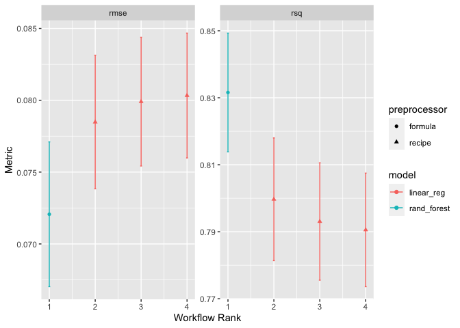
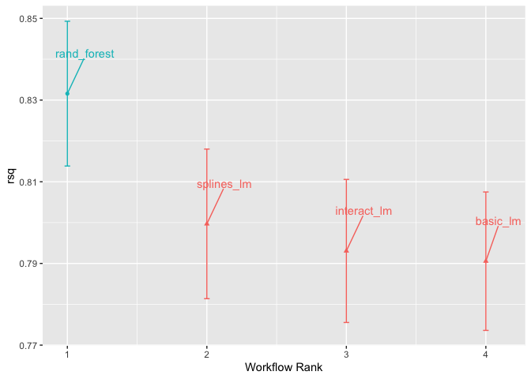
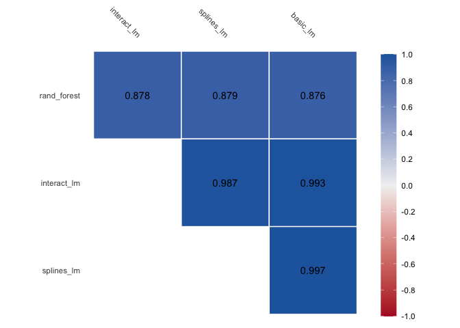
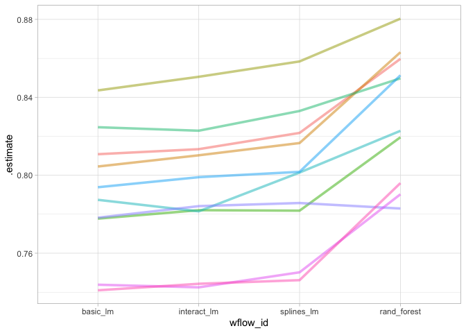

-   [Comparing Models with
    Resampling](#comparing-models-with-resampling)
    -   [CREATING MULTIPLE MODELS WITH WORKFLOW
        SETS](#creating-multiple-models-with-workflow-sets)
    -   [COMPARING RESAMPLED PERFORMANCE
        STATISTICS](#comparing-resampled-performance-statistics)
    -   [SIMPLE HYPOTHESIS TESTING
        METHODS](#simple-hypothesis-testing-methods)

# Comparing Models with Resampling

    library(tidymodels)

    ## ── Attaching packages ────────────────────────────────────── tidymodels 1.1.1 ──

    ## ✔ broom        1.0.5     ✔ recipes      1.0.9
    ## ✔ dials        1.2.0     ✔ rsample      1.2.0
    ## ✔ dplyr        1.1.3     ✔ tibble       3.2.1
    ## ✔ ggplot2      3.4.4     ✔ tidyr        1.3.0
    ## ✔ infer        1.0.4     ✔ tune         1.1.2
    ## ✔ modeldata    1.2.0     ✔ workflows    1.1.3
    ## ✔ parsnip      1.1.1     ✔ workflowsets 1.0.1
    ## ✔ purrr        1.0.2     ✔ yardstick    1.2.0

    ## ── Conflicts ───────────────────────────────────────── tidymodels_conflicts() ──
    ## ✖ purrr::discard() masks scales::discard()
    ## ✖ dplyr::filter()  masks stats::filter()
    ## ✖ dplyr::lag()     masks stats::lag()
    ## ✖ recipes::step()  masks stats::step()
    ## • Use tidymodels_prefer() to resolve common conflicts.

    data(ames)
    ames <- mutate(ames, Sale_Price = log10(Sale_Price))

    set.seed(502)
    ames_split <- initial_split(ames, prop = 0.80, strata = Sale_Price)
    ames_train <- training(ames_split)
    ames_test  <-  testing(ames_split)

    ames_rec <- 
      recipe(Sale_Price ~ Neighborhood + Gr_Liv_Area + Year_Built + Bldg_Type + 
               Latitude + Longitude, data = ames_train) %>%
      step_log(Gr_Liv_Area, base = 10) %>% 
      step_other(Neighborhood, threshold = 0.01) %>% 
      step_dummy(all_nominal_predictors()) %>% 
      step_interact( ~ Gr_Liv_Area:starts_with("Bldg_Type_") ) %>% 
      step_ns(Latitude, Longitude, deg_free = 20)

    lm_model <- linear_reg() %>% set_engine("lm")

    lm_wflow <- 
      workflow() %>% 
      add_model(lm_model) %>% 
      add_recipe(ames_rec)

    lm_fit <- fit(lm_wflow, ames_train)

    rf_model <- 
      rand_forest(trees = 1000) %>% 
      set_engine("ranger") %>% 
      set_mode("regression")

    rf_wflow <- 
      workflow() %>% 
      add_formula(
        Sale_Price ~ Neighborhood + Gr_Liv_Area + Year_Built + Bldg_Type + 
          Latitude + Longitude) %>% 
      add_model(rf_model) 

    set.seed(1001)
    ames_folds <- vfold_cv(ames_train, v = 10)

    keep_pred <- control_resamples(save_pred = TRUE, save_workflow = TRUE)

    set.seed(1003)
    rf_res <- rf_wflow %>% fit_resamples(resamples = ames_folds, control = keep_pred)

## CREATING MULTIPLE MODELS WITH WORKFLOW SETS

Ltes create three different linear models that add different
preprocessing steps incrementally, so we can test whether these
additional terms impove the models results

    # three recipes

    # basice one
    basic_rec <- 
      recipe( Sale_Price ~ Neighborhood + Gr_Liv_Area + Year_Built + Bldg_Type +
                Latitude + Longitude, data=ames_train) |> 
      step_log(Gr_Liv_Area, base=10) |> 
      step_other(Neighborhood, threshold=0.01) |> 
      step_dummy(all_nominal_predictors())

    # with interaction terms
    interaction_rec <- 
      basic_rec |> 
      step_interact(~Gr_Liv_Area:starts_with("Bldg_Type"))

    # with splines
    spline_rec <- 
      interaction_rec |> 
      step_ns(Latitude, Longitude, deg_free = 50)

    basic_rec

    ## 

    ## ── Recipe ──────────────────────────────────────────────────────────────────────

    ## 

    ## ── Inputs

    ## Number of variables by role

    ## outcome:   1
    ## predictor: 6

    ## 

    ## ── Operations

    ## • Log transformation on: Gr_Liv_Area

    ## • Collapsing factor levels for: Neighborhood

    ## • Dummy variables from: all_nominal_predictors()

    interaction_rec

    ## 

    ## ── Recipe ──────────────────────────────────────────────────────────────────────

    ## 

    ## ── Inputs

    ## Number of variables by role

    ## outcome:   1
    ## predictor: 6

    ## 

    ## ── Operations

    ## • Log transformation on: Gr_Liv_Area

    ## • Collapsing factor levels for: Neighborhood

    ## • Dummy variables from: all_nominal_predictors()

    ## • Interactions with: Gr_Liv_Area:starts_with("Bldg_Type")

    spline_rec

    ## 

    ## ── Recipe ──────────────────────────────────────────────────────────────────────

    ## 

    ## ── Inputs

    ## Number of variables by role

    ## outcome:   1
    ## predictor: 6

    ## 

    ## ── Operations

    ## • Log transformation on: Gr_Liv_Area

    ## • Collapsing factor levels for: Neighborhood

    ## • Dummy variables from: all_nominal_predictors()

    ## • Interactions with: Gr_Liv_Area:starts_with("Bldg_Type")

    ## • Natural splines on: Latitude, Longitude

    # using workflow set to create workflow with different recipes
    lm_models <-
      workflow_set(
        preproc = list(
          basic = basic_rec,
          interact = interaction_rec,
          splines = spline_rec
        ),
        models = list(lm = linear_reg()),
        cross = F
      )
    lm_models

    ## # A workflow set/tibble: 3 × 4
    ##   wflow_id    info             option    result    
    ##   <chr>       <list>           <list>    <list>    
    ## 1 basic_lm    <tibble [1 × 4]> <opts[0]> <list [0]>
    ## 2 interact_lm <tibble [1 × 4]> <opts[0]> <list [0]>
    ## 3 splines_lm  <tibble [1 × 4]> <opts[0]> <list [0]>

We’d like to resample each of the models in turn.

    lm_models <-
      lm_models |>
      workflow_map(
        "fit_resamples",
        seed = 1101,
        verbose = T,
        resamples = ames_folds,
        control = keep_pred
      )

    ## i 1 of 3 resampling: basic_lm

    ## ✔ 1 of 3 resampling: basic_lm (1.2s)

    ## i 2 of 3 resampling: interact_lm

    ## ✔ 2 of 3 resampling: interact_lm (1.3s)

    ## i 3 of 3 resampling: splines_lm

    ## ✔ 3 of 3 resampling: splines_lm (2.2s)

    lm_models

    ## # A workflow set/tibble: 3 × 4
    ##   wflow_id    info             option    result   
    ##   <chr>       <list>           <list>    <list>   
    ## 1 basic_lm    <tibble [1 × 4]> <opts[2]> <rsmp[+]>
    ## 2 interact_lm <tibble [1 × 4]> <opts[2]> <rsmp[+]>
    ## 3 splines_lm  <tibble [1 × 4]> <opts[2]> <rsmp[+]>

    collect_metrics(lm_models) |> 
      filter(.metric=="rmse")

    ## # A tibble: 3 × 9
    ##   wflow_id    .config      preproc model .metric .estimator   mean     n std_err
    ##   <chr>       <chr>        <chr>   <chr> <chr>   <chr>       <dbl> <int>   <dbl>
    ## 1 basic_lm    Preprocesso… recipe  line… rmse    standard   0.0803    10 0.00264
    ## 2 interact_lm Preprocesso… recipe  line… rmse    standard   0.0799    10 0.00272
    ## 3 splines_lm  Preprocesso… recipe  line… rmse    standard   0.0785    10 0.00282

What about the random forest model?

    # get the workflow and converto to a workflow set, bind with the lms
    four_models <- as_workflow_set(rand_forest = rf_res) |> 
      bind_rows(lm_models)

    # it was fitted using the same ames_fold
    four_models 

    ## # A workflow set/tibble: 4 × 4
    ##   wflow_id    info             option    result   
    ##   <chr>       <list>           <list>    <list>   
    ## 1 rand_forest <tibble [1 × 4]> <opts[0]> <rsmp[+]>
    ## 2 basic_lm    <tibble [1 × 4]> <opts[2]> <rsmp[+]>
    ## 3 interact_lm <tibble [1 × 4]> <opts[2]> <rsmp[+]>
    ## 4 splines_lm  <tibble [1 × 4]> <opts[2]> <rsmp[+]>

    autoplot(four_models)

    #focusing in the Rˆ2 metric
    library(ggrepel) 
    autoplot(four_models, metric="rsq") +
      geom_text_repel(aes(label=wflow_id), 
                      nudge_x = 1/8, nudge_y = 1/100) +
      theme(legend.position = "none")

## COMPARING RESAMPLED PERFORMANCE STATISTICS

Considering the preceding results for the three linear models, it
appears that the additional terms do not profoundly improve the mean
*R**M**S**E* or *R**ˆ*2 statistics for the linear models. The difference
is small, but it might be larger than the experimental noise in the
system, i.e., considered statistically significant. We can formally test
the hypothesis that the additional terms increase *R**ˆ*2.

> Before making between-model comparisons, it is important for us to
> discuss the within-resample correlation for resampling statistics.

let’s gather the individual resampling statistics for the linear models
and the random forest. We will focus on the *R**ˆ*2 statistic for each
mode

    rsq_indiv_estimates <-
      collect_metrics(four_models, summarize = FALSE) |>
      filter(.metric == "rsq")

    rsq_wider <-
      rsq_indiv_estimates |>
      select(wflow_id, .estimate, id) |>
      pivot_wider(id_cols = id,
                  names_from = wflow_id,
                  values_from = .estimate)

    corrr::correlate(rsq_wider |> 
                       select(-id)) |> 
      autoplot() +
      geom_text(aes(label=round(r,3)))

    ## Correlation computed with
    ## • Method: 'pearson'
    ## • Missing treated using: 'pairwise.complete.obs'

These correlations are high, and indicate that, across models, there are
large within-resample correlations. To see this visually, the *R**ˆ*2
statistics are shown for each model with lines connecting the resamples:

    rsq_indiv_estimates |> 
      mutate(wflow_id = reorder(wflow_id, .estimate)) |> 
      ggplot(aes(x=wflow_id, y=.estimate, group=id, color=id)) +
      geom_line(alpha=.5, linewidth=1.25) +
      theme_light() +
      theme(legend.position = "none") 

A statistical test for the correlations evaluates whether the magnitudes
of these correlations are not simply noise.

    rsq_wider |> 
      with( cor.test(basic_lm, splines_lm) ) |> 
      tidy() |> 
      select(estimate, starts_with("conf"))

    ## # A tibble: 1 × 3
    ##   estimate conf.low conf.high
    ##      <dbl>    <dbl>     <dbl>
    ## 1    0.997    0.987     0.999

The results of the correlation test (the estimate of the correlation and
the confidence intervals) show us that the within-resample correlation
appears to be real.

## SIMPLE HYPOTHESIS TESTING METHODS

<!--

We can use simple hypothesis testing to make formal comparisons between models. Consider the familiar linear statistical model:

$$y_{ij}=\beta_{0} + \beta_{1}x_{i1} + \dots + \beta_{p}x_{ip} + \epsilon_{ij}$$

This versatile model is used to create regression models as well as being the basis for the popular analysis of variance (ANOVA) technique for comparing groups. With the ANOVA model, the predictors ($x_{ij}$) are binary dummy variables for different groups. From this, the $\beta$ parameters estimate whether two or more groups are different from one another using hypothesis testing techniques.

-->

A simple and fast method for comparing two models at a time is to use
the differences in *R**ˆ*2 values as the outcome data in the ANOVA
model. Since the outcomes are matched by resample, the differences do
not contain the resample-to-resample effect and, for this reason, the
standard ANOVA model is appropriate. To illustrate, this call to `lm()`
tests the difference between two of the linear regression models:

    # using LM
    compare_lm <- rsq_wider |> 
      mutate(difference=splines_lm - basic_lm)

    lm(difference ~ 1, data=compare_lm) |> 
      tidy(conf.int = T) |> 
      select(estimate, p.value, starts_with("conf"))

    ## # A tibble: 1 × 4
    ##   estimate   p.value conf.low conf.high
    ##      <dbl>     <dbl>    <dbl>     <dbl>
    ## 1  0.00913 0.0000256  0.00650    0.0118

    # using a t.test
    rsq_wider %>% 
      with( t.test(splines_lm, basic_lm, paired = TRUE) ) %>%
      tidy() %>% 
      select(estimate, p.value, starts_with("conf"))

    ## # A tibble: 1 × 4
    ##   estimate   p.value conf.low conf.high
    ##      <dbl>     <dbl>    <dbl>     <dbl>
    ## 1  0.00913 0.0000256  0.00650    0.0118
