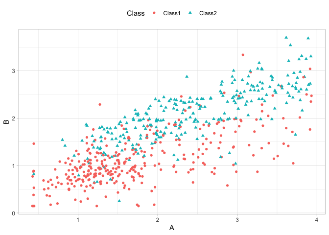

-   [Model Tuning](#model-tuning)
    -   [What do we optimize?](#what-do-we-optimize)
    -   [TWO GENERAL STRATEGIES FOR
        OPTIMIZATION](#two-general-strategies-for-optimization)
    -   [TUNING PARAMETERS IN
        TIDYMODELS](#tuning-parameters-in-tidymodels)
-   [Reference](#reference)

# Model Tuning

## What do we optimize?

For cases where the statistical properties of the tuning parameter are
tractable, common statistical properties can be used as the objective
function. For example, in the case of binary logistic regression, the
link function can be chosen by maximizing the likelihood or information
criteria.

> degrading the likelihood by overfitting actually improves
> misclassification error rate

To demonstrate, consider the classification data shown in Figure 12.1
with two predictors, two classes, and a training set of 593 data points.

    library(tidymodels)

    ## ── Attaching packages ────────────────────────────────────── tidymodels 1.1.1 ──

    ## ✔ broom        1.0.5     ✔ recipes      1.0.9
    ## ✔ dials        1.2.0     ✔ rsample      1.2.0
    ## ✔ dplyr        1.1.4     ✔ tibble       3.2.1
    ## ✔ ggplot2      3.4.4     ✔ tidyr        1.3.0
    ## ✔ infer        1.0.5     ✔ tune         1.1.2
    ## ✔ modeldata    1.2.0     ✔ workflows    1.1.3
    ## ✔ parsnip      1.1.1     ✔ workflowsets 1.0.1
    ## ✔ purrr        1.0.2     ✔ yardstick    1.2.0

    ## ── Conflicts ───────────────────────────────────────── tidymodels_conflicts() ──
    ## ✖ purrr::discard() masks scales::discard()
    ## ✖ dplyr::filter()  masks stats::filter()
    ## ✖ dplyr::lag()     masks stats::lag()
    ## ✖ recipes::step()  masks stats::step()
    ## • Learn how to get started at https://www.tidymodels.org/start/

    tidymodels_prefer()

    data("two_class_dat")

    dat_split <- initial_split(two_class_dat)
    training_set <- training(dat_split)
    testing_set  <- testing(dat_split)

    training_set

    ## # A tibble: 593 × 3
    ##        A     B Class 
    ##    <dbl> <dbl> <fct> 
    ##  1  1.72 0.996 Class1
    ##  2  3.40 1.47  Class1
    ##  3  2.84 2.54  Class1
    ##  4  2.48 1.97  Class2
    ##  5  1.78 0.777 Class1
    ##  6  1.80 0.633 Class1
    ##  7  2.04 1.95  Class2
    ##  8  1.44 0.740 Class1
    ##  9  1.08 1.03  Class1
    ## 10  1.52 0.250 Class2
    ## # ℹ 583 more rows

    training_set |> 
      ggplot(aes(x=A, y=B, color=Class, shape=Class)) +
      geom_point() +
      theme_light() +
      theme(legend.position = "top")

For a data frame `training_set`, let’s create a function to compute the
different models and extract the likelihood statistics for the training
set (using `broom::glance()`):

    llhood <- function(...) {
      logistic_reg() |>
        set_engine("glm", ...) |>
        fit(Class ~ ., data = training_set) |>
        glance() |>
        select(logLik)
    }

    bind_rows(
      llhood(),
      llhood(family = binomial(link = "probit")),
      llhood(family = binomial(link = "cloglog"))) |>
        mutate(link = c("logit", "probit", "c-log-log")) |>
        arrange(desc(logLik))

    ## # A tibble: 3 × 2
    ##   logLik link     
    ##    <dbl> <chr>    
    ## 1  -249. logit    
    ## 2  -253. probit   
    ## 3  -266. c-log-log

According to these results, the logistic model has the best statistical
properties.

From the scale of the log-likelihood values, it is difficult to
understand if these differences are important or negligible. One way of
improving this analysis is to resample the statistics and separate the
modeling data from the data used for performance estimation.

the `mn_log_loss()`function is used to estimate the negative
log-likelihood

    set.seed(1201)
    rs <- vfold_cv(training_set, repeats = 10)

    # Return the individual resampled performance estimates:
    lloss <- function(...) {
      perf_meas <- metric_set(roc_auc, mn_log_loss)
      logistic_reg() |> 
        set_engine("glm",...) |> 
        fit_resamples(Class~A+B, rs, metrics=perf_meas) |> 
        collect_metrics(summarize=FALSE) |> 
        select(id, id2, .metric, .estimate)
    }

    resampled_res <- bind_rows(
      lloss()                                |> mutate(model="logistic"), 
      lloss(family=binomial(link="probit"))  |> mutate(model="probit"),
      lloss(family=binomial(link="cloglog")) |> mutate(model="c-log-log")
    ) |> 
      # convert log-loss to log-likelihood
      mutate(.estimate = if_else(.metric=="mn_log_loss", -.estimate, .estimate)) |> 
      group_by(model, .metric) |> 
      summarize(
        mean = mean(.estimate, na.rm=T),
        std_err = sd(.estimate, na.rm=T) / sqrt(n()),
        .groups = "drop"
      )

    ## → A | warning: glm.fit: fitted probabilities numerically 0 or 1 occurred

    ## There were issues with some computations   A: x1There were issues with some computations   A: x1

    resampled_res

    ## # A tibble: 6 × 4
    ##   model     .metric       mean std_err
    ##   <chr>     <chr>        <dbl>   <dbl>
    ## 1 c-log-log mn_log_loss -0.464 0.0109 
    ## 2 c-log-log roc_auc      0.889 0.00464
    ## 3 logistic  mn_log_loss -0.426 0.00849
    ## 4 logistic  roc_auc      0.889 0.00460
    ## 5 probit    mn_log_loss -0.433 0.00863
    ## 6 probit    roc_auc      0.889 0.00459

    resampled_res |> 
      filter(.metric=="mn_log_loss") |> 
      ggplot(aes(x=mean, y=model)) +
      geom_point() +
      geom_errorbar(aes(xmin=mean-1.64 * std_err, xmax=mean+1.64*std_err), width=.1) +
      labs(y=NULL, x="log-likelihood") +
      theme_light() +
      labs(title="Log-Likelihood")

These results exhibit evidence that the choice of the link function
matters somewhat. Although there is an overlap in the confidence
intervals, the logistic model has the best results.

What about a different metric? We also calculated the area under the ROC
curve for each resample

    resampled_res |> 
      filter(.metric=="roc_auc") |> 
      ggplot(aes(x=mean, y=model)) +
      geom_point() +
      geom_errorbar(aes(xmin=mean-1.64 * std_err, xmax=mean+1.64*std_err), width=.1) +
      labs(y=NULL, x="roc_uac") +
      theme_light() +
      labs(title = "Area Under the ROC Curve")

Given the overlap of the intervals, as well as the scale of the x-axis,
any of these options could be used.

> Remembering Sigmoid Function
>
> *h**θ* = *g*(*z*)
>
> *z* = *θ*0 + *θ*1*x*1 + *θ*2*x*2
>
> *θ*0 + *θ*1*x*1 + *θ*2*x*2 ≥ 0
>
> *x*2 ≥ −*θ*0/*θ*2 + −*θ*1/*θ*2*x*1
>
> used in the line: `geom_abline` where the equation correspond to
> *x*2 =  − *i**n**t**e**r**c**e**p**t*/*b* − *a*/*b**x*1

    glm_models <- list(
      logit  = logistic_reg() |> set_engine("glm"),
      probit = logistic_reg() |> set_engine("glm", family=binomial(link="probit")),
      cloglog = logistic_reg() |> set_engine("glm", family=binomial(link="cloglog"))
    )

    wflows <- workflow_set(list(model=Class~A+B), models=glm_models)

    res <- wflows |> 
      mutate(fitted = map(info,~fit(.x$workflow[[1]], training_set)),
             params = map(fitted, tidy))
    res

    ## # A workflow set/tibble: 3 × 6
    ##   wflow_id      info             option    result     fitted     params  
    ##   <chr>         <list>           <list>    <list>     <list>     <list>  
    ## 1 model_logit   <tibble [1 × 4]> <opts[0]> <list [0]> <workflow> <tibble>
    ## 2 model_probit  <tibble [1 × 4]> <opts[0]> <list [0]> <workflow> <tibble>
    ## 3 model_cloglog <tibble [1 × 4]> <opts[0]> <list [0]> <workflow> <tibble>

    w_res <- res |> 
      select(wflow_id, params) |> 
      unnest(params) |> 
      pivot_wider(id_cols=wflow_id, names_from=term, values_from = estimate) |> 
      janitor::clean_names()

    w_res

    ## # A tibble: 3 × 4
    ##   wflow_id      intercept      a     b
    ##   <chr>             <dbl>  <dbl> <dbl>
    ## 1 model_logit       -4.04 -1.07   3.79
    ## 2 model_probit      -2.26 -0.556  2.06
    ## 3 model_cloglog     -2.68 -0.584  2.04

    training_set |> 
      ggplot(aes(x=A, y=B, color=Class, shape=Class)) +
      geom_point(show.legend = F) +
      geom_abline(data=w_res, aes(slope = -a/b, intercept = -intercept/b, linetype=wflow_id)) +
      coord_obs_pred() +
      theme_light() +
      theme(legend.position = "top") 

> This exercise emphasizes that different metrics might lead to
> different decisions about the choice of tuning parameter values. In
> this case, one metric indicates the models are somewhat different
> while another metric shows no difference at all.

## TWO GENERAL STRATEGIES FOR OPTIMIZATION

Tuning parameter optimization usually falls into one of two categories:
grid search and iterative search.

1.  *Grid search* is when we predefine a set of parameter values to
    evaluate. The main choices involved in grid search are how to make
    the grid and how many parameter combinations to evaluate.
2.  *Iterative search* or sequential search is when we sequentially
    discover new parameter combinations based on previous results.
    Almost any nonlinear optimization method is appropriate, although
    some are more efficient than others.

> Hybrid strategies are also an option and can work well. After an
> initial grid search, a sequential optimization can start from the best
> grid combination.

## TUNING PARAMETERS IN TIDYMODELS

We’ve already dealt with quite a number of arguments that correspond to
tuning parameters for recipe and model specifications in previous
chapters. It is possible to tune:

-   *the threshold for combining neighborhoods* into an “other” category
    (with argument name threshold) discussed in Section 8.4.1

-   *the number of degrees of freedom* in a natural spline (deg\_free,
    Section 8.4.3)

-   *the number of data points* required to execute a split in a
    tree-based model (min\_n, Section 6.1)

-   *the amount of regularization* in penalized models (penalty, Section
    6.1)

For `parsnip` model specifications, there are two kinds of parameter
arguments. *Main arguments* are those that are most often optimized for
performance and are available in multiple engines. A secondary set of
tuning parameters are *engine specific*. These are either infrequently
optimized or are specific only to certain engines.

> The main arguments use a harmonized naming system to remove
> inconsistencies across engines while engine-specific arguments do not.

How can we signal to tidymodels functions which arguments should be
optimized? Parameters are marked for tuning by assigning them a value of
`tune()`.

    # example of tunning sinalization
    neural_net_spec <-
      mlp(hidden_units = tune()) |> 
      set_mode("regression") |> 
      set_engine("keras")

    # tune doesn`t execute any particular parameter value, it only returns an expressions
    tune()

    ## tune()

    # we can check the tunning parameters for an object
    extract_parameter_set_dials(neural_net_spec)

    ## Collection of 1 parameters for tuning
    ## 
    ##    identifier         type    object
    ##  hidden_units hidden_units nparam[+]

How can we signal to tidymodels functions which arguments should be
optimized? Parameters are marked for tuning by assigning them a value of
`tune()`. If we want to tune the two spline functions to potentially
have different levels of smoothness, we call `step_ns()` twice, once for
each predictor. To make the parameters identifiable, the identification
argument can take any character string:

    data(ames)
    ames <- mutate(ames, Sale_Price = log10(Sale_Price))

    set.seed(502)
    ames_split <- initial_split(ames, prop = 0.80, strata = Sale_Price)
    ames_train <- training(ames_split)
    ames_test  <-  testing(ames_split)

    set.seed(1001)
    ames_folds <- vfold_cv(ames_train, v = 10)

    ames_rec <- 
      recipe(Sale_Price ~ Neighborhood + Gr_Liv_Area + Year_Built + Bldg_Type +
               Latitude + Longitude, data = ames_train) |> 
      step_log(Gr_Liv_Area, base=10) |> 
      step_other(Neighborhood, threshold = tune()) |> 
      step_dummy(all_nominal_predictors()) |> 
      step_interact(~ Gr_Liv_Area:starts_with("Bldg_Type_")) |> 
      step_ns(Longitude, deg_free = tune("longitude df")) |> 
      step_ns(Latitude, deg_free= tune("latitude df"))

    ames_rec

    ## 

    ## ── Recipe ──────────────────────────────────────────────────────────────────────

    ## 

    ## ── Inputs

    ## Number of variables by role

    ## outcome:   1
    ## predictor: 6

    ## 

    ## ── Operations

    ## • Log transformation on: Gr_Liv_Area

    ## • Collapsing factor levels for: Neighborhood

    ## • Dummy variables from: all_nominal_predictors()

    ## • Interactions with: Gr_Liv_Area:starts_with("Bldg_Type_")

    ## • Natural splines on: Longitude

    ## • Natural splines on: Latitude

    extract_parameter_set_dials(ames_rec)

    ## Collection of 3 parameters for tuning
    ## 
    ##    identifier      type    object
    ##     threshold threshold nparam[+]
    ##  longitude df  deg_free nparam[+]
    ##   latitude df  deg_free nparam[+]

When a recipe and model specification are combined using a workflow,
both sets of parameters are shown:

    wflow_param <- 
      workflow() |> 
      add_recipe(ames_rec) |> 
      add_model(neural_net_spec) |> 
      extract_parameter_set_dials()

    wflow_param

    ## Collection of 4 parameters for tuning
    ## 
    ##    identifier         type    object
    ##  hidden_units hidden_units nparam[+]
    ##     threshold    threshold nparam[+]
    ##  longitude df     deg_free nparam[+]
    ##   latitude df     deg_free nparam[+]

Each tuning parameter argument has a corresponding function in the
`dials` package. In the vast majority of the cases, the function has the
same name as the parameter argument:

    dials::hidden_units()

    ## # Hidden Units (quantitative)
    ## Range: [1, 10]

    dials::threshold()

    ## Threshold (quantitative)
    ## Range: [0, 1]

The deg\_free parameter is a counterexample; the notion of degrees of
freedom comes up in a variety of different contexts. When used with
splines, there is a specialized dials function called spline\_degree()
that is, by default, invoked for splines:

    dials::spline_degree()

    ## Spline Degrees of Freedom (quantitative)
    ## Range: [1, 10]

The dials package also has a convenience function for extracting a
particular parameter object, and, Inside the parameter set, the range of
the parameters can also be updated in place:

    wflow_param |> extract_parameter_dials("threshold")

    ## Threshold (quantitative)
    ## Range: [0, 0.1]

    extract_parameter_set_dials(ames_rec) |> 
      update(threshold=threshold(c(0.8,1.0)))

    ## Collection of 3 parameters for tuning
    ## 
    ##    identifier      type    object
    ##     threshold threshold nparam[+]
    ##  longitude df  deg_free nparam[+]
    ##   latitude df  deg_free nparam[+]

The \*\*p\*arameter\*\* sets created by `extract_parameter_set_dials()`
are consumed by the tidymodels tuning functions (when needed). If the
defaults for the tuning parameter objects require modification, a
modified parameter set is passed to the appropriate tuning function.

> Some tuning parameters depend on the dimensions of the data. For
> example, the number of nearest neighbors must be between one and the
> number of rows in the data.

# Reference

All code and text came from Max Kuhn and Julia Silge\`s book [Tidy
Modeling with R](https://www.tmwr.org/tuning).
