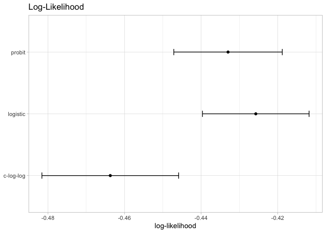
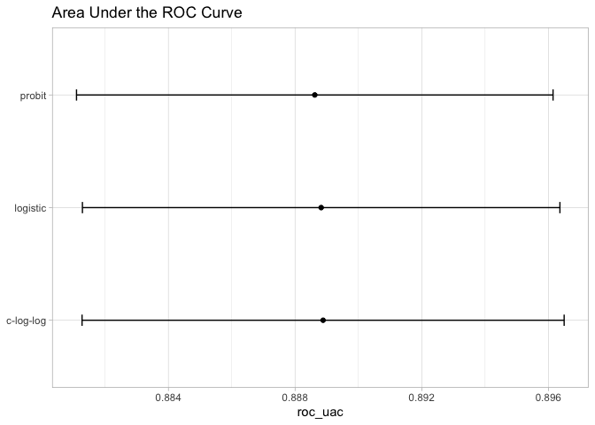
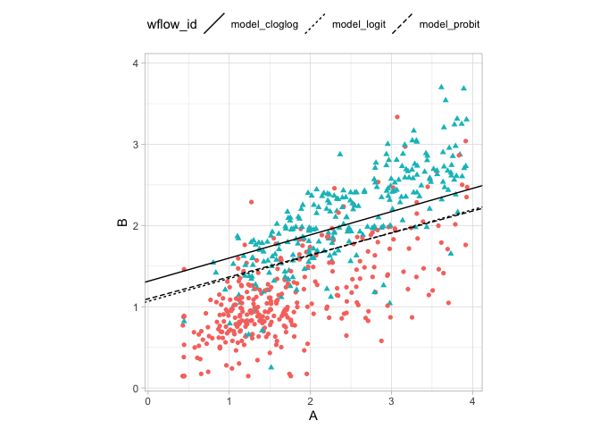

-   [Model Tuning](#model-tuning)
    -   [What do we optimize?](#what-do-we-optimize)
-   [Reference](#reference)

# Model Tuning

## What do we optimize?

For cases where the statistical properties of the tuning parameter are
tractable, common statistical properties can be used as the objective
function. For example, in the case of binary logistic regression, the
link function can be chosen by maximizing the likelihood or information
criteria.

> degrading the likelihood by overfitting actually improves
> misclassification error rate

To demonstrate, consider the classification data shown in Figure 12.1
with two predictors, two classes, and a training set of 593 data points.

    library(tidymodels)

    ## ── Attaching packages ────────────────────────────────────── tidymodels 1.1.1 ──

    ## ✔ broom        1.0.5     ✔ recipes      1.0.9
    ## ✔ dials        1.2.0     ✔ rsample      1.2.0
    ## ✔ dplyr        1.1.4     ✔ tibble       3.2.1
    ## ✔ ggplot2      3.4.4     ✔ tidyr        1.3.0
    ## ✔ infer        1.0.5     ✔ tune         1.1.2
    ## ✔ modeldata    1.2.0     ✔ workflows    1.1.3
    ## ✔ parsnip      1.1.1     ✔ workflowsets 1.0.1
    ## ✔ purrr        1.0.2     ✔ yardstick    1.2.0

    ## ── Conflicts ───────────────────────────────────────── tidymodels_conflicts() ──
    ## ✖ purrr::discard() masks scales::discard()
    ## ✖ dplyr::filter()  masks stats::filter()
    ## ✖ dplyr::lag()     masks stats::lag()
    ## ✖ recipes::step()  masks stats::step()
    ## • Search for functions across packages at https://www.tidymodels.org/find/

    tidymodels_prefer()

    data("two_class_dat")

    dat_split <- initial_split(two_class_dat)
    training_set <- training(dat_split)
    testing_set  <- testing(dat_split)

    training_set

    ## # A tibble: 593 × 3
    ##        A     B Class 
    ##    <dbl> <dbl> <fct> 
    ##  1 1.01  0.699 Class1
    ##  2 3.92  2.73  Class2
    ##  3 1.13  0.799 Class1
    ##  4 1.34  0.940 Class1
    ##  5 3.82  2.16  Class2
    ##  6 1.18  1.62  Class2
    ##  7 2.24  1.63  Class2
    ##  8 1.61  1.71  Class2
    ##  9 0.606 0.371 Class1
    ## 10 3.64  1.41  Class1
    ## # ℹ 583 more rows

    training_set |> 
      ggplot(aes(x=A, y=B, color=Class, shape=Class)) +
      geom_point() +
      theme_light() +
      theme(legend.position = "top")

For a data frame `training_set`, let’s create a function to compute the
different models and extract the likelihood statistics for the training
set (using `broom::glance()`):

    llhood <- function(...) {
      logistic_reg() |>
        set_engine("glm", ...) |>
        fit(Class ~ ., data = training_set) |>
        glance() |>
        select(logLik)
    }

    bind_rows(
      llhood(),
      llhood(family = binomial(link = "probit")),
      llhood(family = binomial(link = "cloglog"))) |>
        mutate(link = c("logit", "probit", "c-log-log")) |>
        arrange(desc(logLik))

    ## # A tibble: 3 × 2
    ##   logLik link     
    ##    <dbl> <chr>    
    ## 1  -265. logit    
    ## 2  -268. probit   
    ## 3  -279. c-log-log

According to these results, the logistic model has the best statistical
properties.

From the scale of the log-likelihood values, it is difficult to
understand if these differences are important or negligible. One way of
improving this analysis is to resample the statistics and separate the
modeling data from the data used for performance estimation.

the `mn_log_loss()`function is used to estimate the negative
log-likelihood

    set.seed(1201)
    rs <- vfold_cv(training_set, repeats = 10)

    # Return the individual resampled performance estimates:
    lloss <- function(...) {
      perf_meas <- metric_set(roc_auc, mn_log_loss)
      logistic_reg() |> 
        set_engine("glm",...) |> 
        fit_resamples(Class~A+B, rs, metrics=perf_meas) |> 
        collect_metrics(summarize=FALSE) |> 
        select(id, id2, .metric, .estimate)
    }

    resampled_res <- bind_rows(
      lloss()                                |> mutate(model="logistic"), 
      lloss(family=binomial(link="probit"))  |> mutate(model="probit"),
      lloss(family=binomial(link="cloglog")) |> mutate(model="c-log-log")
    ) |> 
      # convert log-loss to log-likelihood
      mutate(.estimate = if_else(.metric=="mn_log_loss", -.estimate, .estimate)) |> 
      group_by(model, .metric) |> 
      summarize(
        mean = mean(.estimate, na.rm=T),
        std_err = sd(.estimate, na.rm=T) / sqrt(n()),
        .groups = "drop"
      )

    resampled_res

    ## # A tibble: 6 × 4
    ##   model     .metric       mean std_err
    ##   <chr>     <chr>        <dbl>   <dbl>
    ## 1 c-log-log mn_log_loss -0.483 0.00905
    ## 2 c-log-log roc_auc      0.875 0.00421
    ## 3 logistic  mn_log_loss -0.452 0.00705
    ## 4 logistic  roc_auc      0.875 0.00423
    ## 5 probit    mn_log_loss -0.458 0.00706
    ## 6 probit    roc_auc      0.875 0.00421

    resampled_res |> 
      filter(.metric=="mn_log_loss") |> 
      ggplot(aes(x=mean, y=model)) +
      geom_point() +
      geom_errorbar(aes(xmin=mean-1.64 * std_err, xmax=mean+1.64*std_err), width=.1) +
      labs(y=NULL, x="log-likelihood") +
      theme_light() +
      labs(title="Log-Likelihood")

These results exhibit evidence that the choice of the link function
matters somewhat. Although there is an overlap in the confidence
intervals, the logistic model has the best results.

What about a different metric? We also calculated the area under the ROC
curve for each resample

    resampled_res |> 
      filter(.metric=="roc_auc") |> 
      ggplot(aes(x=mean, y=model)) +
      geom_point() +
      geom_errorbar(aes(xmin=mean-1.64 * std_err, xmax=mean+1.64*std_err), width=.1) +
      labs(y=NULL, x="roc_uac") +
      theme_light() +
      labs(title = "Area Under the ROC Curve")

Given the overlap of the intervals, as well as the scale of the x-axis,
any of these options could be used.

    glm_models <- list(
      logit  = logistic_reg() |> set_engine("glm"),
      probit = logistic_reg() |> set_engine("glm", family=binomial(link="probit")),
      cloglog = logistic_reg() |> set_engine("glm", family=binomial(link="cloglog"))
    )

    wflows <- workflow_set(list(model=Class~A+B), models=glm_models)

    res <- wflows |> 
      mutate(fitted = map(info,~fit(.x$workflow[[1]], training_set)),
             params = map(fitted, tidy))
    res

    ## # A workflow set/tibble: 3 × 6
    ##   wflow_id      info             option    result     fitted     params  
    ##   <chr>         <list>           <list>    <list>     <list>     <list>  
    ## 1 model_logit   <tibble [1 × 4]> <opts[0]> <list [0]> <workflow> <tibble>
    ## 2 model_probit  <tibble [1 × 4]> <opts[0]> <list [0]> <workflow> <tibble>
    ## 3 model_cloglog <tibble [1 × 4]> <opts[0]> <list [0]> <workflow> <tibble>

    w_res <- res |> 
      select(wflow_id, params) |> 
      unnest(params) |> 
      pivot_wider(id_cols=wflow_id, names_from=term, values_from = estimate) |> 
      janitor::clean_names()

    w_res

    ## # A tibble: 3 × 4
    ##   wflow_id      intercept      a     b
    ##   <chr>             <dbl>  <dbl> <dbl>
    ## 1 model_logit       -3.48 -1.34   3.75
    ## 2 model_probit      -1.98 -0.719  2.07
    ## 3 model_cloglog     -2.47 -0.745  2.10

    training_set |> 
      ggplot(aes(x=A, y=B, color=Class, shape=Class)) +
      geom_point(show.legend = F) +
      geom_abline(data=w_res, aes(slope = -a/b, intercept = -intercept/b, linetype=wflow_id)) +
      coord_obs_pred() +
      theme_light() +
      theme(legend.position = "top") 

Remembering Sigmoid Function

*h**θ* = *g*(*z*)
*z* = *θ*0 + *θ*1*x*1 + *θ*2*x*2
*θ*0 + *θ*1*x*1 + *θ*2*x*2 ≥ 0
*x*2 ≥ −*θ*0/*θ*2 + −*θ*1/*θ*2*x*1

# Reference

All code and text came from Max Kuhn and Julia Silge\`s book [Tidy
Modeling with R](https://www.tmwr.org/tuning).
