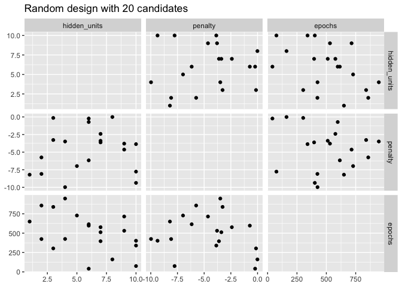

-   [GRID SEARCH](#grid-search)
    -   [REGULAR AND NONREGULAR GRIDS](#regular-and-nonregular-grids)
    -   [REGULAR GRIDS](#regular-grids)
    -   [IRREGULAR GRIDS](#irregular-grids)
    -   [EVALUATING THE GRID](#evaluating-the-grid)
        -   [Dataset](#dataset)
    -   [Tunning the model](#tunning-the-model)
    -   [FINALIZING THE MODEL](#finalizing-the-model)
    -   [TOOLS FOR CREATING TUNING
        SPECIFICATIONS](#tools-for-creating-tuning-specifications)
-   [Reference](#reference)

# GRID SEARCH

## REGULAR AND NONREGULAR GRIDS

There are two main types of grids. A *regular grid* combines each
parameter (with its corresponding set of possible values) factorially,
i.e., by using all combinations of the sets. Alternatively, *a
nonregular grid* is one where the parameter combinations are not formed
from a small set of points.

Before we look at each type in more detail, let’s consider an example
model: the multilayer perceptron model (a.k.a. single layer artificial
neural network). The parameters marked for tuning are:

-   the number of hidden units
-   the number of fitting epochs/iterations in model training
-   the amount of weight decay penalization

<!-- -->

    library(tidymodels)

    ## ── Attaching packages ────────────────────────────────────── tidymodels 1.1.1 ──

    ## ✔ broom        1.0.5     ✔ recipes      1.0.9
    ## ✔ dials        1.2.0     ✔ rsample      1.2.0
    ## ✔ dplyr        1.1.4     ✔ tibble       3.2.1
    ## ✔ ggplot2      3.4.4     ✔ tidyr        1.3.0
    ## ✔ infer        1.0.5     ✔ tune         1.1.2
    ## ✔ modeldata    1.2.0     ✔ workflows    1.1.3
    ## ✔ parsnip      1.1.1     ✔ workflowsets 1.0.1
    ## ✔ purrr        1.0.2     ✔ yardstick    1.2.0

    ## ── Conflicts ───────────────────────────────────────── tidymodels_conflicts() ──
    ## ✖ purrr::discard() masks scales::discard()
    ## ✖ dplyr::filter()  masks stats::filter()
    ## ✖ dplyr::lag()     masks stats::lag()
    ## ✖ recipes::step()  masks stats::step()
    ## • Learn how to get started at https://www.tidymodels.org/start/

    mlp_spec <- 
      mlp(hidden_units = tune(), penalty = tune(), epochs = tune()) |> 
      set_engine("nnet", trace=0) |> # The argument trace = 0 prevents extra logging of the training process
      set_mode("classification")

    mlp_spec

    ## Single Layer Neural Network Model Specification (classification)
    ## 
    ## Main Arguments:
    ##   hidden_units = tune()
    ##   penalty = tune()
    ##   epochs = tune()
    ## 
    ## Engine-Specific Arguments:
    ##   trace = 0
    ## 
    ## Computational engine: nnet

    mlp_param <- extract_parameter_set_dials(mlp_spec)
    mlp_param

    ## Collection of 3 parameters for tuning
    ## 
    ##    identifier         type    object
    ##  hidden_units hidden_units nparam[+]
    ##       penalty      penalty nparam[+]
    ##        epochs       epochs nparam[+]

    mlp_param |> 
      extract_parameter_dials("hidden_units")

    ## # Hidden Units (quantitative)
    ## Range: [1, 10]

    mlp_param |> 
      extract_parameter_dials("epochs")

    ## # Epochs (quantitative)
    ## Range: [10, 1000]

## REGULAR GRIDS

Regular grids are combinations of separate sets of parameter values. The
*tidyr* function `crossing()` is one way to create a regular grid:

    crossing(
      hidden_units = 1:3, 
      penalty = c(0.0, 0.1),
      epochs = c(100, 200)
    )

    ## # A tibble: 12 × 3
    ##    hidden_units penalty epochs
    ##           <int>   <dbl>  <dbl>
    ##  1            1     0      100
    ##  2            1     0      200
    ##  3            1     0.1    100
    ##  4            1     0.1    200
    ##  5            2     0      100
    ##  6            2     0      200
    ##  7            2     0.1    100
    ##  8            2     0.1    200
    ##  9            3     0      100
    ## 10            3     0      200
    ## 11            3     0.1    100
    ## 12            3     0.1    200

The parameter object knows the ranges of the parameters. The *dials*
package contains a set of `grid_*()` functions that take the parameter
object as input to produce different types of grids

    grid_regular(mlp_param, levels=2)

    ## # A tibble: 8 × 3
    ##   hidden_units      penalty epochs
    ##          <int>        <dbl>  <int>
    ## 1            1 0.0000000001     10
    ## 2           10 0.0000000001     10
    ## 3            1 1                10
    ## 4           10 1                10
    ## 5            1 0.0000000001   1000
    ## 6           10 0.0000000001   1000
    ## 7            1 1              1000
    ## 8           10 1              1000

The `levels` argument is the number of levels per parameter to create.
It can also take a named vector of values:

    mlp_param |> 
      grid_regular(levels=c(hidden_units=3, penalty=2, epochs=2))

    ## # A tibble: 12 × 3
    ##    hidden_units      penalty epochs
    ##           <int>        <dbl>  <int>
    ##  1            1 0.0000000001     10
    ##  2            5 0.0000000001     10
    ##  3           10 0.0000000001     10
    ##  4            1 1                10
    ##  5            5 1                10
    ##  6           10 1                10
    ##  7            1 0.0000000001   1000
    ##  8            5 0.0000000001   1000
    ##  9           10 0.0000000001   1000
    ## 10            1 1              1000
    ## 11            5 1              1000
    ## 12           10 1              1000

## IRREGULAR GRIDS

    set.seed(1301)
    mlp_param |> 
      grid_random(size=100) |> # size is the number of combinations
      summary()

    ##   hidden_units      penalty              epochs      
    ##  Min.   : 1.00   Min.   :0.0000000   Min.   :  19.0  
    ##  1st Qu.: 3.00   1st Qu.:0.0000002   1st Qu.: 276.8  
    ##  Median : 5.00   Median :0.0000961   Median : 523.0  
    ##  Mean   : 5.64   Mean   :0.0549390   Mean   : 530.1  
    ##  3rd Qu.: 8.00   3rd Qu.:0.0095897   3rd Qu.: 758.0  
    ##  Max.   :10.00   Max.   :0.9736630   Max.   :1000.0

The issue with random grids is that, with small-to-medium grids, random
values can result in overlapping parameter combination

    library(ggforce)
    set.seed(1302)
    mlp_param |> 
      grid_random(size=20, original = F) |> 
      ggplot(aes(x=.panel_x, y=.panel_y)) +
      geom_point() +
      geom_blank() +
      facet_matrix(vars(hidden_units, penalty, epochs), layer.diag=2) +
      labs(title="Random design with 20 candidates")

A much better approach is to use a set of experimental designs called
space-filling designs. While different design methods have slightly
different goals, they generally find a configuration of points that
cover the parameter space with the smallest chance of overlapping or
redundant values

The dials package contains functions for Latin hypercube and maximum
entropy designs.

    set.seed(1303)
    mlp_param %>% 
      grid_latin_hypercube(size = 20, original = FALSE) %>% 
      ggplot(aes(x = .panel_x, y = .panel_y)) + 
      geom_point() +
      geom_blank() +
      facet_matrix(vars(hidden_units, penalty, epochs), layer.diag = 2) + 
      labs(title = "Latin Hypercube design with 20 candidates")

While not perfect, this Latin hypercube design spaces the points farther
away from one another and allows a better exploration of the
hyperparameter space.

## EVALUATING THE GRID

### Dataset

We use a classification data set to demonstrate model tuning in this and
the next chapter. The data come from Hill et al. (2007), who developed
an automated microscopy laboratory tool for cancer research. The data
consists of 56 imaging measurements on 2019 human breast cancer cells.
These predictors represent shape and intensity characteristics of
different parts of the cells (e.g., the nucleus, the cell boundary,
etc.). The data are included in the `modeldata` package. Let’s remove
one column not needed for analysis (`case`).

    library(tidymodels)
    data(cells)

    skimr::skim(cells)

<table>
<caption>Data summary</caption>
<tbody>
<tr class="odd">
<td style="text-align: left;">Name</td>
<td style="text-align: left;">cells</td>
</tr>
<tr class="even">
<td style="text-align: left;">Number of rows</td>
<td style="text-align: left;">2019</td>
</tr>
<tr class="odd">
<td style="text-align: left;">Number of columns</td>
<td style="text-align: left;">58</td>
</tr>
<tr class="even">
<td style="text-align: left;">_______________________</td>
<td style="text-align: left;"></td>
</tr>
<tr class="odd">
<td style="text-align: left;">Column type frequency:</td>
<td style="text-align: left;"></td>
</tr>
<tr class="even">
<td style="text-align: left;">factor</td>
<td style="text-align: left;">2</td>
</tr>
<tr class="odd">
<td style="text-align: left;">numeric</td>
<td style="text-align: left;">56</td>
</tr>
<tr class="even">
<td style="text-align: left;">________________________</td>
<td style="text-align: left;"></td>
</tr>
<tr class="odd">
<td style="text-align: left;">Group variables</td>
<td style="text-align: left;">None</td>
</tr>
</tbody>
</table>

Data summary

**Variable type: factor**

<table>
<colgroup>
<col style="width: 18%" />
<col style="width: 13%" />
<col style="width: 18%" />
<col style="width: 10%" />
<col style="width: 11%" />
<col style="width: 27%" />
</colgroup>
<thead>
<tr class="header">
<th style="text-align: left;">skim_variable</th>
<th style="text-align: right;">n_missing</th>
<th style="text-align: right;">complete_rate</th>
<th style="text-align: left;">ordered</th>
<th style="text-align: right;">n_unique</th>
<th style="text-align: left;">top_counts</th>
</tr>
</thead>
<tbody>
<tr class="odd">
<td style="text-align: left;">case</td>
<td style="text-align: right;">0</td>
<td style="text-align: right;">1</td>
<td style="text-align: left;">FALSE</td>
<td style="text-align: right;">2</td>
<td style="text-align: left;">Tes: 1010, Tra: 1009</td>
</tr>
<tr class="even">
<td style="text-align: left;">class</td>
<td style="text-align: right;">0</td>
<td style="text-align: right;">1</td>
<td style="text-align: left;">FALSE</td>
<td style="text-align: right;">2</td>
<td style="text-align: left;">PS: 1300, WS: 719</td>
</tr>
</tbody>
</table>

**Variable type: numeric**

<table style="width:100%;">
<colgroup>
<col style="width: 23%" />
<col style="width: 8%" />
<col style="width: 11%" />
<col style="width: 7%" />
<col style="width: 7%" />
<col style="width: 6%" />
<col style="width: 7%" />
<col style="width: 7%" />
<col style="width: 7%" />
<col style="width: 8%" />
<col style="width: 4%" />
</colgroup>
<thead>
<tr class="header">
<th style="text-align: left;">skim_variable</th>
<th style="text-align: right;">n_missing</th>
<th style="text-align: right;">complete_rate</th>
<th style="text-align: right;">mean</th>
<th style="text-align: right;">sd</th>
<th style="text-align: right;">p0</th>
<th style="text-align: right;">p25</th>
<th style="text-align: right;">p50</th>
<th style="text-align: right;">p75</th>
<th style="text-align: right;">p100</th>
<th style="text-align: left;">hist</th>
</tr>
</thead>
<tbody>
<tr class="odd">
<td style="text-align: left;">angle_ch_1</td>
<td style="text-align: right;">0</td>
<td style="text-align: right;">1</td>
<td style="text-align: right;">90.49</td>
<td style="text-align: right;">48.76</td>
<td style="text-align: right;">0.03</td>
<td style="text-align: right;">53.89</td>
<td style="text-align: right;">90.59</td>
<td style="text-align: right;">126.68</td>
<td style="text-align: right;">179.94</td>
<td style="text-align: left;">▅▅▇▅▅</td>
</tr>
<tr class="even">
<td style="text-align: left;">area_ch_1</td>
<td style="text-align: right;">0</td>
<td style="text-align: right;">1</td>
<td style="text-align: right;">320.34</td>
<td style="text-align: right;">214.02</td>
<td style="text-align: right;">150.00</td>
<td style="text-align: right;">193.00</td>
<td style="text-align: right;">253.00</td>
<td style="text-align: right;">362.50</td>
<td style="text-align: right;">2186.00</td>
<td style="text-align: left;">▇▁▁▁▁</td>
</tr>
<tr class="odd">
<td style="text-align: left;">avg_inten_ch_1</td>
<td style="text-align: right;">0</td>
<td style="text-align: right;">1</td>
<td style="text-align: right;">126.07</td>
<td style="text-align: right;">165.01</td>
<td style="text-align: right;">15.16</td>
<td style="text-align: right;">35.36</td>
<td style="text-align: right;">62.34</td>
<td style="text-align: right;">143.19</td>
<td style="text-align: right;">1418.63</td>
<td style="text-align: left;">▇▁▁▁▁</td>
</tr>
<tr class="even">
<td style="text-align: left;">avg_inten_ch_2</td>
<td style="text-align: right;">0</td>
<td style="text-align: right;">1</td>
<td style="text-align: right;">189.05</td>
<td style="text-align: right;">158.96</td>
<td style="text-align: right;">1.00</td>
<td style="text-align: right;">45.00</td>
<td style="text-align: right;">173.51</td>
<td style="text-align: right;">279.29</td>
<td style="text-align: right;">989.51</td>
<td style="text-align: left;">▇▅▁▁▁</td>
</tr>
<tr class="odd">
<td style="text-align: left;">avg_inten_ch_3</td>
<td style="text-align: right;">0</td>
<td style="text-align: right;">1</td>
<td style="text-align: right;">96.42</td>
<td style="text-align: right;">96.67</td>
<td style="text-align: right;">0.12</td>
<td style="text-align: right;">33.50</td>
<td style="text-align: right;">67.43</td>
<td style="text-align: right;">127.34</td>
<td style="text-align: right;">1205.51</td>
<td style="text-align: left;">▇▁▁▁▁</td>
</tr>
<tr class="even">
<td style="text-align: left;">avg_inten_ch_4</td>
<td style="text-align: right;">0</td>
<td style="text-align: right;">1</td>
<td style="text-align: right;">140.70</td>
<td style="text-align: right;">146.63</td>
<td style="text-align: right;">0.56</td>
<td style="text-align: right;">40.68</td>
<td style="text-align: right;">90.25</td>
<td style="text-align: right;">191.17</td>
<td style="text-align: right;">886.84</td>
<td style="text-align: left;">▇▂▁▁▁</td>
</tr>
<tr class="odd">
<td style="text-align: left;">convex_hull_area_ratio_ch_1</td>
<td style="text-align: right;">0</td>
<td style="text-align: right;">1</td>
<td style="text-align: right;">1.21</td>
<td style="text-align: right;">0.20</td>
<td style="text-align: right;">1.01</td>
<td style="text-align: right;">1.07</td>
<td style="text-align: right;">1.15</td>
<td style="text-align: right;">1.28</td>
<td style="text-align: right;">2.90</td>
<td style="text-align: left;">▇▁▁▁▁</td>
</tr>
<tr class="even">
<td style="text-align: left;">convex_hull_perim_ratio_ch_1</td>
<td style="text-align: right;">0</td>
<td style="text-align: right;">1</td>
<td style="text-align: right;">0.90</td>
<td style="text-align: right;">0.08</td>
<td style="text-align: right;">0.51</td>
<td style="text-align: right;">0.86</td>
<td style="text-align: right;">0.91</td>
<td style="text-align: right;">0.96</td>
<td style="text-align: right;">1.00</td>
<td style="text-align: left;">▁▁▂▅▇</td>
</tr>
<tr class="odd">
<td style="text-align: left;">diff_inten_density_ch_1</td>
<td style="text-align: right;">0</td>
<td style="text-align: right;">1</td>
<td style="text-align: right;">72.66</td>
<td style="text-align: right;">49.03</td>
<td style="text-align: right;">25.76</td>
<td style="text-align: right;">43.53</td>
<td style="text-align: right;">55.81</td>
<td style="text-align: right;">79.91</td>
<td style="text-align: right;">442.77</td>
<td style="text-align: left;">▇▁▁▁▁</td>
</tr>
<tr class="even">
<td style="text-align: left;">diff_inten_density_ch_3</td>
<td style="text-align: right;">0</td>
<td style="text-align: right;">1</td>
<td style="text-align: right;">74.33</td>
<td style="text-align: right;">66.01</td>
<td style="text-align: right;">1.41</td>
<td style="text-align: right;">29.03</td>
<td style="text-align: right;">54.14</td>
<td style="text-align: right;">96.86</td>
<td style="text-align: right;">470.69</td>
<td style="text-align: left;">▇▂▁▁▁</td>
</tr>
<tr class="odd">
<td style="text-align: left;">diff_inten_density_ch_4</td>
<td style="text-align: right;">0</td>
<td style="text-align: right;">1</td>
<td style="text-align: right;">87.18</td>
<td style="text-align: right;">81.26</td>
<td style="text-align: right;">2.31</td>
<td style="text-align: right;">31.68</td>
<td style="text-align: right;">60.09</td>
<td style="text-align: right;">115.06</td>
<td style="text-align: right;">531.35</td>
<td style="text-align: left;">▇▂▁▁▁</td>
</tr>
<tr class="even">
<td style="text-align: left;">entropy_inten_ch_1</td>
<td style="text-align: right;">0</td>
<td style="text-align: right;">1</td>
<td style="text-align: right;">6.58</td>
<td style="text-align: right;">0.75</td>
<td style="text-align: right;">4.71</td>
<td style="text-align: right;">6.03</td>
<td style="text-align: right;">6.57</td>
<td style="text-align: right;">7.04</td>
<td style="text-align: right;">9.48</td>
<td style="text-align: left;">▂▇▇▂▁</td>
</tr>
<tr class="odd">
<td style="text-align: left;">entropy_inten_ch_3</td>
<td style="text-align: right;">0</td>
<td style="text-align: right;">1</td>
<td style="text-align: right;">5.48</td>
<td style="text-align: right;">1.47</td>
<td style="text-align: right;">0.22</td>
<td style="text-align: right;">4.61</td>
<td style="text-align: right;">5.85</td>
<td style="text-align: right;">6.61</td>
<td style="text-align: right;">8.01</td>
<td style="text-align: left;">▁▂▅▇▆</td>
</tr>
<tr class="even">
<td style="text-align: left;">entropy_inten_ch_4</td>
<td style="text-align: right;">0</td>
<td style="text-align: right;">1</td>
<td style="text-align: right;">5.51</td>
<td style="text-align: right;">1.50</td>
<td style="text-align: right;">0.37</td>
<td style="text-align: right;">4.67</td>
<td style="text-align: right;">5.80</td>
<td style="text-align: right;">6.66</td>
<td style="text-align: right;">8.27</td>
<td style="text-align: left;">▁▂▃▇▅</td>
</tr>
<tr class="odd">
<td style="text-align: left;">eq_circ_diam_ch_1</td>
<td style="text-align: right;">0</td>
<td style="text-align: right;">1</td>
<td style="text-align: right;">19.48</td>
<td style="text-align: right;">5.38</td>
<td style="text-align: right;">13.86</td>
<td style="text-align: right;">15.71</td>
<td style="text-align: right;">17.97</td>
<td style="text-align: right;">21.50</td>
<td style="text-align: right;">52.76</td>
<td style="text-align: left;">▇▂▁▁▁</td>
</tr>
<tr class="even">
<td style="text-align: left;">eq_ellipse_lwr_ch_1</td>
<td style="text-align: right;">0</td>
<td style="text-align: right;">1</td>
<td style="text-align: right;">2.11</td>
<td style="text-align: right;">1.03</td>
<td style="text-align: right;">1.01</td>
<td style="text-align: right;">1.42</td>
<td style="text-align: right;">1.83</td>
<td style="text-align: right;">2.45</td>
<td style="text-align: right;">11.31</td>
<td style="text-align: left;">▇▁▁▁▁</td>
</tr>
<tr class="odd">
<td style="text-align: left;">eq_ellipse_oblate_vol_ch_1</td>
<td style="text-align: right;">0</td>
<td style="text-align: right;">1</td>
<td style="text-align: right;">714.66</td>
<td style="text-align: right;">936.60</td>
<td style="text-align: right;">146.46</td>
<td style="text-align: right;">277.58</td>
<td style="text-align: right;">433.32</td>
<td style="text-align: right;">785.12</td>
<td style="text-align: right;">11688.96</td>
<td style="text-align: left;">▇▁▁▁▁</td>
</tr>
<tr class="even">
<td style="text-align: left;">eq_ellipse_prolate_vol_ch_1</td>
<td style="text-align: right;">0</td>
<td style="text-align: right;">1</td>
<td style="text-align: right;">361.57</td>
<td style="text-align: right;">458.09</td>
<td style="text-align: right;">63.85</td>
<td style="text-align: right;">148.36</td>
<td style="text-align: right;">224.36</td>
<td style="text-align: right;">383.89</td>
<td style="text-align: right;">6314.82</td>
<td style="text-align: left;">▇▁▁▁▁</td>
</tr>
<tr class="odd">
<td style="text-align: left;">eq_sphere_area_ch_1</td>
<td style="text-align: right;">0</td>
<td style="text-align: right;">1</td>
<td style="text-align: right;">1283.37</td>
<td style="text-align: right;">856.13</td>
<td style="text-align: right;">603.76</td>
<td style="text-align: right;">775.66</td>
<td style="text-align: right;">1014.64</td>
<td style="text-align: right;">1452.79</td>
<td style="text-align: right;">8746.06</td>
<td style="text-align: left;">▇▁▁▁▁</td>
</tr>
<tr class="even">
<td style="text-align: left;">eq_sphere_vol_ch_1</td>
<td style="text-align: right;">0</td>
<td style="text-align: right;">1</td>
<td style="text-align: right;">4918.42</td>
<td style="text-align: right;">6176.01</td>
<td style="text-align: right;">1394.97</td>
<td style="text-align: right;">2031.32</td>
<td style="text-align: right;">3039.10</td>
<td style="text-align: right;">5206.87</td>
<td style="text-align: right;">76911.76</td>
<td style="text-align: left;">▇▁▁▁▁</td>
</tr>
<tr class="odd">
<td style="text-align: left;">fiber_align_2_ch_3</td>
<td style="text-align: right;">0</td>
<td style="text-align: right;">1</td>
<td style="text-align: right;">1.45</td>
<td style="text-align: right;">0.25</td>
<td style="text-align: right;">1.00</td>
<td style="text-align: right;">1.29</td>
<td style="text-align: right;">1.47</td>
<td style="text-align: right;">1.65</td>
<td style="text-align: right;">2.00</td>
<td style="text-align: left;">▅▅▇▆▂</td>
</tr>
<tr class="even">
<td style="text-align: left;">fiber_align_2_ch_4</td>
<td style="text-align: right;">0</td>
<td style="text-align: right;">1</td>
<td style="text-align: right;">1.43</td>
<td style="text-align: right;">0.24</td>
<td style="text-align: right;">1.00</td>
<td style="text-align: right;">1.26</td>
<td style="text-align: right;">1.45</td>
<td style="text-align: right;">1.62</td>
<td style="text-align: right;">2.00</td>
<td style="text-align: left;">▆▆▇▆▁</td>
</tr>
<tr class="odd">
<td style="text-align: left;">fiber_length_ch_1</td>
<td style="text-align: right;">0</td>
<td style="text-align: right;">1</td>
<td style="text-align: right;">34.72</td>
<td style="text-align: right;">21.21</td>
<td style="text-align: right;">11.87</td>
<td style="text-align: right;">20.86</td>
<td style="text-align: right;">29.29</td>
<td style="text-align: right;">41.08</td>
<td style="text-align: right;">220.23</td>
<td style="text-align: left;">▇▁▁▁▁</td>
</tr>
<tr class="even">
<td style="text-align: left;">fiber_width_ch_1</td>
<td style="text-align: right;">0</td>
<td style="text-align: right;">1</td>
<td style="text-align: right;">10.27</td>
<td style="text-align: right;">3.72</td>
<td style="text-align: right;">4.38</td>
<td style="text-align: right;">7.32</td>
<td style="text-align: right;">9.61</td>
<td style="text-align: right;">12.64</td>
<td style="text-align: right;">33.17</td>
<td style="text-align: left;">▇▆▁▁▁</td>
</tr>
<tr class="odd">
<td style="text-align: left;">inten_cooc_asm_ch_3</td>
<td style="text-align: right;">0</td>
<td style="text-align: right;">1</td>
<td style="text-align: right;">0.10</td>
<td style="text-align: right;">0.14</td>
<td style="text-align: right;">0.00</td>
<td style="text-align: right;">0.01</td>
<td style="text-align: right;">0.04</td>
<td style="text-align: right;">0.13</td>
<td style="text-align: right;">0.94</td>
<td style="text-align: left;">▇▁▁▁▁</td>
</tr>
<tr class="even">
<td style="text-align: left;">inten_cooc_asm_ch_4</td>
<td style="text-align: right;">0</td>
<td style="text-align: right;">1</td>
<td style="text-align: right;">0.10</td>
<td style="text-align: right;">0.13</td>
<td style="text-align: right;">0.00</td>
<td style="text-align: right;">0.02</td>
<td style="text-align: right;">0.05</td>
<td style="text-align: right;">0.11</td>
<td style="text-align: right;">0.88</td>
<td style="text-align: left;">▇▁▁▁▁</td>
</tr>
<tr class="odd">
<td style="text-align: left;">inten_cooc_contrast_ch_3</td>
<td style="text-align: right;">0</td>
<td style="text-align: right;">1</td>
<td style="text-align: right;">9.93</td>
<td style="text-align: right;">7.58</td>
<td style="text-align: right;">0.02</td>
<td style="text-align: right;">4.28</td>
<td style="text-align: right;">8.49</td>
<td style="text-align: right;">13.82</td>
<td style="text-align: right;">59.05</td>
<td style="text-align: left;">▇▃▁▁▁</td>
</tr>
<tr class="even">
<td style="text-align: left;">inten_cooc_contrast_ch_4</td>
<td style="text-align: right;">0</td>
<td style="text-align: right;">1</td>
<td style="text-align: right;">7.88</td>
<td style="text-align: right;">6.65</td>
<td style="text-align: right;">0.03</td>
<td style="text-align: right;">4.06</td>
<td style="text-align: right;">6.42</td>
<td style="text-align: right;">9.92</td>
<td style="text-align: right;">61.56</td>
<td style="text-align: left;">▇▁▁▁▁</td>
</tr>
<tr class="odd">
<td style="text-align: left;">inten_cooc_entropy_ch_3</td>
<td style="text-align: right;">0</td>
<td style="text-align: right;">1</td>
<td style="text-align: right;">5.89</td>
<td style="text-align: right;">1.54</td>
<td style="text-align: right;">0.25</td>
<td style="text-align: right;">5.02</td>
<td style="text-align: right;">6.36</td>
<td style="text-align: right;">7.11</td>
<td style="text-align: right;">8.07</td>
<td style="text-align: left;">▁▁▂▅▇</td>
</tr>
<tr class="even">
<td style="text-align: left;">inten_cooc_entropy_ch_4</td>
<td style="text-align: right;">0</td>
<td style="text-align: right;">1</td>
<td style="text-align: right;">5.75</td>
<td style="text-align: right;">1.37</td>
<td style="text-align: right;">0.42</td>
<td style="text-align: right;">5.10</td>
<td style="text-align: right;">6.09</td>
<td style="text-align: right;">6.81</td>
<td style="text-align: right;">8.07</td>
<td style="text-align: left;">▁▁▃▇▇</td>
</tr>
<tr class="odd">
<td style="text-align: left;">inten_cooc_max_ch_3</td>
<td style="text-align: right;">0</td>
<td style="text-align: right;">1</td>
<td style="text-align: right;">0.23</td>
<td style="text-align: right;">0.20</td>
<td style="text-align: right;">0.01</td>
<td style="text-align: right;">0.05</td>
<td style="text-align: right;">0.18</td>
<td style="text-align: right;">0.35</td>
<td style="text-align: right;">0.97</td>
<td style="text-align: left;">▇▃▂▁▁</td>
</tr>
<tr class="even">
<td style="text-align: left;">inten_cooc_max_ch_4</td>
<td style="text-align: right;">0</td>
<td style="text-align: right;">1</td>
<td style="text-align: right;">0.25</td>
<td style="text-align: right;">0.18</td>
<td style="text-align: right;">0.01</td>
<td style="text-align: right;">0.11</td>
<td style="text-align: right;">0.21</td>
<td style="text-align: right;">0.34</td>
<td style="text-align: right;">0.94</td>
<td style="text-align: left;">▇▆▂▁▁</td>
</tr>
<tr class="odd">
<td style="text-align: left;">kurt_inten_ch_1</td>
<td style="text-align: right;">0</td>
<td style="text-align: right;">1</td>
<td style="text-align: right;">0.82</td>
<td style="text-align: right;">3.62</td>
<td style="text-align: right;">-1.40</td>
<td style="text-align: right;">-0.49</td>
<td style="text-align: right;">-0.01</td>
<td style="text-align: right;">0.88</td>
<td style="text-align: right;">97.42</td>
<td style="text-align: left;">▇▁▁▁▁</td>
</tr>
<tr class="even">
<td style="text-align: left;">kurt_inten_ch_3</td>
<td style="text-align: right;">0</td>
<td style="text-align: right;">1</td>
<td style="text-align: right;">3.34</td>
<td style="text-align: right;">7.05</td>
<td style="text-align: right;">-1.35</td>
<td style="text-align: right;">0.10</td>
<td style="text-align: right;">1.42</td>
<td style="text-align: right;">3.99</td>
<td style="text-align: right;">99.98</td>
<td style="text-align: left;">▇▁▁▁▁</td>
</tr>
<tr class="odd">
<td style="text-align: left;">kurt_inten_ch_4</td>
<td style="text-align: right;">0</td>
<td style="text-align: right;">1</td>
<td style="text-align: right;">0.97</td>
<td style="text-align: right;">5.04</td>
<td style="text-align: right;">-1.56</td>
<td style="text-align: right;">-0.83</td>
<td style="text-align: right;">-0.31</td>
<td style="text-align: right;">0.75</td>
<td style="text-align: right;">82.72</td>
<td style="text-align: left;">▇▁▁▁▁</td>
</tr>
<tr class="even">
<td style="text-align: left;">length_ch_1</td>
<td style="text-align: right;">0</td>
<td style="text-align: right;">1</td>
<td style="text-align: right;">30.36</td>
<td style="text-align: right;">11.98</td>
<td style="text-align: right;">14.90</td>
<td style="text-align: right;">22.13</td>
<td style="text-align: right;">27.32</td>
<td style="text-align: right;">34.84</td>
<td style="text-align: right;">102.96</td>
<td style="text-align: left;">▇▃▁▁▁</td>
</tr>
<tr class="odd">
<td style="text-align: left;">neighbor_avg_dist_ch_1</td>
<td style="text-align: right;">0</td>
<td style="text-align: right;">1</td>
<td style="text-align: right;">231.07</td>
<td style="text-align: right;">42.87</td>
<td style="text-align: right;">146.08</td>
<td style="text-align: right;">196.98</td>
<td style="text-align: right;">226.99</td>
<td style="text-align: right;">261.07</td>
<td style="text-align: right;">375.79</td>
<td style="text-align: left;">▅▇▆▂▁</td>
</tr>
<tr class="even">
<td style="text-align: left;">neighbor_min_dist_ch_1</td>
<td style="text-align: right;">0</td>
<td style="text-align: right;">1</td>
<td style="text-align: right;">29.69</td>
<td style="text-align: right;">11.50</td>
<td style="text-align: right;">10.08</td>
<td style="text-align: right;">22.55</td>
<td style="text-align: right;">27.64</td>
<td style="text-align: right;">34.08</td>
<td style="text-align: right;">126.99</td>
<td style="text-align: left;">▇▂▁▁▁</td>
</tr>
<tr class="odd">
<td style="text-align: left;">neighbor_var_dist_ch_1</td>
<td style="text-align: right;">0</td>
<td style="text-align: right;">1</td>
<td style="text-align: right;">105.14</td>
<td style="text-align: right;">20.84</td>
<td style="text-align: right;">56.89</td>
<td style="text-align: right;">87.91</td>
<td style="text-align: right;">107.22</td>
<td style="text-align: right;">121.61</td>
<td style="text-align: right;">159.30</td>
<td style="text-align: left;">▃▇▇▇▁</td>
</tr>
<tr class="even">
<td style="text-align: left;">perim_ch_1</td>
<td style="text-align: right;">0</td>
<td style="text-align: right;">1</td>
<td style="text-align: right;">89.98</td>
<td style="text-align: right;">40.82</td>
<td style="text-align: right;">47.49</td>
<td style="text-align: right;">64.15</td>
<td style="text-align: right;">77.50</td>
<td style="text-align: right;">100.52</td>
<td style="text-align: right;">459.77</td>
<td style="text-align: left;">▇▁▁▁▁</td>
</tr>
<tr class="odd">
<td style="text-align: left;">shape_bfr_ch_1</td>
<td style="text-align: right;">0</td>
<td style="text-align: right;">1</td>
<td style="text-align: right;">0.60</td>
<td style="text-align: right;">0.10</td>
<td style="text-align: right;">0.19</td>
<td style="text-align: right;">0.53</td>
<td style="text-align: right;">0.60</td>
<td style="text-align: right;">0.67</td>
<td style="text-align: right;">0.89</td>
<td style="text-align: left;">▁▂▇▇▁</td>
</tr>
<tr class="even">
<td style="text-align: left;">shape_lwr_ch_1</td>
<td style="text-align: right;">0</td>
<td style="text-align: right;">1</td>
<td style="text-align: right;">1.81</td>
<td style="text-align: right;">0.71</td>
<td style="text-align: right;">1.00</td>
<td style="text-align: right;">1.33</td>
<td style="text-align: right;">1.63</td>
<td style="text-align: right;">2.06</td>
<td style="text-align: right;">7.76</td>
<td style="text-align: left;">▇▂▁▁▁</td>
</tr>
<tr class="odd">
<td style="text-align: left;">shape_p_2_a_ch_1</td>
<td style="text-align: right;">0</td>
<td style="text-align: right;">1</td>
<td style="text-align: right;">2.05</td>
<td style="text-align: right;">0.95</td>
<td style="text-align: right;">1.00</td>
<td style="text-align: right;">1.38</td>
<td style="text-align: right;">1.78</td>
<td style="text-align: right;">2.38</td>
<td style="text-align: right;">8.10</td>
<td style="text-align: left;">▇▂▁▁▁</td>
</tr>
<tr class="even">
<td style="text-align: left;">skew_inten_ch_1</td>
<td style="text-align: right;">0</td>
<td style="text-align: right;">1</td>
<td style="text-align: right;">0.69</td>
<td style="text-align: right;">0.72</td>
<td style="text-align: right;">-2.67</td>
<td style="text-align: right;">0.28</td>
<td style="text-align: right;">0.61</td>
<td style="text-align: right;">0.98</td>
<td style="text-align: right;">6.88</td>
<td style="text-align: left;">▁▇▂▁▁</td>
</tr>
<tr class="odd">
<td style="text-align: left;">skew_inten_ch_3</td>
<td style="text-align: right;">0</td>
<td style="text-align: right;">1</td>
<td style="text-align: right;">1.49</td>
<td style="text-align: right;">1.04</td>
<td style="text-align: right;">-1.11</td>
<td style="text-align: right;">0.82</td>
<td style="text-align: right;">1.30</td>
<td style="text-align: right;">1.92</td>
<td style="text-align: right;">9.67</td>
<td style="text-align: left;">▅▇▁▁▁</td>
</tr>
<tr class="even">
<td style="text-align: left;">skew_inten_ch_4</td>
<td style="text-align: right;">0</td>
<td style="text-align: right;">1</td>
<td style="text-align: right;">0.93</td>
<td style="text-align: right;">0.89</td>
<td style="text-align: right;">-1.00</td>
<td style="text-align: right;">0.40</td>
<td style="text-align: right;">0.73</td>
<td style="text-align: right;">1.23</td>
<td style="text-align: right;">8.07</td>
<td style="text-align: left;">▇▆▁▁▁</td>
</tr>
<tr class="odd">
<td style="text-align: left;">spot_fiber_count_ch_3</td>
<td style="text-align: right;">0</td>
<td style="text-align: right;">1</td>
<td style="text-align: right;">1.88</td>
<td style="text-align: right;">1.62</td>
<td style="text-align: right;">0.00</td>
<td style="text-align: right;">1.00</td>
<td style="text-align: right;">2.00</td>
<td style="text-align: right;">3.00</td>
<td style="text-align: right;">16.00</td>
<td style="text-align: left;">▇▁▁▁▁</td>
</tr>
<tr class="even">
<td style="text-align: left;">spot_fiber_count_ch_4</td>
<td style="text-align: right;">0</td>
<td style="text-align: right;">1</td>
<td style="text-align: right;">6.82</td>
<td style="text-align: right;">4.16</td>
<td style="text-align: right;">1.00</td>
<td style="text-align: right;">4.00</td>
<td style="text-align: right;">6.00</td>
<td style="text-align: right;">8.00</td>
<td style="text-align: right;">50.00</td>
<td style="text-align: left;">▇▁▁▁▁</td>
</tr>
<tr class="odd">
<td style="text-align: left;">total_inten_ch_1</td>
<td style="text-align: right;">0</td>
<td style="text-align: right;">1</td>
<td style="text-align: right;">37245.12</td>
<td style="text-align: right;">61836.39</td>
<td style="text-align: right;">2382.00</td>
<td style="text-align: right;">9499.50</td>
<td style="text-align: right;">18285.00</td>
<td style="text-align: right;">35716.50</td>
<td style="text-align: right;">741411.00</td>
<td style="text-align: left;">▇▁▁▁▁</td>
</tr>
<tr class="even">
<td style="text-align: left;">total_inten_ch_2</td>
<td style="text-align: right;">0</td>
<td style="text-align: right;">1</td>
<td style="text-align: right;">52258.09</td>
<td style="text-align: right;">46496.51</td>
<td style="text-align: right;">1.00</td>
<td style="text-align: right;">14367.00</td>
<td style="text-align: right;">49220.00</td>
<td style="text-align: right;">72495.00</td>
<td style="text-align: right;">363311.00</td>
<td style="text-align: left;">▇▂▁▁▁</td>
</tr>
<tr class="odd">
<td style="text-align: left;">total_inten_ch_3</td>
<td style="text-align: right;">0</td>
<td style="text-align: right;">1</td>
<td style="text-align: right;">26759.65</td>
<td style="text-align: right;">27758.92</td>
<td style="text-align: right;">24.00</td>
<td style="text-align: right;">8776.00</td>
<td style="text-align: right;">18749.00</td>
<td style="text-align: right;">35277.00</td>
<td style="text-align: right;">313433.00</td>
<td style="text-align: left;">▇▁▁▁▁</td>
</tr>
<tr class="even">
<td style="text-align: left;">total_inten_ch_4</td>
<td style="text-align: right;">0</td>
<td style="text-align: right;">1</td>
<td style="text-align: right;">40551.36</td>
<td style="text-align: right;">46312.20</td>
<td style="text-align: right;">96.00</td>
<td style="text-align: right;">9939.00</td>
<td style="text-align: right;">24839.00</td>
<td style="text-align: right;">55004.00</td>
<td style="text-align: right;">519602.00</td>
<td style="text-align: left;">▇▁▁▁▁</td>
</tr>
<tr class="odd">
<td style="text-align: left;">var_inten_ch_1</td>
<td style="text-align: right;">0</td>
<td style="text-align: right;">1</td>
<td style="text-align: right;">72.20</td>
<td style="text-align: right;">79.69</td>
<td style="text-align: right;">11.47</td>
<td style="text-align: right;">25.30</td>
<td style="text-align: right;">42.50</td>
<td style="text-align: right;">81.77</td>
<td style="text-align: right;">642.02</td>
<td style="text-align: left;">▇▁▁▁▁</td>
</tr>
<tr class="even">
<td style="text-align: left;">var_inten_ch_3</td>
<td style="text-align: right;">0</td>
<td style="text-align: right;">1</td>
<td style="text-align: right;">98.55</td>
<td style="text-align: right;">96.91</td>
<td style="text-align: right;">0.87</td>
<td style="text-align: right;">36.70</td>
<td style="text-align: right;">69.12</td>
<td style="text-align: right;">123.84</td>
<td style="text-align: right;">757.02</td>
<td style="text-align: left;">▇▂▁▁▁</td>
</tr>
<tr class="odd">
<td style="text-align: left;">var_inten_ch_4</td>
<td style="text-align: right;">0</td>
<td style="text-align: right;">1</td>
<td style="text-align: right;">120.02</td>
<td style="text-align: right;">112.11</td>
<td style="text-align: right;">2.30</td>
<td style="text-align: right;">47.43</td>
<td style="text-align: right;">87.25</td>
<td style="text-align: right;">159.14</td>
<td style="text-align: right;">933.52</td>
<td style="text-align: left;">▇▂▁▁▁</td>
</tr>
<tr class="even">
<td style="text-align: left;">width_ch_1</td>
<td style="text-align: right;">0</td>
<td style="text-align: right;">1</td>
<td style="text-align: right;">17.62</td>
<td style="text-align: right;">6.17</td>
<td style="text-align: right;">6.39</td>
<td style="text-align: right;">13.82</td>
<td style="text-align: right;">16.19</td>
<td style="text-align: right;">19.78</td>
<td style="text-align: right;">54.74</td>
<td style="text-align: left;">▇▆▁▁▁</td>
</tr>
</tbody>
</table>

    # case is a default Train x Test classification of the dataset
    cells <- cells %>% select(-case)

Given the dimensions of the data, we can compute performance metrics
using 10-fold cross-validation:

    set.seed(1304)
    cell_folds <- vfold_cv(cells)

Because of the high degree of correlation between predictors, it makes
sense to use PCA feature extraction to decorrelate the predictors. The
number of PCA components to retain is also tuned, along with the model
parameters.

Many of the predictors have skewed distributions. Since PCA is variance
based, extreme values can have a detrimental effect on these
calculations. To counter this, let’s add a recipe step estimating a
Yeo-Johnson transformation for each predictor

## Tunning the model

    # The Yeo-Johnson transformation is very similar to the Box-Cox but does not
    # require the input variables to be strictly positive
    mlp_rec <- recipe( class ~ ., data=cells ) |> 
      step_YeoJohnson(all_numeric_predictors()) |> 
      step_normalize(all_numeric_predictors()) |> 
      step_pca(all_numeric_predictors(), num_comp = tune()) |> 
      # While the resulting PCA components are technically on the same scale, the 
      # lower-rank components tend to have a wider range than the higher-rank 
      # components. For this reason, we normalize again to coerce the predictors
      # to have the same mean and variance.
      step_normalize(all_numeric_predictors())

    mlp_rec

    ## 

    ## ── Recipe ──────────────────────────────────────────────────────────────────────

    ## 

    ## ── Inputs

    ## Number of variables by role

    ## outcome:    1
    ## predictor: 56

    ## 

    ## ── Operations

    ## • Yeo-Johnson transformation on: all_numeric_predictors()

    ## • Centering and scaling for: all_numeric_predictors()

    ## • PCA extraction with: all_numeric_predictors()

    ## • Centering and scaling for: all_numeric_predictors()

    mlp_wflow <- 
      workflow() |> 
      add_model(mlp_spec) |> 
      add_recipe(mlp_rec)

    mlp_wflow

    ## ══ Workflow ════════════════════════════════════════════════════════════════════
    ## Preprocessor: Recipe
    ## Model: mlp()
    ## 
    ## ── Preprocessor ────────────────────────────────────────────────────────────────
    ## 4 Recipe Steps
    ## 
    ## • step_YeoJohnson()
    ## • step_normalize()
    ## • step_pca()
    ## • step_normalize()
    ## 
    ## ── Model ───────────────────────────────────────────────────────────────────────
    ## Single Layer Neural Network Model Specification (classification)
    ## 
    ## Main Arguments:
    ##   hidden_units = tune()
    ##   penalty = tune()
    ##   epochs = tune()
    ## 
    ## Engine-Specific Arguments:
    ##   trace = 0
    ## 
    ## Computational engine: nnet

Let’s create a parameter object mlp\_param to adjust a few of the
default ranges.

    mlp_param <- 
      mlp_wflow |> 
      extract_parameter_set_dials() |> 
      update(
        epochs = epochs(c(15,200)),
        num_comp = num_comp(c(0,40))
      )

    mlp_param

    ## Collection of 4 parameters for tuning
    ## 
    ##    identifier         type    object
    ##  hidden_units hidden_units nparam[+]
    ##       penalty      penalty nparam[+]
    ##        epochs       epochs nparam[+]
    ##      num_comp     num_comp nparam[+]

> In `step_pca()`, using zero PCA components is a shortcut to skip the
> feature extraction. In this way, the original predictors can be
> directly compared to the results that include PCA components.

The `tune_grid()` function is the primary function for conducting grid
search, if has additional arguments related to the grid:

-   *grid*: An integer or dataframe
-   *param\_info*

Otherwise, the interface to `tune_grid()` is the same as
`fit_resamples()`.

    # which metric will be used?
    roc_res <- metric_set(roc_auc)

    library(doMC)

    ## Loading required package: foreach

    ## 
    ## Attaching package: 'foreach'

    ## The following objects are masked from 'package:purrr':
    ## 
    ##     accumulate, when

    ## Loading required package: iterators

    ## Loading required package: parallel

    registerDoMC(cores=parallel::detectCores()-1)
    set.seed(1305)
    mlp_reg_tune <- 
      mlp_wflow |> 
      tune_grid(
        cell_folds, 
        grid = mlp_param |> grid_regular(levels=3),
        metrics=roc_res
      )

    mlp_reg_tune

    ## # Tuning results
    ## # 10-fold cross-validation 
    ## # A tibble: 10 × 4
    ##    splits             id     .metrics          .notes          
    ##    <list>             <chr>  <list>            <list>          
    ##  1 <split [1817/202]> Fold01 <tibble [81 × 8]> <tibble [0 × 3]>
    ##  2 <split [1817/202]> Fold02 <tibble [81 × 8]> <tibble [0 × 3]>
    ##  3 <split [1817/202]> Fold03 <tibble [81 × 8]> <tibble [0 × 3]>
    ##  4 <split [1817/202]> Fold04 <tibble [81 × 8]> <tibble [0 × 3]>
    ##  5 <split [1817/202]> Fold05 <tibble [81 × 8]> <tibble [0 × 3]>
    ##  6 <split [1817/202]> Fold06 <tibble [81 × 8]> <tibble [0 × 3]>
    ##  7 <split [1817/202]> Fold07 <tibble [81 × 8]> <tibble [0 × 3]>
    ##  8 <split [1817/202]> Fold08 <tibble [81 × 8]> <tibble [0 × 3]>
    ##  9 <split [1817/202]> Fold09 <tibble [81 × 8]> <tibble [0 × 3]>
    ## 10 <split [1818/201]> Fold10 <tibble [81 × 8]> <tibble [0 × 3]>

There are high-level convenience functions we can use to understand the
results. First, the autoplot() method for regular grids shows the
performance profiles across tuning parameters.

    autoplot(mlp_reg_tune) +
      theme(legend.position = "top")

For these data, the amount of penalization has the largest impact on the
area under the ROC curve. The number of epochs doesn’t appear to have a
pronounced effect on performance. The change in the number of hidden
units appears to matter most when the amount of regularization is low
(and harms performance).

    show_best(mlp_reg_tune)

    ## # A tibble: 5 × 10
    ##   hidden_units penalty epochs num_comp .metric .estimator  mean     n std_err
    ##          <int>   <dbl>  <int>    <int> <chr>   <chr>      <dbl> <int>   <dbl>
    ## 1            5       1    200        0 roc_auc binary     0.894    10 0.00784
    ## 2           10       1    107        0 roc_auc binary     0.894    10 0.00869
    ## 3            5       1    107        0 roc_auc binary     0.892    10 0.00830
    ## 4            5       1    107       20 roc_auc binary     0.892    10 0.00980
    ## 5            5       1    200       20 roc_auc binary     0.892    10 0.00964
    ## # ℹ 1 more variable: .config <chr>

Based on these results, it would make sense to conduct another run of
grid search with larger values of the weight decay penalty.

To use a space-filling design, either the `grid` argument can be given
an integer or one of the `grid_*()` functions can produce a data frame.
To evaluate the same range using a maximum entropy design with 20
candidate values:

    set.seed(1306)
    mlp_sfd_tune <- 
      mlp_wflow |> 
      tune_grid(
        cell_folds,
        grid = 20,
        param_info = mlp_param,
        metrics = roc_res
      )

    mlp_sfd_tune

    ## # Tuning results
    ## # 10-fold cross-validation 
    ## # A tibble: 10 × 4
    ##    splits             id     .metrics          .notes          
    ##    <list>             <chr>  <list>            <list>          
    ##  1 <split [1817/202]> Fold01 <tibble [20 × 8]> <tibble [0 × 3]>
    ##  2 <split [1817/202]> Fold02 <tibble [20 × 8]> <tibble [0 × 3]>
    ##  3 <split [1817/202]> Fold03 <tibble [20 × 8]> <tibble [0 × 3]>
    ##  4 <split [1817/202]> Fold04 <tibble [20 × 8]> <tibble [0 × 3]>
    ##  5 <split [1817/202]> Fold05 <tibble [20 × 8]> <tibble [0 × 3]>
    ##  6 <split [1817/202]> Fold06 <tibble [20 × 8]> <tibble [0 × 3]>
    ##  7 <split [1817/202]> Fold07 <tibble [20 × 8]> <tibble [0 × 3]>
    ##  8 <split [1817/202]> Fold08 <tibble [20 × 8]> <tibble [0 × 3]>
    ##  9 <split [1817/202]> Fold09 <tibble [20 × 8]> <tibble [0 × 3]>
    ## 10 <split [1818/201]> Fold10 <tibble [20 × 8]> <tibble [0 × 3]>

    autoplot(mlp_sfd_tune)

    show_best(mlp_sfd_tune)

    ## # A tibble: 5 × 10
    ##   hidden_units    penalty epochs num_comp .metric .estimator  mean     n std_err
    ##          <int>      <dbl>  <int>    <int> <chr>   <chr>      <dbl> <int>   <dbl>
    ## 1            8    5.94e-1     73       22 roc_auc binary     0.883    10 0.0102 
    ## 2            8    1.03e-8     44        9 roc_auc binary     0.878    10 0.00783
    ## 3            3    6.49e-9    120        8 roc_auc binary     0.878    10 0.00950
    ## 4            9    1.41e-1    172       11 roc_auc binary     0.873    10 0.0104 
    ## 5            4    1.58e-3     36       26 roc_auc binary     0.872    10 0.0107 
    ## # ℹ 1 more variable: .config <chr>

## FINALIZING THE MODEL

If one of the sets of possible model parameters found via `show_best()`
were an attractive final option for these data, we might wish to
evaluate how well it does on the test set. However, the results of
`tune_grid()` only provide the substrate to choose appropriate tuning
parameters.

To fit a final model, a final set of parameter values must be
determined. There are two methods to do so:

-   manually pick values that appear appropriate or
-   use a select\_\*() function.

For example, `select_best()` will choose the parameters with the
numerically best results. Let’s go back to our regular grid results and
see which one is best:

    show_best(mlp_reg_tune, metric="roc_auc")

    ## # A tibble: 5 × 10
    ##   hidden_units penalty epochs num_comp .metric .estimator  mean     n std_err
    ##          <int>   <dbl>  <int>    <int> <chr>   <chr>      <dbl> <int>   <dbl>
    ## 1            5       1    200        0 roc_auc binary     0.894    10 0.00784
    ## 2           10       1    107        0 roc_auc binary     0.894    10 0.00869
    ## 3            5       1    107        0 roc_auc binary     0.892    10 0.00830
    ## 4            5       1    107       20 roc_auc binary     0.892    10 0.00980
    ## 5            5       1    200       20 roc_auc binary     0.892    10 0.00964
    ## # ℹ 1 more variable: .config <chr>

To manually specify these parameters, we can create a tibble with these
values and then use a finalization function to splice the values back
into the workflow:

    logistic_param <- 
      tibble(
        num_comp = 0,
        epochs = 125,
        hidden_units = 1,
        penalty = 1
      )

    final_mlp_wflow <- 
      mlp_wflow |> 
      finalize_workflow(logistic_param)

    final_mlp_wflow

    ## ══ Workflow ════════════════════════════════════════════════════════════════════
    ## Preprocessor: Recipe
    ## Model: mlp()
    ## 
    ## ── Preprocessor ────────────────────────────────────────────────────────────────
    ## 4 Recipe Steps
    ## 
    ## • step_YeoJohnson()
    ## • step_normalize()
    ## • step_pca()
    ## • step_normalize()
    ## 
    ## ── Model ───────────────────────────────────────────────────────────────────────
    ## Single Layer Neural Network Model Specification (classification)
    ## 
    ## Main Arguments:
    ##   hidden_units = 1
    ##   penalty = 1
    ##   epochs = 125
    ## 
    ## Engine-Specific Arguments:
    ##   trace = 0
    ## 
    ## Computational engine: nnet

No more values of tune() are included in this finalized workflow. Now
the model can be fit to the entire training set:

    final_mlp_fit <- 
      final_mlp_wflow |> 
      fit(cells)

    final_mlp_fit

    ## ══ Workflow [trained] ══════════════════════════════════════════════════════════
    ## Preprocessor: Recipe
    ## Model: mlp()
    ## 
    ## ── Preprocessor ────────────────────────────────────────────────────────────────
    ## 4 Recipe Steps
    ## 
    ## • step_YeoJohnson()
    ## • step_normalize()
    ## • step_pca()
    ## • step_normalize()
    ## 
    ## ── Model ───────────────────────────────────────────────────────────────────────
    ## a 56-1-1 network with 59 weights
    ## inputs: angle_ch_1 area_ch_1 avg_inten_ch_1 avg_inten_ch_2 avg_inten_ch_3 avg_inten_ch_4 convex_hull_area_ratio_ch_1 convex_hull_perim_ratio_ch_1 diff_inten_density_ch_1 diff_inten_density_ch_3 diff_inten_density_ch_4 entropy_inten_ch_1 entropy_inten_ch_3 entropy_inten_ch_4 eq_circ_diam_ch_1 eq_ellipse_lwr_ch_1 eq_ellipse_oblate_vol_ch_1 eq_ellipse_prolate_vol_ch_1 eq_sphere_area_ch_1 eq_sphere_vol_ch_1 fiber_align_2_ch_3 fiber_align_2_ch_4 fiber_length_ch_1 fiber_width_ch_1 inten_cooc_asm_ch_3 inten_cooc_asm_ch_4 inten_cooc_contrast_ch_3 inten_cooc_contrast_ch_4 inten_cooc_entropy_ch_3 inten_cooc_entropy_ch_4 inten_cooc_max_ch_3 inten_cooc_max_ch_4 kurt_inten_ch_1 kurt_inten_ch_3 kurt_inten_ch_4 length_ch_1 neighbor_avg_dist_ch_1 neighbor_min_dist_ch_1 neighbor_var_dist_ch_1 perim_ch_1 shape_bfr_ch_1 shape_lwr_ch_1 shape_p_2_a_ch_1 skew_inten_ch_1 skew_inten_ch_3 skew_inten_ch_4 spot_fiber_count_ch_3 spot_fiber_count_ch_4 total_inten_ch_1 total_inten_ch_2 total_inten_ch_3 total_inten_ch_4 var_inten_ch_1 var_inten_ch_3 var_inten_ch_4 width_ch_1 
    ## output(s): ..y 
    ## options were - entropy fitting  decay=1

    extract_fit_engine(final_mlp_fit) |> NeuralNetTools::plotnet()

    mlp_sdf_final_wflow <- mlp_wflow |> 
      finalize_workflow(select_best(mlp_sfd_tune))

    mlp_sdf_final_wflow

    ## ══ Workflow ════════════════════════════════════════════════════════════════════
    ## Preprocessor: Recipe
    ## Model: mlp()
    ## 
    ## ── Preprocessor ────────────────────────────────────────────────────────────────
    ## 4 Recipe Steps
    ## 
    ## • step_YeoJohnson()
    ## • step_normalize()
    ## • step_pca()
    ## • step_normalize()
    ## 
    ## ── Model ───────────────────────────────────────────────────────────────────────
    ## Single Layer Neural Network Model Specification (classification)
    ## 
    ## Main Arguments:
    ##   hidden_units = 8
    ##   penalty = 0.594012957334647
    ##   epochs = 73
    ## 
    ## Engine-Specific Arguments:
    ##   trace = 0
    ## 
    ## Computational engine: nnet

    final_mlp_sdf_fit <-
      mlp_sdf_final_wflow |> 
      fit(cells)

    final_mlp_sdf_fit

    ## ══ Workflow [trained] ══════════════════════════════════════════════════════════
    ## Preprocessor: Recipe
    ## Model: mlp()
    ## 
    ## ── Preprocessor ────────────────────────────────────────────────────────────────
    ## 4 Recipe Steps
    ## 
    ## • step_YeoJohnson()
    ## • step_normalize()
    ## • step_pca()
    ## • step_normalize()
    ## 
    ## ── Model ───────────────────────────────────────────────────────────────────────
    ## a 22-8-1 network with 193 weights
    ## inputs: PC01 PC02 PC03 PC04 PC05 PC06 PC07 PC08 PC09 PC10 PC11 PC12 PC13 PC14 PC15 PC16 PC17 PC18 PC19 PC20 PC21 PC22 
    ## output(s): ..y 
    ## options were - entropy fitting  decay=0.594013

    final_mlp_sdf_fit |> 
      extract_fit_engine() |> 
      NeuralNetTools::plotnet()

## TOOLS FOR CREATING TUNING SPECIFICATIONS

The `usemodel` package cna take a dataframe and a formula, than write
out R code for tuning the model.

    library(usemodels)

    data(ames)
    ames <- mutate(ames, Sale_Price = log10(Sale_Price))

    set.seed(502)
    ames_split <- initial_split(ames, prop = 0.80, strata = Sale_Price)
    ames_train <- training(ames_split)
    ames_test  <-  testing(ames_split)

    use_xgboost( Sale_Price ~ Neighborhood + Gr_Liv_Area + Year_Built + Bldg_Type +
                   Latitude + Longitude, 
                 data = ames_train, 
                 # verbose add comments
                 verbose=T)

    ## xgboost_recipe <- 
    ##   recipe(formula = Sale_Price ~ Neighborhood + Gr_Liv_Area + Year_Built + Bldg_Type + 
    ##     Latitude + Longitude, data = ames_train) %>% 
    ##   step_zv(all_predictors()) 
    ## 
    ## xgboost_spec <- 
    ##   boost_tree(trees = tune(), min_n = tune(), tree_depth = tune(), learn_rate = tune(), 
    ##     loss_reduction = tune(), sample_size = tune()) %>% 
    ##   set_mode("classification") %>% 
    ##   set_engine("xgboost") 
    ## 
    ## xgboost_workflow <- 
    ##   workflow() %>% 
    ##   add_recipe(xgboost_recipe) %>% 
    ##   add_model(xgboost_spec) 
    ## 
    ## set.seed(7019)
    ## xgboost_tune <-
    ##   tune_grid(xgboost_workflow, resamples = stop("add your rsample object"), grid = stop("add number of candidate points"))

> The `usemodels` package can also be used to create model fitting code
> with no tuning by setting the argument `tune = FALSE`.

# Reference

All code and text came from Max Kuhn and Julia Silge\`s book [Tidy
Modeling with R](https://www.tmwr.org/grid-search).
