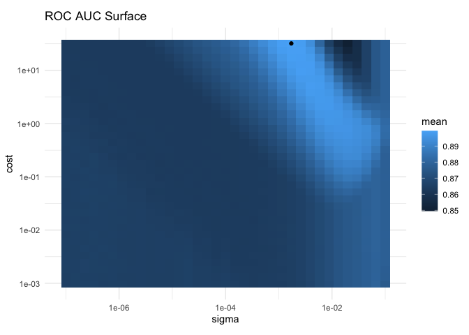
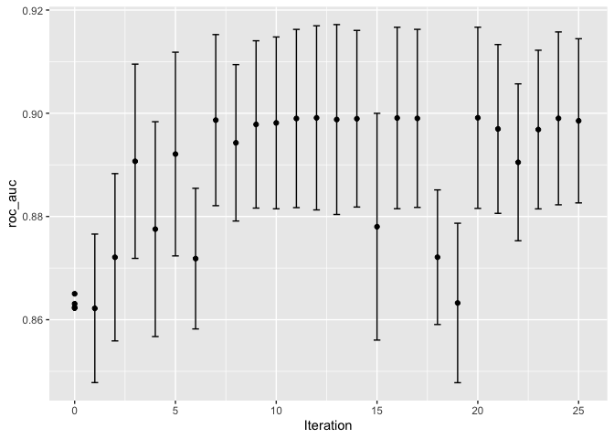
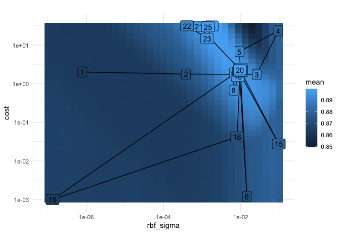
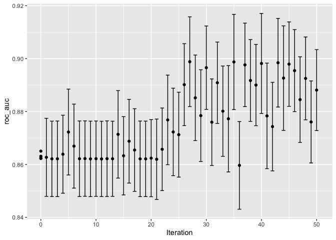
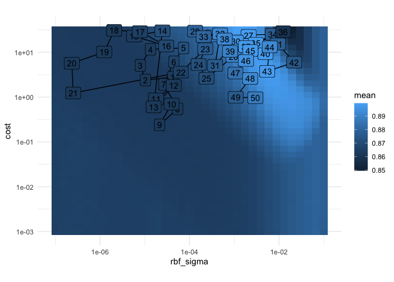

-   [Iteractive Search](#iteractive-search)
    -   [Bayesian Optimization](#bayesian-optimization)
    -   [A GAUSSIAN PROCESS MODE](#a-gaussian-process-mode)
    -   [SIMULATED ANNEALING](#simulated-annealing)
-   [Reference](#reference)

# Iteractive Search

> When grid search is infeasible or inefficient, iterative methods are a
> sensible approach for optimizing tuning parameters.

We once again use the cell segmentation data, for modeling, with a
support vector machine (SVM) model to demonstrate sequential tuning
methods. The two tuning parameters to optimize are the SVM cost value
and the radial basis function kernel parameter *σ*. Both parameters can
have a profound effect on the model complexity and performance.

The SVM model uses a dot product and, for this reason, it is necessary
to center and scale the predictors. Like the multilayer perceptron
model, this model would benefit from the use of PCA feature extraction.
However, we will not use this third tuning parameter in this chapter so
that we can visualize the search process in two dimensions.

    # put rnotbook in the same workdir
    knitr::opts_knit$set(root.dir = normalizePath(rprojroot::find_rstudio_root_file())) 
    library(tidymodels)

    ## ── Attaching packages ────────────────────────────────────── tidymodels 1.1.1 ──

    ## ✔ broom        1.0.5     ✔ recipes      1.0.9
    ## ✔ dials        1.2.0     ✔ rsample      1.2.0
    ## ✔ dplyr        1.1.4     ✔ tibble       3.2.1
    ## ✔ ggplot2      3.4.4     ✔ tidyr        1.3.0
    ## ✔ infer        1.0.5     ✔ tune         1.1.2
    ## ✔ modeldata    1.2.0     ✔ workflows    1.1.3
    ## ✔ parsnip      1.1.1     ✔ workflowsets 1.0.1
    ## ✔ purrr        1.0.2     ✔ yardstick    1.2.0

    ## ── Conflicts ───────────────────────────────────────── tidymodels_conflicts() ──
    ## ✖ purrr::discard() masks scales::discard()
    ## ✖ dplyr::filter()  masks stats::filter()
    ## ✖ dplyr::lag()     masks stats::lag()
    ## ✖ recipes::step()  masks stats::step()
    ## • Use suppressPackageStartupMessages() to eliminate package startup messages

    data(cells)
    # removing the default 
    cells <- cells |> select(-case)
    cell_folds <- vfold_cv(cells, 5)

    # which metric will be used?
    roc_res <- metric_set(roc_auc)

    svm_rec <- 
      recipe(class ~., data=cells) |> 
      step_YeoJohnson(all_numeric_predictors()) |> 
      step_normalize(all_numeric_predictors())

    svm_spec <-
      svm_rbf(cost=tune(), rbf_sigma = tune()) |> 
      set_engine("kernlab") |> 
      set_mode("classification")

    svm_wflow <- 
      workflow() |> 
      add_model(svm_spec) |> 
      add_recipe(svm_rec) 

    svm_rec

    ## 

    ## ── Recipe ──────────────────────────────────────────────────────────────────────

    ## 

    ## ── Inputs

    ## Number of variables by role

    ## outcome:    1
    ## predictor: 56

    ## 

    ## ── Operations

    ## • Yeo-Johnson transformation on: all_numeric_predictors()

    ## • Centering and scaling for: all_numeric_predictors()

    svm_spec

    ## Radial Basis Function Support Vector Machine Model Specification (classification)
    ## 
    ## Main Arguments:
    ##   cost = tune()
    ##   rbf_sigma = tune()
    ## 
    ## Computational engine: kernlab

    svm_wflow

    ## ══ Workflow ════════════════════════════════════════════════════════════════════
    ## Preprocessor: Recipe
    ## Model: svm_rbf()
    ## 
    ## ── Preprocessor ────────────────────────────────────────────────────────────────
    ## 2 Recipe Steps
    ## 
    ## • step_YeoJohnson()
    ## • step_normalize()
    ## 
    ## ── Model ───────────────────────────────────────────────────────────────────────
    ## Radial Basis Function Support Vector Machine Model Specification (classification)
    ## 
    ## Main Arguments:
    ##   cost = tune()
    ##   rbf_sigma = tune()
    ## 
    ## Computational engine: kernlab

The defult parameters ranges, for the two tunning parameters `cost` and
`rbf_sigma` are:

    cost()

    ## Cost (quantitative)
    ## Transformer: log-2 [1e-100, Inf]
    ## Range (transformed scale): [-10, 5]

    rbf_sigma()

    ## Radial Basis Function sigma (quantitative)
    ## Transformer: log-10 [1e-100, Inf]
    ## Range (transformed scale): [-10, 0]

For illustration, let’s slightly change the kernel parameter range, to
improve the visualizations of the search:

    svm_param <- 
      svm_wflow |> 
      extract_parameter_set_dials() |> 
      update(rbf_sigma = rbf_sigma(c(-7, -1)))

    set.seed(1975)
    library(doMC)
    registerDoMC(cores=parallel::detectCores()-1)
    svm_tune_res <- svm_wflow |> 
      tune_grid(
        cell_folds, 
        grid = svm_param |> grid_regular(levels=35),
        metrics=roc_res
      )

    saveRDS(svm_tune_res, "./svm_tune_res.rds")

    svm_tune_res <- readRDS("./svm_tune_res.rds")

    best_tune <- svm_tune_res |>
      select_best()

    svm_tune_res |>
      collect_metrics() |>
      ggplot() +
      geom_tile(aes(rbf_sigma, cost, fill = mean)) +
      geom_point(
        data = best_tune,
        mapping = aes(rbf_sigma, cost),
        color = "black"
      ) +
      scale_x_log10() +
      scale_y_log10() +
      coord_fixed() +
      labs(title = "ROC AUC Surface", x = "sigma") +
      theme_minimal()

There is a large swath in the lower diagonal of the parameter space that
is relatively flat with poor performance. A ridge of best performance
occurs in the upper-right portion of the space. The black dot indicates
the best settings. The transition from the plateau of poor results to
the ridge of best performance is very sharp. There is also a sharp drop
in the area under the ROC curve just to the right of the ridge.

    set.seed(1401)
    start_grid <- 
      svm_param %>% 
      update(
        cost = cost(c(-6, 1)),
        rbf_sigma = rbf_sigma(c(-6, -4))
      ) %>% 
      grid_regular(levels = 2)

    set.seed(1402)
    svm_initial <- 
      svm_wflow %>% 
      tune_grid(resamples = cell_folds, grid = start_grid, metrics = roc_res)

    collect_metrics(svm_initial)

    ## # A tibble: 4 × 8
    ##     cost rbf_sigma .metric .estimator  mean     n std_err .config             
    ##    <dbl>     <dbl> <chr>   <chr>      <dbl> <int>   <dbl> <chr>               
    ## 1 0.0156  0.000001 roc_auc binary     0.863     5 0.00576 Preprocessor1_Model1
    ## 2 2       0.000001 roc_auc binary     0.862     5 0.00562 Preprocessor1_Model2
    ## 3 0.0156  0.0001   roc_auc binary     0.862     5 0.00550 Preprocessor1_Model3
    ## 4 2       0.0001   roc_auc binary     0.865     5 0.00602 Preprocessor1_Model4

This initial grid shows fairly equivalent results, with no individual
point much better than any of the others. These results can be ingested
by the iterative tuning functions discussed in the following sections to
be used as initial values.

## Bayesian Optimization

Bayesian optimization techniques analyze the current resampling results
and create a predictive model to suggest tuning parameter values that
have yet to be evaluated. The suggested parameter combination is then
resampled. These results are then used in another predictive model that
recommends more candidate values for testing, and so on. The process
proceeds for a set number of iterations or until no further improvements
occur. Shahriari et al. (2016) and Frazier (2018) are good introductions
to Bayesian optimization.

When using Bayesian optimization, the primary concerns are how to create
the model and how to select parameters recommended by that model. First,
let’s consider the technique most commonly used for Bayesian
optimization, the Gaussian process model.

## A GAUSSIAN PROCESS MODE

Mathematically, a GP is a collection of random variables whose joint
probability distribution is multivariate Gaussian. In the context of our
application, this is the collection of performance metrics for the
tuning parameter candidate values.

These are assumed to be distributed as multivariate Gaussian. The inputs
that define the independent variables/predictors for the GP model are
the corresponding tuning parameter values:

    collect_metrics(svm_initial) |> 
      select(cost, rbf_sigma)

    ## # A tibble: 4 × 2
    ##     cost rbf_sigma
    ##    <dbl>     <dbl>
    ## 1 0.0156  0.000001
    ## 2 2       0.000001
    ## 3 0.0156  0.0001  
    ## 4 2       0.0001

    ctrl <- control_bayes(verbose = T)

    library(doMC)

    ## Loading required package: foreach

    ## 
    ## Attaching package: 'foreach'

    ## The following objects are masked from 'package:purrr':
    ## 
    ##     accumulate, when

    ## Loading required package: iterators

    ## Loading required package: parallel

    registerDoMC(cores=parallel::detectCores()-1)
    set.seed(1403)
    svm_bo <- 
      svm_wflow |> 
      tune_bayes(
        resamples = cell_folds,
        metrics = roc_res,
        initial = svm_initial, 
        param_info = svm_param,
        iter=25,
        control = ctrl
      )

    ## i Gaussian process model

    ## ✓ Gaussian process model

    ## i Generating 5000 candidates

    ## i Predicted candidates

    ## i Estimating performance

    ## ✓ Estimating performance

    ## i Gaussian process model

    ## ✓ Gaussian process model

    ## i Generating 5000 candidates

    ## i Predicted candidates

    ## i Estimating performance

    ## ✓ Estimating performance

    ## i Gaussian process model

    ## ✓ Gaussian process model

    ## i Generating 5000 candidates

    ## i Predicted candidates

    ## i Estimating performance

    ## ✓ Estimating performance

    ## i Gaussian process model

    ## ✓ Gaussian process model

    ## i Generating 5000 candidates

    ## i Predicted candidates

    ## i Estimating performance

    ## ✓ Estimating performance

    ## i Gaussian process model

    ## ✓ Gaussian process model

    ## i Generating 5000 candidates

    ## i Predicted candidates

    ## i Estimating performance

    ## ✓ Estimating performance

    ## i Gaussian process model

    ## ✓ Gaussian process model

    ## i Generating 5000 candidates

    ## i Predicted candidates

    ## i Estimating performance

    ## ✓ Estimating performance

    ## i Gaussian process model

    ## ✓ Gaussian process model

    ## i Generating 5000 candidates

    ## i Predicted candidates

    ## i Estimating performance

    ## ✓ Estimating performance

    ## i Gaussian process model

    ## ✓ Gaussian process model

    ## i Generating 5000 candidates

    ## i Predicted candidates

    ## i Estimating performance

    ## ✓ Estimating performance

    ## i Gaussian process model

    ## ✓ Gaussian process model

    ## i Generating 5000 candidates

    ## i Predicted candidates

    ## i Estimating performance

    ## ✓ Estimating performance

    ## i Gaussian process model

    ## ✓ Gaussian process model

    ## i Generating 5000 candidates

    ## i Predicted candidates

    ## i Estimating performance

    ## ✓ Estimating performance

    ## i Gaussian process model

    ## ✓ Gaussian process model

    ## i Generating 5000 candidates

    ## i Predicted candidates

    ## i Estimating performance

    ## ✓ Estimating performance

    ## i Gaussian process model

    ## ✓ Gaussian process model

    ## i Generating 5000 candidates

    ## i Predicted candidates

    ## i Estimating performance

    ## ✓ Estimating performance

    ## i Gaussian process model

    ## ✓ Gaussian process model

    ## i Generating 5000 candidates

    ## i Predicted candidates

    ## i Estimating performance

    ## ✓ Estimating performance

    ## i Gaussian process model

    ## ✓ Gaussian process model

    ## i Generating 5000 candidates

    ## i Predicted candidates

    ## i Estimating performance

    ## ✓ Estimating performance

    ## i Gaussian process model

    ## ✓ Gaussian process model

    ## i Generating 5000 candidates

    ## i Predicted candidates

    ## i Estimating performance

    ## ✓ Estimating performance

    ## i Gaussian process model

    ## ✓ Gaussian process model

    ## i Generating 5000 candidates

    ## i Predicted candidates

    ## i Estimating performance

    ## ✓ Estimating performance

    ## i Gaussian process model

    ## ✓ Gaussian process model

    ## i Generating 5000 candidates

    ## i Predicted candidates

    ## i Estimating performance

    ## ✓ Estimating performance

    ## i Gaussian process model

    ## ✓ Gaussian process model

    ## i Generating 5000 candidates

    ## i Predicted candidates

    ## i Estimating performance

    ## ✓ Estimating performance

    ## i Gaussian process model

    ## ✓ Gaussian process model

    ## i Generating 5000 candidates

    ## i Predicted candidates

    ## i Estimating performance

    ## ✓ Estimating performance

    ## i Gaussian process model

    ## ✓ Gaussian process model

    ## i Generating 5000 candidates

    ## i Predicted candidates

    ## i Estimating performance

    ## ✓ Estimating performance

    ## i Gaussian process model

    ## ✓ Gaussian process model

    ## i Generating 5000 candidates

    ## i Predicted candidates

    ## i Estimating performance

    ## ✓ Estimating performance

    ## i Gaussian process model

    ## ✓ Gaussian process model

    ## i Generating 5000 candidates

    ## i Predicted candidates

    ## i Estimating performance

    ## ✓ Estimating performance

    ## i Gaussian process model

    ## ✓ Gaussian process model

    ## i Generating 5000 candidates

    ## i Predicted candidates

    ## i Estimating performance

    ## ✓ Estimating performance

    ## i Gaussian process model

    ## ✓ Gaussian process model

    ## i Generating 5000 candidates

    ## i Predicted candidates

    ## i Estimating performance

    ## ✓ Estimating performance

    ## i Gaussian process model

    ## ✓ Gaussian process model

    ## i Generating 5000 candidates

    ## i Predicted candidates

    ## i Estimating performance

    ## ✓ Estimating performance

Comparing results

    # bayes process
    show_best(svm_bo)

    ## # A tibble: 5 × 9
    ##    cost rbf_sigma .metric .estimator  mean     n std_err .config .iter
    ##   <dbl>     <dbl> <chr>   <chr>      <dbl> <int>   <dbl> <chr>   <int>
    ## 1  2.28   0.00957 roc_auc binary     0.899     5 0.00683 Iter20     20
    ## 2  2.35   0.00969 roc_auc binary     0.899     5 0.00694 Iter12     12
    ## 3  2.25   0.00969 roc_auc binary     0.899     5 0.00684 Iter16     16
    ## 4 31.4    0.00178 roc_auc binary     0.899     5 0.00652 Iter24     24
    ## 5  2.10   0.00968 roc_auc binary     0.899     5 0.00671 Iter17     17

    # grid search
    show_best(svm_tune_res)

    ## # A tibble: 5 × 8
    ##    cost rbf_sigma .metric .estimator  mean     n std_err .config                
    ##   <dbl>     <dbl> <chr>   <chr>      <dbl> <int>   <dbl> <chr>                  
    ## 1  32     0.00172 roc_auc binary     0.899     5 0.00611 Preprocessor1_Model0875
    ## 2  23.6   0.00258 roc_auc binary     0.899     5 0.00556 Preprocessor1_Model0909
    ## 3  23.6   0.00172 roc_auc binary     0.899     5 0.00659 Preprocessor1_Model0874
    ## 4  32     0.00115 roc_auc binary     0.899     5 0.00694 Preprocessor1_Model0840
    ## 5  17.4   0.00172 roc_auc binary     0.899     5 0.00678 Preprocessor1_Model0873

    autoplot(svm_bo, type = "performance")

    # gausian process search in the parameters space
    svm_bo |> 
      collect_metrics() |> 
      filter(.iter>0) |> 
      ggplot() +
      geom_tile(data = collect_metrics(svm_tune_res), mapping=aes(x=rbf_sigma, y=cost, fill = mean)) +
      geom_path(aes(rbf_sigma, cost)) +
      geom_label(aes(x=rbf_sigma, y=cost,label=.iter, fill=mean)) +
      scale_x_log10() +
      scale_y_log10() +
      coord_fixed() +
      theme_minimal()

    svm_bo |> 
      select_best()

    ## # A tibble: 1 × 3
    ##    cost rbf_sigma .config
    ##   <dbl>     <dbl> <chr>  
    ## 1  2.28   0.00957 Iter20

## SIMULATED ANNEALING

Simulated annealing (SA) is a general nonlinear search routine inspired
by the process in which metal cools. It is a global search method that
can effectively navigate many different types of search landscapes,
including discontinuous functions. Unlike most gradient-based
optimization routines, simulated annealing can reassess previous
solutions.

The process of using simulated annealing starts with an initial value
and embarks on a controlled random walk through the parameter space.
Each new candidate parameter value is a small perturbation of the
previous value that keeps the new point within a local neighborhood.

> The acceptance probabilities of simulated annealing allow the search
> to proceed in the wrong direction, at least for the short term, with
> the potential to find a much better region of the parameter space in
> the long run.

    library(finetune)
    ctrl_sa <- control_sim_anneal(verbose=T, no_improve=10L)

    set.seed(1404)
    library(doMC)
    registerDoMC(cores=parallel::detectCores()-1)
    svm_sa <- 
      svm_wflow |> 
      tune_sim_anneal(
        resamples = cell_folds, 
        metrics = roc_res,
        initial = svm_initial,
        param_info = svm_param, 
        iter = 50, 
        control = ctrl_sa
      )

    ## Optimizing roc_auc

    ## Initial best: 0.86502

    ## 1 ◯ accept suboptimal  roc_auc=0.86269 (+/-0.005741)

    ## 2 ◯ accept suboptimal  roc_auc=0.86211 (+/-0.005545)

    ## 3 + better suboptimal  roc_auc=0.86213 (+/-0.00556)

    ## 4 + better suboptimal  roc_auc=0.86386 (+/-0.005737)

    ## 5 ♥ new best           roc_auc=0.87225 (+/-0.006314)

    ## 6 ◯ accept suboptimal  roc_auc=0.86692 (+/-0.00618)

    ## 7 ◯ accept suboptimal  roc_auc=0.86215 (+/-0.005557)

    ## 8 + better suboptimal  roc_auc=0.86221 (+/-0.005548)

    ## 9 ◯ accept suboptimal  roc_auc=0.86209 (+/-0.005551)

    ## 10 + better suboptimal  roc_auc=0.86218 (+/-0.005542)

    ## 11 ◯ accept suboptimal  roc_auc=0.86209 (+/-0.005539)

    ## 12 + better suboptimal  roc_auc=0.86218 (+/-0.005562)

    ## 13 ✖ restart from best  roc_auc=0.86214 (+/-0.005526)

    ## 14 ◯ accept suboptimal  roc_auc=0.87137 (+/-0.006436)

    ## 15 ◯ accept suboptimal  roc_auc=0.86327 (+/-0.005757)

    ## 16 + better suboptimal  roc_auc=0.86878 (+/-0.00616)

    ## 17 ◯ accept suboptimal  roc_auc=0.86544 (+/-0.006077)

    ## 18 ◯ accept suboptimal  roc_auc=0.86211 (+/-0.005561)

    ## 19 + better suboptimal  roc_auc=0.86212 (+/-0.005549)

    ## 20 + better suboptimal  roc_auc=0.86237 (+/-0.005673)

    ## 21 ✖ restart from best  roc_auc=0.86196 (+/-0.005913)

    ## 22 ◯ accept suboptimal  roc_auc=0.86572 (+/-0.006074)

    ## 23 ♥ new best           roc_auc=0.87683 (+/-0.006592)

    ## 24 ◯ accept suboptimal  roc_auc=0.87228 (+/-0.006434)

    ## 25 ◯ accept suboptimal  roc_auc=0.87125 (+/-0.006243)

    ## 26 ♥ new best           roc_auc=0.89016 (+/-0.006028)

    ## 27 ♥ new best           roc_auc=0.89883 (+/-0.006607)

    ## 28 ◯ accept suboptimal  roc_auc=0.88518 (+/-0.006298)

    ## 29 ─ discard suboptimal roc_auc=0.87846 (+/-0.006746)

    ## 30 + better suboptimal  roc_auc=0.89658 (+/-0.006135)

    ## 31 ─ discard suboptimal roc_auc=0.87597 (+/-0.006367)

    ## 32 ─ discard suboptimal roc_auc=0.89089 (+/-0.005982)

    ## 33 ─ discard suboptimal roc_auc=0.88014 (+/-0.006641)

    ## 34 ─ discard suboptimal roc_auc=0.87726 (+/-0.007816)

    ## 35 ✖ restart from best  roc_auc=0.89875 (+/-0.007003)

    ## 36 ─ discard suboptimal roc_auc=0.85964 (+/-0.006446)

    ## 37 ◯ accept suboptimal  roc_auc=0.89764 (+/-0.006141)

    ## 38 ─ discard suboptimal roc_auc=0.89173 (+/-0.006018)

    ## 39 ─ discard suboptimal roc_auc=0.89001 (+/-0.005984)

    ## 40 + better suboptimal  roc_auc=0.89817 (+/-0.007359)

    ## 41 ─ discard suboptimal roc_auc=0.87834 (+/-0.007766)

    ## 42 ─ discard suboptimal roc_auc=0.87431 (+/-0.006515)

    ## 43 ✖ restart from best  roc_auc=0.89845 (+/-0.006517)

    ## 44 ◯ accept suboptimal  roc_auc=0.89264 (+/-0.007687)

    ## 45 + better suboptimal  roc_auc=0.89793 (+/-0.006209)

    ## 46 ◯ accept suboptimal  roc_auc=0.89546 (+/-0.006035)

    ## 47 ─ discard suboptimal roc_auc=0.88451 (+/-0.006299)

    ## 48 ◯ accept suboptimal  roc_auc=0.89253 (+/-0.006093)

    ## 49 ─ discard suboptimal roc_auc=0.87607 (+/-0.006031)

    ## 50 ◯ accept suboptimal  roc_auc=0.8881 (+/-0.005949)

Let\`s check the results

    svm_sa |> 
      show_best()

    ## # A tibble: 5 × 9
    ##    cost rbf_sigma .metric .estimator  mean     n std_err .config .iter
    ##   <dbl>     <dbl> <chr>   <chr>      <dbl> <int>   <dbl> <chr>   <int>
    ## 1 23.9    0.00210 roc_auc binary     0.899     5 0.00661 Iter27     27
    ## 2 15.9    0.00305 roc_auc binary     0.899     5 0.00700 Iter35     35
    ## 3  3.74   0.00546 roc_auc binary     0.898     5 0.00652 Iter43     43
    ## 4  9.28   0.00500 roc_auc binary     0.898     5 0.00736 Iter40     40
    ## 5 10.9    0.00230 roc_auc binary     0.898     5 0.00621 Iter45     45

    autoplot(svm_sa, type="performance")

    # simulated annealing search in the parameters space
    svm_sa |> 
      collect_metrics() |> 
      filter(.iter>0) |> 
      ggplot() +
      geom_tile(data = collect_metrics(svm_tune_res), mapping=aes(x=rbf_sigma, y=cost, fill = mean)) +
      geom_path(aes(rbf_sigma, cost)) +
      geom_label(aes(x=rbf_sigma, y=cost,label=.iter, fill=mean)) +
      scale_x_log10() +
      scale_y_log10() +
      coord_fixed() +
      theme_minimal()

# Reference

All code and text came from Max Kuhn and Julia Silge\`s book [Tidy
Modeling with R](https://www.tmwr.org/iterative-search).
