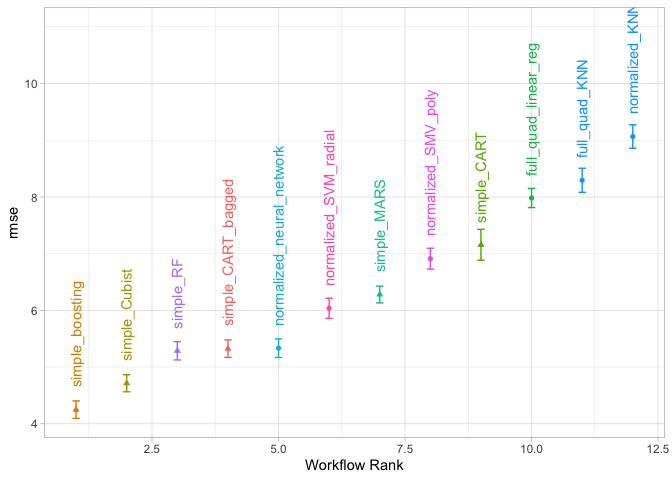
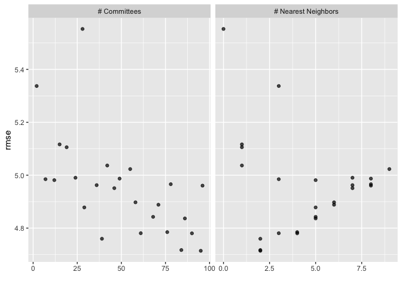
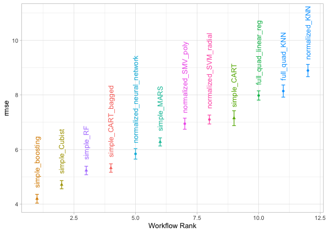
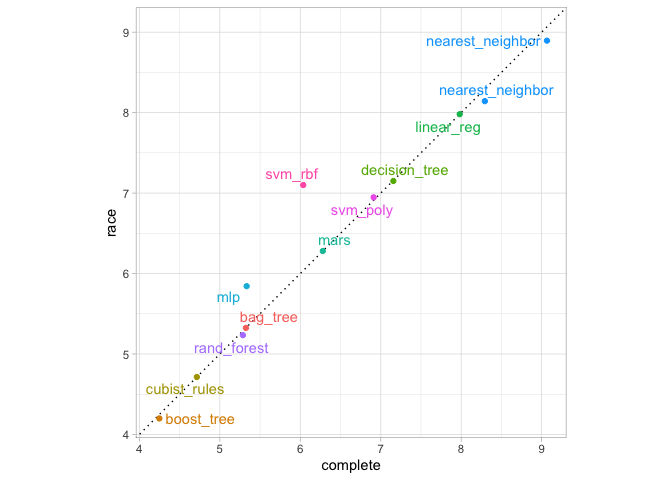
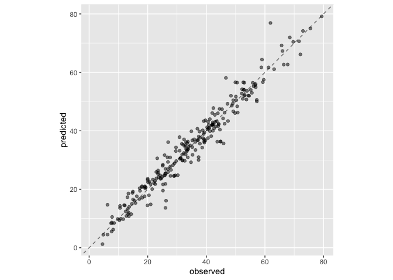

-   [Screening Many Models](#screening-many-models)
    -   [MODELING CONCRETE MIXTURE
        STRENGTH](#modeling-concrete-mixture-strength)
        -   [CREATING THE WORKFLOW SET](#creating-the-workflow-set)
        -   [TUNING AND EVALUATING THE
            MODELS](#tuning-and-evaluating-the-models)
    -   [EFFICIENTLY SCREENING MODELS](#efficiently-screening-models)
    -   [FINALIZING A MODEL](#finalizing-a-model)
-   [Reference](#reference)

# Screening Many Models

For projects with new data sets that have not yet been well understood,
a data practitioner may need to screen many combinations of models and
preprocessors. It is common to have little or no a priori knowledge
about which method will work best with a novel data set.

> A good strategy is to spend some initial effort trying a variety of
> modeling approaches, determine what works best, then invest additional
> time tweaking/optimizing a small set of models.

## MODELING CONCRETE MIXTURE STRENGTH

To demonstrate how to screen multiple model workflows, we will use the
concrete mixture data from Applied Predictive Modeling.

How can workflow sets make such a process of large scale testing for
models easier?

    # put rnotbook in the same workdir
    knitr::opts_knit$set(root.dir = normalizePath(rprojroot::find_rstudio_root_file())) 

    library(tidymodels)

    ## ── Attaching packages ────────────────────────────────────── tidymodels 1.1.1 ──

    ## ✔ broom        1.0.5     ✔ recipes      1.0.9
    ## ✔ dials        1.2.0     ✔ rsample      1.2.0
    ## ✔ dplyr        1.1.4     ✔ tibble       3.2.1
    ## ✔ ggplot2      3.4.4     ✔ tidyr        1.3.0
    ## ✔ infer        1.0.5     ✔ tune         1.1.2
    ## ✔ modeldata    1.2.0     ✔ workflows    1.1.3
    ## ✔ parsnip      1.1.1     ✔ workflowsets 1.0.1
    ## ✔ purrr        1.0.2     ✔ yardstick    1.2.0

    ## ── Conflicts ───────────────────────────────────────── tidymodels_conflicts() ──
    ## ✖ purrr::discard() masks scales::discard()
    ## ✖ dplyr::filter()  masks stats::filter()
    ## ✖ dplyr::lag()     masks stats::lag()
    ## ✖ recipes::step()  masks stats::step()
    ## • Search for functions across packages at https://www.tidymodels.org/find/

    data(concrete, package="modeldata")
    glimpse(concrete)

    ## Rows: 1,030
    ## Columns: 9
    ## $ cement               <dbl> 540.0, 540.0, 332.5, 332.5, 198.6, 266.0, 380.0, …
    ## $ blast_furnace_slag   <dbl> 0.0, 0.0, 142.5, 142.5, 132.4, 114.0, 95.0, 95.0,…
    ## $ fly_ash              <dbl> 0, 0, 0, 0, 0, 0, 0, 0, 0, 0, 0, 0, 0, 0, 0, 0, 0…
    ## $ water                <dbl> 162, 162, 228, 228, 192, 228, 228, 228, 228, 228,…
    ## $ superplasticizer     <dbl> 2.5, 2.5, 0.0, 0.0, 0.0, 0.0, 0.0, 0.0, 0.0, 0.0,…
    ## $ coarse_aggregate     <dbl> 1040.0, 1055.0, 932.0, 932.0, 978.4, 932.0, 932.0…
    ## $ fine_aggregate       <dbl> 676.0, 676.0, 594.0, 594.0, 825.5, 670.0, 594.0, …
    ## $ age                  <int> 28, 28, 270, 365, 360, 90, 365, 28, 28, 28, 90, 2…
    ## $ compressive_strength <dbl> 79.99, 61.89, 40.27, 41.05, 44.30, 47.03, 43.70, …

    skimr::skim(concrete)

<table>
<caption>Data summary</caption>
<tbody>
<tr class="odd">
<td style="text-align: left;">Name</td>
<td style="text-align: left;">concrete</td>
</tr>
<tr class="even">
<td style="text-align: left;">Number of rows</td>
<td style="text-align: left;">1030</td>
</tr>
<tr class="odd">
<td style="text-align: left;">Number of columns</td>
<td style="text-align: left;">9</td>
</tr>
<tr class="even">
<td style="text-align: left;">_______________________</td>
<td style="text-align: left;"></td>
</tr>
<tr class="odd">
<td style="text-align: left;">Column type frequency:</td>
<td style="text-align: left;"></td>
</tr>
<tr class="even">
<td style="text-align: left;">numeric</td>
<td style="text-align: left;">9</td>
</tr>
<tr class="odd">
<td style="text-align: left;">________________________</td>
<td style="text-align: left;"></td>
</tr>
<tr class="even">
<td style="text-align: left;">Group variables</td>
<td style="text-align: left;">None</td>
</tr>
</tbody>
</table>

Data summary

**Variable type: numeric**

<table style="width:100%;">
<colgroup>
<col style="width: 20%" />
<col style="width: 9%" />
<col style="width: 13%" />
<col style="width: 6%" />
<col style="width: 6%" />
<col style="width: 6%" />
<col style="width: 6%" />
<col style="width: 6%" />
<col style="width: 7%" />
<col style="width: 6%" />
<col style="width: 5%" />
</colgroup>
<thead>
<tr class="header">
<th style="text-align: left;">skim_variable</th>
<th style="text-align: right;">n_missing</th>
<th style="text-align: right;">complete_rate</th>
<th style="text-align: right;">mean</th>
<th style="text-align: right;">sd</th>
<th style="text-align: right;">p0</th>
<th style="text-align: right;">p25</th>
<th style="text-align: right;">p50</th>
<th style="text-align: right;">p75</th>
<th style="text-align: right;">p100</th>
<th style="text-align: left;">hist</th>
</tr>
</thead>
<tbody>
<tr class="odd">
<td style="text-align: left;">cement</td>
<td style="text-align: right;">0</td>
<td style="text-align: right;">1</td>
<td style="text-align: right;">281.17</td>
<td style="text-align: right;">104.51</td>
<td style="text-align: right;">102.00</td>
<td style="text-align: right;">192.38</td>
<td style="text-align: right;">272.90</td>
<td style="text-align: right;">350.00</td>
<td style="text-align: right;">540.0</td>
<td style="text-align: left;">▆▇▇▃▂</td>
</tr>
<tr class="even">
<td style="text-align: left;">blast_furnace_slag</td>
<td style="text-align: right;">0</td>
<td style="text-align: right;">1</td>
<td style="text-align: right;">73.90</td>
<td style="text-align: right;">86.28</td>
<td style="text-align: right;">0.00</td>
<td style="text-align: right;">0.00</td>
<td style="text-align: right;">22.00</td>
<td style="text-align: right;">142.95</td>
<td style="text-align: right;">359.4</td>
<td style="text-align: left;">▇▂▃▁▁</td>
</tr>
<tr class="odd">
<td style="text-align: left;">fly_ash</td>
<td style="text-align: right;">0</td>
<td style="text-align: right;">1</td>
<td style="text-align: right;">54.19</td>
<td style="text-align: right;">64.00</td>
<td style="text-align: right;">0.00</td>
<td style="text-align: right;">0.00</td>
<td style="text-align: right;">0.00</td>
<td style="text-align: right;">118.30</td>
<td style="text-align: right;">200.1</td>
<td style="text-align: left;">▇▁▂▂▁</td>
</tr>
<tr class="even">
<td style="text-align: left;">water</td>
<td style="text-align: right;">0</td>
<td style="text-align: right;">1</td>
<td style="text-align: right;">181.57</td>
<td style="text-align: right;">21.35</td>
<td style="text-align: right;">121.80</td>
<td style="text-align: right;">164.90</td>
<td style="text-align: right;">185.00</td>
<td style="text-align: right;">192.00</td>
<td style="text-align: right;">247.0</td>
<td style="text-align: left;">▁▅▇▂▁</td>
</tr>
<tr class="odd">
<td style="text-align: left;">superplasticizer</td>
<td style="text-align: right;">0</td>
<td style="text-align: right;">1</td>
<td style="text-align: right;">6.20</td>
<td style="text-align: right;">5.97</td>
<td style="text-align: right;">0.00</td>
<td style="text-align: right;">0.00</td>
<td style="text-align: right;">6.40</td>
<td style="text-align: right;">10.20</td>
<td style="text-align: right;">32.2</td>
<td style="text-align: left;">▇▆▁▁▁</td>
</tr>
<tr class="even">
<td style="text-align: left;">coarse_aggregate</td>
<td style="text-align: right;">0</td>
<td style="text-align: right;">1</td>
<td style="text-align: right;">972.92</td>
<td style="text-align: right;">77.75</td>
<td style="text-align: right;">801.00</td>
<td style="text-align: right;">932.00</td>
<td style="text-align: right;">968.00</td>
<td style="text-align: right;">1029.40</td>
<td style="text-align: right;">1145.0</td>
<td style="text-align: left;">▃▅▇▅▂</td>
</tr>
<tr class="odd">
<td style="text-align: left;">fine_aggregate</td>
<td style="text-align: right;">0</td>
<td style="text-align: right;">1</td>
<td style="text-align: right;">773.58</td>
<td style="text-align: right;">80.18</td>
<td style="text-align: right;">594.00</td>
<td style="text-align: right;">730.95</td>
<td style="text-align: right;">779.50</td>
<td style="text-align: right;">824.00</td>
<td style="text-align: right;">992.6</td>
<td style="text-align: left;">▂▃▇▃▁</td>
</tr>
<tr class="even">
<td style="text-align: left;">age</td>
<td style="text-align: right;">0</td>
<td style="text-align: right;">1</td>
<td style="text-align: right;">45.66</td>
<td style="text-align: right;">63.17</td>
<td style="text-align: right;">1.00</td>
<td style="text-align: right;">7.00</td>
<td style="text-align: right;">28.00</td>
<td style="text-align: right;">56.00</td>
<td style="text-align: right;">365.0</td>
<td style="text-align: left;">▇▁▁▁▁</td>
</tr>
<tr class="odd">
<td style="text-align: left;">compressive_strength</td>
<td style="text-align: right;">0</td>
<td style="text-align: right;">1</td>
<td style="text-align: right;">35.82</td>
<td style="text-align: right;">16.71</td>
<td style="text-align: right;">2.33</td>
<td style="text-align: right;">23.71</td>
<td style="text-align: right;">34.44</td>
<td style="text-align: right;">46.14</td>
<td style="text-align: right;">82.6</td>
<td style="text-align: left;">▅▇▇▃▁</td>
</tr>
</tbody>
</table>

The `compressive_strength` column is the outcome. The `age` predictor
tells us the age of the concrete sample at testing in days (concrete
strengthens over time) and the rest of the predictors like `cement` and
`water` are concrete components in units of kilograms per cubic meter.

> For some cases in this data set, the same concrete formula was tested
> multiple times. We’d rather not include these replicate mixtures as
> individual data points since they might be distributed across both the
> training and test set. Doing so might artificially inflate our
> performance estimates.

    concrete <- 
      concrete |> 
      group_by(across(-compressive_strength)) |> 
      summarize(compressive_strength = mean(compressive_strength), 
                .groups = "drop")

    nrow(concrete)

    ## [1] 992

Let’s split the data using the default 3:1 ratio of training-to-test and
resample the training set using five repeats of 10-fold
cross-validation:

    set.seed(1501)
    concrete_split <- initial_split(concrete, strata = compressive_strength)
    concrete_train <- training(concrete_split)
    concrete_test  <- testing(concrete_split)

    set.seed(1502)
    concrete_folds <- vfold_cv(concrete_train, strata = compressive_strength, repeats = 5)

Some models (notably neural networks, KNN, and support vector machines)
require predictors that have been centered and scaled, so some model
workflows will require recipes with these preprocessing steps. For other
models, a traditional response surface design model expansion (i.e.,
quadratic and two-way interactions) is a good idea. For these purposes,
we create two recipes:

    normalized_rec <- recipe(compressive_strength ~ ., data=concrete_train) |> 
      step_normalize(all_predictors())

    poly_rec <- 
      normalized_rec |> 
      step_poly(all_predictors()) 
      step_interact(~all_predictors():all_predictors())

    ## all_predictors():all_predictors() ~ list(list(terms = list(~), 
    ##     role = "predictor", trained = FALSE, objects = NULL, sep = "_x_", 
    ##     keep_original_cols = TRUE, skip = FALSE, id = "interact_Pc5PC"))

    normalized_rec

    ## 

    ## ── Recipe ──────────────────────────────────────────────────────────────────────

    ## 

    ## ── Inputs

    ## Number of variables by role

    ## outcome:   1
    ## predictor: 8

    ## 

    ## ── Operations

    ## • Centering and scaling for: all_predictors()

    poly_rec

    ## 

    ## ── Recipe ──────────────────────────────────────────────────────────────────────

    ## 

    ## ── Inputs

    ## Number of variables by role

    ## outcome:   1
    ## predictor: 8

    ## 

    ## ── Operations

    ## • Centering and scaling for: all_predictors()

    ## • Orthogonal polynomials on: all_predictors()

For the models, we use the the parsnip addin to create a set of model
specifications:

    library(rules)

    ## 
    ## Attaching package: 'rules'

    ## The following object is masked from 'package:dials':
    ## 
    ##     max_rules

    library(baguette)

    linear_reg_spec <- 
      linear_reg(penalty=tune(), mixture=tune()) |> 
      set_engine("glmnet")

    nnet_spec <- 
      mlp(hidden_units = tune(), penalty = tune(), epochs = tune()) |> 
      set_engine("nnet", MaxNWts=2600) |> 
      set_mode("regression")

    mars_spec <- 
      mars(prod_degree = tune()) |> 
      set_engine("earth") |> 
      set_mode("regression")

    svm_r_spec <- 
      svm_rbf(cost=tune(), rbf_sigma = tune()) |> 
      set_engine("kernlab") |> 
      set_mode("regression")

    svm_p_spec <- 
      svm_poly(cost=tune(), degree = tune()) |> 
      set_engine("kernlab") |> 
      set_mode("regression")

    knn_spec <- 
      nearest_neighbor(neighbors = tune(), dist_power = tune(), weight_func=tune()) |> 
      set_engine("kknn") |> 
      set_mode("regression")

    cart_spec <- 
      decision_tree(cost_complexity = tune(), min_n = tune()) |> 
      set_engine("rpart") |> 
      set_mode("regression")

    bag_cart_spec <- bag_tree() |> 
      set_engine("rpart", times=50L) |> 
      set_mode("regression")

    rf_spec <- 
      rand_forest(mtry = tune(), min_n=tune(), trees = 1000) |> 
      set_engine("ranger") |> 
      set_mode("regression")

    xgb_spec <- boost_tree(tree_depth = tune(), learn_rate = tune(), loss_reduction = tune(),
                          min_n = tune(), sample_size = tune(), trees=tune()) |> 
      set_engine("xgboost") |> 
      set_mode("regression")

    cubist_spec <- 
      cubist_rules(committees = tune(), neighbors = tune()) |> 
      set_engine("Cubist")

    # The analysis in M. Kuhn and Johnson (2013) specifies that the neural network should have up to 27 hidden units in the layer

    nnet_param <- 
      nnet_spec |> 
      extract_parameter_set_dials() |> 
      update(hidden_units=hidden_units(c(1,27)))

### CREATING THE WORKFLOW SET

Workflos sets take a named list of preprocessors and model specification
and combine them into an object containing multiple wokflows. There are
thre possible kinds of preprocessors:

-   A standard R formula
-   A recipe object (prior to estimation/prepping)
-   A dplyr-style selector to choose the outcome and predictors

s a first workflow set example, let’s combine the recipe that only
standardizes the predictors to the nonlinear models that require the
predictors to be in the same units:

    normalized <- 
      workflow_set(
        preproc = list(normalized=normalized_rec), 
        models  = list(SVM_radial = svm_r_spec,
                       SMV_poly   = svm_p_spec,
                       KNN        = knn_spec,
                       neural_network = nnet_spec)
      )

    normalized

    ## # A workflow set/tibble: 4 × 4
    ##   wflow_id                  info             option    result    
    ##   <chr>                     <list>           <list>    <list>    
    ## 1 normalized_SVM_radial     <tibble [1 × 4]> <opts[0]> <list [0]>
    ## 2 normalized_SMV_poly       <tibble [1 × 4]> <opts[0]> <list [0]>
    ## 3 normalized_KNN            <tibble [1 × 4]> <opts[0]> <list [0]>
    ## 4 normalized_neural_network <tibble [1 × 4]> <opts[0]> <list [0]>

Since there is only a single preprocessor, this function creates a set
of workflows with this value. If the preprocessor contained more than
one entry, the function would create all combinations of preprocessors
and models

The `wflow_id` column is automatically created but can be modified using
a call to `mutate()`. The `info` column contains a tibble with some
identifiers and the workflow object. The workflow can be extracted:

    # extract method
    normalized |> 
      extract_workflow(id="normalized_KNN")

    ## ══ Workflow ════════════════════════════════════════════════════════════════════
    ## Preprocessor: Recipe
    ## Model: nearest_neighbor()
    ## 
    ## ── Preprocessor ────────────────────────────────────────────────────────────────
    ## 1 Recipe Step
    ## 
    ## • step_normalize()
    ## 
    ## ── Model ───────────────────────────────────────────────────────────────────────
    ## K-Nearest Neighbor Model Specification (regression)
    ## 
    ## Main Arguments:
    ##   neighbors = tune()
    ##   weight_func = tune()
    ##   dist_power = tune()
    ## 
    ## Computational engine: kknn

    # similar tibble/list manipulation
    normalized |> 
      filter(wflow_id=="normalized_KNN") |> 
      pull(info) |> 
      pluck(1, "workflow", 1)

    ## ══ Workflow ════════════════════════════════════════════════════════════════════
    ## Preprocessor: Recipe
    ## Model: nearest_neighbor()
    ## 
    ## ── Preprocessor ────────────────────────────────────────────────────────────────
    ## 1 Recipe Step
    ## 
    ## • step_normalize()
    ## 
    ## ── Model ───────────────────────────────────────────────────────────────────────
    ## K-Nearest Neighbor Model Specification (regression)
    ## 
    ## Main Arguments:
    ##   neighbors = tune()
    ##   weight_func = tune()
    ##   dist_power = tune()
    ## 
    ## Computational engine: kknn

The `option` column is a placeholder for any arguments to use when we
evaluate the workflow. For example, to add the neural network parameter
object:

    normalized <- 
      normalized |> 
      option_add(param_info=nnet_param, id="normalized_neural_network")

    normalized

    ## # A workflow set/tibble: 4 × 4
    ##   wflow_id                  info             option    result    
    ##   <chr>                     <list>           <list>    <list>    
    ## 1 normalized_SVM_radial     <tibble [1 × 4]> <opts[0]> <list [0]>
    ## 2 normalized_SMV_poly       <tibble [1 × 4]> <opts[0]> <list [0]>
    ## 3 normalized_KNN            <tibble [1 × 4]> <opts[0]> <list [0]>
    ## 4 normalized_neural_network <tibble [1 × 4]> <opts[1]> <list [0]>

When a function from the *tune* or *finetune* package is used to tune
(or resample) the workflow, this argument will be used.

The `result` column is a placeholder for the output of the tuning or
resampling functions.

For the other nonlinear models, let’s create another workflow set that
uses dplyr selectors for the outcome and predictors:

    model_vars <- 
      workflow_variables(outcomes = compressive_strength,
                         predictors = everything())

    no_pre_proc <- 
      workflow_set(
        preproc = list(simple=model_vars),
        models  = list(
          MARS = mars_spec,
          CART = cart_spec, 
          CART_bagged = bag_cart_spec,
          RF = rf_spec, 
          boosting = xgb_spec, 
          Cubist = cubist_spec
        )
      )

    no_pre_proc

    ## # A workflow set/tibble: 6 × 4
    ##   wflow_id           info             option    result    
    ##   <chr>              <list>           <list>    <list>    
    ## 1 simple_MARS        <tibble [1 × 4]> <opts[0]> <list [0]>
    ## 2 simple_CART        <tibble [1 × 4]> <opts[0]> <list [0]>
    ## 3 simple_CART_bagged <tibble [1 × 4]> <opts[0]> <list [0]>
    ## 4 simple_RF          <tibble [1 × 4]> <opts[0]> <list [0]>
    ## 5 simple_boosting    <tibble [1 × 4]> <opts[0]> <list [0]>
    ## 6 simple_Cubist      <tibble [1 × 4]> <opts[0]> <list [0]>

Finally, we assemble the set that uses nonlinear terms and interactions
with the appropriate models:

    with_features <- workflow_set(
      preproc = list(full_quad = poly_rec),
      models  = list(linear_reg = linear_reg_spec, KNN=knn_spec)
    )

    with_features

    ## # A workflow set/tibble: 2 × 4
    ##   wflow_id             info             option    result    
    ##   <chr>                <list>           <list>    <list>    
    ## 1 full_quad_linear_reg <tibble [1 × 4]> <opts[0]> <list [0]>
    ## 2 full_quad_KNN        <tibble [1 × 4]> <opts[0]> <list [0]>

These objects are `tibbles` with the extra class of workflow\_set. Row
binding does not affect the state of the sets and the result is itself a
workflow set:

    all_workflows <- bind_rows(no_pre_proc, normalized, with_features)

    all_workflows

    ## # A workflow set/tibble: 12 × 4
    ##    wflow_id                  info             option    result    
    ##    <chr>                     <list>           <list>    <list>    
    ##  1 simple_MARS               <tibble [1 × 4]> <opts[0]> <list [0]>
    ##  2 simple_CART               <tibble [1 × 4]> <opts[0]> <list [0]>
    ##  3 simple_CART_bagged        <tibble [1 × 4]> <opts[0]> <list [0]>
    ##  4 simple_RF                 <tibble [1 × 4]> <opts[0]> <list [0]>
    ##  5 simple_boosting           <tibble [1 × 4]> <opts[0]> <list [0]>
    ##  6 simple_Cubist             <tibble [1 × 4]> <opts[0]> <list [0]>
    ##  7 normalized_SVM_radial     <tibble [1 × 4]> <opts[0]> <list [0]>
    ##  8 normalized_SMV_poly       <tibble [1 × 4]> <opts[0]> <list [0]>
    ##  9 normalized_KNN            <tibble [1 × 4]> <opts[0]> <list [0]>
    ## 10 normalized_neural_network <tibble [1 × 4]> <opts[1]> <list [0]>
    ## 11 full_quad_linear_reg      <tibble [1 × 4]> <opts[0]> <list [0]>
    ## 12 full_quad_KNN             <tibble [1 × 4]> <opts[0]> <list [0]>

### TUNING AND EVALUATING THE MODELS

Almost all of the members of `all_workflows` contain tuning parameters.
To evaluate their performance, we can use the standard tuning or
resampling functions (e.g., `tune_grid()` and so on). The
`workflow_map()` function will apply the same function to all of the
workflows in the set; the default is `tune_grid()`.

    grid_ctrl <- control_grid(
      save_pred=T,
      parallel_over="everything",
      save_workflow = T
    )

    library(doMC)
    registerDoMC(cores=parallel::detectCores()-1)

    grid_results <- 
      all_workflows |> 
      # fn default for map is "tune_grid"
      workflow_map(
        seed=1503, # seed to be passed to tune_grid
        resamples = concrete_folds,
        grid=25, #  An integer denotes the number of candidate parameter sets to be created automatically.
        control = grid_ctrl
      )

    # caching the output results
    saveRDS(grid_results, "./tmwr/chp15_grid_results.rds")

    grid_results <- readRDS("./tmwr/chp15_grid_results.rds")
    grid_results

    ## # A workflow set/tibble: 12 × 4
    ##    wflow_id                  info             option    result   
    ##    <chr>                     <list>           <list>    <list>   
    ##  1 simple_MARS               <tibble [1 × 4]> <opts[3]> <tune[+]>
    ##  2 simple_CART               <tibble [1 × 4]> <opts[3]> <tune[+]>
    ##  3 simple_CART_bagged        <tibble [1 × 4]> <opts[3]> <rsmp[+]>
    ##  4 simple_RF                 <tibble [1 × 4]> <opts[3]> <tune[+]>
    ##  5 simple_boosting           <tibble [1 × 4]> <opts[3]> <tune[+]>
    ##  6 simple_Cubist             <tibble [1 × 4]> <opts[3]> <tune[+]>
    ##  7 normalized_SVM_radial     <tibble [1 × 4]> <opts[3]> <tune[+]>
    ##  8 normalized_SMV_poly       <tibble [1 × 4]> <opts[3]> <tune[+]>
    ##  9 normalized_KNN            <tibble [1 × 4]> <opts[3]> <tune[+]>
    ## 10 normalized_neural_network <tibble [1 × 4]> <opts[4]> <tune[+]>
    ## 11 full_quad_linear_reg      <tibble [1 × 4]> <opts[3]> <tune[+]>
    ## 12 full_quad_KNN             <tibble [1 × 4]> <opts[3]> <tune[+]>

The `option` column now contains all of the options that we used in the
`workflow_map()`call. This makes our results reproducible. In the result
columns, the “`tune[+]`” and “`rsmp[+]`” notations mean that the object
had no issues. A value such as “`tune[x]`” occurs if all of the models
failed for some reason.

There are a few convenience functions for examining results such as
grid\_results. The `rank_results()` function will order the models by
some performance metric. By default, it uses the first metric in the
metric set (RMSE in this instance). Let’s `filter()` to look only at
RMSE:

    grid_results |> 
      rank_results() |> 
      filter(.metric=="rmse") |> 
      select(model, .config, rmse=mean, rank)

    ## # A tibble: 252 × 4
    ##    model        .config                rmse  rank
    ##    <chr>        <chr>                 <dbl> <int>
    ##  1 boost_tree   Preprocessor1_Model04  4.25     1
    ##  2 boost_tree   Preprocessor1_Model06  4.29     2
    ##  3 boost_tree   Preprocessor1_Model13  4.31     3
    ##  4 boost_tree   Preprocessor1_Model14  4.39     4
    ##  5 boost_tree   Preprocessor1_Model16  4.46     5
    ##  6 boost_tree   Preprocessor1_Model03  4.47     6
    ##  7 boost_tree   Preprocessor1_Model15  4.48     7
    ##  8 boost_tree   Preprocessor1_Model05  4.55     8
    ##  9 boost_tree   Preprocessor1_Model20  4.71     9
    ## 10 cubist_rules Preprocessor1_Model24  4.71    10
    ## # ℹ 242 more rows

    autoplot(
      grid_results,
      rank_metric = "rmse", 
      metric="rmse",
      select_best = T
    ) +
      geom_text(aes(y=mean+0.4, label=wflow_id), angle=90, hjust=0) +
      lims(y=c(NA,11)) +
      theme_light() +
      theme(legend.position = "none")

    autoplot(grid_results, id="simple_Cubist", metric="rmse")

The example model screening with our concrete mixture data fits a total
of 12,600 models. Using 2 workers in parallel, the estimation process
took 1.9 hours to complete.

## EFFICIENTLY SCREENING MODELS

One effective method for screening a large set of models efficiently is
to use the racing approach

    library(finetune)

    race_ctrl <-
      control_race(
        save_pred = T,
        parallel_over = "everything",
        save_workflow = T
      )

    library(doMC)
    registerDoMC(cores=parallel::detectCores()-1)

    race_results <- 
      all_workflows |> 
      workflow_map(
        "tune_race_anova",
        seed=1503,
        resamples = concrete_folds,
        grid=25,
        control=race_ctrl
      )

    saveRDS(race_results, "./tmwr/chp15_race_results.rds")

    race_results <- readRDS("./tmwr/chp15_race_results.rds")
    race_results

    ## # A workflow set/tibble: 12 × 4
    ##    wflow_id                  info             option    result   
    ##    <chr>                     <list>           <list>    <list>   
    ##  1 simple_MARS               <tibble [1 × 4]> <opts[3]> <race[+]>
    ##  2 simple_CART               <tibble [1 × 4]> <opts[3]> <race[+]>
    ##  3 simple_CART_bagged        <tibble [1 × 4]> <opts[3]> <rsmp[+]>
    ##  4 simple_RF                 <tibble [1 × 4]> <opts[3]> <race[+]>
    ##  5 simple_boosting           <tibble [1 × 4]> <opts[3]> <race[+]>
    ##  6 simple_Cubist             <tibble [1 × 4]> <opts[3]> <race[+]>
    ##  7 normalized_SVM_radial     <tibble [1 × 4]> <opts[3]> <race[+]>
    ##  8 normalized_SMV_poly       <tibble [1 × 4]> <opts[3]> <race[+]>
    ##  9 normalized_KNN            <tibble [1 × 4]> <opts[3]> <race[+]>
    ## 10 normalized_neural_network <tibble [1 × 4]> <opts[4]> <race[+]>
    ## 11 full_quad_linear_reg      <tibble [1 × 4]> <opts[3]> <race[+]>
    ## 12 full_quad_KNN             <tibble [1 × 4]> <opts[3]> <race[+]>

The same helpful functions are available for this object to interrogate
the results and, in fact, the basic `autoplot()` method shown before
produces trends similar:

    autoplot(
      race_results,
      rank_metric = "rmse", 
      metric="rmse",
      select_best = T
    )  +
      geom_text(aes(y=mean+0.4, label=wflow_id), angle=90, hjust=0) +
      lims(y=c(NA,11)) +
      theme_light() +
      theme(legend.position = "none")

Overall, the racing approach estimated a total of 1,050 models, 8.33% of
the full set of 12,600 models in the full grid. As a result, the racing
approach was 4.8-fold faster.

    matched_results <- rank_results(race_results, select_best = T) |> 
      select(wflow_id, .metric, race=mean, config_race=.config) |> 
      inner_join(
        rank_results(grid_results, select_best = T) |> 
          select(wflow_id, .metric, complete=mean, 
                 config_complete=.config, model),
        by=c("wflow_id",".metric")
      ) |> 
      filter(.metric=="rmse")

    library(ggrepel)

    matched_results |> 
      ggplot(aes(x=complete, y=race, color=model)) +
      geom_abline(lty=3) +
      geom_point() +
      geom_text_repel(aes(label=model)) +
      coord_obs_pred() +
      theme_light() +
      theme(legend.position = "none")

While the racing approach selected the same candidate parameters as the
complete grid for only 41.67% of the models, the performance metrics of
the models selected by racing were nearly equal.

## FINALIZING A MODEL

    best_results <- 
      race_results |> 
      extract_workflow_set_result("simple_boosting") |> 
      select_best(metric="rmse")

    best_results

    ## # A tibble: 1 × 7
    ##   trees min_n tree_depth learn_rate loss_reduction sample_size .config          
    ##   <int> <int>      <int>      <dbl>          <dbl>       <dbl> <chr>            
    ## 1  1957     8          7     0.0756    0.000000145       0.679 Preprocessor1_Mo…

    boost_test_results <- 
      race_results |> 
      extract_workflow("simple_boosting") |> 
      finalize_workflow(best_results) |> 
      last_fit(split=concrete_split)

    boost_test_results

    ## # Resampling results
    ## # Manual resampling 
    ## # A tibble: 1 × 6
    ##   splits            id               .metrics .notes   .predictions .workflow 
    ##   <list>            <chr>            <list>   <list>   <list>       <list>    
    ## 1 <split [743/249]> train/test split <tibble> <tibble> <tibble>     <workflow>

    collect_metrics(boost_test_results)

    ## # A tibble: 2 × 4
    ##   .metric .estimator .estimate .config             
    ##   <chr>   <chr>          <dbl> <chr>               
    ## 1 rmse    standard       3.41  Preprocessor1_Model1
    ## 2 rsq     standard       0.954 Preprocessor1_Model1

    boost_test_results |> 
      collect_predictions() |> 
      ggplot(aes(x=compressive_strength, y=.pred)) +
      geom_abline(color="gray50", lty=2) +
      geom_point(alpha=.5) +
      coord_obs_pred() +
      labs(x="observed", y="predicted")

# Reference

All code and text came from Max Kuhn and Julia Silge\`s book [Tidy
Modeling with R](https://www.tmwr.org/workflow-sets).
