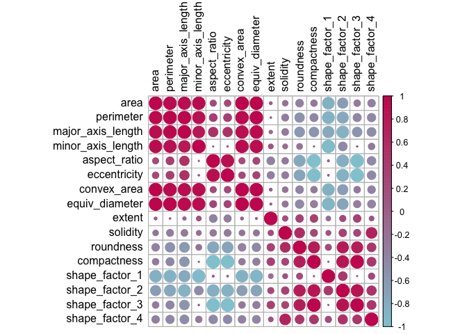
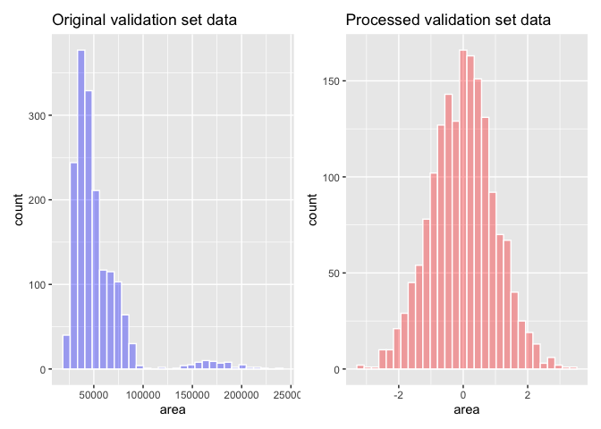
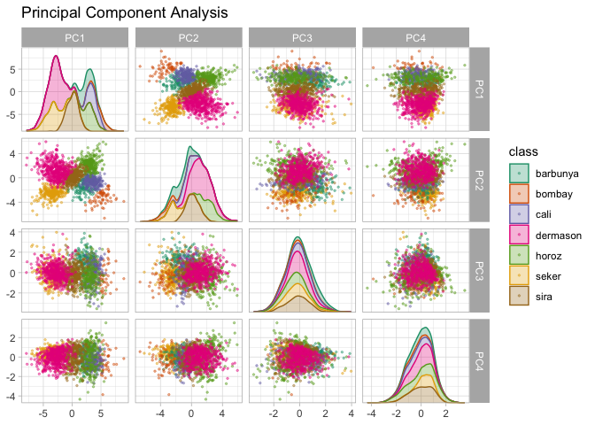
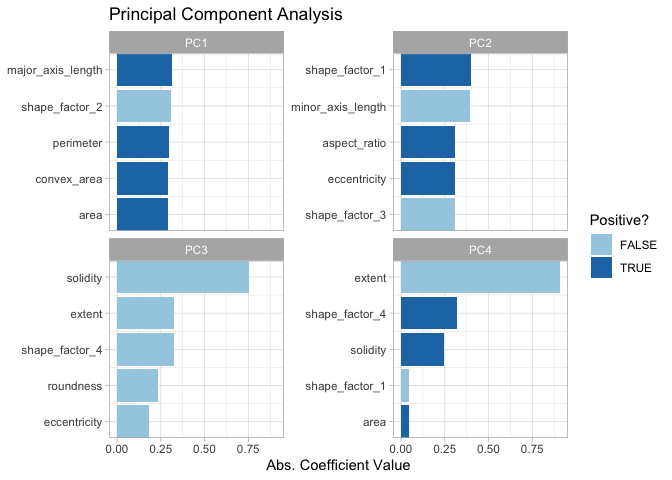
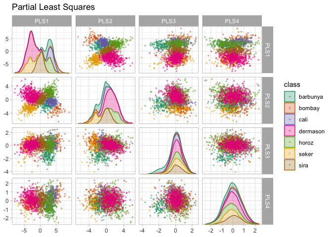
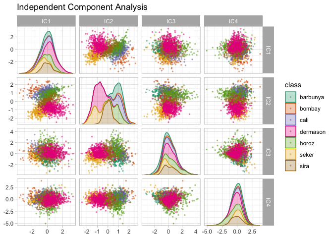
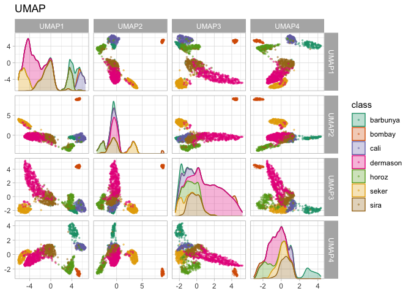
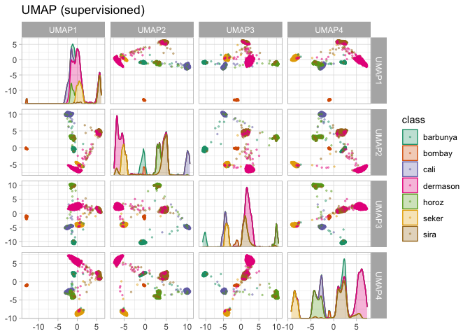
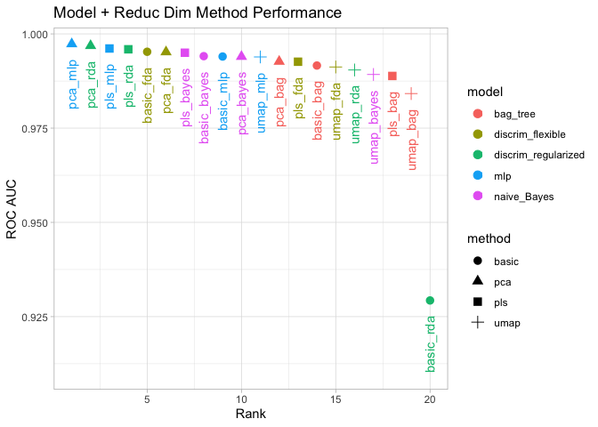

-   [Main objetives](#main-objetives)
-   [Beans dataset](#beans-dataset)
-   [A STARTER RECIPE](#a-starter-recipe)
-   [BACKING THE RECIPE](#backing-the-recipe)
-   [Feature Extraction Techniques](#feature-extraction-techniques)
-   [PCA](#pca)
-   [Partial Least Squares](#partial-least-squares)
-   [Independent Component Analysis](#independent-component-analysis)
-   [Uniform Manifold Approximation and
    Projection](#uniform-manifold-approximation-and-projection)
-   [Modeling](#modeling)
-   [Reference](#reference)

## Main objetives

1.  Demonstrate how to use recipes to create a small set of features
    that capture the main aspects of the original predictor set.
2.  Descrive how recipes can be used on their own (as opposed to being
    used in a workflow object)

In addition to the tidymodels package, this chapter uses the following
packages: `baguette`, `beans`, `bestNormalize`, `corrplot`, `discrim`,
`embed`, `ggforce`, `klaR`, `learntidymodels`, `mixOmics`, and `uwot.`

## Beans dataset

    # put rnotbook in the same workdir
    knitr::opts_knit$set(root.dir = normalizePath(rprojroot::find_rstudio_root_file())) 
    library(tidymodels)

    ## ── Attaching packages ────────────────────────────────────── tidymodels 1.1.1 ──

    ## ✔ broom        1.0.5     ✔ recipes      1.0.9
    ## ✔ dials        1.2.0     ✔ rsample      1.2.0
    ## ✔ dplyr        1.1.4     ✔ tibble       3.2.1
    ## ✔ ggplot2      3.4.4     ✔ tidyr        1.3.0
    ## ✔ infer        1.0.5     ✔ tune         1.1.2
    ## ✔ modeldata    1.2.0     ✔ workflows    1.1.3
    ## ✔ parsnip      1.1.1     ✔ workflowsets 1.0.1
    ## ✔ purrr        1.0.2     ✔ yardstick    1.2.0

    ## ── Conflicts ───────────────────────────────────────── tidymodels_conflicts() ──
    ## ✖ purrr::discard() masks scales::discard()
    ## ✖ dplyr::filter()  masks stats::filter()
    ## ✖ dplyr::lag()     masks stats::lag()
    ## ✖ recipes::step()  masks stats::step()
    ## • Use suppressPackageStartupMessages() to eliminate package startup messages

    library(beans)
    data("beans")

    # what we have here?
    beans |> 
      skimr::skim()

<table>
<caption>Data summary</caption>
<tbody>
<tr class="odd">
<td style="text-align: left;">Name</td>
<td style="text-align: left;">beans</td>
</tr>
<tr class="even">
<td style="text-align: left;">Number of rows</td>
<td style="text-align: left;">13611</td>
</tr>
<tr class="odd">
<td style="text-align: left;">Number of columns</td>
<td style="text-align: left;">17</td>
</tr>
<tr class="even">
<td style="text-align: left;">_______________________</td>
<td style="text-align: left;"></td>
</tr>
<tr class="odd">
<td style="text-align: left;">Column type frequency:</td>
<td style="text-align: left;"></td>
</tr>
<tr class="even">
<td style="text-align: left;">factor</td>
<td style="text-align: left;">1</td>
</tr>
<tr class="odd">
<td style="text-align: left;">numeric</td>
<td style="text-align: left;">16</td>
</tr>
<tr class="even">
<td style="text-align: left;">________________________</td>
<td style="text-align: left;"></td>
</tr>
<tr class="odd">
<td style="text-align: left;">Group variables</td>
<td style="text-align: left;">None</td>
</tr>
</tbody>
</table>

Data summary

**Variable type: factor**

<table>
<colgroup>
<col style="width: 14%" />
<col style="width: 10%" />
<col style="width: 14%" />
<col style="width: 8%" />
<col style="width: 9%" />
<col style="width: 43%" />
</colgroup>
<thead>
<tr class="header">
<th style="text-align: left;">skim_variable</th>
<th style="text-align: right;">n_missing</th>
<th style="text-align: right;">complete_rate</th>
<th style="text-align: left;">ordered</th>
<th style="text-align: right;">n_unique</th>
<th style="text-align: left;">top_counts</th>
</tr>
</thead>
<tbody>
<tr class="odd">
<td style="text-align: left;">class</td>
<td style="text-align: right;">0</td>
<td style="text-align: right;">1</td>
<td style="text-align: left;">FALSE</td>
<td style="text-align: right;">7</td>
<td style="text-align: left;">der: 3546, sir: 2636, sek: 2027, hor:
1928</td>
</tr>
</tbody>
</table>

**Variable type: numeric**

<table style="width:100%;">
<colgroup>
<col style="width: 16%" />
<col style="width: 8%" />
<col style="width: 12%" />
<col style="width: 8%" />
<col style="width: 8%" />
<col style="width: 8%" />
<col style="width: 8%" />
<col style="width: 8%" />
<col style="width: 8%" />
<col style="width: 8%" />
<col style="width: 5%" />
</colgroup>
<thead>
<tr class="header">
<th style="text-align: left;">skim_variable</th>
<th style="text-align: right;">n_missing</th>
<th style="text-align: right;">complete_rate</th>
<th style="text-align: right;">mean</th>
<th style="text-align: right;">sd</th>
<th style="text-align: right;">p0</th>
<th style="text-align: right;">p25</th>
<th style="text-align: right;">p50</th>
<th style="text-align: right;">p75</th>
<th style="text-align: right;">p100</th>
<th style="text-align: left;">hist</th>
</tr>
</thead>
<tbody>
<tr class="odd">
<td style="text-align: left;">area</td>
<td style="text-align: right;">0</td>
<td style="text-align: right;">1</td>
<td style="text-align: right;">53048.28</td>
<td style="text-align: right;">29324.10</td>
<td style="text-align: right;">20420.00</td>
<td style="text-align: right;">36328.00</td>
<td style="text-align: right;">44652.00</td>
<td style="text-align: right;">61332.00</td>
<td style="text-align: right;">254616.00</td>
<td style="text-align: left;">▇▂▁▁▁</td>
</tr>
<tr class="even">
<td style="text-align: left;">perimeter</td>
<td style="text-align: right;">0</td>
<td style="text-align: right;">1</td>
<td style="text-align: right;">855.28</td>
<td style="text-align: right;">214.29</td>
<td style="text-align: right;">524.74</td>
<td style="text-align: right;">703.52</td>
<td style="text-align: right;">794.94</td>
<td style="text-align: right;">977.21</td>
<td style="text-align: right;">1985.37</td>
<td style="text-align: left;">▇▆▁▁▁</td>
</tr>
<tr class="odd">
<td style="text-align: left;">major_axis_length</td>
<td style="text-align: right;">0</td>
<td style="text-align: right;">1</td>
<td style="text-align: right;">320.14</td>
<td style="text-align: right;">85.69</td>
<td style="text-align: right;">183.60</td>
<td style="text-align: right;">253.30</td>
<td style="text-align: right;">296.88</td>
<td style="text-align: right;">376.50</td>
<td style="text-align: right;">738.86</td>
<td style="text-align: left;">▇▆▂▁▁</td>
</tr>
<tr class="even">
<td style="text-align: left;">minor_axis_length</td>
<td style="text-align: right;">0</td>
<td style="text-align: right;">1</td>
<td style="text-align: right;">202.27</td>
<td style="text-align: right;">44.97</td>
<td style="text-align: right;">122.51</td>
<td style="text-align: right;">175.85</td>
<td style="text-align: right;">192.43</td>
<td style="text-align: right;">217.03</td>
<td style="text-align: right;">460.20</td>
<td style="text-align: left;">▇▇▁▁▁</td>
</tr>
<tr class="odd">
<td style="text-align: left;">aspect_ratio</td>
<td style="text-align: right;">0</td>
<td style="text-align: right;">1</td>
<td style="text-align: right;">1.58</td>
<td style="text-align: right;">0.25</td>
<td style="text-align: right;">1.02</td>
<td style="text-align: right;">1.43</td>
<td style="text-align: right;">1.55</td>
<td style="text-align: right;">1.71</td>
<td style="text-align: right;">2.43</td>
<td style="text-align: left;">▂▇▅▂▁</td>
</tr>
<tr class="even">
<td style="text-align: left;">eccentricity</td>
<td style="text-align: right;">0</td>
<td style="text-align: right;">1</td>
<td style="text-align: right;">0.75</td>
<td style="text-align: right;">0.09</td>
<td style="text-align: right;">0.22</td>
<td style="text-align: right;">0.72</td>
<td style="text-align: right;">0.76</td>
<td style="text-align: right;">0.81</td>
<td style="text-align: right;">0.91</td>
<td style="text-align: left;">▁▁▂▇▇</td>
</tr>
<tr class="odd">
<td style="text-align: left;">convex_area</td>
<td style="text-align: right;">0</td>
<td style="text-align: right;">1</td>
<td style="text-align: right;">53768.20</td>
<td style="text-align: right;">29774.92</td>
<td style="text-align: right;">20684.00</td>
<td style="text-align: right;">36714.50</td>
<td style="text-align: right;">45178.00</td>
<td style="text-align: right;">62294.00</td>
<td style="text-align: right;">263261.00</td>
<td style="text-align: left;">▇▂▁▁▁</td>
</tr>
<tr class="even">
<td style="text-align: left;">equiv_diameter</td>
<td style="text-align: right;">0</td>
<td style="text-align: right;">1</td>
<td style="text-align: right;">253.06</td>
<td style="text-align: right;">59.18</td>
<td style="text-align: right;">161.24</td>
<td style="text-align: right;">215.07</td>
<td style="text-align: right;">238.44</td>
<td style="text-align: right;">279.45</td>
<td style="text-align: right;">569.37</td>
<td style="text-align: left;">▇▆▁▁▁</td>
</tr>
<tr class="odd">
<td style="text-align: left;">extent</td>
<td style="text-align: right;">0</td>
<td style="text-align: right;">1</td>
<td style="text-align: right;">0.75</td>
<td style="text-align: right;">0.05</td>
<td style="text-align: right;">0.56</td>
<td style="text-align: right;">0.72</td>
<td style="text-align: right;">0.76</td>
<td style="text-align: right;">0.79</td>
<td style="text-align: right;">0.87</td>
<td style="text-align: left;">▁▁▅▇▂</td>
</tr>
<tr class="even">
<td style="text-align: left;">solidity</td>
<td style="text-align: right;">0</td>
<td style="text-align: right;">1</td>
<td style="text-align: right;">0.99</td>
<td style="text-align: right;">0.00</td>
<td style="text-align: right;">0.92</td>
<td style="text-align: right;">0.99</td>
<td style="text-align: right;">0.99</td>
<td style="text-align: right;">0.99</td>
<td style="text-align: right;">0.99</td>
<td style="text-align: left;">▁▁▁▁▇</td>
</tr>
<tr class="odd">
<td style="text-align: left;">roundness</td>
<td style="text-align: right;">0</td>
<td style="text-align: right;">1</td>
<td style="text-align: right;">0.87</td>
<td style="text-align: right;">0.06</td>
<td style="text-align: right;">0.49</td>
<td style="text-align: right;">0.83</td>
<td style="text-align: right;">0.88</td>
<td style="text-align: right;">0.92</td>
<td style="text-align: right;">0.99</td>
<td style="text-align: left;">▁▁▂▇▇</td>
</tr>
<tr class="even">
<td style="text-align: left;">compactness</td>
<td style="text-align: right;">0</td>
<td style="text-align: right;">1</td>
<td style="text-align: right;">0.80</td>
<td style="text-align: right;">0.06</td>
<td style="text-align: right;">0.64</td>
<td style="text-align: right;">0.76</td>
<td style="text-align: right;">0.80</td>
<td style="text-align: right;">0.83</td>
<td style="text-align: right;">0.99</td>
<td style="text-align: left;">▂▅▇▂▁</td>
</tr>
<tr class="odd">
<td style="text-align: left;">shape_factor_1</td>
<td style="text-align: right;">0</td>
<td style="text-align: right;">1</td>
<td style="text-align: right;">0.01</td>
<td style="text-align: right;">0.00</td>
<td style="text-align: right;">0.00</td>
<td style="text-align: right;">0.01</td>
<td style="text-align: right;">0.01</td>
<td style="text-align: right;">0.01</td>
<td style="text-align: right;">0.01</td>
<td style="text-align: left;">▁▃▇▃▁</td>
</tr>
<tr class="even">
<td style="text-align: left;">shape_factor_2</td>
<td style="text-align: right;">0</td>
<td style="text-align: right;">1</td>
<td style="text-align: right;">0.00</td>
<td style="text-align: right;">0.00</td>
<td style="text-align: right;">0.00</td>
<td style="text-align: right;">0.00</td>
<td style="text-align: right;">0.00</td>
<td style="text-align: right;">0.00</td>
<td style="text-align: right;">0.00</td>
<td style="text-align: left;">▇▇▇▃▁</td>
</tr>
<tr class="odd">
<td style="text-align: left;">shape_factor_3</td>
<td style="text-align: right;">0</td>
<td style="text-align: right;">1</td>
<td style="text-align: right;">0.64</td>
<td style="text-align: right;">0.10</td>
<td style="text-align: right;">0.41</td>
<td style="text-align: right;">0.58</td>
<td style="text-align: right;">0.64</td>
<td style="text-align: right;">0.70</td>
<td style="text-align: right;">0.97</td>
<td style="text-align: left;">▂▇▇▃▁</td>
</tr>
<tr class="even">
<td style="text-align: left;">shape_factor_4</td>
<td style="text-align: right;">0</td>
<td style="text-align: right;">1</td>
<td style="text-align: right;">1.00</td>
<td style="text-align: right;">0.00</td>
<td style="text-align: right;">0.95</td>
<td style="text-align: right;">0.99</td>
<td style="text-align: right;">1.00</td>
<td style="text-align: right;">1.00</td>
<td style="text-align: right;">1.00</td>
<td style="text-align: left;">▁▁▁▁▇</td>
</tr>
</tbody>
</table>

    # split (with a validation set)
    set.seed(1601)
    bean_split <- initial_validation_split(beans, strata = class,
                                           prop = c(.75, .125))

    ## Warning: Too little data to stratify.
    ## • Resampling will be unstratified.

    bean_split

    ## <Training/Validation/Testing/Total>
    ## <10206/1702/1703/13611>

    # the dataframes
    bean_train <- training(bean_split) 
    bean_test  <- testing(bean_split) 
    bean_validation <- validation(bean_split)

    # create a rset for tunning
    set.seed(1601)
    bean_val <- validation_set(bean_split)
    bean_val

    ## # A tibble: 1 × 2
    ##   splits               id        
    ##   <list>               <chr>     
    ## 1 <split [10206/1702]> validation

    bean_val$splits[[1]]

    ## <Training/Validation/Total>
    ## <10206/1702/11908>

To visually assess how well different methods perform, we can estimate
the methods on the training set (n = 10,206 beans) and display the
results using the validation set (n = 1,702).

Before beginning any dimensionality reduction, we can spend some time
investigating our data. Since we know that many of these shape features
are probably measuring similar concepts, let’s take a look at the
correlation structure of the data using this code.

    library(corrplot)

    ## corrplot 0.92 loaded

    tmwr_cols <- colorRampPalette(c("#91CBD765", "#CA225E"))

    bean_train |> 
      select(-class) |> 
      cor() |> 
      corrplot(col=tmwr_cols(200), tl.col="black")

Many of these predictors are highly correlated, such as area and
perimeter or shape factors 2 and 3.

## A STARTER RECIPE

Several predictors are ratios and so are likely to have skewed
distributions. Such distributions can wreak havoc on variance
calculations (such as the ones used in PCA). The `bestNormalize` package
has a step that can enforce a symmetric distribution for the predictors.
We’ll use this to mitigate the issue of skewed distributions:

    library(bestNormalize)

    bean_rec <- 
      recipe(class ~ ., data=bean_train) |> 
      step_zv(all_numeric_predictors()) |> 
      step_orderNorm(all_numeric_predictors()) |> 
      step_normalize(all_numeric_predictors())

    bean_rec

    ## 

    ## ── Recipe ──────────────────────────────────────────────────────────────────────

    ## 

    ## ── Inputs

    ## Number of variables by role

    ## outcome:    1
    ## predictor: 16

    ## 

    ## ── Operations

    ## • Zero variance filter on: all_numeric_predictors()

    ## • orderNorm transformation on: all_numeric_predictors()

    ## • Centering and scaling for: all_numeric_predictors()

    # training the recipe
    bean_rec_trained <- prep(bean_rec)
    bean_rec_trained

    ## 

    ## ── Recipe ──────────────────────────────────────────────────────────────────────

    ## 

    ## ── Inputs

    ## Number of variables by role

    ## outcome:    1
    ## predictor: 16

    ## 

    ## ── Training information

    ## Training data contained 10206 data points and no incomplete rows.

    ## 

    ## ── Operations

    ## • Zero variance filter removed: <none> | Trained

    ## • orderNorm transformation on: area and perimeter, ... | Trained

    ## • Centering and scaling for: area and perimeter, ... | Trained

> Remember that `prep()` for a recipe is like `fit()`for a model.

## BACKING THE RECIPE

> Using `bake()` with a recipe is much like using `predict()` with a
> model; the operations estimated from the training set are applied to
> any data, like testing data or new data at prediction time.

    bean_val_processed <- bake(bean_rec_trained, new_data = bean_validation)

    library(patchwork)
    p1 <- bean_validation |> 
      ggplot(aes(x=area)) +
      geom_histogram(bins=30, color="white", fill="blue", alpha=1/3) +
      ggtitle("Original validation set data")

    p2 <- bean_val_processed |> 
      ggplot(aes(x=area)) +
      geom_histogram(bins=30, color="white", fill="red", alpha=1/3) +
      ggtitle("Processed validation set data")

    p1+p2

## Feature Extraction Techniques

Since recipes are the primary option in tidymodels for dimensionality
reduction, let’s write a function that will estimate the transformation
and plot the resulting data in a scatter plot matrix via the ggforce
package:

    library(ggforce) 

    plot_validation_results <- function(recipe, dat=bean_validation){
      recipe |> 
        prep() |> 
        bake(new_dat=dat) |> 
        ggplot(aes(.panel_x, y=.panel_y, color=class, fill=class)) +
        geom_point(alpha = 0.4, size=0.5) +
        geom_autodensity(alpha=.3) +
        facet_matrix(vars(-class), layer.diag = 2) +
        scale_color_brewer(palette="Dark2") +
        scale_fill_brewer(palette="Dark2") +
        theme_light()
    }

## PCA

    bean_rec_trained |> 
      step_pca(all_numeric_predictors(), num_comp=4) |> 
      plot_validation_results() +
      ggtitle("Principal Component Analysis")

We see that the first two components PC1 and PC2, especially when used
together, do an effective job distinguishing between or separating the
classes. Recall that PCA is unsupervised. For these data, it turns out
that the PCA components that explain the most variation in the
predictors also happen to be predictive of the classes.

What features are driving performance? The `learntidymodels` package has
functions that can help visualize the top features for each component.
We’ll need the prepared recipe; the PCA step is added in the following
code along with a call to `prep()`:

    library(learntidymodels)

    ## Loading required package: tidyverse

    ## ── Attaching core tidyverse packages ──────────────────────── tidyverse 2.0.0 ──
    ## ✔ forcats   1.0.0     ✔ readr     2.1.4
    ## ✔ lubridate 1.9.3     ✔ stringr   1.5.1
    ## ── Conflicts ────────────────────────────────────────── tidyverse_conflicts() ──
    ## ✖ readr::col_factor() masks scales::col_factor()
    ## ✖ purrr::discard()    masks scales::discard()
    ## ✖ dplyr::filter()     masks stats::filter()
    ## ✖ stringr::fixed()    masks recipes::fixed()
    ## ✖ dplyr::lag()        masks stats::lag()
    ## ✖ readr::spec()       masks yardstick::spec()
    ## ℹ Use the conflicted package (<http://conflicted.r-lib.org/>) to force all conflicts to become errors

    bean_rec_trained |> 
      step_pca(all_numeric_predictors(), num_comp=4) |> 
      prep() |> 
      plot_top_loadings(component_number <=4, n=5) +
      scale_fill_brewer(palette="Paired") +
      theme_light() +
      ggtitle("Principal Component Analysis")

## Partial Least Squares

PLS is a supervised version of PCA. It tries to find components that
simultaneously maximize the variation in the predictors while also
maximizing the relationship between those components and the outcome

    bean_rec_trained |> 
      step_pls(all_numeric_predictors(), outcome="class", num_comp=4) |> 
      plot_validation_results() +
      ggtitle("Partial Least Squares")

The first two PLS components plotted in Figure 16.7 are nearly identical
to the first two PCA components! We find this result because those PCA
components are so effective at separating the varieties of beans. The
remaining components are different.

    bean_rec_trained |> 
      step_pls(all_numeric_predictors(), outcome="class", num_comp=4) |> 
      prep() |> 
      plot_top_loadings(component_number <= 4, n=5, type="pls") +
      scale_fill_brewer(palette="Paired") +
      ggtitle("Partial Least Squares")

*Solidity* (i.e., the density of the bean) drives the third PLS
component, along with roundness. *Solidity* may be capturing bean
features related to “bumpiness” of the bean surface since it can measure
irregularity of the bean boundaries.

## Independent Component Analysis

ICA is slightly different than PCA in that if finds components that are
statistically independent from one another possible (as opposed to being
uncorrelated). It can be thought of as maximizing the “non gaussianity”
of the ICA components, or separating information instead of compressing
information like PCA.

    bean_rec_trained |> 
      step_ica(all_numeric_predictors(), num_comp=4) |> 
      plot_validation_results() +
      ggtitle("Independent Component Analysis")

Inspecting this plot, there does not appear to be much separation
between the classes in the first few components when using ICA. These
independent (or as independent as possible) components do not separate
the bean types.

## Uniform Manifold Approximation and Projection

UMAP is similar to the popular t-SNE method for nonlinear dimension
reduction. In the original high-dimensional space, UMAP uses a
distance-based nearest neighbor method to find local areas of the data
where the data points are more likely to be related. The relationship
between data points is saved as a directed graph model where most points
are not connected.

From there, UMAP translates points in the graph to the reduced
dimensional space. To do this, the algorithm has an optimization process
that uses cross-entropy to map data points to the smaller set of
features so that the graph is well approximated.

    library(embed)
    bean_rec_trained |> 
      step_umap(all_numeric_predictors(), num_comp=4) |> 
      plot_validation_results() +
      ggtitle("UMAP")

While the between-cluster space is pronounced, the clusters can contain
a heterogeneous mixture of classes.

There is also a supervised version of UMAP:

    bean_rec_trained |> 
      step_umap(all_numeric_predictors(), outcome="class", num_comp=4) |> 
      plot_validation_results() +
      ggtitle("UMAP (supervisioned)")

UMAP is a powerful method to reduce the feature space. However, it can
be very sensitive to tuning parameters. For this reason, it would help
to experiment with a few of the parameters to assess how robust the
results are for these data.

## Modeling

Both the PLS and UMAP methods are worth investigating in conjunction
with different models. Let’s explore a variety of different models with
these dimensionality reduction techniques (along with no transformation
at all): a single layer neural network, bagged trees, flexible
discriminant analysis (FDA), naive Bayes, and regularized discriminant
analysis (RDA).

    library(baguette)
    library(discrim)

    ## 
    ## Attaching package: 'discrim'

    ## The following object is masked from 'package:dials':
    ## 
    ##     smoothness

    mlp_spec <- 
      mlp(hidden_units = tune(), penalty=tune(), epochs=tune()) |> 
      set_engine("nnet") |> 
      set_mode("classification")

    bagging_spec <- 
      bag_tree() |> 
      set_engine("rpart") |> 
      set_mode("classification")

    fda_spec <- 
      discrim_flexible(prod_degree = tune()) |> 
      set_engine("earth")

    rda_spec <- 
      discrim_regularized(frac_common_cov=tune(), frac_identity=tune()) |> 
      set_engine("klaR")

    bayes_spec <- 
      naive_Bayes() |> 
      set_engine("klaR")

We also need recipes for the dimensionality reduction methods we’ll try.
Let’s start with a base recipe `bean_rec` and then extend it with
different dimensionality reduction steps:

    bean_rec <- 
      recipe(class ~ ., data=bean_train) |> 
      step_zv(all_numeric_predictors()) |> 
      step_orderNorm(all_numeric_predictors()) |> 
      step_normalize(all_numeric_predictors())

    pls_rec <- 
      bean_rec |> 
      step_pls(all_numeric_predictors(), outcome = "class", num_comp=tune())

    umap_rec <-
      bean_rec |> 
      step_umap(all_numeric_predictors(),
                outcome = "class",
                num_comp = tune(), 
                neighbors = tune(),
                min_dist = tune())

    pca_rec <- 
      bean_rec |> 
      step_pca(num_comp = tune())

Once again, the `workflowsets` package takes the preprocessors and
models and crosses them. The control option parallel\_over is set so
that the parallel processing can work simultaneously across tuning
parameter combinations.

    ctrl <- control_grid(parallel_over = "everything")

    library(doMC)
    registerDoMC()

    bean_res <- 
      workflow_set(
        preproc = list(basic=class~., pls=pls_rec, umap=umap_rec, pca=pca_rec),
        models  = list(bayes=bayes_spec, fda=fda_spec,
                       rda=rda_spec, bag=bagging_spec,
                       mlp=mlp_spec)) |> 
      workflow_map(
        verbose = T,
        seed = 1603,
        resamples = bean_val, 
        grid = 10,
        metrics = metric_set(roc_auc),
        control = ctrl
      )

    saveRDS(bean_res, "./tmwr/chp16_bean_res.rds")

We can rank the models by their validation set, estimates of the area
under the ROC curve:

    bean_res <- readRDS("./tmwr/chp16_bean_res.rds") 

    rankings <- 
      bean_res |> 
      rank_results(select_best=T) |> 
      mutate(method = map_chr(wflow_id, ~str_split(.x, "_", simplify=T)[1]))

    rankings |> 
      filter(rank<=5) |> 
      dplyr::select(rank, mean, model, method)

    ## # A tibble: 5 × 4
    ##    rank  mean model               method
    ##   <int> <dbl> <chr>               <chr> 
    ## 1     1 0.997 mlp                 pca   
    ## 2     2 0.997 discrim_regularized pca   
    ## 3     3 0.996 mlp                 pls   
    ## 4     4 0.996 discrim_regularized pls   
    ## 5     5 0.995 discrim_flexible    basic

    rankings |> 
      ggplot(aes(x=rank, y=mean, color=model, shape=method)) +
      geom_point(size=3) +
      geom_text(aes(label=wflow_id), angle=90, hjust=1, nudge_y = -.004) +
      labs(
        title="Model + Reduc Dim Method Performance",
        x="Rank",
        y="ROC AUC"
      ) +
      lims(y=c(.91,NA)) +
      theme_light()

For demonstration, we\`ll use the best result as final model. We
finalize the workflow with the numerically best parameters, fit it to
the training set, then evaluate with the test set:

    best_model_method <- rankings[1,]$wflow_id
    best_model_method

    ## [1] "pca_mlp"

    best_res <- 
      bean_res |> 
      extract_workflow(best_model_method) |> 
      finalize_workflow(
        bean_res |> 
          extract_workflow_set_result(best_model_method) |> 
          select_best(metric="roc_auc")
      ) |> 
      last_fit(split=bean_split, metrics=metric_set(roc_auc))

    best_wflow_fit <- extract_workflow(best_res)

What are the results for our metric on testing set?

    collect_metrics(best_res)

    ## # A tibble: 1 × 4
    ##   .metric .estimator .estimate .config             
    ##   <chr>   <chr>          <dbl> <chr>               
    ## 1 roc_auc hand_till      0.995 Preprocessor1_Model1

Pretty good! We’ll use this model in the next chapter to demonstrate
variable importance methods.

# Reference

All code and text came from Max Kuhn and Julia Silge\`s book [Tidy
Modeling with R](https://www.tmwr.org/dimensionality).
