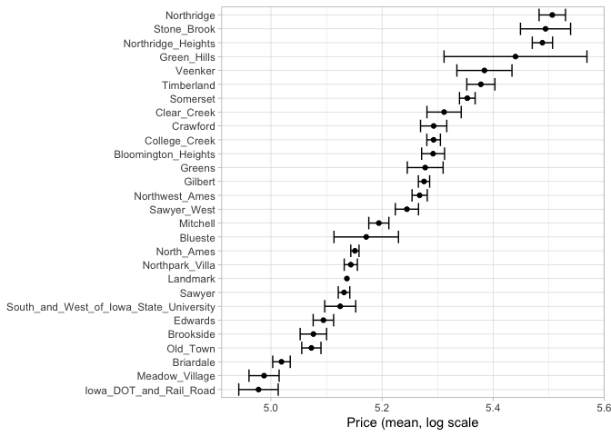
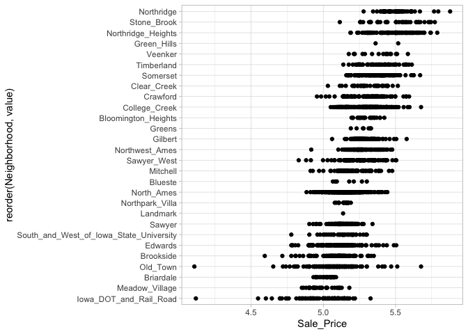
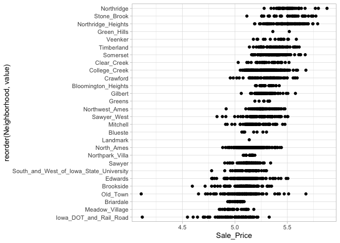
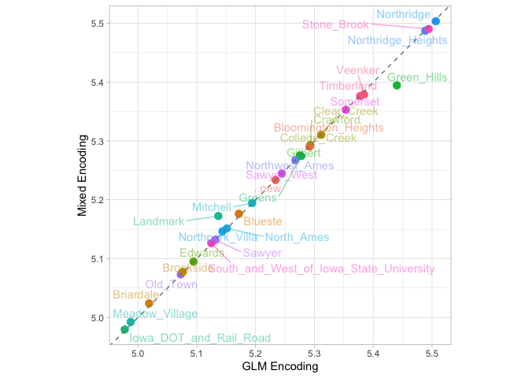
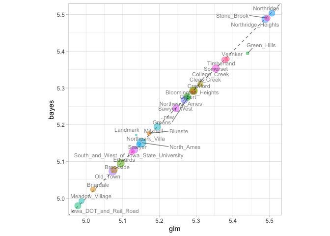

-   [Enconding ordinal predicttors](#enconding-ordinal-predicttors)
-   [Using the outcome for encoding
    predictors](#using-the-outcome-for-encoding-predictors)
-   [Effect encodings with partial
    pooling](#effect-encodings-with-partial-pooling)
-   [Feature Hashing](#feature-hashing)
-   [Reference](#reference)

    # put rnotbook in the same workdir
    knitr::opts_knit$set(root.dir = normalizePath(rprojroot::find_rstudio_root_file())) 

    library(tidymodels)

    ## ── Attaching packages ────────────────────────────────────── tidymodels 1.1.1 ──

    ## ✔ broom        1.0.5     ✔ recipes      1.0.9
    ## ✔ dials        1.2.0     ✔ rsample      1.2.0
    ## ✔ dplyr        1.1.4     ✔ tibble       3.2.1
    ## ✔ ggplot2      3.4.4     ✔ tidyr        1.3.0
    ## ✔ infer        1.0.5     ✔ tune         1.1.2
    ## ✔ modeldata    1.2.0     ✔ workflows    1.1.3
    ## ✔ parsnip      1.1.1     ✔ workflowsets 1.0.1
    ## ✔ purrr        1.0.2     ✔ yardstick    1.2.0

    ## ── Conflicts ───────────────────────────────────────── tidymodels_conflicts() ──
    ## ✖ purrr::discard() masks scales::discard()
    ## ✖ dplyr::filter()  masks stats::filter()
    ## ✖ dplyr::lag()     masks stats::lag()
    ## ✖ recipes::step()  masks stats::step()
    ## • Use tidymodels_prefer() to resolve common conflicts.

    data(ames)
    ames <- mutate(ames, Sale_Price = log10(Sale_Price))

    set.seed(502)
    ames_split <- initial_split(ames, prop = 0.80, strata = Sale_Price)
    ames_train <- training(ames_split)
    ames_test  <-  testing(ames_split)

> We advise starting with untransformed categorical variables when a
> model allows it; note that more complex encodings often do no result
> in better performance for such models.

## Enconding ordinal predicttors

Sometimes qualitative columns can be ordered, such as “low,” “medium,”
and “high”. In base R, the default encoding strategy is to make new
numeric columns that are polynomial expansions of the data. For columns
that have five ordinal values the factor column is replaced with columns
for linear, quadratic, cubic, and quartic terms.

While this is not unreasonable, it is not an approach that people tend
to find useful. For example, an 11-degree polynomial is probably not the
most effective way of encoding an ordinal factor for the months of the
year. Instead, consider trying recipe steps related to ordered factors,
such as `step_unorder()`, to convert to regular factors, and
`step_ordinalscore()`, which maps specific numeric values to each factor
level.

## Using the outcome for encoding predictors

There are multiple option sfor encoding more complex than dummy or
indicator. One method called *effect* or *likelihood encodings* replaces
the original categorical variables a single numeric olumn that measure
the effect of those data.

    ames_train |> 
      group_by(Neighborhood) |> 
      summarize(mean=mean(Sale_Price),
                std_err = sd(Sale_Price)/sqrt(length(Sale_Price))) |> 
      ggplot(aes(y=reorder(Neighborhood, mean), x=mean)) +
      geom_point() +
      geom_errorbar(aes(xmin=mean-1.64*std_err, xmax=mean+1.64*std_err)) +
      labs(y=NULL, x="Price (mean, log scale") +
      theme_light()

This kind of effect encoding works well, when you categorical variable
has many levels. In tidymodels, the `embed` package includes several
recipe step functions for differente kind of effect encodings, such as
`step_lencode_glm()`, `step_lencode_mixed()` and `step_lencode_bayes()`.
These steps use a generalized linear model to estimate the effect of
each level in a categorical predictor on the outcome. When using a
recipe step like `step_lencode_glm()`.

    library(embed) 

    ames_glm <- 
      recipe(Sale_Price ~ Neighborhood + Gr_Liv_Area + Year_Built + Bldg_Type +
               Latitude + Longitude, data = ames_train) |> 
      step_log(Gr_Liv_Area, base=10) |> 
      step_lencode_glm(Neighborhood, outcome = "Sale_Price") |> 
      step_dummy(all_nominal_predictors()) |> 
      step_interact(~Gr_Liv_Area:starts_with("Bldg_Type_")) |> 
      step_ns(Latitude, Longitude, deg_free = 20)

    ames_glm

    ## 

    ## ── Recipe ──────────────────────────────────────────────────────────────────────

    ## 

    ## ── Inputs

    ## Number of variables by role

    ## outcome:   1
    ## predictor: 6

    ## 

    ## ── Operations

    ## • Log transformation on: Gr_Liv_Area

    ## • Linear embedding for factors via GLM for: Neighborhood

    ## • Dummy variables from: all_nominal_predictors()

    ## • Interactions with: Gr_Liv_Area:starts_with("Bldg_Type_")

    ## • Natural splines on: Latitude and Longitude

    glm_estimates <- 
      prep(ames_glm) |> 
      tidy(number=2)

    glm_estimates

    ## # A tibble: 29 × 4
    ##    level              value terms        id               
    ##    <chr>              <dbl> <chr>        <chr>            
    ##  1 North_Ames          5.15 Neighborhood lencode_glm_yj20u
    ##  2 College_Creek       5.29 Neighborhood lencode_glm_yj20u
    ##  3 Old_Town            5.07 Neighborhood lencode_glm_yj20u
    ##  4 Edwards             5.09 Neighborhood lencode_glm_yj20u
    ##  5 Somerset            5.35 Neighborhood lencode_glm_yj20u
    ##  6 Northridge_Heights  5.49 Neighborhood lencode_glm_yj20u
    ##  7 Gilbert             5.28 Neighborhood lencode_glm_yj20u
    ##  8 Sawyer              5.13 Neighborhood lencode_glm_yj20u
    ##  9 Northwest_Ames      5.27 Neighborhood lencode_glm_yj20u
    ## 10 Sawyer_West         5.24 Neighborhood lencode_glm_yj20u
    ## # ℹ 19 more rows

    ames_train |> 
      select(Sale_Price, Neighborhood) |> 
      inner_join(glm_estimates, by=c("Neighborhood"="level")) |> 
      ggplot(aes(y=reorder(Neighborhood, value), x=Sale_Price)) +
      geom_point() +
      theme_light()

Effect encoding methods like this one can also seamlessly handle
situations where a novel factor level is encountered in the data. This
`value` is the predicted price from the GLM whe we don\`t have any
specific neighborhood information:

    glm_estimates |> 
      filter(level=="..new")

    ## # A tibble: 1 × 4
    ##   level value terms        id               
    ##   <chr> <dbl> <chr>        <chr>            
    ## 1 ..new  5.23 Neighborhood lencode_glm_yj20u

Effect encoding can be powerful but should be used with care. The
effects should be computed from the training set, after data splitting.
This type of supervised preprocessing should be rigorously resample to
avoid overfitting.

## Effect encodings with partial pooling

Creating an effect encondig with `step_lencode_glm()` estimates the
effect separately for each factor level. However, some of these
neighborhoods have many houses in them, and some have only a few. There
is much more uncertainty in our measurement of price for the single
training set home in the Landmark neighborhood than the 354 training set
homes in North Ames.

We can use partial pooling to adjust these estimates so that levels with
small sample sizes are shrunken toward the overall mean. The effects for
each level are modeled all at once using a mixed or hierarchical
generalized linear model:

    ames_mixed <- 
      recipe(Sale_Price ~ Neighborhood + Gr_Liv_Area + Year_Built + Bldg_Type +
               Latitude + Longitude, data = ames_train) |> 
      step_log(Gr_Liv_Area, base=10) |> 
      step_lencode_mixed(Neighborhood, outcome = vars(Sale_Price)) |> 
      step_dummy(all_nominal_predictors()) |> 
      step_interact(~Gr_Liv_Area:starts_with("Bldg_Type_")) |> 
      step_ns(Latitude, Longitude, deg_free = 20)

    ames_mixed

    ## 

    ## ── Recipe ──────────────────────────────────────────────────────────────────────

    ## 

    ## ── Inputs

    ## Number of variables by role

    ## outcome:   1
    ## predictor: 6

    ## 

    ## ── Operations

    ## • Log transformation on: Gr_Liv_Area

    ## • Linear embedding for factors via mixed effects for: Neighborhood

    ## • Dummy variables from: all_nominal_predictors()

    ## • Interactions with: Gr_Liv_Area:starts_with("Bldg_Type_")

    ## • Natural splines on: Latitude and Longitude

    mixed_estimates <- 
      prep(ames_mixed) |> 
      tidy(number=2)

    mixed_estimates

    ## # A tibble: 29 × 4
    ##    level              value terms        id                 
    ##    <chr>              <dbl> <chr>        <chr>              
    ##  1 North_Ames          5.15 Neighborhood lencode_mixed_AmBz1
    ##  2 College_Creek       5.29 Neighborhood lencode_mixed_AmBz1
    ##  3 Old_Town            5.07 Neighborhood lencode_mixed_AmBz1
    ##  4 Edwards             5.10 Neighborhood lencode_mixed_AmBz1
    ##  5 Somerset            5.35 Neighborhood lencode_mixed_AmBz1
    ##  6 Northridge_Heights  5.49 Neighborhood lencode_mixed_AmBz1
    ##  7 Gilbert             5.28 Neighborhood lencode_mixed_AmBz1
    ##  8 Sawyer              5.13 Neighborhood lencode_mixed_AmBz1
    ##  9 Northwest_Ames      5.27 Neighborhood lencode_mixed_AmBz1
    ## 10 Sawyer_West         5.24 Neighborhood lencode_mixed_AmBz1
    ## # ℹ 19 more rows

    mixed_estimates %>%
      filter(level == "..new")

    ## # A tibble: 1 × 4
    ##   level value terms        id                 
    ##   <chr> <dbl> <chr>        <chr>              
    ## 1 ..new  5.23 Neighborhood lencode_mixed_AmBz1

    ames_train |> 
      select(Sale_Price, Neighborhood) |> 
      inner_join(mixed_estimates, by=c("Neighborhood"="level")) |> 
      ggplot(aes(y=reorder(Neighborhood, value), x=Sale_Price)) +
      geom_point() +
      theme_light()

Comparing both directly

    glm_estimates |> 
      inner_join(mixed_estimates, by="level") |> 
      ggplot(aes(value.x, value.y, color=level)) +
      geom_point(show.legend = F, size=3) +
      geom_abline(color="grey50", linetype="dashed") +
      ggrepel::geom_text_repel(aes(label=level), show.legend = F, alpha=.5) +
      labs(x="GLM Encoding", y="Mixed Encoding") +
      coord_fixed() +
      theme_light()

> You can use a fully Bayesian herarchical model for the effects in the
> same way with `step_lencode_bayes()`

    ames_bayes <-
      recipe(Sale_Price ~ Neighborhood + Gr_Liv_Area + Year_Built + Bldg_Type +
               Latitude + Longitude, data = ames_train) |> 
      step_log(Gr_Liv_Area, base=10) |> 
      step_lencode_bayes(Neighborhood, outcome = vars(Sale_Price)) |> 
      step_dummy(all_nominal_predictors()) |> 
      step_interact(~Gr_Liv_Area:starts_with("Bldg_Type_")) |> 
      step_ns(Latitude, Longitude, deg_free = 20)

    ames_bayes

    ## 

    ## ── Recipe ──────────────────────────────────────────────────────────────────────

    ## 

    ## ── Inputs

    ## Number of variables by role

    ## outcome:   1
    ## predictor: 6

    ## 

    ## ── Operations

    ## • Log transformation on: Gr_Liv_Area

    ## • Linear embedding for factors via Bayesian GLM for: Neighborhood

    ## • Dummy variables from: all_nominal_predictors()

    ## • Interactions with: Gr_Liv_Area:starts_with("Bldg_Type_")

    ## • Natural splines on: Latitude and Longitude

    bayes_estimates <- 
      prep(ames_mixed) |> 
      tidy(number=2)

    bayes_estimates

    ## # A tibble: 29 × 4
    ##    level              value terms        id                 
    ##    <chr>              <dbl> <chr>        <chr>              
    ##  1 North_Ames          5.15 Neighborhood lencode_mixed_AmBz1
    ##  2 College_Creek       5.29 Neighborhood lencode_mixed_AmBz1
    ##  3 Old_Town            5.07 Neighborhood lencode_mixed_AmBz1
    ##  4 Edwards             5.10 Neighborhood lencode_mixed_AmBz1
    ##  5 Somerset            5.35 Neighborhood lencode_mixed_AmBz1
    ##  6 Northridge_Heights  5.49 Neighborhood lencode_mixed_AmBz1
    ##  7 Gilbert             5.28 Neighborhood lencode_mixed_AmBz1
    ##  8 Sawyer              5.13 Neighborhood lencode_mixed_AmBz1
    ##  9 Northwest_Ames      5.27 Neighborhood lencode_mixed_AmBz1
    ## 10 Sawyer_West         5.24 Neighborhood lencode_mixed_AmBz1
    ## # ℹ 19 more rows

    bayes_estimates %>%
      filter(level == "..new")

    ## # A tibble: 1 × 4
    ##   level value terms        id                 
    ##   <chr> <dbl> <chr>        <chr>              
    ## 1 ..new  5.23 Neighborhood lencode_mixed_AmBz1

Let\`s bsiually compare the effects using bayes vs glm.

    glm_estimates |> 
      rename(glm = value) |> 
      left_join(
        bayes_estimates |> 
          rename(bayes=value),
        by="level"
      ) |> 
      left_join(
        ames_train |> 
          count(Neighborhood) |> 
          mutate(level=as.character(Neighborhood))
      ) |> 
      ggplot(aes(glm, bayes, size=sqrt(n))) +
      geom_abline(color="gray50", lty=2) +
      geom_point(aes(color=level, color=level), alpha=.5, show.legend = F) +
      ggrepel::geom_text_repel(aes(label=level), size=3,show.legend = F, alpha=.5) +
      coord_fixed() +
      theme_light()

    ## Joining with `by = join_by(level)`

    ## Warning: Duplicated aesthetics after name standardisation: colour
    ## Duplicated aesthetics after name standardisation: colour

    ## Warning: Removed 1 rows containing missing values (`geom_point()`).

Notice that most estimates for neighborhood effects are about the same
when we compare pooling to no pooling. However, the neighborhoods with
the fewest homes in them have been pulled (either up or down) toward the
mean effect.

## Feature Hashing

    library(rlang)

    ## 
    ## Attaching package: 'rlang'

    ## The following objects are masked from 'package:purrr':
    ## 
    ##     %@%, flatten, flatten_chr, flatten_dbl, flatten_int, flatten_lgl,
    ##     flatten_raw, invoke, splice

    ames_hash <- 
      ames_train |> 
      mutate(Hash = map_chr(Neighborhood, hash))

    ames_hash |> 
      select(Neighborhood, Hash)

    ## # A tibble: 2,342 × 2
    ##    Neighborhood    Hash                            
    ##    <fct>           <chr>                           
    ##  1 North_Ames      076543f71313e522efe157944169d919
    ##  2 North_Ames      076543f71313e522efe157944169d919
    ##  3 Briardale       b598bec306983e3e68a3118952df8cf0
    ##  4 Briardale       b598bec306983e3e68a3118952df8cf0
    ##  5 Northpark_Villa 6af95b5db968bf393e78188a81e0e1e4
    ##  6 Northpark_Villa 6af95b5db968bf393e78188a81e0e1e4
    ##  7 Sawyer_West     5b8ac3fb32a9671d55da7b13c6e5ef49
    ##  8 Sawyer_West     5b8ac3fb32a9671d55da7b13c6e5ef49
    ##  9 Sawyer          2491e7eceb561d5a5f19abea49145c68
    ## 10 Sawyer          2491e7eceb561d5a5f19abea49145c68
    ## # ℹ 2,332 more rows

If we input Briardale to this hashing function, we will always get the
same output. The neighborhoods in this case are called the “keys,” while
the outputs are the “hashes.”

> A hashing function takes an input of variable size and maps it to an
> output of fixed size. Hashing functions are commonly used in
> cryptography and databases.

The `rlang::hash()` function generates a 128-bit hash, which means there
are 2^128 possible hash values. This is great for some applications but
doesn’t help with feature hashing of high cardinality variables
(variables with many levels). In feature hashing, the number of possible
hashes is a hyperparameter and is set by the model developer through
computing the modulo of the integer hashes. We can get sixteen possible
hash values by using `Hash %% 16`

    ames_hash |> 
      mutate( Hash = strtoi(substr(Hash, 26, 32), base=16L),
              Hash = Hash %% 16 ) |> 
      select(Neighborhood, Hash)

    ## # A tibble: 2,342 × 2
    ##    Neighborhood     Hash
    ##    <fct>           <dbl>
    ##  1 North_Ames          9
    ##  2 North_Ames          9
    ##  3 Briardale           0
    ##  4 Briardale           0
    ##  5 Northpark_Villa     4
    ##  6 Northpark_Villa     4
    ##  7 Sawyer_West         9
    ##  8 Sawyer_West         9
    ##  9 Sawyer              8
    ## 10 Sawyer              8
    ## # ℹ 2,332 more rows

Now instead of the 28 neighborhoods in our original data or an
incredibly huge number of the original hashes, we have sixteen hash
values. This method is very fast and memory efficient, and it can be a
good strategy when there are a large number of possible categories.

> Feature hashing is useful for text data as well as high cardinality
> categorical data.

We can implement feature hashing using a tidymodels recipe step from the
textrecipes package:

    library(textrecipes)

    ames_hash <- 
      recipe(Sale_Price ~ Neighborhood + Gr_Liv_Area + Year_Built + Bldg_Type +
               Latitude + Longitude, data = ames_train) |> 
      step_log(Gr_Liv_Area, base=10) |> 
      step_dummy_hash(Neighborhood, signed = F, num_terms = 16L) |> 
      step_dummy(all_nominal_predictors()) |> 
      step_interact(~Gr_Liv_Area:starts_with("Bldg_Type_")) |> 
      step_ns(Latitude, Longitude, deg_free = 20)

    ames_hash

    ## 

    ## ── Recipe ──────────────────────────────────────────────────────────────────────

    ## 

    ## ── Inputs

    ## Number of variables by role

    ## outcome:   1
    ## predictor: 6

    ## 

    ## ── Operations

    ## • Log transformation on: Gr_Liv_Area

    ## • Feature hashing with: Neighborhood

    ## • Dummy variables from: all_nominal_predictors()

    ## • Interactions with: Gr_Liv_Area:starts_with("Bldg_Type_")

    ## • Natural splines on: Latitude and Longitude

# Reference

All code and text came from Max Kuhn and Julia Silge\`s book [Tidy
Modeling with R](https://www.tmwr.org/categorical).
