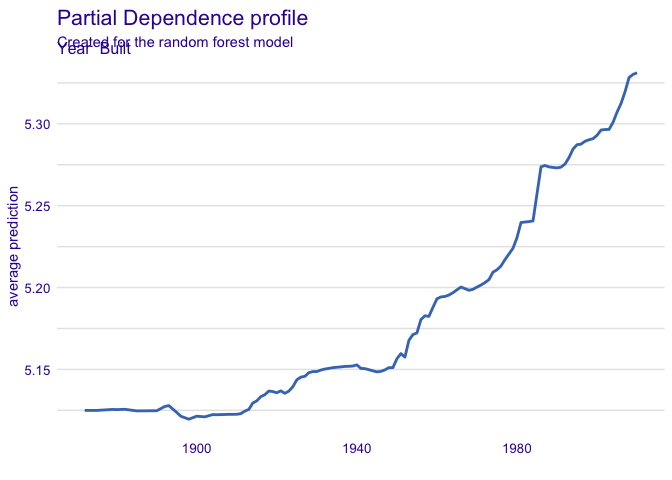
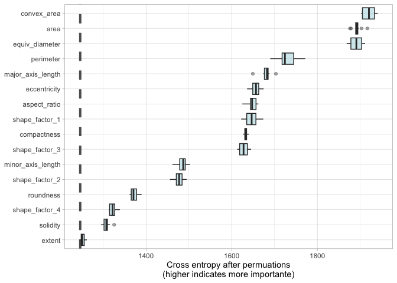

-   [Setup](#setup)
-   [Models of Explanations](#models-of-explanations)
-   [Software for model explanations](#software-for-model-explanations)
-   [Local Explanations](#local-explanations)
-   [Global Explanations](#global-explanations)
-   [Building Global Explanations from Local
    explantion](#building-global-explanations-from-local-explantion)
-   [Back to Beans](#back-to-beans)
-   [Reference](#reference)

## Setup

Fitting two models (same code from [chapter
10](./chapter10_resamplingForPerformance.md))

    # put rnotbook in the same workdir
    knitr::opts_knit$set(root.dir = normalizePath(rprojroot::find_rstudio_root_file())) 

    library(tidymodels)

    ## ── Attaching packages ────────────────────────────────────── tidymodels 1.1.1 ──

    ## ✔ broom        1.0.5     ✔ recipes      1.0.9
    ## ✔ dials        1.2.0     ✔ rsample      1.2.0
    ## ✔ dplyr        1.1.4     ✔ tibble       3.2.1
    ## ✔ ggplot2      3.4.4     ✔ tidyr        1.3.0
    ## ✔ infer        1.0.5     ✔ tune         1.1.2
    ## ✔ modeldata    1.2.0     ✔ workflows    1.1.3
    ## ✔ parsnip      1.1.1     ✔ workflowsets 1.0.1
    ## ✔ purrr        1.0.2     ✔ yardstick    1.2.0

    ## ── Conflicts ───────────────────────────────────────── tidymodels_conflicts() ──
    ## ✖ purrr::discard() masks scales::discard()
    ## ✖ dplyr::filter()  masks stats::filter()
    ## ✖ dplyr::lag()     masks stats::lag()
    ## ✖ recipes::step()  masks stats::step()
    ## • Search for functions across packages at https://www.tidymodels.org/find/

    data(ames)
    ames <- mutate(ames, Sale_Price = log10(Sale_Price))

    set.seed(502)
    ames_split <- initial_split(ames, prop = 0.80, strata = Sale_Price)
    ames_train <- training(ames_split)
    ames_test  <-  testing(ames_split)

    ames_rec <- 
      recipe(Sale_Price ~ Neighborhood + Gr_Liv_Area + Year_Built + Bldg_Type + 
               Latitude + Longitude, data = ames_train) %>%
      step_log(Gr_Liv_Area, base = 10) %>% 
      step_other(Neighborhood, threshold = 0.01) %>% 
      step_dummy(all_nominal_predictors()) %>% 
      step_interact( ~ Gr_Liv_Area:starts_with("Bldg_Type_") ) %>% 
      step_ns(Latitude, Longitude, deg_free = 20)
      
    lm_model <- linear_reg() %>% set_engine("lm")

    lm_wflow <- 
      workflow() %>% 
      add_model(lm_model) %>% 
      add_recipe(ames_rec)

    lm_fit <- fit(lm_wflow, ames_train)

    rf_model <- 
      rand_forest(trees=1000) |> 
      set_engine("ranger") |> 
      set_mode("regression")

    rf_model

    ## Random Forest Model Specification (regression)
    ## 
    ## Main Arguments:
    ##   trees = 1000
    ## 
    ## Computational engine: ranger

    rf_wflow <- 
      workflow() |> 
      add_formula(
        Sale_Price ~ Neighborhood + Gr_Liv_Area + Year_Built + Bldg_Type + Latitude + Longitude) |> 
      add_model(rf_model
      )

    rf_wflow

    ## ══ Workflow ════════════════════════════════════════════════════════════════════
    ## Preprocessor: Formula
    ## Model: rand_forest()
    ## 
    ## ── Preprocessor ────────────────────────────────────────────────────────────────
    ## Sale_Price ~ Neighborhood + Gr_Liv_Area + Year_Built + Bldg_Type + 
    ##     Latitude + Longitude
    ## 
    ## ── Model ───────────────────────────────────────────────────────────────────────
    ## Random Forest Model Specification (regression)
    ## 
    ## Main Arguments:
    ##   trees = 1000
    ## 
    ## Computational engine: ranger

    rf_fit <- rf_wflow |> fit(data=ames_train)
    rf_fit

    ## ══ Workflow [trained] ══════════════════════════════════════════════════════════
    ## Preprocessor: Formula
    ## Model: rand_forest()
    ## 
    ## ── Preprocessor ────────────────────────────────────────────────────────────────
    ## Sale_Price ~ Neighborhood + Gr_Liv_Area + Year_Built + Bldg_Type + 
    ##     Latitude + Longitude
    ## 
    ## ── Model ───────────────────────────────────────────────────────────────────────
    ## Ranger result
    ## 
    ## Call:
    ##  ranger::ranger(x = maybe_data_frame(x), y = y, num.trees = ~1000,      num.threads = 1, verbose = FALSE, seed = sample.int(10^5,          1)) 
    ## 
    ## Type:                             Regression 
    ## Number of trees:                  1000 
    ## Sample size:                      2342 
    ## Number of independent variables:  6 
    ## Mtry:                             2 
    ## Target node size:                 5 
    ## Variable importance mode:         none 
    ## Splitrule:                        variance 
    ## OOB prediction error (MSE):       0.005235612 
    ## R squared (OOB):                  0.8306539

## Models of Explanations

> There are two types of model explanations, *global* and *local*.
> *Global* model explanations provide an overall understanding
> aggregated over a whole set of observations; *local* model
> explanations provide information about a prediction for a single
> observation.

## Software for model explanations

Tidymodels framework does not itself contain software for model
explanations, supplementary R packagens can do the job:

-   `vip` functions when we want to use *model-based* methods that take
    advantage of model strucutre (and are often faster)
-   `DALEX` functions when we want to use *model-agnostic* methods that
    can be applied to any model.

Let’s get the model fitted in chapter 10 to use as cases to explain

    lm_pred <- lm_fit |> 
      predict(ames_test) |> 
      bind_cols(ames_test |> select(Sale_Price) |> mutate(model="lm+interactions"))

    rf_pred <- rf_fit |> 
      predict(ames_test) |> 
      bind_cols(ames_test |> select(Sale_Price) |> mutate(model="random forest"))

    bind_rows(lm_pred, rf_pred) |> 
      ggplot(aes(x=Sale_Price, y=.pred, color=model)) +
      geom_point(alpha=.5) +
      geom_abline(lty="dashed", color="gray50") +
      facet_wrap(~model) +
      coord_obs_pred() +
      theme_light() +
      theme(legend.position = "none")

Let’s build a *model-agnostic* explainers for both methods. We’ll use
`DALEXtra` add-on package for `DALEX`, which provides support for
tidymodels. To compute any kind of model explanation, global or local,
using DALEX, we first prepare the appropriate data and then create an
explainer for each model:

    library(DALEXtra)

    ## Loading required package: DALEX

    ## Welcome to DALEX (version: 2.4.3).
    ## Find examples and detailed introduction at: http://ema.drwhy.ai/
    ## Additional features will be available after installation of: ggpubr.
    ## Use 'install_dependencies()' to get all suggested dependencies

    ## 
    ## Attaching package: 'DALEX'

    ## The following object is masked from 'package:dplyr':
    ## 
    ##     explain

    vip_features <- c("Neighborhood", "Gr_Liv_Area", "Year_Built", "Bldg_Type", "Latitude", "Longitude")

    vip_train <- 
      ames_train |> 
      select(all_of(vip_features)) 

    explainer_lm <-
      explain_tidymodels(
        lm_fit, 
        data=vip_train,
        y=ames_train$Sale_Price, 
        label="lm + interactions",
        verbose=F
      )

    explainer_rf <-
      explain_tidymodels(
        rf_fit, 
        data=vip_train,
        y=ames_train$Sale_Price, 
        label="random forest",
        verbose=F
      )

> A linear model is typically straightforward to interpret and explain;
> you may not often find yourself using separate model explanation
> algorithms for a linear model. However, it can sometimes be difficult
> to understand or explain the predictions of even a linear model once
> it has splines and interaction terms!

Dealing with significant feature engineering transformations during
model explainability highlights some options we have (or sometimes,
ambiguity in such analyses). We can quantify global or local model
explanations either in terms of:

-   *original*, basic predictors as they existed without significant
    feature engineering transformations, or
-   *derived features*, such as those created via dimensionality
    reduction (Chapter 16) or interactions and spline terms, as in this
    example.

## Local Explanations

Local model explanations provide information about a prediction for a
sinlge observation. Let’s consider an old suplex in the North Ames
neighborhood:

    duplex <- vip_train[120,]
    duplex

    ## # A tibble: 1 × 6
    ##   Neighborhood Gr_Liv_Area Year_Built Bldg_Type Latitude Longitude
    ##   <fct>              <int>      <int> <fct>        <dbl>     <dbl>
    ## 1 North_Ames          1040       1949 Duplex        42.0     -93.6

There are multiple possible approaches to understanding why a model
predicts a given price for this duplex.

One is a break-down explanation with `DALEX` function `predict_parts()`.
It computes how contributions attributed to individual features change
the mean model’s prediction for a particular observation:

    lm_breakdown <- predict_parts(
      explainer = explainer_lm, 
      new_observation = duplex
    )

    lm_breakdown

    ##                                              contribution
    ## lm + interactions: intercept                        5.221
    ## lm + interactions: Gr_Liv_Area = 1040              -0.082
    ## lm + interactions: Bldg_Type = Duplex              -0.049
    ## lm + interactions: Longitude = -93.608903          -0.043
    ## lm + interactions: Year_Built = 1949               -0.039
    ## lm + interactions: Latitude = 42.035841            -0.007
    ## lm + interactions: Neighborhood = North_Ames        0.001
    ## lm + interactions: prediction                       5.002

Since this linear model was trained using spline terms for `latitude`
and `longitude`, the contribution to price for `Longitude` shown here
combines the effects of all of its individual spline terms. The
contribution is in terms of the original `Longitude` feature, not the
derived spline features.

The most important features are slightly different for the random forest
model, with the size, age, and duplex status being most important:

    rf_breakdown <- predict_parts(
      explainer = explainer_rf,
      new_observation = duplex
    )

    rf_breakdown

    ##                                          contribution
    ## random forest: intercept                        5.221
    ## random forest: Year_Built = 1949               -0.076
    ## random forest: Gr_Liv_Area = 1040              -0.075
    ## random forest: Bldg_Type = Duplex              -0.025
    ## random forest: Longitude = -93.608903          -0.043
    ## random forest: Latitude = 42.035841            -0.030
    ## random forest: Neighborhood = North_Ames       -0.002
    ## random forest: prediction                       4.969

> Model break-down explanations like these depend on the order of the
> features

If we choose the `order` for the random forest model explanation to be
the same as the default for the linear model (chosen via heuristic), we
can change the relative importance of the features:

    predict_parts(
      explainer = explainer_rf,
      new_observation = duplex, 
      order = lm_breakdown$variable_name
    )

    ##                                          contribution
    ## random forest: intercept                        5.221
    ## random forest: Gr_Liv_Area = 1040              -0.075
    ## random forest: Bldg_Type = Duplex              -0.018
    ## random forest: Longitude = -93.608903          -0.024
    ## random forest: Year_Built = 1949               -0.102
    ## random forest: Latitude = 42.035841            -0.030
    ## random forest: Neighborhood = North_Ames       -0.002
    ## random forest: prediction                       4.969

We can use the fact that these break-down explanations change based on
order to compute the most important features over all (or many) possible
orderings. This is the idea behind `Shapley Additive Explanations`,
where the average contributions of features are computed under different
combinations or “coalitions” of feature orderings. Let’s compute SHAP
attributions for our duplex, using `B = 20` random orderings:

    set.seed(1801) 
    shap_duplex <- 
      predict_parts(
        explainer = explainer_rf,
        new_observation = duplex, 
        type="shap",
        B=20
      )

    shap_duplex

    ##                                                   min           q1
    ## random forest: Bldg_Type = Duplex        -0.054635341 -0.054635341
    ## random forest: Gr_Liv_Area = 1040        -0.087038766 -0.079412806
    ## random forest: Latitude = 42.04          -0.033659927 -0.019881963
    ## random forest: Longitude = -93.61        -0.049390367 -0.041803920
    ## random forest: Neighborhood = North_Ames -0.004953282 -0.002031669
    ## random forest: Year_Built = 1949         -0.122560126 -0.099058355
    ##                                                 median         mean
    ## random forest: Bldg_Type = Duplex        -0.0296404225 -0.034746904
    ## random forest: Gr_Liv_Area = 1040        -0.0747947403 -0.075820143
    ## random forest: Latitude = 42.04          -0.0132505376 -0.015918258
    ## random forest: Longitude = -93.61        -0.0391741821 -0.034504251
    ## random forest: Neighborhood = North_Ames -0.0006536407  0.003597277
    ## random forest: Year_Built = 1949         -0.0948255079 -0.093912978
    ##                                                    q3          max
    ## random forest: Bldg_Type = Duplex        -0.024844153 -0.018208471
    ## random forest: Gr_Liv_Area = 1040        -0.071529019 -0.067636225
    ## random forest: Latitude = 42.04          -0.008781406 -0.004187129
    ## random forest: Longitude = -93.61        -0.021643775 -0.021525983
    ## random forest: Neighborhood = North_Ames  0.005948982  0.022622259
    ## random forest: Year_Built = 1949         -0.080272588 -0.075914103

    # autoplot
    plot(shap_duplex)

    #  manually
    shap_duplex |> as_tibble()

    ## # A tibble: 126 × 7
    ##    variable          contribution variable_name variable_value  sign label     B
    ##    <chr>                    <dbl> <chr>         <chr>          <dbl> <chr> <dbl>
    ##  1 Bldg_Type = Dupl…     -0.0347  Bldg_Type     Duplex            -1 rand…     0
    ##  2 Gr_Liv_Area = 10…     -0.0758  Gr_Liv_Area   1040              -1 rand…     0
    ##  3 Latitude = 42.04      -0.0159  Latitude      42.04             -1 rand…     0
    ##  4 Longitude = -93.…     -0.0345  Longitude     -93.61            -1 rand…     0
    ##  5 Neighborhood = N…      0.00360 Neighborhood  North_Ames         1 rand…     0
    ##  6 Year_Built = 1949     -0.0939  Year_Built    1949              -1 rand…     0
    ##  7 Gr_Liv_Area = 10…     -0.0748  Gr_Liv_Area   1040              -1 rand…     1
    ##  8 Latitude = 42.04      -0.0134  Latitude      42.04             -1 rand…     1
    ##  9 Year_Built = 1949     -0.0893  Year_Built    1949              -1 rand…     1
    ## 10 Longitude = -93.…     -0.0418  Longitude     -93.61            -1 rand…     1
    ## # ℹ 116 more rows

    library(forcats)
    shap_duplex |>
      group_by(variable) |> 
      mutate(mean_val = mean(contribution)) |> 
      ungroup() |> 
      mutate(variable = fct_reorder(variable, abs(mean_val))) |> 
      ggplot(aes(contribution, variable, fill=mean_val>0)) +
      geom_col(data=~distinct(., variable, mean_val),
               aes(mean_val, variable), 
               alpha=.5) +
      geom_boxplot(width=0.5) +
      scale_fill_viridis_d() +
      labs(y=NULL) +
      theme_light() +
      theme(legend.position = "none")

What about a different observation in our data set? Let’s look at a
larger, newer one-family home in the Gilbert neighborhood:

    big_house <- vip_train[1269,]
    big_house

    ## # A tibble: 1 × 6
    ##   Neighborhood Gr_Liv_Area Year_Built Bldg_Type Latitude Longitude
    ##   <fct>              <int>      <int> <fct>        <dbl>     <dbl>
    ## 1 Gilbert             2267       2002 OneFam        42.1     -93.6

    set.seed(1802) 
    shap_house <- 
      predict_parts(
        explainer = explainer_rf,
        new_observation = big_house, 
        type="shap",
        B=20
      )

    shap_house

    ##                                                 min            q1       median
    ## random forest: Bldg_Type = OneFam     -8.513695e-05  0.0003115125  0.002563429
    ## random forest: Gr_Liv_Area = 2267      7.225981e-02  0.0977985179  0.102871402
    ## random forest: Latitude = 42.06       -3.817273e-02 -0.0088406405  0.010492345
    ## random forest: Longitude = -93.64     -6.136852e-02 -0.0297883137 -0.003496849
    ## random forest: Neighborhood = Gilbert -4.441021e-02 -0.0226682973 -0.010650998
    ## random forest: Year_Built = 2002      -2.764069e-04  0.0037855646  0.053829320
    ##                                               mean           q3          max
    ## random forest: Bldg_Type = OneFam      0.002563429  0.004743527  0.005678158
    ## random forest: Gr_Liv_Area = 2267      0.099183657  0.104426668  0.123653571
    ## random forest: Latitude = 42.06        0.008626883  0.034658845  0.038141551
    ## random forest: Longitude = -93.64     -0.011320223  0.010346095  0.028271600
    ## random forest: Neighborhood = Gilbert -0.016109486 -0.009471823 -0.009471823
    ## random forest: Year_Built = 2002       0.039526378  0.066079224  0.072294955

Unlike the duplex, the size and age of this house contribute to its
price being higher.

    shap_house |>
      group_by(variable) |> 
      mutate(mean_val = mean(contribution)) |> 
      ungroup() |> 
      mutate(variable = fct_reorder(variable, abs(mean_val))) |> 
      ggplot(aes(contribution, variable, fill=mean_val>0)) +
      geom_col(data=~distinct(., variable, mean_val),
               aes(mean_val, variable), 
               alpha=.5) +
      geom_boxplot(width=0.5) +
      scale_fill_viridis_d() +
      labs(y=NULL) +
      theme_light() +
      theme(legend.position = "none")

## Global Explanations

Global model explanations, also called global feature importance or
variable importance, help us understand which features are most
important in driving the predictions of the linear and random forest
models overall, aggregated over the whole training set.

> One way to compute variable importance is to permute the features
> (Breiman 2001a). We can permute or shuffle the values of a feature,
> predict from the model, and then measure how much worse the model fits
> the data compared to before shuffling.

If shuffling a column causes a large degradation in model performance,
it is important; if shuffling a column’s values doesn’t make much
difference to how the model performs, it must not be an important
variable. Using `DALEX`, we compute this kind of variable importance via
the `model_parts()` function.

    set.seed(1803) 
    vip_lm <- model_parts(explainer_lm, loss_function = loss_root_mean_square)
    set.seed(1804)
    vip_rf <- model_parts(explainer_rf, loss_function = loss_root_mean_square)

Again, we could use de default plot method from `DALEX` by calling
`plot(vip_lm, vip_rf)`…

    plot(vip_lm, vip_rf)

…but underlying data is available for exploration, analysis, and
plotting. Let’s create a function for plotting.

    ggplot_imp <- function(...) {
      obj <- list(...)
      metric_name <- attr(obj[[1]], "loss_name")
      metric_lab <- paste(metric_name, "after permuations\n(higher indicates more importante)")
      
      full_vip <- bind_rows(obj) |> 
        filter(variable != "_baseline_")
      
      perm_vals <- full_vip |> 
        filter(variable == "_full_model_") |> 
        group_by(label) |> 
        summarise(dropouts_loss = mean(dropout_loss))
      
      p <- full_vip |> 
        filter(variable != "_full_model_") |> 
        mutate(variable = fct_reorder(variable, dropout_loss)) |> 
        ggplot(aes(dropout_loss, variable))
      
      if(length(obj)>1) {
        p <- p +
          facet_wrap(vars(label)) +
          geom_vline(data=perm_vals, aes(xintercept=dropouts_loss, color=label),
                     linewidth=1.4, lty="dashed", alpha=0.7) +
          geom_boxplot(aes(color=label, fill=label), alpha=.2)
      } else {
        p <- p +
          geom_vline(data=perm_vals, aes(xintercept=dropouts_loss),
                     linewidth=1.4, lty="dashed", alpha=0.7) +
          geom_boxplot(fill="#91CBD765", alpha=.4)
      }
      
      p +
        theme_light() +
        theme(legend.position = "none") +
        labs(
          x = metric_lab,
          y = NULL, fill=NULL, color=NULL)
    }

    ggplot_imp(vip_lm, vip_rf)

## Building Global Explanations from Local explantion

So far in this chapter, we have focused on *local model explanations*
for a single observation (via Shapley additive explanations) and *global
model explanations* for a data set as a whole (via permuting features).
It is also possible to build *global model explanations* by aggregating
*local model explanations*, as with *partial dependence profiles*.

> Partial dependence profiles show how the expected value of a model
> prediction, like the predicted price of a home in Ames, changes as a
> function of a feature, like the age or gross living area.

One way to build such a profile is by aggregating or averaging profiles
for individual observations. We can compute such individual profiles
(for 500 of the observations in our training set) and then aggregate
them using the `DALEX` function `model_profile()`:

    set.seed(1805)
    pdp_age <- model_profile(explainer_rf, N=500, variables = "Year_Built")

    pdp_age

    ## Top profiles    : 
    ##      _vname_       _label_  _x_   _yhat_ _ids_
    ## 1 Year_Built random forest 1872 5.124954     0
    ## 2 Year_Built random forest 1875 5.124954     0
    ## 3 Year_Built random forest 1879 5.125543     0
    ## 4 Year_Built random forest 1880 5.125444     0
    ## 5 Year_Built random forest 1882 5.125641     0
    ## 6 Year_Built random forest 1885 5.124652     0

    plot(pdp_age)

Using this function we can see the nonlinear behavior of the random
forest model.

    ggplot_pdp <- function(obj, x){

      p <- 
        as_tibble(obj$agr_profiles) |>
        mutate(`_label_` = stringr::str_remove(`_label_`, "^[^_]*_")) |>
        ggplot(aes(`_x_`, `_yhat_`)) +
        geom_line(
          data = as_tibble(obj$cp_profiles),
          aes(x = {{x}}, group = `_ids_`),
          linewidth = 0.5,
          alpha = 0.05,
          color = "gray50"
        )
      
      num_colors <- n_distinct(obj$agr_profiles$`_label_`)
      
      if (num_colors > 1) {
        p <- p + geom_line(aes(color = `_label_`),
                           linewidth = 1.2,
                           alpha = 0.8)
      } else {
        p <- p + geom_line(
          color = "midnightblue",
          linewidth = 1.2,
          alpha = 0.8
        )
      }
      
      p
        
    }

    ggplot_pdp(pdp_age, Year_Built) +
      labs(x = "Year_Built", y="Sale Price (log)",
           color=NULL) +
      theme_light()

Sale price for houses built in different years is mostly flat, with a
modest rise after about 1960. Partial dependence profiles can be
computed for any other feature in the model, and also for groups in the
data, such as `Bldg_Type`.

    set.seed(1806)
    # how Gr_Liv_Area influences Sale_Price per Bldg_Type group
    pdp_liv <- model_profile(explainer_rf, N=1000, variables="Gr_Liv_Area",
                             groups="Bldg_Type")

    ## Warning in FUN(X[[i]], ...): Variable: < Gr_Liv_Area > has more than 201 unique
    ## values and all of them will be used as variable splits in calculating variable
    ## profiles. Use the `variable_splits` parameter to mannualy change this
    ## behaviour. If you believe this warning to be a false positive, raise issue at
    ## <https://github.com/ModelOriented/ingredients/issues>.

    # default
    plot(pdp_liv) +
      scale_x_log10()

    # manually plot
    ggplot_pdp(pdp_liv, Gr_Liv_Area) +
      scale_x_log10() +
      scale_color_brewer(palette="Dark2") +
      labs(x="Gross living area",
           y="Sale Price (log)",
           color=NULL) +
      theme_light()

We see that sale price increases the most between about 1000 and 3000
square feet of living area, and that differente home types mostly
exhibit similar increasing trends in price with more living space.

    as_tibble(pdp_liv$agr_profiles) |> 
      mutate(Bldg_Type = stringr::str_remove(`_label_`, "random forest_")) |> 
      ggplot(aes(`_x_`, `_yhat_`, color=Bldg_Type)) +
      geom_line(data=as_tibble(pdp_liv$cp_profiles),
                aes(x=Gr_Liv_Area, group=`_ids_`),
                linewidth=0.5, alpha=0.1, color="gray50") +
      geom_line(linewidth=1.2, alpha=0.8, show.legend = FALSE) +
      scale_x_log10() +
      facet_wrap(~Bldg_Type) +
      scale_color_brewer(palette="Dark2") +
      labs(x="Gross living area",
           y="Sale Price (log)",
           color=NULL) +
      theme_light()

There is no one correct approach for building model explanations, and
the options outlined in this chapter are not exhaustive. We have
highlighted good options for explanations at both the individual and
global level, as well as how to bridge from one to the other.

## Back to Beans

We can use the same approach in [the beans
models](./chapter16_dim_reduction.md) outlined throughout this chapter
to create a model-agnostic explainer on the dim reduction and computy
global model explanations via `model_parts()`:

Recovering the best model fitted

    # dataset
    library(beans)
    data("beans")

    set.seed(1806)
    bean_split <- initial_split(beans, strata = class)
    bean_train <- training(bean_split)

    # bestNormalize::step_orderNorm() used in the best recipe
    library(bestNormalize)

    # recovering workset flow results
    bean_res <- readRDS("./tmwr/chp16_bean_res.rds") 

    bean_res |> 
      rank_results(select_best = T) |> 
      slice_head(n=5) |> 
      select(rank, wflow_id, .metric, mean)

    ## # A tibble: 5 × 4
    ##    rank wflow_id  .metric  mean
    ##   <int> <chr>     <chr>   <dbl>
    ## 1     1 pca_mlp   roc_auc 0.997
    ## 2     2 pca_rda   roc_auc 0.997
    ## 3     3 pls_mlp   roc_auc 0.996
    ## 4     4 pls_rda   roc_auc 0.996
    ## 5     5 basic_fda roc_auc 0.995

    best_model_method <- bean_res |> 
      rank_results(select_best = T) |> 
      slice_head(n=1) |> 
      pull(wflow_id)

    best_model_method

    ## [1] "pca_mlp"

    best_method_res <- bean_res |> 
      extract_workflow(best_model_method) |> 
      finalize_workflow(
        bean_res |> 
          extract_workflow_set_result(best_model_method) |> 
          select_best(metric="roc_auc")
      ) |> 
      last_fit(split=bean_split , metrics=metric_set(roc_auc))

    best_method_res |>
      collect_metrics()

    ## # A tibble: 1 × 4
    ##   .metric .estimator .estimate .config             
    ##   <chr>   <chr>          <dbl> <chr>               
    ## 1 roc_auc hand_till      0.996 Preprocessor1_Model1

    pca_mlp_fit <- best_method_res |> 
      extract_workflow()

Evaluationg feature importance

    set.seed(1807)
    vip_beans <- 
      explain_tidymodels(
        pca_mlp_fit, 
        data=bean_train |> select(-class),
        y=bean_train$class,
        label="MLP",
        verbose=F
      ) |> 
      model_parts()

    vip_beans

    ##             variable mean_dropout_loss label
    ## 1       _full_model_          1246.220   MLP
    ## 2             extent          1251.838   MLP
    ## 3           solidity          1307.194   MLP
    ## 4     shape_factor_4          1321.860   MLP
    ## 5          roundness          1372.312   MLP
    ## 6     shape_factor_2          1477.100   MLP
    ## 7  minor_axis_length          1484.966   MLP
    ## 8     shape_factor_3          1627.545   MLP
    ## 9        compactness          1633.034   MLP
    ## 10    shape_factor_1          1646.895   MLP
    ## 11      aspect_ratio          1647.985   MLP
    ## 12      eccentricity          1656.583   MLP
    ## 13 major_axis_length          1680.092   MLP
    ## 14         perimeter          1730.457   MLP
    ## 15    equiv_diameter          1890.925   MLP
    ## 16              area          1892.364   MLP
    ## 17       convex_area          1920.270   MLP
    ## 18        _baseline_          1986.094   MLP

    ggplot_imp(vip_beans)

> The measures of global feature importance that we see incorporate the
> effects of all of the PCA components, but in terms of the original
> variables.

# Reference

All code and text came from Max Kuhn and Julia Silge\`s book [Tidy
Modeling with R](https://www.tmwr.org/explain).
