-   [Equivocal Results](#equivocal-results)
-   [Determining model applicability](#determining-model-applicability)
    -   [Chicago Dataset](#chicago-dataset)
-   [Reference](#reference)

    # put rnotbook in the same workdir
    knitr::opts_knit$set(root.dir = normalizePath(rprojroot::find_rstudio_root_file())) 

This chapter discusses two methods for quantifying the potential quality
of a prediction:

-   **Equivocal zones** use the predicted values to alert the user that
    results may be suspect.
-   **Applicability** uses the predictors to measure the amount of
    extrapolation (if any) for new samples.

## Equivocal Results

> In some cases, the amount of uncertainty associated with a prediction
> is too high to be trusted.

If a model result indicated that you had a 51% chance of having
contracted COVID-19, it would be natural to view the diagnosis with some
skepticism. n fact, regulatory bodies often require many medical
diagnostics to have an *equivocal zone*. This zone is a range of results
in which the prediction should not be reported to patients

Simulate classification data and two class prediction, the true model is
a logistic regression model with the equation:

*l**o**g**i**t*(*p*) =  − 1 − 2*x* − *x**ˆ*2/5 − 2*y**ˆ*2
The two predictors follows a bivariate normal distribution with a
correlation of 0.7. We’ll create a training set of 200 samples and a
test set of 50:

    library(tidyverse)

    ## ── Attaching core tidyverse packages ──────────────────────── tidyverse 2.0.0 ──
    ## ✔ dplyr     1.1.4     ✔ readr     2.1.4
    ## ✔ forcats   1.0.0     ✔ stringr   1.5.1
    ## ✔ ggplot2   3.4.4     ✔ tibble    3.2.1
    ## ✔ lubridate 1.9.3     ✔ tidyr     1.3.0
    ## ✔ purrr     1.0.2     
    ## ── Conflicts ────────────────────────────────────────── tidyverse_conflicts() ──
    ## ✖ dplyr::filter() masks stats::filter()
    ## ✖ dplyr::lag()    masks stats::lag()
    ## ℹ Use the conflicted package (<http://conflicted.r-lib.org/>) to force all conflicts to become errors

    library(tidymodels) 

    ## ── Attaching packages ────────────────────────────────────── tidymodels 1.1.1 ──
    ## ✔ broom        1.0.5     ✔ rsample      1.2.0
    ## ✔ dials        1.2.0     ✔ tune         1.1.2
    ## ✔ infer        1.0.5     ✔ workflows    1.1.3
    ## ✔ modeldata    1.2.0     ✔ workflowsets 1.0.1
    ## ✔ parsnip      1.1.1     ✔ yardstick    1.2.0
    ## ✔ recipes      1.0.9     
    ## ── Conflicts ───────────────────────────────────────── tidymodels_conflicts() ──
    ## ✖ scales::discard() masks purrr::discard()
    ## ✖ dplyr::filter()   masks stats::filter()
    ## ✖ recipes::fixed()  masks stringr::fixed()
    ## ✖ dplyr::lag()      masks stats::lag()
    ## ✖ yardstick::spec() masks readr::spec()
    ## ✖ recipes::step()   masks stats::step()
    ## • Learn how to get started at https://www.tidymodels.org/start/

    simulate_two_classes <-
      function(n, error=1.0, eqn=quote(-1-2*x-0.2*x^2 + 2*y^2)) {
        sigma <- matrix(c(1,0.7,0.7,1), nrow=2, ncol=2)
        dat <- MASS::mvrnorm(n=n, mu=c(0,0), Sigma=sigma)
        colnames(dat) <- c("x", "y")
        cls <- paste0("class_", 1:2)
        dat <- 
          as_tibble(dat) |> 
          mutate(
            linear_pred = !!eqn, 
            linear_pred = linear_pred + rnorm(n, sd=error),
            prob = binomial()$linkinv(linear_pred),
            class = ifelse(prob>runif(n), cls[1], cls[2]),
            class = factor(class, levels=cls)
          )
        dplyr::select(dat, x, y, class)
      }

    set.seed(1901)
    training_set <- simulate_two_classes(200)
    testing_set <- simulate_two_classes(50)

We estimate a logistic regression model using Bayesian methods (using
the default Gaussian prior distributions for the parameters):

    two_class_mod <-
      logistic_reg() |> 
      set_engine("stan", seed=1902) |> 
      fit(class ~ . + I(x^2) + I(y^2), data = training_set) 

    two_class_mod

    ## parsnip model object
    ## 
    ## stan_glm
    ##  family:       binomial [logit]
    ##  formula:      class ~ . + I(x^2) + I(y^2)
    ##  observations: 200
    ##  predictors:   5
    ## ------
    ##             Median MAD_SD
    ## (Intercept)  1.2    0.3  
    ## x            2.0    0.4  
    ## y            0.2    0.3  
    ## I(x^2)       0.4    0.3  
    ## I(y^2)      -2.5    0.4  
    ## 
    ## ------
    ## * For help interpreting the printed output see ?print.stanreg
    ## * For info on the priors used see ?prior_summary.stanreg

    f <- function(x){sqrt((-1-2*x-0.2*x^2)/-2)}
    range <- seq(-3,3,.1)
    prob_field <- augment(two_class_mod, expand_grid(x=range, y=range))
    test_pred <- augment(two_class_mod, testing_set)

    prob_field |> 
      ggplot(aes(x,y,fill=.pred_class_1)) +
      geom_tile() +
      scale_fill_gradient2(low="orange", mid="white", high="#7777FF", midpoint = .5) +
      geom_function(fun=f, lty=2) +
      geom_function(fun=~(-f(.x)), lty=2) +
      geom_point(data=test_pred, aes(x, y, color=class, shape=.pred_class), size=3) + 
      scale_color_manual(values=c("#4444FF","darkorange")) +
      labs(fill="Prob of Class 1", color="True Value", shape="Prediction") +
      coord_fixed() +
      theme_light()

    ## Warning in sqrt((-1 - 2 * x - 0.2 * x^2)/-2): NaNs produced

    ## Warning: The following aesthetics were dropped during statistical transformation: fill
    ## ℹ This can happen when ggplot fails to infer the correct grouping structure in
    ##   the data.
    ## ℹ Did you forget to specify a `group` aesthetic or to convert a numerical
    ##   variable into a factor?

    ## Warning in sqrt((-1 - 2 * x - 0.2 * x^2)/-2): NaNs produced

    ## Warning: The following aesthetics were dropped during statistical transformation: fill
    ## ℹ This can happen when ggplot fails to infer the correct grouping structure in
    ##   the data.
    ## ℹ Did you forget to specify a `group` aesthetic or to convert a numerical
    ##   variable into a factor?

    ## Warning: Removed 42 rows containing missing values (`geom_function()`).
    ## Removed 42 rows containing missing values (`geom_function()`).

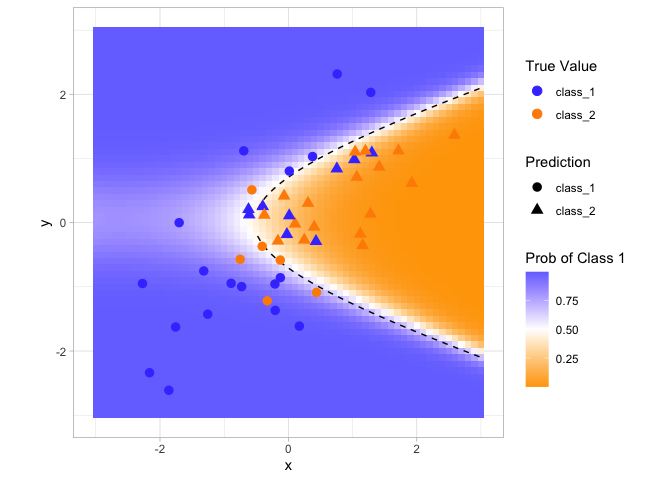

The data points closest to the class boundary are the most uncertain. If
their values changed slightly, their predicted class might change. One
simple method for disqualifying some results is to call them “equivocal”
if the values are within some range around 50% (or the appropriate
probability cutoff for a certain situation). Depending on the problem
the model is being applied to, this might indicate we should collect
another measurement or we require more information before a trustworthy
prediction is possible.

Let’s use the test set to determine the balance between improving
performance and having enough reportable results. The predictions are
created using:

    test_pred |> 
      head()

    ## # A tibble: 6 × 6
    ##   .pred_class .pred_class_1 .pred_class_2      x      y class  
    ##   <fct>               <dbl>         <dbl>  <dbl>  <dbl> <fct>  
    ## 1 class_2           0.0216          0.978  1.12  -0.176 class_2
    ## 2 class_1           0.513           0.487 -0.126 -0.582 class_2
    ## 3 class_2           0.00334         0.997  1.92   0.615 class_2
    ## 4 class_2           0.418           0.582 -0.400  0.252 class_1
    ## 5 class_2           0.144           0.856  1.30   1.09  class_1
    ## 6 class_2           0.00910         0.991  2.59   1.36  class_2

With tidymodels, the `probably` package contains functoins for equivocal
zones.

    library(probably)

    ## 
    ## Attaching package: 'probably'

    ## The following objects are masked from 'package:base':
    ## 
    ##     as.factor, as.ordered

    lvls <- levels(training_set$class)

    test_pred <- test_pred |> 
      mutate(.pred_with_eqz = make_two_class_pred(.pred_class_1, lvls, buffer=0.15))

    test_pred |> 
      count(.pred_with_eqz)

    ## # A tibble: 3 × 2
    ##   .pred_with_eqz     n
    ##       <clss_prd> <int>
    ## 1           [EQ]    10
    ## 2        class_1    19
    ## 3        class_2    21

> The notation \[EQ\] in this example is not a factor level but an
> attribute of that column.

The equivocal results are converted to NA and are not used in the
calculations that use the hard class predictions

    test_pred |> 
      conf_mat(class, .pred_class)

    ##           Truth
    ## Prediction class_1 class_2
    ##    class_1      18       6
    ##    class_2       9      17

    # Reportable Results Only
    test_pred |> 
      conf_mat(class, .pred_with_eqz)

    ##           Truth
    ## Prediction class_1 class_2
    ##    class_1      16       3
    ##    class_2       6      15

An `is_equivocal()` function is also available for filtering these rows
from the data.

Does the equivocal zone help improve accuracy?

    eq_zone_results <- function(buffer, data, lvls) {
      data <- 
        data |> 
        mutate(.pred_with_eqz = make_two_class_pred(.pred_class_1, lvls, buffer=buffer))
      acc <- data |> accuracy(class, .pred_with_eqz)
      rep_rate <- reportable_rate(data$.pred_with_eqz)
      tibble(accuracy=acc$.estimate, reportable=rep_rate, buffer=buffer)
    }

    seq(0, .1, length.out=40) |> 
      map_df(eq_zone_results, data=test_pred, lvls=lvls) |> 
      pivot_longer(c(-buffer), names_to="statistic", values_to="value") |> 
      ggplot(aes(x=buffer, y=value, lty=statistic)) +
      geom_step(linewidth=1.2, alpha=.8) +
      labs(x=NULL, y=NULL) +
      theme_light()

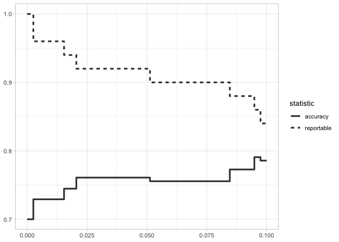

Accuracy improves by a few percentage points but at the cost of nearly
10% of predictions being unusable! The value of such a compromise
depends on how the model predictions will be used.

This analysis focused on using the predicted class probability to
disqualify points, since this is a fundamental measure of uncertainty in
classification models. A slightly better approach would be to use the
standard error of the class probability. Since we used a Bayesian model,
the probability estimates we found are actually the mean of the
posterior predictive distribution. In other words, the Bayesian model
gives us a distribution for the class probability. Measuring the
standard deviation of this distribution gives us a standard error of
prediction of the probability. In most cases, this value is directly
related to the mean class probability.

One important aspect of the standard error of prediction is that it
takes into account more than just the class probability. In cases where
there is significant extrapolation or aberrant predictor values, the
standard error might increase.

The benefit of using the standard error of prediction is that it might
also flag predictions that are problematic (as opposed to simply
uncertain).

One reason we used the Bayesian model is that it naturally estimates the
standard error of prediction; not many models can calculate this. For
our test set, using type = “pred\_int” will produce upper and lower
limits and the std\_error adds a column for that quantity. For 80%
intervals:

    test_pred <- test_pred |> 
      bind_cols(
        predict(two_class_mod, testing_set, type="pred_int", std_error=T)
      )

    test_pred |> 
      head()

    ## # A tibble: 6 × 12
    ##   .pred_class .pred_class_1 .pred_class_2      x      y class   .pred_with_eqz
    ##   <fct>               <dbl>         <dbl>  <dbl>  <dbl> <fct>       <clss_prd>
    ## 1 class_2           0.0216          0.978  1.12  -0.176 class_2        class_2
    ## 2 class_1           0.513           0.487 -0.126 -0.582 class_2           [EQ]
    ## 3 class_2           0.00334         0.997  1.92   0.615 class_2        class_2
    ## 4 class_2           0.418           0.582 -0.400  0.252 class_1           [EQ]
    ## 5 class_2           0.144           0.856  1.30   1.09  class_1        class_2
    ## 6 class_2           0.00910         0.991  2.59   1.36  class_2        class_2
    ## # ℹ 5 more variables: .pred_lower_class_1 <dbl>, .pred_upper_class_1 <dbl>,
    ## #   .pred_lower_class_2 <dbl>, .pred_upper_class_2 <dbl>, .std_error <dbl>

For our example where the model and data are well behaved, shows the
standard error of prediction across the space:

    range <- seq(-3,3,.1)

    std_field <-
      predict(
        two_class_mod,
        expand_grid(x = range, y = range),
        type = "pred_int",
        std_error = T
      ) |> 
      bind_cols(expand_grid(x = range, y = range))

    std_field |> 
      ggplot(aes(x,y,fill=.std_error)) +
      geom_tile() +
      scale_fill_gradient(low="white", high="pink") +
      geom_point(data=test_pred, aes(x, y, color=class, shape=.pred_class), size=3) + 
      scale_color_manual(values=c("#4444FF","orange")) +
      labs(fill="Std Error", color="True Value", shape="Prediction") +
      coord_fixed() +
      theme_light()

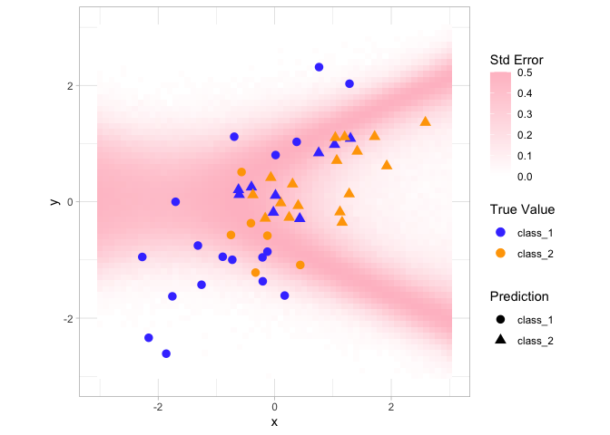

## Determining model applicability

Equivocal zones try to measure the reliability of a prediction based on
the model outputs. It may be that model statistics, such as the standard
error of prediction, cannot measure the impact of extrapolation, and so
we need another way to assess whether to trust a prediction and answer,
“Is our model applicable for predicting a specific data point?”

### Chicago Dataset

Let’s take the Chicago. The goal is to predict the number of customers
entering the Clark and Lake train station each day.

    library(modeldata)
    data(Chicago)

    Chicago <- Chicago |> select (ridership, date, one_of(stations))

    skimr::skim(Chicago)

<table>
<caption>Data summary</caption>
<tbody>
<tr class="odd">
<td style="text-align: left;">Name</td>
<td style="text-align: left;">Chicago</td>
</tr>
<tr class="even">
<td style="text-align: left;">Number of rows</td>
<td style="text-align: left;">5698</td>
</tr>
<tr class="odd">
<td style="text-align: left;">Number of columns</td>
<td style="text-align: left;">22</td>
</tr>
<tr class="even">
<td style="text-align: left;">_______________________</td>
<td style="text-align: left;"></td>
</tr>
<tr class="odd">
<td style="text-align: left;">Column type frequency:</td>
<td style="text-align: left;"></td>
</tr>
<tr class="even">
<td style="text-align: left;">Date</td>
<td style="text-align: left;">1</td>
</tr>
<tr class="odd">
<td style="text-align: left;">numeric</td>
<td style="text-align: left;">21</td>
</tr>
<tr class="even">
<td style="text-align: left;">________________________</td>
<td style="text-align: left;"></td>
</tr>
<tr class="odd">
<td style="text-align: left;">Group variables</td>
<td style="text-align: left;">None</td>
</tr>
</tbody>
</table>

Data summary

**Variable type: Date**

<table>
<colgroup>
<col style="width: 17%" />
<col style="width: 12%" />
<col style="width: 17%" />
<col style="width: 13%" />
<col style="width: 13%" />
<col style="width: 13%" />
<col style="width: 11%" />
</colgroup>
<thead>
<tr class="header">
<th style="text-align: left;">skim_variable</th>
<th style="text-align: right;">n_missing</th>
<th style="text-align: right;">complete_rate</th>
<th style="text-align: left;">min</th>
<th style="text-align: left;">max</th>
<th style="text-align: left;">median</th>
<th style="text-align: right;">n_unique</th>
</tr>
</thead>
<tbody>
<tr class="odd">
<td style="text-align: left;">date</td>
<td style="text-align: right;">0</td>
<td style="text-align: right;">1</td>
<td style="text-align: left;">2001-01-22</td>
<td style="text-align: left;">2016-08-28</td>
<td style="text-align: left;">2008-11-09</td>
<td style="text-align: right;">5698</td>
</tr>
</tbody>
</table>

**Variable type: numeric**

<table>
<colgroup>
<col style="width: 19%" />
<col style="width: 11%" />
<col style="width: 16%" />
<col style="width: 6%" />
<col style="width: 5%" />
<col style="width: 5%" />
<col style="width: 5%" />
<col style="width: 6%" />
<col style="width: 6%" />
<col style="width: 6%" />
<col style="width: 6%" />
</colgroup>
<thead>
<tr class="header">
<th style="text-align: left;">skim_variable</th>
<th style="text-align: right;">n_missing</th>
<th style="text-align: right;">complete_rate</th>
<th style="text-align: right;">mean</th>
<th style="text-align: right;">sd</th>
<th style="text-align: right;">p0</th>
<th style="text-align: right;">p25</th>
<th style="text-align: right;">p50</th>
<th style="text-align: right;">p75</th>
<th style="text-align: right;">p100</th>
<th style="text-align: left;">hist</th>
</tr>
</thead>
<tbody>
<tr class="odd">
<td style="text-align: left;">ridership</td>
<td style="text-align: right;">0</td>
<td style="text-align: right;">1</td>
<td style="text-align: right;">13.62</td>
<td style="text-align: right;">6.56</td>
<td style="text-align: right;">0.60</td>
<td style="text-align: right;">6.17</td>
<td style="text-align: right;">15.90</td>
<td style="text-align: right;">18.93</td>
<td style="text-align: right;">26.06</td>
<td style="text-align: left;">▅▂▃▇▁</td>
</tr>
<tr class="even">
<td style="text-align: left;">Austin</td>
<td style="text-align: right;">0</td>
<td style="text-align: right;">1</td>
<td style="text-align: right;">1.52</td>
<td style="text-align: right;">0.57</td>
<td style="text-align: right;">0.19</td>
<td style="text-align: right;">0.96</td>
<td style="text-align: right;">1.66</td>
<td style="text-align: right;">1.98</td>
<td style="text-align: right;">2.73</td>
<td style="text-align: left;">▂▅▅▇▂</td>
</tr>
<tr class="odd">
<td style="text-align: left;">Quincy_Wells</td>
<td style="text-align: right;">0</td>
<td style="text-align: right;">1</td>
<td style="text-align: right;">5.58</td>
<td style="text-align: right;">2.91</td>
<td style="text-align: right;">0.00</td>
<td style="text-align: right;">1.85</td>
<td style="text-align: right;">7.02</td>
<td style="text-align: right;">7.78</td>
<td style="text-align: right;">9.82</td>
<td style="text-align: left;">▅▁▁▇▅</td>
</tr>
<tr class="even">
<td style="text-align: left;">Belmont</td>
<td style="text-align: right;">0</td>
<td style="text-align: right;">1</td>
<td style="text-align: right;">4.09</td>
<td style="text-align: right;">1.26</td>
<td style="text-align: right;">0.71</td>
<td style="text-align: right;">2.90</td>
<td style="text-align: right;">4.47</td>
<td style="text-align: right;">4.94</td>
<td style="text-align: right;">6.42</td>
<td style="text-align: left;">▁▃▂▇▃</td>
</tr>
<tr class="odd">
<td style="text-align: left;">Archer_35th</td>
<td style="text-align: right;">0</td>
<td style="text-align: right;">1</td>
<td style="text-align: right;">2.21</td>
<td style="text-align: right;">0.87</td>
<td style="text-align: right;">0.20</td>
<td style="text-align: right;">1.41</td>
<td style="text-align: right;">2.43</td>
<td style="text-align: right;">2.88</td>
<td style="text-align: right;">4.86</td>
<td style="text-align: left;">▃▂▇▃▁</td>
</tr>
<tr class="even">
<td style="text-align: left;">Oak_Park</td>
<td style="text-align: right;">0</td>
<td style="text-align: right;">1</td>
<td style="text-align: right;">1.32</td>
<td style="text-align: right;">0.56</td>
<td style="text-align: right;">0.08</td>
<td style="text-align: right;">0.73</td>
<td style="text-align: right;">1.51</td>
<td style="text-align: right;">1.76</td>
<td style="text-align: right;">2.51</td>
<td style="text-align: left;">▃▂▃▇▁</td>
</tr>
<tr class="odd">
<td style="text-align: left;">Western</td>
<td style="text-align: right;">0</td>
<td style="text-align: right;">1</td>
<td style="text-align: right;">2.87</td>
<td style="text-align: right;">1.12</td>
<td style="text-align: right;">0.28</td>
<td style="text-align: right;">1.77</td>
<td style="text-align: right;">3.27</td>
<td style="text-align: right;">3.60</td>
<td style="text-align: right;">5.74</td>
<td style="text-align: left;">▃▃▇▅▁</td>
</tr>
<tr class="even">
<td style="text-align: left;">Clark_Lake</td>
<td style="text-align: right;">0</td>
<td style="text-align: right;">1</td>
<td style="text-align: right;">13.61</td>
<td style="text-align: right;">6.56</td>
<td style="text-align: right;">0.60</td>
<td style="text-align: right;">6.16</td>
<td style="text-align: right;">15.88</td>
<td style="text-align: right;">18.91</td>
<td style="text-align: right;">26.06</td>
<td style="text-align: left;">▅▂▃▇▁</td>
</tr>
<tr class="odd">
<td style="text-align: left;">Clinton</td>
<td style="text-align: right;">0</td>
<td style="text-align: right;">1</td>
<td style="text-align: right;">2.44</td>
<td style="text-align: right;">1.03</td>
<td style="text-align: right;">0.00</td>
<td style="text-align: right;">1.43</td>
<td style="text-align: right;">2.68</td>
<td style="text-align: right;">3.14</td>
<td style="text-align: right;">4.56</td>
<td style="text-align: left;">▃▅▆▇▃</td>
</tr>
<tr class="even">
<td style="text-align: left;">Merchandise_Mart</td>
<td style="text-align: right;">0</td>
<td style="text-align: right;">1</td>
<td style="text-align: right;">4.67</td>
<td style="text-align: right;">2.53</td>
<td style="text-align: right;">0.00</td>
<td style="text-align: right;">1.78</td>
<td style="text-align: right;">5.59</td>
<td style="text-align: right;">6.44</td>
<td style="text-align: right;">12.10</td>
<td style="text-align: left;">▅▁▇▂▁</td>
</tr>
<tr class="odd">
<td style="text-align: left;">Irving_Park</td>
<td style="text-align: right;">0</td>
<td style="text-align: right;">1</td>
<td style="text-align: right;">3.41</td>
<td style="text-align: right;">1.14</td>
<td style="text-align: right;">0.00</td>
<td style="text-align: right;">2.27</td>
<td style="text-align: right;">3.84</td>
<td style="text-align: right;">4.25</td>
<td style="text-align: right;">5.48</td>
<td style="text-align: left;">▁▃▂▇▃</td>
</tr>
<tr class="even">
<td style="text-align: left;">Washington_Wells</td>
<td style="text-align: right;">0</td>
<td style="text-align: right;">1</td>
<td style="text-align: right;">5.26</td>
<td style="text-align: right;">2.93</td>
<td style="text-align: right;">0.00</td>
<td style="text-align: right;">1.31</td>
<td style="text-align: right;">6.78</td>
<td style="text-align: right;">7.36</td>
<td style="text-align: right;">11.09</td>
<td style="text-align: left;">▅▁▂▇▁</td>
</tr>
<tr class="odd">
<td style="text-align: left;">Harlem</td>
<td style="text-align: right;">0</td>
<td style="text-align: right;">1</td>
<td style="text-align: right;">2.32</td>
<td style="text-align: right;">0.88</td>
<td style="text-align: right;">0.00</td>
<td style="text-align: right;">1.39</td>
<td style="text-align: right;">2.72</td>
<td style="text-align: right;">2.95</td>
<td style="text-align: right;">5.06</td>
<td style="text-align: left;">▂▃▇▃▁</td>
</tr>
<tr class="even">
<td style="text-align: left;">Monroe</td>
<td style="text-align: right;">0</td>
<td style="text-align: right;">1</td>
<td style="text-align: right;">4.84</td>
<td style="text-align: right;">2.37</td>
<td style="text-align: right;">0.00</td>
<td style="text-align: right;">2.20</td>
<td style="text-align: right;">5.69</td>
<td style="text-align: right;">6.31</td>
<td style="text-align: right;">12.30</td>
<td style="text-align: left;">▅▁▇▂▁</td>
</tr>
<tr class="odd">
<td style="text-align: left;">Polk</td>
<td style="text-align: right;">0</td>
<td style="text-align: right;">1</td>
<td style="text-align: right;">2.32</td>
<td style="text-align: right;">1.27</td>
<td style="text-align: right;">0.00</td>
<td style="text-align: right;">0.88</td>
<td style="text-align: right;">2.86</td>
<td style="text-align: right;">3.34</td>
<td style="text-align: right;">4.51</td>
<td style="text-align: left;">▅▁▂▇▂</td>
</tr>
<tr class="even">
<td style="text-align: left;">Ashland</td>
<td style="text-align: right;">0</td>
<td style="text-align: right;">1</td>
<td style="text-align: right;">1.25</td>
<td style="text-align: right;">0.42</td>
<td style="text-align: right;">0.15</td>
<td style="text-align: right;">0.86</td>
<td style="text-align: right;">1.39</td>
<td style="text-align: right;">1.57</td>
<td style="text-align: right;">2.28</td>
<td style="text-align: left;">▂▃▅▇▁</td>
</tr>
<tr class="odd">
<td style="text-align: left;">Kedzie</td>
<td style="text-align: right;">0</td>
<td style="text-align: right;">1</td>
<td style="text-align: right;">2.52</td>
<td style="text-align: right;">0.91</td>
<td style="text-align: right;">0.26</td>
<td style="text-align: right;">1.61</td>
<td style="text-align: right;">2.91</td>
<td style="text-align: right;">3.19</td>
<td style="text-align: right;">4.93</td>
<td style="text-align: left;">▃▃▇▇▁</td>
</tr>
<tr class="even">
<td style="text-align: left;">Addison</td>
<td style="text-align: right;">0</td>
<td style="text-align: right;">1</td>
<td style="text-align: right;">2.17</td>
<td style="text-align: right;">0.83</td>
<td style="text-align: right;">0.00</td>
<td style="text-align: right;">1.35</td>
<td style="text-align: right;">2.48</td>
<td style="text-align: right;">2.77</td>
<td style="text-align: right;">3.85</td>
<td style="text-align: left;">▁▃▂▇▁</td>
</tr>
<tr class="odd">
<td style="text-align: left;">Jefferson_Park</td>
<td style="text-align: right;">0</td>
<td style="text-align: right;">1</td>
<td style="text-align: right;">5.39</td>
<td style="text-align: right;">1.83</td>
<td style="text-align: right;">0.26</td>
<td style="text-align: right;">3.43</td>
<td style="text-align: right;">6.24</td>
<td style="text-align: right;">6.73</td>
<td style="text-align: right;">11.33</td>
<td style="text-align: left;">▂▃▇▂▁</td>
</tr>
<tr class="even">
<td style="text-align: left;">Montrose</td>
<td style="text-align: right;">0</td>
<td style="text-align: right;">1</td>
<td style="text-align: right;">1.71</td>
<td style="text-align: right;">0.66</td>
<td style="text-align: right;">0.00</td>
<td style="text-align: right;">1.06</td>
<td style="text-align: right;">1.91</td>
<td style="text-align: right;">2.13</td>
<td style="text-align: right;">3.09</td>
<td style="text-align: left;">▁▃▂▇▂</td>
</tr>
<tr class="odd">
<td style="text-align: left;">California</td>
<td style="text-align: right;">0</td>
<td style="text-align: right;">1</td>
<td style="text-align: right;">0.86</td>
<td style="text-align: right;">0.29</td>
<td style="text-align: right;">0.19</td>
<td style="text-align: right;">0.61</td>
<td style="text-align: right;">0.89</td>
<td style="text-align: right;">1.11</td>
<td style="text-align: right;">1.50</td>
<td style="text-align: left;">▃▃▆▇▁</td>
</tr>
</tbody>
</table>

    n <- nrow(Chicago)
    Chicago_train <- Chicago |> slice(1:(n-14)) 
    Chicago_test  <- Chicago |> slice((n-13):n)

The main predictors are lagged ridership data at different train
stations, including Clark and Lake, as well as the date.

The ridership predictors are highly correlated with one another. In the
following recipe, the date column is expanded into several new features,
and the ridership predictors are represented using partial least squares
(PLS) components

    base_recipe <- 
      recipe(ridership ~ ., data=Chicago_train) |> 
      step_date(date) |>  
      step_holiday(date, keep_original_cols = F) |> 
      step_dummy(all_nominal()) |> 
      step_zv(all_predictors()) |> 
      step_normalize(!!stations) |> 
      step_pls(!!stations, num_comp=10, outcome=vars(ridership))

    base_recipe |> 
      prep() |> 
      juice() |> 
      str()

    ## tibble [5,684 × 32] (S3: tbl_df/tbl/data.frame)
    ##  $ ridership        : num [1:5684] 15.7 15.8 15.9 15.9 15.4 ...
    ##  $ date_year        : int [1:5684] 2001 2001 2001 2001 2001 2001 2001 2001 2001 2001 ...
    ##  $ date_LaborDay    : int [1:5684] 0 0 0 0 0 0 0 0 0 0 ...
    ##  $ date_NewYearsDay : int [1:5684] 0 0 0 0 0 0 0 0 0 0 ...
    ##  $ date_ChristmasDay: int [1:5684] 0 0 0 0 0 0 0 0 0 0 ...
    ##  $ date_dow_Mon     : num [1:5684] 1 0 0 0 0 0 0 1 0 0 ...
    ##  $ date_dow_Tue     : num [1:5684] 0 1 0 0 0 0 0 0 1 0 ...
    ##  $ date_dow_Wed     : num [1:5684] 0 0 1 0 0 0 0 0 0 1 ...
    ##  $ date_dow_Thu     : num [1:5684] 0 0 0 1 0 0 0 0 0 0 ...
    ##  $ date_dow_Fri     : num [1:5684] 0 0 0 0 1 0 0 0 0 0 ...
    ##  $ date_dow_Sat     : num [1:5684] 0 0 0 0 0 1 0 0 0 0 ...
    ##  $ date_month_Feb   : num [1:5684] 0 0 0 0 0 0 0 0 0 0 ...
    ##  $ date_month_Mar   : num [1:5684] 0 0 0 0 0 0 0 0 0 0 ...
    ##  $ date_month_Apr   : num [1:5684] 0 0 0 0 0 0 0 0 0 0 ...
    ##  $ date_month_May   : num [1:5684] 0 0 0 0 0 0 0 0 0 0 ...
    ##  $ date_month_Jun   : num [1:5684] 0 0 0 0 0 0 0 0 0 0 ...
    ##  $ date_month_Jul   : num [1:5684] 0 0 0 0 0 0 0 0 0 0 ...
    ##  $ date_month_Aug   : num [1:5684] 0 0 0 0 0 0 0 0 0 0 ...
    ##  $ date_month_Sep   : num [1:5684] 0 0 0 0 0 0 0 0 0 0 ...
    ##  $ date_month_Oct   : num [1:5684] 0 0 0 0 0 0 0 0 0 0 ...
    ##  $ date_month_Nov   : num [1:5684] 0 0 0 0 0 0 0 0 0 0 ...
    ##  $ date_month_Dec   : num [1:5684] 0 0 0 0 0 0 0 0 0 0 ...
    ##  $ PLS01            : num [1:5684] 1.37 1.6 1.69 1.64 1.48 ...
    ##  $ PLS02            : num [1:5684] -0.104 -0.205 -0.235 -0.368 -0.359 ...
    ##  $ PLS03            : num [1:5684] -0.2429 -0.171 -0.1741 -0.2242 -0.0632 ...
    ##  $ PLS04            : num [1:5684] 0.975 1.006 0.929 0.904 0.867 ...
    ##  $ PLS05            : num [1:5684] -0.1066 -0.0606 -0.1228 -0.0338 -0.0917 ...
    ##  $ PLS06            : num [1:5684] -0.0798 -0.0948 -0.0743 -0.1119 -0.1239 ...
    ##  $ PLS07            : num [1:5684] -0.259 -0.224 -0.284 -0.221 -0.355 ...
    ##  $ PLS08            : num [1:5684] -0.141 -0.12 -0.251 -0.171 -0.212 ...
    ##  $ PLS09            : num [1:5684] 0.01474 0.07961 0.05055 -0.00964 -0.13523 ...
    ##  $ PLS10            : num [1:5684] -0.151 -0.0976 -0.0846 -0.0795 -0.0368 ...

    lm_spec <- 
      linear_reg() |> 
      set_engine("lm")

    lm_wflow <- 
      workflow() |> 
      add_recipe(base_recipe) |> 
      add_model(lm_spec)

    set.seed(1902)
    lm_fit <- fit(lm_wflow, data=Chicago_train)

    lm_fit

    ## ══ Workflow [trained] ══════════════════════════════════════════════════════════
    ## Preprocessor: Recipe
    ## Model: linear_reg()
    ## 
    ## ── Preprocessor ────────────────────────────────────────────────────────────────
    ## 6 Recipe Steps
    ## 
    ## • step_date()
    ## • step_holiday()
    ## • step_dummy()
    ## • step_zv()
    ## • step_normalize()
    ## • step_pls()
    ## 
    ## ── Model ───────────────────────────────────────────────────────────────────────
    ## 
    ## Call:
    ## stats::lm(formula = ..y ~ ., data = data)
    ## 
    ## Coefficients:
    ##       (Intercept)          date_year      date_LaborDay   date_NewYearsDay  
    ##        -565.47807            0.28305            0.84023          -10.02075  
    ## date_ChristmasDay       date_dow_Mon       date_dow_Tue       date_dow_Wed  
    ##         -11.36458           12.40655           13.74134           13.72771  
    ##      date_dow_Thu       date_dow_Fri       date_dow_Sat     date_month_Feb  
    ##          13.54271           12.97579            1.24774            0.41317  
    ##    date_month_Mar     date_month_Apr     date_month_May     date_month_Jun  
    ##           1.04684            1.03409            0.77438            2.00216  
    ##    date_month_Jul     date_month_Aug     date_month_Sep     date_month_Oct  
    ##           1.40989            1.67550            1.36925            2.07435  
    ##    date_month_Nov     date_month_Dec              PLS01              PLS02  
    ##           0.61037           -0.18234            0.05384            0.61437  
    ##             PLS03              PLS04              PLS05              PLS06  
    ##           0.97264           -0.81058            1.74295           -0.38935  
    ##             PLS07              PLS08              PLS09              PLS10  
    ##           0.04457           -0.35202            0.61638           -0.50822

How well do the data fit on the test set? We can `predict()` for the
test set to find both predictions and prediction intervals:

    res_test <-
      predict(lm_fit, Chicago_test) |> 
      bind_cols(
        predict(lm_fit, Chicago_test, type="pred_int"),
        Chicago_test
      )

    res_test |> 
      select(date, ridership, starts_with(".pred"))

    ## # A tibble: 14 × 5
    ##    date       ridership .pred .pred_lower .pred_upper
    ##    <date>         <dbl> <dbl>       <dbl>       <dbl>
    ##  1 2016-08-15     20.6  20.3        16.2         24.5
    ##  2 2016-08-16     21.0  21.3        17.1         25.4
    ##  3 2016-08-17     21.0  21.4        17.3         25.6
    ##  4 2016-08-18     21.3  21.4        17.3         25.5
    ##  5 2016-08-19     20.4  20.9        16.7         25.0
    ##  6 2016-08-20      6.22  7.52        3.34        11.7
    ##  7 2016-08-21      6.62  6.34        2.19        10.5
    ##  8 2016-08-22     21.2  20.2        16.1         24.3
    ##  9 2016-08-23     21.3  21.3        17.1         25.4
    ## 10 2016-08-24     20.7  21.5        17.4         25.6
    ## 11 2016-08-25     21.3  21.4        17.3         25.5
    ## 12 2016-08-26     20.5  20.7        16.5         24.8
    ## 13 2016-08-27      6.27  8.31        4.18        12.4
    ## 14 2016-08-28      5.63  7.18        3.05        11.3

    res_test |> 
      rmse(ridership, .pred)

    ## # A tibble: 1 × 3
    ##   .metric .estimator .estimate
    ##   <chr>   <chr>          <dbl>
    ## 1 rmse    standard       0.865

These are fairly good results. Figure 19.4 visualizes the predictions
along with 95% prediction intervals.

    res_test |> 
      mutate( weekday = lubridate::wday(date, label=T) ) |>
      ggplot(aes(x=date)) +
      geom_ribbon(aes(ymin=.pred_lower, ymax=.pred_upper),alpha=.2, fill="blue") +
      geom_point(aes(y=ridership, color=weekday), size=2) +
      geom_line(aes(y=.pred)) + 
      theme_light()

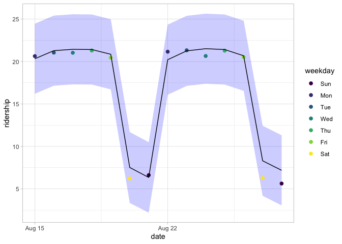

Given the scale of the ridership numbers, these results look
particularly good for such a simple model. If this model were deployed,
how well would it have done a few years later in June 2020?

    # simulating COVID-19 pandemic scenario
    Chicago_2020 <- Chicago_test |>
      mutate( date = ymd("2020-06-01") + seq(0:13) ) |> 
      mutate( across(where(is.numeric), ~.x*0.05) )

    res_2020 <- 
      predict(lm_fit, Chicago_2020) |> 
      bind_cols(
        predict(lm_fit, Chicago_2020, type="pred_int"),
        Chicago_2020
      )

    res_2020 |> 
      select(date, ridership, contains(".pred"))

    ## # A tibble: 14 × 5
    ##    date       ridership .pred .pred_lower .pred_upper
    ##    <date>         <dbl> <dbl>       <dbl>       <dbl>
    ##  1 2020-06-02     1.03  21.7        17.5         25.9
    ##  2 2020-06-03     1.05  21.7        17.5         25.9
    ##  3 2020-06-04     1.05  21.5        17.3         25.7
    ##  4 2020-06-05     1.07  20.9        16.7         25.1
    ##  5 2020-06-06     1.02   9.21        5.03        13.4
    ##  6 2020-06-07     0.311  7.88        3.71        12.0
    ##  7 2020-06-08     0.331 20.3        16.1         24.5
    ##  8 2020-06-09     1.06  21.7        17.5         25.9
    ##  9 2020-06-10     1.07  21.7        17.5         25.9
    ## 10 2020-06-11     1.03  21.5        17.3         25.7
    ## 11 2020-06-12     1.06  20.9        16.7         25.1
    ## 12 2020-06-13     1.03   9.20        5.02        13.4
    ## 13 2020-06-14     0.313  7.92        3.75        12.1
    ## 14 2020-06-15     0.281 20.3        16.1         24.5

The prediction intervals are about the same width, even though these
data are well beyond the time period of the original training set.
However, given the global pandemic in 2020, the performance on these
data are abysmal:

    res_2020 |> 
      rmse(ridership, .pred)

    ## # A tibble: 1 × 3
    ##   .metric .estimator .estimate
    ##   <chr>   <chr>          <dbl>
    ## 1 rmse    standard        17.7

You can see this terrible model performance visually.

    res_2020 |> 
      mutate( weekday = lubridate::wday(date, label=T) ) |>
      ggplot(aes(x=date)) +
      geom_ribbon(aes(ymin=.pred_lower, ymax=.pred_upper),alpha=.2, fill="blue") +
      geom_point(aes(y=ridership, color=weekday), size=2) +
      geom_line(aes(y=.pred)) + 
      theme_light()

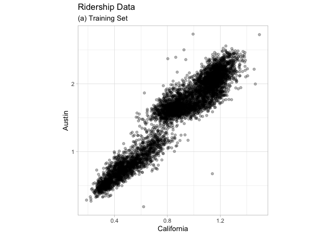

Confidence and prediction intervals for linear regression expand as the
data become more and more removed from the center of the training set.
However, that effect is not dramatic enough to flag these predictions as
being poor.

> Sometimes the statistics produced by models don’t measure the quality
> of predictions very well.

This situation can be avoided by having a secondary methodology that can
quantify how applicable the model is for any new prediction (i.e., the
model’s applicability domain).

The approach used in this chapter is a fairly simple unsupervised method
that attempts to measure how much (if any) a new data point is beyond
the training data.

> The idea is to accompany a prediction with a score that measures how
> similar the new point is to the training set.

One method that works well uses principal component analysis (PCA) on
the numeric predictor values. We’ll illustrate the process by using only
two of the predictors that correspond to ridership at different stations
(California and Austin stations)

    Chicago_train |> 
      ggplot(aes(California, Austin)) +
      geom_point(alpha=.3) +
      theme_light() +
      theme(aspect.ratio = 1) +
      labs(title = "Ridership Data",subtitle = "(a) Training Set")

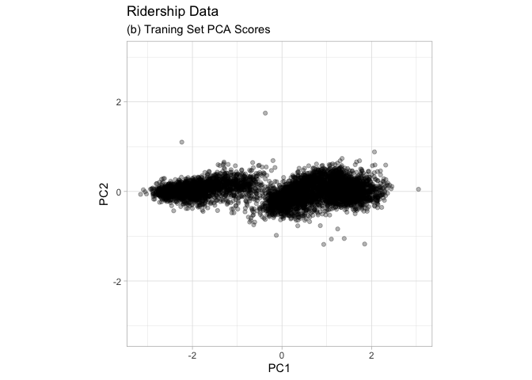

The first step is to conduct PCA on the training data. The PCA scores
for the training set are shown as:

    Chicago_rec <-
      Chicago_train |>
      recipe(ridership ~ Austin + California) |>
      step_normalize(all_numeric_predictors()) |>
      step_pca(all_numeric_predictors(), num_comp = 2) |>
      prep()

    Chicago_rec |> 
      juice() |> 
      ggplot(aes(PC1, PC2)) +
      geom_point(alpha=.3) +
      coord_obs_pred() +
      theme_light() +
      labs(title = "Ridership Data",subtitle = "(b) Traning Set PCA Scores")

Next, using these results, we measure the distance of each training set
point to the center of the PCA data.

    Chicago_rec |> 
      juice() |> 
      mutate( PC1_center = mean(PC1),
              PC2_center = mean(PC2)) |> 
      ggplot() +
      geom_segment(aes(x=PC1, y=PC2, xend=PC1_center, yend=PC2_center), alpha=.1) +
      coord_obs_pred() +
      theme_light() +
      labs(title = "Ridership Data",subtitle = "(c) Distance to Center")

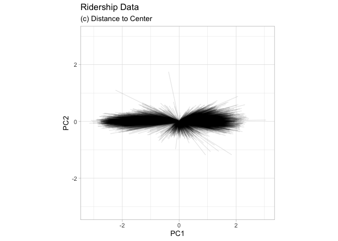

We can then use this reference distribution to estimate how far a data
point is from the mainstream of the training data.

    Chicago_rec |> 
      juice() |> 
      mutate( PC1_center = mean(PC1),
              PC2_center = mean(PC2)) |> 
      mutate(distance = sqrt((PC1-PC1_center)^2+(PC2-PC2_center)^2)) |> 
      ggplot(aes(x=distance)) +
      geom_histogram(color="white") +
      theme_light() +
      theme(aspect.ratio = 1) +
      labs(title = "Ridership Data",subtitle = "(c) Distance to Center")

    ## `stat_bin()` using `bins = 30`. Pick better value with `binwidth`.

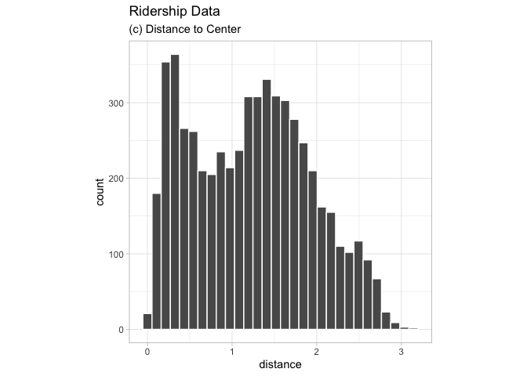

For a new sample, the PCA scores are computed along with the distance to
the center of the training set.

However, what does it mean when a new sample has a distance of X? Since
the PCA components can have different ranges from data set to data set,
there is no obvious limit to say that a distance is too large.

One approach is to treat the distances from the training set data as
“normal.” For new samples, we can determine how the new distance
compares to the range in the reference distribution (from the training
set). A percentile can be computed for new samples that reflect how much
of the training set is less extreme than the new samples.

> A percentile of 90% means that most of the training set data are
> closer to the data center than the new sample.

    chicago_2020_pca <- Chicago_rec |> 
      bake(Chicago_2020)

    Chicago_rec |> 
      juice() |> 
      mutate( PC1_center = mean(PC1),
              PC2_center = mean(PC2)) |> 
      ggplot() +
      geom_segment(aes(x=PC1, y=PC2, xend=PC1_center, yend=PC2_center), alpha=.1) +
      geom_point(data = chicago_2020_pca, aes(PC1, PC2), color="red", alpha=.6) +
      geom_segment(data = chicago_2020_pca, aes(x=PC1, y=PC2, xend=0, yend=0), color="red", alpha=.6, lty=2) +
      coord_obs_pred() +
      theme_light() +
      labs(title = "Distances to Training Set Center",subtitle = "Component Analysis")

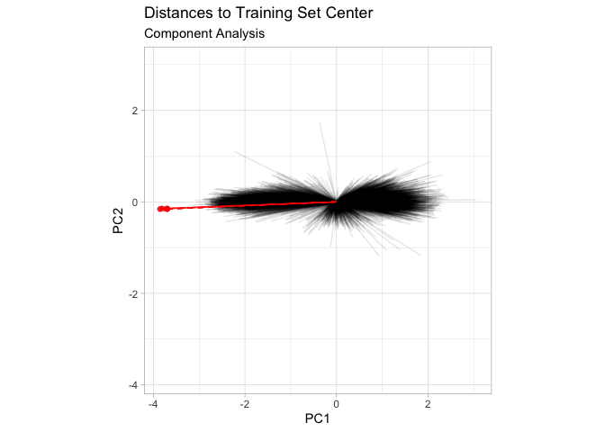

    chi_2020_dists <- chicago_2020_pca |> 
      mutate(dist = sqrt(PC1^2 + PC2^2))

    Chicago_rec |> 
      juice() |> 
      mutate( PC1_center = mean(PC1),
              PC2_center = mean(PC2)) |> 
      mutate(distance = sqrt((PC1-PC1_center)^2+(PC2-PC2_center)^2)) |>
      ggplot(aes(x=distance)) +
      geom_histogram(color="white") +
      geom_vline(data=chi_2020_dists, aes(xintercept=dist), lty=2, color="red") +
      theme_light() +
      labs(title = "Distances to Training Set Center",subtitle = "Distribution")

    ## `stat_bin()` using `bins = 30`. Pick better value with `binwidth`.

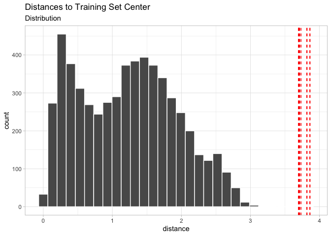

The 2020 sample is farther from the center than any of the training set
samples (with a percentile of 100%). This indicates the sample is very
extreme and that its corresponding prediction would be a severe
extrapolation (and probably should not be reported).

The `applicable` package can develop an applicability domain model using
PCA. We’ll use the 20 lagged station ridership predictors as inputs into
the PCA analysis. There is an additional argument called threshold that
determines how many components are used in the distance calculation. For
our example, we’ll use a large value that indicates we should use enough
components to account for 99% of the variation in the ridership
predictors:

    library(applicable)

    pca_stat <- apd_pca(~ ., data=Chicago_train |> select(one_of(stations)), threshold=0.99)

    pca_stat

    ## # Predictors:
    ##    20
    ## # Principal Components:
    ##    9 components were needed
    ##    to capture at least 99% of the
    ##    total variation in the predictors.

The `autoplot()` method plots the reference distribution. It has an
optional argument for which data to plot.

    autoplot(pca_stat)

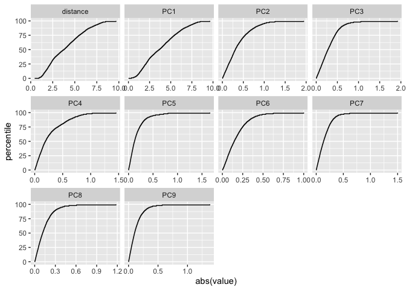

    autoplot(pca_stat, distance) + labs(x="distance")

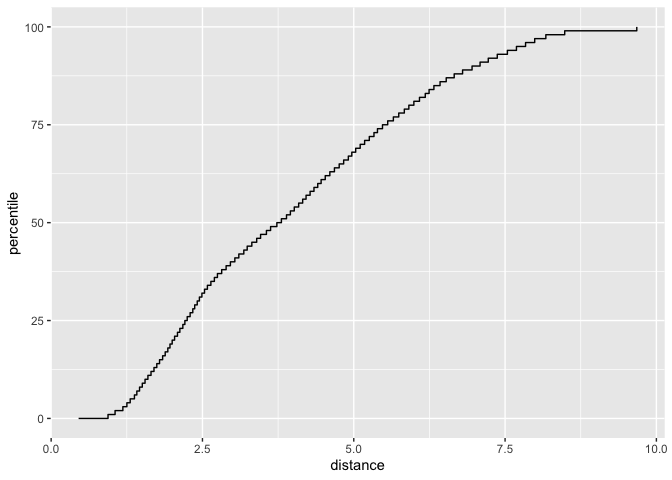

The x-axis shows the values of the distance and the y-axis displays the
distribution’s percentiles. To compute the percentiles for new data, the
`score()` function.

    score(pca_stat, Chicago_test) |> 
      select(starts_with("distance"))

    ## # A tibble: 14 × 2
    ##    distance distance_pctl
    ##       <dbl>         <dbl>
    ##  1     4.88          66.7
    ##  2     5.21          71.4
    ##  3     5.19          71.1
    ##  4     5.00          68.5
    ##  5     4.36          59.3
    ##  6     4.10          55.2
    ##  7     5.59          76.4
    ##  8     4.21          56.9
    ##  9     4.94          67.5
    ## 10     4.93          67.4
    ## 11     4.93          67.3
    ## 12     3.50          47.4
    ## 13     3.89          52.1
    ## 14     5.42          74.4

    score(pca_stat, Chicago_2020) |> 
      select(starts_with("distance"))

    ## # A tibble: 14 × 2
    ##    distance distance_pctl
    ##       <dbl>         <dbl>
    ##  1     10.5             1
    ##  2     10.5             1
    ##  3     10.5             1
    ##  4     10.5             1
    ##  5     10.5             1
    ##  6     10.9             1
    ##  7     11.0             1
    ##  8     10.5             1
    ##  9     10.5             1
    ## 10     10.5             1
    ## 11     10.5             1
    ## 12     10.5             1
    ## 13     10.9             1
    ## 14     11.0             1

    bind_rows(
      score(pca_stat, Chicago_test) |> 
        select(starts_with("distance")) |> 
        mutate( data = "test"),
      score(pca_stat, Chicago_2020) |> 
        select(starts_with("distance")) |> 
        mutate( data = "2020" ),
      score(pca_stat, Chicago_train) |> 
        select(starts_with("distance")) |> 
        mutate( data = "train" )) |> 
      ggplot(aes(x=distance_pctl)) +
      geom_density(aes(fill=data), color="white", alpha=.5) +
      theme_light()

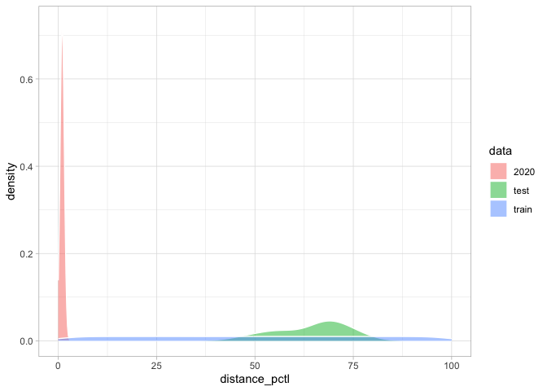

The 2020 distance values indicate that these predictor values are
outside of the vast majority of data seen by the model at training time.
These should be flagged so that the predictions are either not reported
at all or viewed with skepticism.

> One important aspect of this analysis concerns which predictors are
> used to develop the applicability domain model. In our analysis, we
> used the raw predictor columns. However, in building the model, PLS
> score features were used in their place. Which of these should
> apd\_pca() use? The apd\_pca() function can also take a recipe as the
> input (instead of a formula) so that the distances reflect the PLS
> scores instead of the individual predictor columns. You can evaluate
> both methods to understand which one gives more relevant results.

# Reference

All code and text came from Max Kuhn and Julia Silge\`s book [Tidy
Modeling with R](https://www.tmwr.org/trust).
