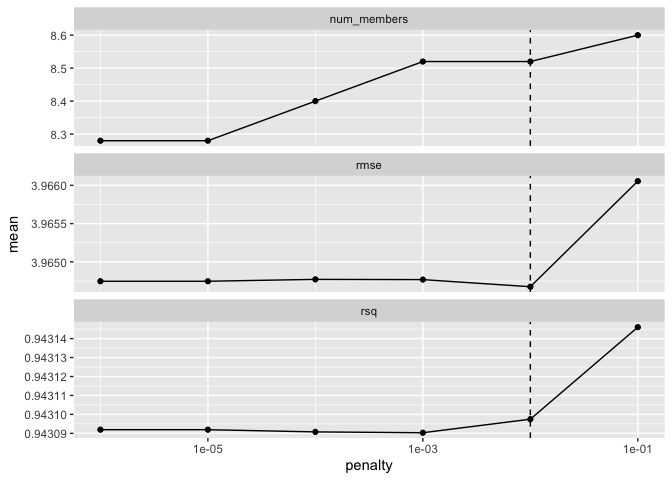
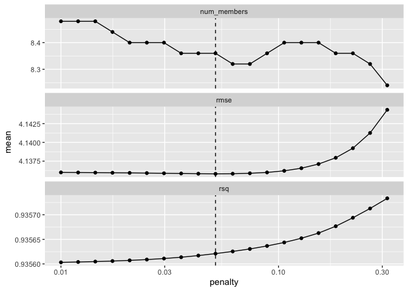
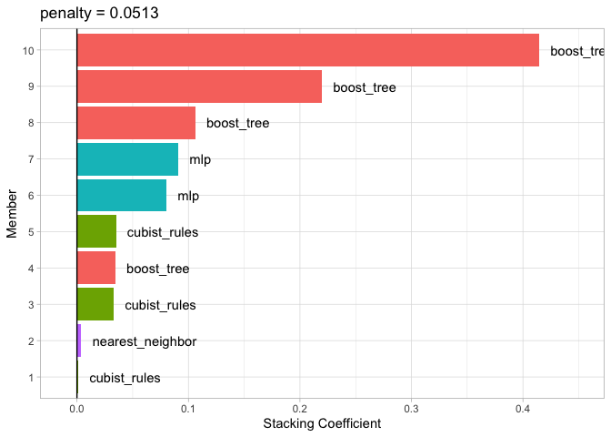

-   [Creating the training set for
    stacking](#creating-the-training-set-for-stacking)
-   [Blend the predictions](#blend-the-predictions)
-   [Fit the member models](#fit-the-member-models)
-   [Test set results](#test-set-results)
-   [Reference](#reference)

A model ensemble, where the predictions of multiple single learners are
aggregated to make one prediction, can produce a high-performance final
model.

> Model stacking combines the predictions for multiple models of any
> type. For example, a logistic regression, classification tree, and
> support vector machine can be included in a stacking ensemble.

This chapter shows how to stack predictive models using the stacks
package. We’ll re-use the results from [Chapter
15](./chapter15_workflowset.md) where multiple models were evaluated to
predict the compressive strength of concrete mixtures.

    library(tidymodels)

    # put rnotbook in the same workdir
    knitr::opts_knit$set(root.dir = normalizePath(rprojroot::find_rstudio_root_file())) 

    # recovering the training and test set
    set.seed(1501)
    concrete_split <- initial_split(concrete, strata = compressive_strength)
    concrete_train <- training(concrete_split)
    concrete_test  <- testing(concrete_split)

    # recovering the tunned models
    race_results <- readRDS("./chp15_race_results.rds")
    race_results

    ## # A workflow set/tibble: 12 × 4
    ##    wflow_id                  info             option    result   
    ##    <chr>                     <list>           <list>    <list>   
    ##  1 simple_MARS               <tibble [1 × 4]> <opts[3]> <race[+]>
    ##  2 simple_CART               <tibble [1 × 4]> <opts[3]> <race[+]>
    ##  3 simple_CART_bagged        <tibble [1 × 4]> <opts[3]> <rsmp[+]>
    ##  4 simple_RF                 <tibble [1 × 4]> <opts[3]> <race[+]>
    ##  5 simple_boosting           <tibble [1 × 4]> <opts[3]> <race[+]>
    ##  6 simple_Cubist             <tibble [1 × 4]> <opts[3]> <race[+]>
    ##  7 normalized_SVM_radial     <tibble [1 × 4]> <opts[3]> <race[+]>
    ##  8 normalized_SMV_poly       <tibble [1 × 4]> <opts[3]> <race[+]>
    ##  9 normalized_KNN            <tibble [1 × 4]> <opts[3]> <race[+]>
    ## 10 normalized_neural_network <tibble [1 × 4]> <opts[4]> <race[+]>
    ## 11 full_quad_linear_reg      <tibble [1 × 4]> <opts[3]> <race[+]>
    ## 12 full_quad_KNN             <tibble [1 × 4]> <opts[3]> <race[+]>

The process of building a stacked ensemble is:

1.  Assemble the training set of hold-out prediction (produced via
    resampling)
2.  Create a model to blend these predictions.
3.  For each member of the ensemble, fit ht emodel on the original
    training set.

> We’ll use the term candidate members to describe the possible model
> configurations (of all model types) that might be included in the
> stacking ensemble.

This means that a stacking model can include different types of models
(e.g., trees and neural networks) as well as different configurations of
the same model (e.g., trees with different depths).

## Creating the training set for stacking

The first step for building a stacked ensemble relies on the assessment
set predictions from a resampling scheme with multiple splits. For each
data point in the training set, stacking requires an out-of-sample
prediction of some sort.

Back in Chapter 15, we used five repeats of 10-fold cross-validation to
resample the data. This resampling scheme generates five assessment set
predictions for each training set sample.

> Simple validation sets can also be used with stacking since tidymodels
> considers this to be a single resample.

To start ensembling with the stacks package, create an empty data stack
using the stacks() function and then add candidate models. Recall that
we used workflow sets to fit a wide variety of models to these data.
We’ll use the racing results:

    library(stacks)

    concrete_stack <- 
      stacks() |> 
      add_candidates(race_results)

    concrete_stack

    ## # A data stack with 12 model definitions and 68 candidate members:
    ## #   simple_MARS: 1 model configuration
    ## #   simple_CART: 5 model configurations
    ## #   simple_CART_bagged: 1 model configuration
    ## #   simple_RF: 3 model configurations
    ## #   simple_boosting: 5 model configurations
    ## #   simple_Cubist: 13 model configurations
    ## #   normalized_SVM_radial: 1 model configuration
    ## #   normalized_SMV_poly: 1 model configuration
    ## #   normalized_KNN: 4 model configurations
    ## #   normalized_neural_network: 4 model configurations
    ## #   full_quad_linear_reg: 25 model configurations
    ## #   full_quad_KNN: 5 model configurations
    ## # Outcome: compressive_strength (numeric)

Recall that racing methods are more efficient since they might not
evaluate all configurations on all resamples. Stacking requires that all
candidate members have the complete set of resamples. `add_candidates()`
includes only the model configurations that have complete results.

## Blend the predictions

The training set predictions and the corresponding observed outcome data
are used to create a meta-learning model where the assessment set
predictions are the predictors of the observed outcome data.
Meta-learning can be accomplished using any model. The most commonly
used model is a regularized generalized linear model, which encompasses
linear, logistic, and multinomial models.

Specifically, regularization via the lasso penalty (Tibshirani 1996),
which uses shrinkage to pull points toward a central value, has several
advantages:

-   Using the lasso penalty can remove candidates from ensemble.
-   The correlation between ensemble candidates tends to be very high,
    and regularization helps alleviate this issue.

<!-- -->

    set.seed(2001)
    ens <- blend_predictions(concrete_stack)

    ens

    ## ── A stacked ensemble model ─────────────────────────────────────
    ## 
    ## 
    ## Out of 68 possible candidate members, the ensemble retained 9.
    ## 
    ## Penalty: 0.01.
    ## 
    ## Mixture: 1.
    ## 
    ## 
    ## The 9 highest weighted members are:

    ## # A tibble: 9 × 3
    ##   member                         type              weight
    ##   <chr>                          <chr>              <dbl>
    ## 1 simple_boosting_1_04           boost_tree       0.413  
    ## 2 simple_boosting_1_16           boost_tree       0.221  
    ## 3 simple_boosting_1_20           boost_tree       0.105  
    ## 4 normalized_neural_network_1_17 mlp              0.0913 
    ## 5 normalized_neural_network_1_04 mlp              0.0832 
    ## 6 simple_boosting_1_03           boost_tree       0.0356 
    ## 7 simple_Cubist_1_25             cubist_rules     0.0341 
    ## 8 simple_Cubist_1_21             cubist_rules     0.0331 
    ## 9 full_quad_KNN_1_12             nearest_neighbor 0.00629

    ## 
    ## Members have not yet been fitted with `fit_members()`.

This evaluates the meta-learning model over a predefined grid of lasso
penalty values and uses an internal resampling method to determine the
best value.

    autoplot(ens)

The top panel shows the average number of candidate ensemble members
retained by the meta-learning model. We can see that the number of
members is fairly constant and, as it increases, the RMSE also
increases.

The default range may not have served us well here. To evaluate the
meta-learning model with larger penalties, let’s pass an additional
option:

    set.seed(2002)
    ens <- blend_predictions(concrete_stack,
                             penalty = 10^seq(-2, -0.5, length=20))

    autoplot(ens)

The penalty value associated with the smallest RMSE was 0.051. Printing
the object shows the details of the meta-learning model:

    ens

    ## ── A stacked ensemble model ─────────────────────────────────────
    ## 
    ## 
    ## Out of 68 possible candidate members, the ensemble retained 10.
    ## 
    ## Penalty: 0.0513483290743755.
    ## 
    ## Mixture: 1.
    ## 
    ## 
    ## The 10 highest weighted members are:

    ## # A tibble: 10 × 3
    ##    member                         type              weight
    ##    <chr>                          <chr>              <dbl>
    ##  1 simple_boosting_1_04           boost_tree       0.415  
    ##  2 simple_boosting_1_16           boost_tree       0.220  
    ##  3 simple_boosting_1_20           boost_tree       0.106  
    ##  4 normalized_neural_network_1_17 mlp              0.0910 
    ##  5 normalized_neural_network_1_04 mlp              0.0804 
    ##  6 simple_Cubist_1_21             cubist_rules     0.0351 
    ##  7 simple_boosting_1_03           boost_tree       0.0345 
    ##  8 simple_Cubist_1_25             cubist_rules     0.0330 
    ##  9 full_quad_KNN_1_12             nearest_neighbor 0.00392
    ## 10 simple_Cubist_1_07             cubist_rules     0.00118

    ## 
    ## Members have not yet been fitted with `fit_members()`.

The regularized linear regression meta-learning model contained seven
blending coefficients across four types of models. The autoplot() method
can be used again to show the contributions of each model type, to
produce.

    autoplot(ens, "weights") +
      geom_text(aes(x=weight+0.01, label=model), hjust=0) +
      theme_light() +
      theme(legend.position = "none") +
      lims(x=c(-0.01, 0.45))

## Fit the member models

The ensemble contains seven candidate members, and we now know how their
predictions can be blended into a final prediction for the ensemble.
However, these individual model fits have not yet been created. To be
able to use the stacking model, seven additional model fits are
required. These use the entire training set with the original
predictors.

The `stacks` package has a function, `fit_members()`, that trains and
returns these models:

    # remembering race_result is a tunned version of the model 
    # training in the cross validation folds, not in the whole training dataset

    library(rules) # necessary do the cubist model

    ## 
    ## Attaching package: 'rules'

    ## The following object is masked from 'package:dials':
    ## 
    ##     max_rules

    ens <- fit_members(ens)
    ens

    ## ── A stacked ensemble model ─────────────────────────────────────

    ## 

    ## Out of 68 possible candidate members, the ensemble retained 10.

    ## Penalty: 0.0513483290743755.

    ## Mixture: 1.

    ## 
    ## The 10 highest weighted members are:

    ## # A tibble: 10 × 3
    ##    member                         type              weight
    ##    <chr>                          <chr>              <dbl>
    ##  1 simple_boosting_1_04           boost_tree       0.415  
    ##  2 simple_boosting_1_16           boost_tree       0.220  
    ##  3 simple_boosting_1_20           boost_tree       0.106  
    ##  4 normalized_neural_network_1_17 mlp              0.0910 
    ##  5 normalized_neural_network_1_04 mlp              0.0804 
    ##  6 simple_Cubist_1_21             cubist_rules     0.0351 
    ##  7 simple_boosting_1_03           boost_tree       0.0345 
    ##  8 simple_Cubist_1_25             cubist_rules     0.0330 
    ##  9 full_quad_KNN_1_12             nearest_neighbor 0.00392
    ## 10 simple_Cubist_1_07             cubist_rules     0.00118

## Test set results

Since the blending process used resampling, we can estimate that the
ensemble with seven members had an estimated RMSE of 4.12. Recall from
Chapter 15 that the best boosted tree had a test set RMSE of 3.41

    reg_metrics <- metric_set(rmse, rsq)

    ens_test_pred <- 
      predict(ens, concrete_test) |> 
      bind_cols(concrete_test)

    ens_test_pred |> 
      reg_metrics(compressive_strength, .pred)

    ## # A tibble: 2 × 3
    ##   .metric .estimator .estimate
    ##   <chr>   <chr>          <dbl>
    ## 1 rmse    standard       2.57 
    ## 2 rsq     standard       0.977

This is moderately better than our best single model. It is fairly
common for stacking to produce incremental benefits when compared to the
best single model.

# Reference

All code and text came from Max Kuhn and Julia Silge\`s book [Tidy
Modeling with R](https://www.tmwr.org/ensembles).
