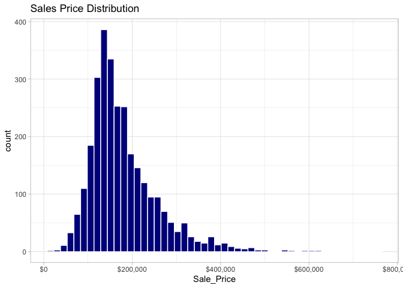

-   [Dataset](#dataset)
-   [EDA](#eda)
    -   [Sale Price](#sale-price)
    -   [Geographic Distribution](#geographic-distribution)
-   [Reference](#reference)

    library(tidyverse) # eda and transformation

    ## ── Attaching packages ─────────────────────────────────────── tidyverse 1.3.2 ──
    ## ✔ ggplot2 3.4.0     ✔ purrr   1.0.2
    ## ✔ tibble  3.2.1     ✔ dplyr   1.1.3
    ## ✔ tidyr   1.3.0     ✔ stringr 1.5.0
    ## ✔ readr   2.1.3     ✔ forcats 0.5.2
    ## ── Conflicts ────────────────────────────────────────── tidyverse_conflicts() ──
    ## ✖ dplyr::filter() masks stats::filter()
    ## ✖ dplyr::lag()    masks stats::lag()

    theme_set(theme_light())

# Dataset

In this chapter, we’ll introduce the Ames housing data set ([De Cock
2011](https://www.tmwr.org/ames#ref-ames)), which we will use in
modeling examples throughout this book. Exploratory data analysis, like
what we walk through in this chapter, is an important first step in
building a reliable model. The data set contains information on 2,930
properties in Ames, Iowa, including columns related to:

. house characteristics (bedrooms, garage, fireplace, pool, porch, etc.)
. location (neighborhood) . lot information (zoning, shape, size, etc.)
. ratings of condition and quality . sale price

> Our modeling goal is to predict the sale price of a house based on
> other information we have, such as its characteristics and location.

    # load data from modeldata package
    data(ames, package="modeldata")

    dim(ames)

    ## [1] 2930   74

    head(ames)

    ## # A tibble: 6 × 74
    ##   MS_SubClass             MS_Zoning Lot_Frontage Lot_Area Street Alley Lot_Shape
    ##   <fct>                   <fct>            <dbl>    <int> <fct>  <fct> <fct>    
    ## 1 One_Story_1946_and_New… Resident…          141    31770 Pave   No_A… Slightly…
    ## 2 One_Story_1946_and_New… Resident…           80    11622 Pave   No_A… Regular  
    ## 3 One_Story_1946_and_New… Resident…           81    14267 Pave   No_A… Slightly…
    ## 4 One_Story_1946_and_New… Resident…           93    11160 Pave   No_A… Regular  
    ## 5 Two_Story_1946_and_New… Resident…           74    13830 Pave   No_A… Slightly…
    ## 6 Two_Story_1946_and_New… Resident…           78     9978 Pave   No_A… Slightly…
    ## # ℹ 67 more variables: Land_Contour <fct>, Utilities <fct>, Lot_Config <fct>,
    ## #   Land_Slope <fct>, Neighborhood <fct>, Condition_1 <fct>, Condition_2 <fct>,
    ## #   Bldg_Type <fct>, House_Style <fct>, Overall_Cond <fct>, Year_Built <int>,
    ## #   Year_Remod_Add <int>, Roof_Style <fct>, Roof_Matl <fct>,
    ## #   Exterior_1st <fct>, Exterior_2nd <fct>, Mas_Vnr_Type <fct>,
    ## #   Mas_Vnr_Area <dbl>, Exter_Cond <fct>, Foundation <fct>, Bsmt_Cond <fct>,
    ## #   Bsmt_Exposure <fct>, BsmtFin_Type_1 <fct>, BsmtFin_SF_1 <dbl>, …

    skimr::skim(ames)

<table>
<caption>Data summary</caption>
<tbody>
<tr class="odd">
<td style="text-align: left;">Name</td>
<td style="text-align: left;">ames</td>
</tr>
<tr class="even">
<td style="text-align: left;">Number of rows</td>
<td style="text-align: left;">2930</td>
</tr>
<tr class="odd">
<td style="text-align: left;">Number of columns</td>
<td style="text-align: left;">74</td>
</tr>
<tr class="even">
<td style="text-align: left;">_______________________</td>
<td style="text-align: left;"></td>
</tr>
<tr class="odd">
<td style="text-align: left;">Column type frequency:</td>
<td style="text-align: left;"></td>
</tr>
<tr class="even">
<td style="text-align: left;">factor</td>
<td style="text-align: left;">40</td>
</tr>
<tr class="odd">
<td style="text-align: left;">numeric</td>
<td style="text-align: left;">34</td>
</tr>
<tr class="even">
<td style="text-align: left;">________________________</td>
<td style="text-align: left;"></td>
</tr>
<tr class="odd">
<td style="text-align: left;">Group variables</td>
<td style="text-align: left;">None</td>
</tr>
</tbody>
</table>

Data summary

**Variable type: factor**

<table>
<colgroup>
<col style="width: 15%" />
<col style="width: 10%" />
<col style="width: 14%" />
<col style="width: 8%" />
<col style="width: 9%" />
<col style="width: 41%" />
</colgroup>
<thead>
<tr class="header">
<th style="text-align: left;">skim_variable</th>
<th style="text-align: right;">n_missing</th>
<th style="text-align: right;">complete_rate</th>
<th style="text-align: left;">ordered</th>
<th style="text-align: right;">n_unique</th>
<th style="text-align: left;">top_counts</th>
</tr>
</thead>
<tbody>
<tr class="odd">
<td style="text-align: left;">MS_SubClass</td>
<td style="text-align: right;">0</td>
<td style="text-align: right;">1</td>
<td style="text-align: left;">FALSE</td>
<td style="text-align: right;">16</td>
<td style="text-align: left;">One: 1079, Two: 575, One: 287, One:
192</td>
</tr>
<tr class="even">
<td style="text-align: left;">MS_Zoning</td>
<td style="text-align: right;">0</td>
<td style="text-align: right;">1</td>
<td style="text-align: left;">FALSE</td>
<td style="text-align: right;">7</td>
<td style="text-align: left;">Res: 2273, Res: 462, Flo: 139, Res:
27</td>
</tr>
<tr class="odd">
<td style="text-align: left;">Street</td>
<td style="text-align: right;">0</td>
<td style="text-align: right;">1</td>
<td style="text-align: left;">FALSE</td>
<td style="text-align: right;">2</td>
<td style="text-align: left;">Pav: 2918, Grv: 12</td>
</tr>
<tr class="even">
<td style="text-align: left;">Alley</td>
<td style="text-align: right;">0</td>
<td style="text-align: right;">1</td>
<td style="text-align: left;">FALSE</td>
<td style="text-align: right;">3</td>
<td style="text-align: left;">No_: 2732, Gra: 120, Pav: 78</td>
</tr>
<tr class="odd">
<td style="text-align: left;">Lot_Shape</td>
<td style="text-align: right;">0</td>
<td style="text-align: right;">1</td>
<td style="text-align: left;">FALSE</td>
<td style="text-align: right;">4</td>
<td style="text-align: left;">Reg: 1859, Sli: 979, Mod: 76, Irr: 16</td>
</tr>
<tr class="even">
<td style="text-align: left;">Land_Contour</td>
<td style="text-align: right;">0</td>
<td style="text-align: right;">1</td>
<td style="text-align: left;">FALSE</td>
<td style="text-align: right;">4</td>
<td style="text-align: left;">Lvl: 2633, HLS: 120, Bnk: 117, Low:
60</td>
</tr>
<tr class="odd">
<td style="text-align: left;">Utilities</td>
<td style="text-align: right;">0</td>
<td style="text-align: right;">1</td>
<td style="text-align: left;">FALSE</td>
<td style="text-align: right;">3</td>
<td style="text-align: left;">All: 2927, NoS: 2, NoS: 1</td>
</tr>
<tr class="even">
<td style="text-align: left;">Lot_Config</td>
<td style="text-align: right;">0</td>
<td style="text-align: right;">1</td>
<td style="text-align: left;">FALSE</td>
<td style="text-align: right;">5</td>
<td style="text-align: left;">Ins: 2140, Cor: 511, Cul: 180, FR2:
85</td>
</tr>
<tr class="odd">
<td style="text-align: left;">Land_Slope</td>
<td style="text-align: right;">0</td>
<td style="text-align: right;">1</td>
<td style="text-align: left;">FALSE</td>
<td style="text-align: right;">3</td>
<td style="text-align: left;">Gtl: 2789, Mod: 125, Sev: 16</td>
</tr>
<tr class="even">
<td style="text-align: left;">Neighborhood</td>
<td style="text-align: right;">0</td>
<td style="text-align: right;">1</td>
<td style="text-align: left;">FALSE</td>
<td style="text-align: right;">28</td>
<td style="text-align: left;">Nor: 443, Col: 267, Old: 239, Edw:
194</td>
</tr>
<tr class="odd">
<td style="text-align: left;">Condition_1</td>
<td style="text-align: right;">0</td>
<td style="text-align: right;">1</td>
<td style="text-align: left;">FALSE</td>
<td style="text-align: right;">9</td>
<td style="text-align: left;">Nor: 2522, Fee: 164, Art: 92, RRA: 50</td>
</tr>
<tr class="even">
<td style="text-align: left;">Condition_2</td>
<td style="text-align: right;">0</td>
<td style="text-align: right;">1</td>
<td style="text-align: left;">FALSE</td>
<td style="text-align: right;">8</td>
<td style="text-align: left;">Nor: 2900, Fee: 13, Art: 5, Pos: 4</td>
</tr>
<tr class="odd">
<td style="text-align: left;">Bldg_Type</td>
<td style="text-align: right;">0</td>
<td style="text-align: right;">1</td>
<td style="text-align: left;">FALSE</td>
<td style="text-align: right;">5</td>
<td style="text-align: left;">One: 2425, Twn: 233, Dup: 109, Twn:
101</td>
</tr>
<tr class="even">
<td style="text-align: left;">House_Style</td>
<td style="text-align: right;">0</td>
<td style="text-align: right;">1</td>
<td style="text-align: left;">FALSE</td>
<td style="text-align: right;">8</td>
<td style="text-align: left;">One: 1481, Two: 873, One: 314, SLv:
128</td>
</tr>
<tr class="odd">
<td style="text-align: left;">Overall_Cond</td>
<td style="text-align: right;">0</td>
<td style="text-align: right;">1</td>
<td style="text-align: left;">FALSE</td>
<td style="text-align: right;">9</td>
<td style="text-align: left;">Ave: 1654, Abo: 533, Goo: 390, Ver:
144</td>
</tr>
<tr class="even">
<td style="text-align: left;">Roof_Style</td>
<td style="text-align: right;">0</td>
<td style="text-align: right;">1</td>
<td style="text-align: left;">FALSE</td>
<td style="text-align: right;">6</td>
<td style="text-align: left;">Gab: 2321, Hip: 551, Gam: 22, Fla: 20</td>
</tr>
<tr class="odd">
<td style="text-align: left;">Roof_Matl</td>
<td style="text-align: right;">0</td>
<td style="text-align: right;">1</td>
<td style="text-align: left;">FALSE</td>
<td style="text-align: right;">8</td>
<td style="text-align: left;">Com: 2887, Tar: 23, WdS: 9, WdS: 7</td>
</tr>
<tr class="even">
<td style="text-align: left;">Exterior_1st</td>
<td style="text-align: right;">0</td>
<td style="text-align: right;">1</td>
<td style="text-align: left;">FALSE</td>
<td style="text-align: right;">16</td>
<td style="text-align: left;">Vin: 1026, Met: 450, HdB: 442, Wd :
420</td>
</tr>
<tr class="odd">
<td style="text-align: left;">Exterior_2nd</td>
<td style="text-align: right;">0</td>
<td style="text-align: right;">1</td>
<td style="text-align: left;">FALSE</td>
<td style="text-align: right;">17</td>
<td style="text-align: left;">Vin: 1015, Met: 447, HdB: 406, Wd :
397</td>
</tr>
<tr class="even">
<td style="text-align: left;">Mas_Vnr_Type</td>
<td style="text-align: right;">0</td>
<td style="text-align: right;">1</td>
<td style="text-align: left;">FALSE</td>
<td style="text-align: right;">5</td>
<td style="text-align: left;">Non: 1775, Brk: 880, Sto: 249, Brk:
25</td>
</tr>
<tr class="odd">
<td style="text-align: left;">Exter_Cond</td>
<td style="text-align: right;">0</td>
<td style="text-align: right;">1</td>
<td style="text-align: left;">FALSE</td>
<td style="text-align: right;">5</td>
<td style="text-align: left;">Typ: 2549, Goo: 299, Fai: 67, Exc: 12</td>
</tr>
<tr class="even">
<td style="text-align: left;">Foundation</td>
<td style="text-align: right;">0</td>
<td style="text-align: right;">1</td>
<td style="text-align: left;">FALSE</td>
<td style="text-align: right;">6</td>
<td style="text-align: left;">PCo: 1310, CBl: 1244, Brk: 311, Sla:
49</td>
</tr>
<tr class="odd">
<td style="text-align: left;">Bsmt_Cond</td>
<td style="text-align: right;">0</td>
<td style="text-align: right;">1</td>
<td style="text-align: left;">FALSE</td>
<td style="text-align: right;">6</td>
<td style="text-align: left;">Typ: 2616, Goo: 122, Fai: 104, No_:
80</td>
</tr>
<tr class="even">
<td style="text-align: left;">Bsmt_Exposure</td>
<td style="text-align: right;">0</td>
<td style="text-align: right;">1</td>
<td style="text-align: left;">FALSE</td>
<td style="text-align: right;">5</td>
<td style="text-align: left;">No: 1906, Av: 418, Gd: 284, Mn: 239</td>
</tr>
<tr class="odd">
<td style="text-align: left;">BsmtFin_Type_1</td>
<td style="text-align: right;">0</td>
<td style="text-align: right;">1</td>
<td style="text-align: left;">FALSE</td>
<td style="text-align: right;">7</td>
<td style="text-align: left;">GLQ: 859, Unf: 851, ALQ: 429, Rec:
288</td>
</tr>
<tr class="even">
<td style="text-align: left;">BsmtFin_Type_2</td>
<td style="text-align: right;">0</td>
<td style="text-align: right;">1</td>
<td style="text-align: left;">FALSE</td>
<td style="text-align: right;">7</td>
<td style="text-align: left;">Unf: 2499, Rec: 106, LwQ: 89, No_: 81</td>
</tr>
<tr class="odd">
<td style="text-align: left;">Heating</td>
<td style="text-align: right;">0</td>
<td style="text-align: right;">1</td>
<td style="text-align: left;">FALSE</td>
<td style="text-align: right;">6</td>
<td style="text-align: left;">Gas: 2885, Gas: 27, Gra: 9, Wal: 6</td>
</tr>
<tr class="even">
<td style="text-align: left;">Heating_QC</td>
<td style="text-align: right;">0</td>
<td style="text-align: right;">1</td>
<td style="text-align: left;">FALSE</td>
<td style="text-align: right;">5</td>
<td style="text-align: left;">Exc: 1495, Typ: 864, Goo: 476, Fai:
92</td>
</tr>
<tr class="odd">
<td style="text-align: left;">Central_Air</td>
<td style="text-align: right;">0</td>
<td style="text-align: right;">1</td>
<td style="text-align: left;">FALSE</td>
<td style="text-align: right;">2</td>
<td style="text-align: left;">Y: 2734, N: 196</td>
</tr>
<tr class="even">
<td style="text-align: left;">Electrical</td>
<td style="text-align: right;">0</td>
<td style="text-align: right;">1</td>
<td style="text-align: left;">FALSE</td>
<td style="text-align: right;">6</td>
<td style="text-align: left;">SBr: 2682, Fus: 188, Fus: 50, Fus: 8</td>
</tr>
<tr class="odd">
<td style="text-align: left;">Functional</td>
<td style="text-align: right;">0</td>
<td style="text-align: right;">1</td>
<td style="text-align: left;">FALSE</td>
<td style="text-align: right;">8</td>
<td style="text-align: left;">Typ: 2728, Min: 70, Min: 65, Mod: 35</td>
</tr>
<tr class="even">
<td style="text-align: left;">Garage_Type</td>
<td style="text-align: right;">0</td>
<td style="text-align: right;">1</td>
<td style="text-align: left;">FALSE</td>
<td style="text-align: right;">7</td>
<td style="text-align: left;">Att: 1731, Det: 782, Bui: 186, No_:
157</td>
</tr>
<tr class="odd">
<td style="text-align: left;">Garage_Finish</td>
<td style="text-align: right;">0</td>
<td style="text-align: right;">1</td>
<td style="text-align: left;">FALSE</td>
<td style="text-align: right;">4</td>
<td style="text-align: left;">Unf: 1231, RFn: 812, Fin: 728, No_:
159</td>
</tr>
<tr class="even">
<td style="text-align: left;">Garage_Cond</td>
<td style="text-align: right;">0</td>
<td style="text-align: right;">1</td>
<td style="text-align: left;">FALSE</td>
<td style="text-align: right;">6</td>
<td style="text-align: left;">Typ: 2665, No_: 159, Fai: 74, Goo: 15</td>
</tr>
<tr class="odd">
<td style="text-align: left;">Paved_Drive</td>
<td style="text-align: right;">0</td>
<td style="text-align: right;">1</td>
<td style="text-align: left;">FALSE</td>
<td style="text-align: right;">3</td>
<td style="text-align: left;">Pav: 2652, Dir: 216, Par: 62</td>
</tr>
<tr class="even">
<td style="text-align: left;">Pool_QC</td>
<td style="text-align: right;">0</td>
<td style="text-align: right;">1</td>
<td style="text-align: left;">FALSE</td>
<td style="text-align: right;">5</td>
<td style="text-align: left;">No_: 2917, Exc: 4, Goo: 4, Typ: 3</td>
</tr>
<tr class="odd">
<td style="text-align: left;">Fence</td>
<td style="text-align: right;">0</td>
<td style="text-align: right;">1</td>
<td style="text-align: left;">FALSE</td>
<td style="text-align: right;">5</td>
<td style="text-align: left;">No_: 2358, Min: 330, Goo: 118, Goo:
112</td>
</tr>
<tr class="even">
<td style="text-align: left;">Misc_Feature</td>
<td style="text-align: right;">0</td>
<td style="text-align: right;">1</td>
<td style="text-align: left;">FALSE</td>
<td style="text-align: right;">6</td>
<td style="text-align: left;">Non: 2824, She: 95, Gar: 5, Oth: 4</td>
</tr>
<tr class="odd">
<td style="text-align: left;">Sale_Type</td>
<td style="text-align: right;">0</td>
<td style="text-align: right;">1</td>
<td style="text-align: left;">FALSE</td>
<td style="text-align: right;">10</td>
<td style="text-align: left;">WD : 2536, New: 239, COD: 87, Con: 26</td>
</tr>
<tr class="even">
<td style="text-align: left;">Sale_Condition</td>
<td style="text-align: right;">0</td>
<td style="text-align: right;">1</td>
<td style="text-align: left;">FALSE</td>
<td style="text-align: right;">6</td>
<td style="text-align: left;">Nor: 2413, Par: 245, Abn: 190, Fam:
46</td>
</tr>
</tbody>
</table>

**Variable type: numeric**

<table>
<colgroup>
<col style="width: 16%" />
<col style="width: 8%" />
<col style="width: 11%" />
<col style="width: 8%" />
<col style="width: 7%" />
<col style="width: 7%" />
<col style="width: 8%" />
<col style="width: 8%" />
<col style="width: 8%" />
<col style="width: 8%" />
<col style="width: 5%" />
</colgroup>
<thead>
<tr class="header">
<th style="text-align: left;">skim_variable</th>
<th style="text-align: right;">n_missing</th>
<th style="text-align: right;">complete_rate</th>
<th style="text-align: right;">mean</th>
<th style="text-align: right;">sd</th>
<th style="text-align: right;">p0</th>
<th style="text-align: right;">p25</th>
<th style="text-align: right;">p50</th>
<th style="text-align: right;">p75</th>
<th style="text-align: right;">p100</th>
<th style="text-align: left;">hist</th>
</tr>
</thead>
<tbody>
<tr class="odd">
<td style="text-align: left;">Lot_Frontage</td>
<td style="text-align: right;">0</td>
<td style="text-align: right;">1</td>
<td style="text-align: right;">57.65</td>
<td style="text-align: right;">33.50</td>
<td style="text-align: right;">0.00</td>
<td style="text-align: right;">43.00</td>
<td style="text-align: right;">63.00</td>
<td style="text-align: right;">78.00</td>
<td style="text-align: right;">313.00</td>
<td style="text-align: left;">▇▇▁▁▁</td>
</tr>
<tr class="even">
<td style="text-align: left;">Lot_Area</td>
<td style="text-align: right;">0</td>
<td style="text-align: right;">1</td>
<td style="text-align: right;">10147.92</td>
<td style="text-align: right;">7880.02</td>
<td style="text-align: right;">1300.00</td>
<td style="text-align: right;">7440.25</td>
<td style="text-align: right;">9436.50</td>
<td style="text-align: right;">11555.25</td>
<td style="text-align: right;">215245.00</td>
<td style="text-align: left;">▇▁▁▁▁</td>
</tr>
<tr class="odd">
<td style="text-align: left;">Year_Built</td>
<td style="text-align: right;">0</td>
<td style="text-align: right;">1</td>
<td style="text-align: right;">1971.36</td>
<td style="text-align: right;">30.25</td>
<td style="text-align: right;">1872.00</td>
<td style="text-align: right;">1954.00</td>
<td style="text-align: right;">1973.00</td>
<td style="text-align: right;">2001.00</td>
<td style="text-align: right;">2010.00</td>
<td style="text-align: left;">▁▂▃▆▇</td>
</tr>
<tr class="even">
<td style="text-align: left;">Year_Remod_Add</td>
<td style="text-align: right;">0</td>
<td style="text-align: right;">1</td>
<td style="text-align: right;">1984.27</td>
<td style="text-align: right;">20.86</td>
<td style="text-align: right;">1950.00</td>
<td style="text-align: right;">1965.00</td>
<td style="text-align: right;">1993.00</td>
<td style="text-align: right;">2004.00</td>
<td style="text-align: right;">2010.00</td>
<td style="text-align: left;">▅▂▂▃▇</td>
</tr>
<tr class="odd">
<td style="text-align: left;">Mas_Vnr_Area</td>
<td style="text-align: right;">0</td>
<td style="text-align: right;">1</td>
<td style="text-align: right;">101.10</td>
<td style="text-align: right;">178.63</td>
<td style="text-align: right;">0.00</td>
<td style="text-align: right;">0.00</td>
<td style="text-align: right;">0.00</td>
<td style="text-align: right;">162.75</td>
<td style="text-align: right;">1600.00</td>
<td style="text-align: left;">▇▁▁▁▁</td>
</tr>
<tr class="even">
<td style="text-align: left;">BsmtFin_SF_1</td>
<td style="text-align: right;">0</td>
<td style="text-align: right;">1</td>
<td style="text-align: right;">4.18</td>
<td style="text-align: right;">2.23</td>
<td style="text-align: right;">0.00</td>
<td style="text-align: right;">3.00</td>
<td style="text-align: right;">3.00</td>
<td style="text-align: right;">7.00</td>
<td style="text-align: right;">7.00</td>
<td style="text-align: left;">▃▂▇▁▇</td>
</tr>
<tr class="odd">
<td style="text-align: left;">BsmtFin_SF_2</td>
<td style="text-align: right;">0</td>
<td style="text-align: right;">1</td>
<td style="text-align: right;">49.71</td>
<td style="text-align: right;">169.14</td>
<td style="text-align: right;">0.00</td>
<td style="text-align: right;">0.00</td>
<td style="text-align: right;">0.00</td>
<td style="text-align: right;">0.00</td>
<td style="text-align: right;">1526.00</td>
<td style="text-align: left;">▇▁▁▁▁</td>
</tr>
<tr class="even">
<td style="text-align: left;">Bsmt_Unf_SF</td>
<td style="text-align: right;">0</td>
<td style="text-align: right;">1</td>
<td style="text-align: right;">559.07</td>
<td style="text-align: right;">439.54</td>
<td style="text-align: right;">0.00</td>
<td style="text-align: right;">219.00</td>
<td style="text-align: right;">465.50</td>
<td style="text-align: right;">801.75</td>
<td style="text-align: right;">2336.00</td>
<td style="text-align: left;">▇▅▂▁▁</td>
</tr>
<tr class="odd">
<td style="text-align: left;">Total_Bsmt_SF</td>
<td style="text-align: right;">0</td>
<td style="text-align: right;">1</td>
<td style="text-align: right;">1051.26</td>
<td style="text-align: right;">440.97</td>
<td style="text-align: right;">0.00</td>
<td style="text-align: right;">793.00</td>
<td style="text-align: right;">990.00</td>
<td style="text-align: right;">1301.50</td>
<td style="text-align: right;">6110.00</td>
<td style="text-align: left;">▇▃▁▁▁</td>
</tr>
<tr class="even">
<td style="text-align: left;">First_Flr_SF</td>
<td style="text-align: right;">0</td>
<td style="text-align: right;">1</td>
<td style="text-align: right;">1159.56</td>
<td style="text-align: right;">391.89</td>
<td style="text-align: right;">334.00</td>
<td style="text-align: right;">876.25</td>
<td style="text-align: right;">1084.00</td>
<td style="text-align: right;">1384.00</td>
<td style="text-align: right;">5095.00</td>
<td style="text-align: left;">▇▃▁▁▁</td>
</tr>
<tr class="odd">
<td style="text-align: left;">Second_Flr_SF</td>
<td style="text-align: right;">0</td>
<td style="text-align: right;">1</td>
<td style="text-align: right;">335.46</td>
<td style="text-align: right;">428.40</td>
<td style="text-align: right;">0.00</td>
<td style="text-align: right;">0.00</td>
<td style="text-align: right;">0.00</td>
<td style="text-align: right;">703.75</td>
<td style="text-align: right;">2065.00</td>
<td style="text-align: left;">▇▃▂▁▁</td>
</tr>
<tr class="even">
<td style="text-align: left;">Gr_Liv_Area</td>
<td style="text-align: right;">0</td>
<td style="text-align: right;">1</td>
<td style="text-align: right;">1499.69</td>
<td style="text-align: right;">505.51</td>
<td style="text-align: right;">334.00</td>
<td style="text-align: right;">1126.00</td>
<td style="text-align: right;">1442.00</td>
<td style="text-align: right;">1742.75</td>
<td style="text-align: right;">5642.00</td>
<td style="text-align: left;">▇▇▁▁▁</td>
</tr>
<tr class="odd">
<td style="text-align: left;">Bsmt_Full_Bath</td>
<td style="text-align: right;">0</td>
<td style="text-align: right;">1</td>
<td style="text-align: right;">0.43</td>
<td style="text-align: right;">0.52</td>
<td style="text-align: right;">0.00</td>
<td style="text-align: right;">0.00</td>
<td style="text-align: right;">0.00</td>
<td style="text-align: right;">1.00</td>
<td style="text-align: right;">3.00</td>
<td style="text-align: left;">▇▆▁▁▁</td>
</tr>
<tr class="even">
<td style="text-align: left;">Bsmt_Half_Bath</td>
<td style="text-align: right;">0</td>
<td style="text-align: right;">1</td>
<td style="text-align: right;">0.06</td>
<td style="text-align: right;">0.25</td>
<td style="text-align: right;">0.00</td>
<td style="text-align: right;">0.00</td>
<td style="text-align: right;">0.00</td>
<td style="text-align: right;">0.00</td>
<td style="text-align: right;">2.00</td>
<td style="text-align: left;">▇▁▁▁▁</td>
</tr>
<tr class="odd">
<td style="text-align: left;">Full_Bath</td>
<td style="text-align: right;">0</td>
<td style="text-align: right;">1</td>
<td style="text-align: right;">1.57</td>
<td style="text-align: right;">0.55</td>
<td style="text-align: right;">0.00</td>
<td style="text-align: right;">1.00</td>
<td style="text-align: right;">2.00</td>
<td style="text-align: right;">2.00</td>
<td style="text-align: right;">4.00</td>
<td style="text-align: left;">▁▇▇▁▁</td>
</tr>
<tr class="even">
<td style="text-align: left;">Half_Bath</td>
<td style="text-align: right;">0</td>
<td style="text-align: right;">1</td>
<td style="text-align: right;">0.38</td>
<td style="text-align: right;">0.50</td>
<td style="text-align: right;">0.00</td>
<td style="text-align: right;">0.00</td>
<td style="text-align: right;">0.00</td>
<td style="text-align: right;">1.00</td>
<td style="text-align: right;">2.00</td>
<td style="text-align: left;">▇▁▅▁▁</td>
</tr>
<tr class="odd">
<td style="text-align: left;">Bedroom_AbvGr</td>
<td style="text-align: right;">0</td>
<td style="text-align: right;">1</td>
<td style="text-align: right;">2.85</td>
<td style="text-align: right;">0.83</td>
<td style="text-align: right;">0.00</td>
<td style="text-align: right;">2.00</td>
<td style="text-align: right;">3.00</td>
<td style="text-align: right;">3.00</td>
<td style="text-align: right;">8.00</td>
<td style="text-align: left;">▁▇▂▁▁</td>
</tr>
<tr class="even">
<td style="text-align: left;">Kitchen_AbvGr</td>
<td style="text-align: right;">0</td>
<td style="text-align: right;">1</td>
<td style="text-align: right;">1.04</td>
<td style="text-align: right;">0.21</td>
<td style="text-align: right;">0.00</td>
<td style="text-align: right;">1.00</td>
<td style="text-align: right;">1.00</td>
<td style="text-align: right;">1.00</td>
<td style="text-align: right;">3.00</td>
<td style="text-align: left;">▁▇▁▁▁</td>
</tr>
<tr class="odd">
<td style="text-align: left;">TotRms_AbvGrd</td>
<td style="text-align: right;">0</td>
<td style="text-align: right;">1</td>
<td style="text-align: right;">6.44</td>
<td style="text-align: right;">1.57</td>
<td style="text-align: right;">2.00</td>
<td style="text-align: right;">5.00</td>
<td style="text-align: right;">6.00</td>
<td style="text-align: right;">7.00</td>
<td style="text-align: right;">15.00</td>
<td style="text-align: left;">▁▇▂▁▁</td>
</tr>
<tr class="even">
<td style="text-align: left;">Fireplaces</td>
<td style="text-align: right;">0</td>
<td style="text-align: right;">1</td>
<td style="text-align: right;">0.60</td>
<td style="text-align: right;">0.65</td>
<td style="text-align: right;">0.00</td>
<td style="text-align: right;">0.00</td>
<td style="text-align: right;">1.00</td>
<td style="text-align: right;">1.00</td>
<td style="text-align: right;">4.00</td>
<td style="text-align: left;">▇▇▁▁▁</td>
</tr>
<tr class="odd">
<td style="text-align: left;">Garage_Cars</td>
<td style="text-align: right;">0</td>
<td style="text-align: right;">1</td>
<td style="text-align: right;">1.77</td>
<td style="text-align: right;">0.76</td>
<td style="text-align: right;">0.00</td>
<td style="text-align: right;">1.00</td>
<td style="text-align: right;">2.00</td>
<td style="text-align: right;">2.00</td>
<td style="text-align: right;">5.00</td>
<td style="text-align: left;">▅▇▂▁▁</td>
</tr>
<tr class="even">
<td style="text-align: left;">Garage_Area</td>
<td style="text-align: right;">0</td>
<td style="text-align: right;">1</td>
<td style="text-align: right;">472.66</td>
<td style="text-align: right;">215.19</td>
<td style="text-align: right;">0.00</td>
<td style="text-align: right;">320.00</td>
<td style="text-align: right;">480.00</td>
<td style="text-align: right;">576.00</td>
<td style="text-align: right;">1488.00</td>
<td style="text-align: left;">▃▇▃▁▁</td>
</tr>
<tr class="odd">
<td style="text-align: left;">Wood_Deck_SF</td>
<td style="text-align: right;">0</td>
<td style="text-align: right;">1</td>
<td style="text-align: right;">93.75</td>
<td style="text-align: right;">126.36</td>
<td style="text-align: right;">0.00</td>
<td style="text-align: right;">0.00</td>
<td style="text-align: right;">0.00</td>
<td style="text-align: right;">168.00</td>
<td style="text-align: right;">1424.00</td>
<td style="text-align: left;">▇▁▁▁▁</td>
</tr>
<tr class="even">
<td style="text-align: left;">Open_Porch_SF</td>
<td style="text-align: right;">0</td>
<td style="text-align: right;">1</td>
<td style="text-align: right;">47.53</td>
<td style="text-align: right;">67.48</td>
<td style="text-align: right;">0.00</td>
<td style="text-align: right;">0.00</td>
<td style="text-align: right;">27.00</td>
<td style="text-align: right;">70.00</td>
<td style="text-align: right;">742.00</td>
<td style="text-align: left;">▇▁▁▁▁</td>
</tr>
<tr class="odd">
<td style="text-align: left;">Enclosed_Porch</td>
<td style="text-align: right;">0</td>
<td style="text-align: right;">1</td>
<td style="text-align: right;">23.01</td>
<td style="text-align: right;">64.14</td>
<td style="text-align: right;">0.00</td>
<td style="text-align: right;">0.00</td>
<td style="text-align: right;">0.00</td>
<td style="text-align: right;">0.00</td>
<td style="text-align: right;">1012.00</td>
<td style="text-align: left;">▇▁▁▁▁</td>
</tr>
<tr class="even">
<td style="text-align: left;">Three_season_porch</td>
<td style="text-align: right;">0</td>
<td style="text-align: right;">1</td>
<td style="text-align: right;">2.59</td>
<td style="text-align: right;">25.14</td>
<td style="text-align: right;">0.00</td>
<td style="text-align: right;">0.00</td>
<td style="text-align: right;">0.00</td>
<td style="text-align: right;">0.00</td>
<td style="text-align: right;">508.00</td>
<td style="text-align: left;">▇▁▁▁▁</td>
</tr>
<tr class="odd">
<td style="text-align: left;">Screen_Porch</td>
<td style="text-align: right;">0</td>
<td style="text-align: right;">1</td>
<td style="text-align: right;">16.00</td>
<td style="text-align: right;">56.09</td>
<td style="text-align: right;">0.00</td>
<td style="text-align: right;">0.00</td>
<td style="text-align: right;">0.00</td>
<td style="text-align: right;">0.00</td>
<td style="text-align: right;">576.00</td>
<td style="text-align: left;">▇▁▁▁▁</td>
</tr>
<tr class="even">
<td style="text-align: left;">Pool_Area</td>
<td style="text-align: right;">0</td>
<td style="text-align: right;">1</td>
<td style="text-align: right;">2.24</td>
<td style="text-align: right;">35.60</td>
<td style="text-align: right;">0.00</td>
<td style="text-align: right;">0.00</td>
<td style="text-align: right;">0.00</td>
<td style="text-align: right;">0.00</td>
<td style="text-align: right;">800.00</td>
<td style="text-align: left;">▇▁▁▁▁</td>
</tr>
<tr class="odd">
<td style="text-align: left;">Misc_Val</td>
<td style="text-align: right;">0</td>
<td style="text-align: right;">1</td>
<td style="text-align: right;">50.64</td>
<td style="text-align: right;">566.34</td>
<td style="text-align: right;">0.00</td>
<td style="text-align: right;">0.00</td>
<td style="text-align: right;">0.00</td>
<td style="text-align: right;">0.00</td>
<td style="text-align: right;">17000.00</td>
<td style="text-align: left;">▇▁▁▁▁</td>
</tr>
<tr class="even">
<td style="text-align: left;">Mo_Sold</td>
<td style="text-align: right;">0</td>
<td style="text-align: right;">1</td>
<td style="text-align: right;">6.22</td>
<td style="text-align: right;">2.71</td>
<td style="text-align: right;">1.00</td>
<td style="text-align: right;">4.00</td>
<td style="text-align: right;">6.00</td>
<td style="text-align: right;">8.00</td>
<td style="text-align: right;">12.00</td>
<td style="text-align: left;">▅▆▇▃▃</td>
</tr>
<tr class="odd">
<td style="text-align: left;">Year_Sold</td>
<td style="text-align: right;">0</td>
<td style="text-align: right;">1</td>
<td style="text-align: right;">2007.79</td>
<td style="text-align: right;">1.32</td>
<td style="text-align: right;">2006.00</td>
<td style="text-align: right;">2007.00</td>
<td style="text-align: right;">2008.00</td>
<td style="text-align: right;">2009.00</td>
<td style="text-align: right;">2010.00</td>
<td style="text-align: left;">▇▇▇▇▃</td>
</tr>
<tr class="even">
<td style="text-align: left;">Sale_Price</td>
<td style="text-align: right;">0</td>
<td style="text-align: right;">1</td>
<td style="text-align: right;">180796.06</td>
<td style="text-align: right;">79886.69</td>
<td style="text-align: right;">12789.00</td>
<td style="text-align: right;">129500.00</td>
<td style="text-align: right;">160000.00</td>
<td style="text-align: right;">213500.00</td>
<td style="text-align: right;">755000.00</td>
<td style="text-align: left;">▇▇▁▁▁</td>
</tr>
<tr class="odd">
<td style="text-align: left;">Longitude</td>
<td style="text-align: right;">0</td>
<td style="text-align: right;">1</td>
<td style="text-align: right;">-93.64</td>
<td style="text-align: right;">0.03</td>
<td style="text-align: right;">-93.69</td>
<td style="text-align: right;">-93.66</td>
<td style="text-align: right;">-93.64</td>
<td style="text-align: right;">-93.62</td>
<td style="text-align: right;">-93.58</td>
<td style="text-align: left;">▅▅▇▆▁</td>
</tr>
<tr class="even">
<td style="text-align: left;">Latitude</td>
<td style="text-align: right;">0</td>
<td style="text-align: right;">1</td>
<td style="text-align: right;">42.03</td>
<td style="text-align: right;">0.02</td>
<td style="text-align: right;">41.99</td>
<td style="text-align: right;">42.02</td>
<td style="text-align: right;">42.03</td>
<td style="text-align: right;">42.05</td>
<td style="text-align: right;">42.06</td>
<td style="text-align: left;">▂▂▇▇▇</td>
</tr>
</tbody>
</table>

# EDA

## Sale Price

    ames$Sale_Price |> 
      summary()

    ##    Min. 1st Qu.  Median    Mean 3rd Qu.    Max. 
    ##   12789  129500  160000  180796  213500  755000

    ames |> 
      ggplot(aes(x=Sale_Price)) +
      geom_histogram(bins=50, col="white", fill="darkblue") +
      scale_x_continuous(labels = scales::label_dollar()) +
      labs(title="Sales Price Distribution")

This plot shows us that the data are right-skewed; there are more
inexpensive houses than expensive ones.

    ames |> 
      ggplot(aes(x=Sale_Price)) +
      geom_histogram(bins=50, col="white", fill="darkblue") +
      scale_x_continuous(labels = scales::label_dollar(), trans = scales::log10_trans()) +
      labs(title="Sales Price Distribution")

## Geographic Distribution

    ames |> 
      mutate( Sale_Price = log10(Sale_Price) ) |> 
      select(Neighborhood, Longitude, Latitude, Sale_Price) |> 
      ggplot() +
      geom_point(aes(x=Latitude, y=Longitude, color=Neighborhood, alpha=Sale_Price)) +
      theme_minimal() +
      theme(
        legend.position = "bottom"
      )

# Reference

All code and text came from Max Kuhn and Julia Silge\`s book [Tidy
Modeling with R](https://www.tmwr.org/ames).
