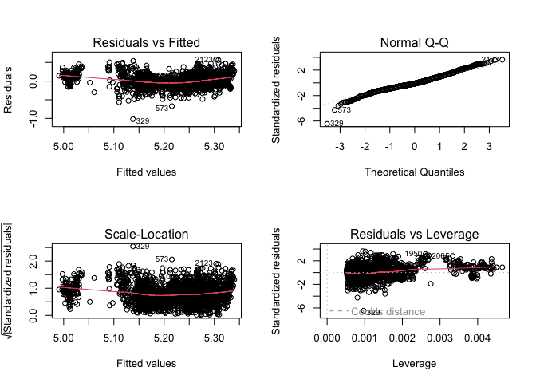

-   [Data - Training and Testing
    Sets](#data---training-and-testing-sets)
-   [Creating Models](#creating-models)
    -   [Convert to package sintaxe](#convert-to-package-sintaxe)
-   [Fit interface](#fit-interface)
-   [Parsnip Argument Consistency](#parsnip-argument-consistency)
-   [Model Results](#model-results)
    -   [Broom Tidy](#broom-tidy)
-   [Make Predictions](#make-predictions)
-   [Reference](#reference)

# Data - Training and Testing Sets

    library(tidyverse) # eda and transformation

    ## ── Attaching packages ─────────────────────────────────────── tidyverse 1.3.2 ──
    ## ✔ ggplot2 3.4.0     ✔ purrr   1.0.2
    ## ✔ tibble  3.2.1     ✔ dplyr   1.1.3
    ## ✔ tidyr   1.3.0     ✔ stringr 1.5.0
    ## ✔ readr   2.1.3     ✔ forcats 0.5.2
    ## ── Conflicts ────────────────────────────────────────── tidyverse_conflicts() ──
    ## ✖ dplyr::filter() masks stats::filter()
    ## ✖ dplyr::lag()    masks stats::lag()

    library(tidymodels)

    ## ── Attaching packages ────────────────────────────────────── tidymodels 1.0.0 ──
    ## ✔ broom        1.0.5     ✔ rsample      1.1.1
    ## ✔ dials        1.1.0     ✔ tune         1.1.1
    ## ✔ infer        1.0.4     ✔ workflows    1.1.2
    ## ✔ modeldata    1.0.1     ✔ workflowsets 1.0.0
    ## ✔ parsnip      1.1.0     ✔ yardstick    1.1.0
    ## ✔ recipes      1.0.6     
    ## ── Conflicts ───────────────────────────────────────── tidymodels_conflicts() ──
    ## ✖ scales::discard() masks purrr::discard()
    ## ✖ dplyr::filter()   masks stats::filter()
    ## ✖ recipes::fixed()  masks stringr::fixed()
    ## ✖ dplyr::lag()      masks stats::lag()
    ## ✖ yardstick::spec() masks readr::spec()
    ## ✖ recipes::step()   masks stats::step()
    ## • Use tidymodels_prefer() to resolve common conflicts.

    theme_set(theme_light())

    # load data from modeldata package
    data(ames, package="modeldata")
    ames <- ames %>% mutate(Sale_Price = log10(Sale_Price))

    # traning and testing subset
    set.seed(1975)
    ames_split <- initial_split(ames, prop = 0.80, strata = Sale_Price)
    ames_train <- training(ames_split)
    ames_test  <-  testing(ames_split)

# Creating Models

    library(tidymodels)
    tidymodels_prefer()

    # linear regressions

    # with lm: ordinary LM
    linear_reg() |> 
      set_engine("lm")

    ## Linear Regression Model Specification (regression)
    ## 
    ## Computational engine: lm

    # with glmnet: regularized linear regression
    linear_reg() |> 
      set_engine("glmnet")

    ## Linear Regression Model Specification (regression)
    ## 
    ## Computational engine: glmnet

    # with rstanarm: bayesian regularization
    linear_reg() |>  
      set_engine("stan")

    ## Linear Regression Model Specification (regression)
    ## 
    ## Computational engine: stan

## Convert to package sintaxe

`translate()` provides the original package\`s sintax code

    # with lm: ordinary LM
    linear_reg() |> 
      set_engine("lm") |> 
      translate()

    ## Linear Regression Model Specification (regression)
    ## 
    ## Computational engine: lm 
    ## 
    ## Model fit template:
    ## stats::lm(formula = missing_arg(), data = missing_arg(), weights = missing_arg())

    # with glmnet: regularized linear regression
    linear_reg(penalty = 1) |> 
      set_engine("glmnet") |> 
      translate()

    ## Linear Regression Model Specification (regression)
    ## 
    ## Main Arguments:
    ##   penalty = 1
    ## 
    ## Computational engine: glmnet 
    ## 
    ## Model fit template:
    ## glmnet::glmnet(x = missing_arg(), y = missing_arg(), weights = missing_arg(), 
    ##     family = "gaussian")

    # with rstanarm: bayesian regularization
    linear_reg() |>  
      set_engine("stan") |> 
      translate()

    ## Linear Regression Model Specification (regression)
    ## 
    ## Computational engine: stan 
    ## 
    ## Model fit template:
    ## rstanarm::stan_glm(formula = missing_arg(), data = missing_arg(), 
    ##     weights = missing_arg(), family = stats::gaussian, refresh = 0)

Note the `missing_arg()` placeholder!!

# Fit interface

    lm_model <- linear_reg() |> 
      set_engine("lm")

    # formula format
    lm_form_fit <- 
      lm_model |> 
      fit(Sale_Price ~ Longitude + Latitude, data=ames_train)

    lm_form_fit

    ## parsnip model object
    ## 
    ## 
    ## Call:
    ## stats::lm(formula = Sale_Price ~ Longitude + Latitude, data = data)
    ## 
    ## Coefficients:
    ## (Intercept)    Longitude     Latitude  
    ##    -312.765       -2.046        3.008

    # formula format
    lm_xy_fit <-
      lm_model |>
      fit_xy(x = select(ames_train, Longitude, Latitude),
             y = pull(ames_train, Sale_Price)) 

    lm_xy_fit

    ## parsnip model object
    ## 
    ## 
    ## Call:
    ## stats::lm(formula = ..y ~ ., data = data)
    ## 
    ## Coefficients:
    ## (Intercept)    Longitude     Latitude  
    ##    -312.765       -2.046        3.008

# Parsnip Argument Consistency

    rand_forest(trees=1000, min_n=5) |> 
      set_engine("ranger") |> 
      set_mode("regression") |> 
      translate()

    ## Random Forest Model Specification (regression)
    ## 
    ## Main Arguments:
    ##   trees = 1000
    ##   min_n = 5
    ## 
    ## Computational engine: ranger 
    ## 
    ## Model fit template:
    ## ranger::ranger(x = missing_arg(), y = missing_arg(), weights = missing_arg(), 
    ##     num.trees = 1000, min.node.size = min_rows(~5, x), num.threads = 1, 
    ##     verbose = FALSE, seed = sample.int(10^5, 1))

Note: `trees` becames `num.tree`, `min_n` becames `min.node.size`.

    rand_forest(trees=1000, min_n=5) |> 
      set_engine("randomForest") |> 
      set_mode("regression") |> 
      translate()

    ## Random Forest Model Specification (regression)
    ## 
    ## Main Arguments:
    ##   trees = 1000
    ##   min_n = 5
    ## 
    ## Computational engine: randomForest 
    ## 
    ## Model fit template:
    ## randomForest::randomForest(x = missing_arg(), y = missing_arg(), 
    ##     ntree = 1000, nodesize = min_rows(~5, x))

Note: `trees` becames `ntree`, `min_n` becames `nodesize`.

Modeling functions in parsnip separate model arguments into two
categories:

. Main arguments are more commonly used and tend to be available across
engines. . Engine arguments are either specific to a particular engine
or used more rarely.

`verbose=T` is one case of that

    rand_forest(trees=1000, min_n=5) |> 
      set_engine("ranger", verbose=T) |> 
      set_mode("regression")

    ## Random Forest Model Specification (regression)
    ## 
    ## Main Arguments:
    ##   trees = 1000
    ##   min_n = 5
    ## 
    ## Engine-Specific Arguments:
    ##   verbose = T
    ## 
    ## Computational engine: ranger

# Model Results

    lm_model <- lm_form_fit |> 
      extract_fit_engine()

    lm_model

    ## 
    ## Call:
    ## stats::lm(formula = Sale_Price ~ Longitude + Latitude, data = data)
    ## 
    ## Coefficients:
    ## (Intercept)    Longitude     Latitude  
    ##    -312.765       -2.046        3.008

    lm_model |> summary()

    ## 
    ## Call:
    ## stats::lm(formula = Sale_Price ~ Longitude + Latitude, data = data)
    ## 
    ## Residuals:
    ##      Min       1Q   Median       3Q      Max 
    ## -1.02076 -0.09747 -0.01818  0.09735  0.57457 
    ## 
    ## Coefficients:
    ##              Estimate Std. Error t value Pr(>|t|)    
    ## (Intercept) -312.7654    14.2500  -21.95   <2e-16 ***
    ## Longitude     -2.0457     0.1271  -16.10   <2e-16 ***
    ## Latitude       3.0076     0.1791   16.79   <2e-16 ***
    ## ---
    ## Signif. codes:  0 '***' 0.001 '**' 0.01 '*' 0.05 '.' 0.1 ' ' 1
    ## 
    ## Residual standard error: 0.1583 on 2339 degrees of freedom
    ## Multiple R-squared:  0.1839, Adjusted R-squared:  0.1832 
    ## F-statistic: 263.5 on 2 and 2339 DF,  p-value: < 2.2e-16

    lm_model |> vcov()

    ##             (Intercept)     Longitude      Latitude
    ## (Intercept)  203.061704  1.5373318058 -1.4060094059
    ## Longitude      1.537332  0.0161418852 -0.0006127463
    ## Latitude      -1.406009 -0.0006127463  0.0320836812

    par(mfrow = c(2, 2))
    lm_model |> plot()

## Broom Tidy

Model coefs and attributes direct from `Parsnip` object

    lm_form_fit |> tidy()

    ## # A tibble: 3 × 5
    ##   term        estimate std.error statistic  p.value
    ##   <chr>          <dbl>     <dbl>     <dbl>    <dbl>
    ## 1 (Intercept)  -313.      14.2       -21.9 3.03e-97
    ## 2 Longitude      -2.05     0.127     -16.1 2.12e-55
    ## 3 Latitude        3.01     0.179      16.8 7.88e-60

    lm_form_fit |> glance()

    ## # A tibble: 1 × 12
    ##   r.squared adj.r.squared sigma statistic   p.value    df logLik    AIC    BIC
    ##       <dbl>         <dbl> <dbl>     <dbl>     <dbl> <dbl>  <dbl>  <dbl>  <dbl>
    ## 1     0.184         0.183 0.158      264. 6.22e-104     2   996. -1984. -1961.
    ## # ℹ 3 more variables: deviance <dbl>, df.residual <int>, nobs <int>

# Make Predictions

Another area where parsnip diverges from conventional R modeling
functions is the format of values returned from predict(). For
predictions, parsnip always conforms to the following rules:

. The results are always a tibble. . The column names of the tibble are
always predictable. . There are always as many rows in the tibble as
there are in the input data set.

For example, when numeric data are predicted:

    ames_small <- 
      ames_test |> 
      sample_n(5)

    ames_small |> 
      predict(lm_form_fit, new_data=_)

    ## # A tibble: 5 × 1
    ##   .pred
    ##   <dbl>
    ## 1  5.27
    ## 2  5.29
    ## 3  5.01
    ## 4  5.17
    ## 5  5.26

The row order of the predictions are always the same as the original
data. These three rules make it easier to merge predictions with the
original data:

    bind_cols(
      select(ames_small, Sale_Price),
      predict(lm_form_fit, new_data=ames_small),
      predict(lm_form_fit, new_data=ames_small, type="pred_int")
    )

    ## # A tibble: 5 × 4
    ##   Sale_Price .pred .pred_lower .pred_upper
    ##        <dbl> <dbl>       <dbl>       <dbl>
    ## 1       5.43  5.27        4.95        5.58
    ## 2       5.58  5.29        4.98        5.60
    ## 3       5.20  5.01        4.70        5.32
    ## 4       5.04  5.17        4.86        5.48
    ## 5       5.25  5.26        4.95        5.57

Using the standard code interface.

    tree_model <- 
      decision_tree(min_n=3) |> 
      set_engine("rpart") |> 
      set_mode("regression")

    tree_model

    ## Decision Tree Model Specification (regression)
    ## 
    ## Main Arguments:
    ##   min_n = 3
    ## 
    ## Computational engine: rpart

    tree_fit <- 
      tree_model |> 
      fit(Sale_Price ~ Longitude + Latitude, data=ames_train)

    tree_fit

    ## parsnip model object
    ## 
    ## n= 2342 
    ## 
    ## node), split, n, deviance, yval
    ##       * denotes terminal node
    ## 
    ##   1) root 2342 71.7859100 5.222485  
    ##     2) Longitude>=-93.62997 902 20.5792600 5.124276  
    ##       4) Latitude< 42.05874 878 15.4257700 5.112793  
    ##         8) Latitude< 42.03842 582 12.1810900 5.092481  
    ##          16) Latitude>=42.01385 454  8.3580720 5.074173  
    ##            32) Latitude< 42.02419 59  2.2590590 4.951700 *
    ##            33) Latitude>=42.02419 395  5.0818510 5.092466 *
    ##          17) Latitude< 42.01385 128  3.1310670 5.157419  
    ##            34) Latitude< 41.99312 81  1.2543910 5.083497 *
    ##            35) Latitude>=41.99312 47  0.6712223 5.284818 *
    ##         9) Latitude>=42.03842 296  2.5324440 5.152731 *
    ##       5) Latitude>=42.05874 24  0.8022535 5.544369 *
    ##     3) Longitude< -93.62997 1440 37.0573800 5.284003  
    ##       6) Latitude< 42.0486 934 19.5865000 5.229821  
    ##        12) Latitude>=42.01873 680 14.1714700 5.202742  
    ##          24) Latitude< 42.02406 202  3.3910860 5.124440 *
    ##          25) Latitude>=42.02406 478  9.0184840 5.235832  
    ##            50) Longitude>=-93.68073 352  6.6960690 5.212905  
    ##             100) Latitude< 42.0369 218  3.5316130 5.158390 *
    ##             101) Latitude>=42.0369 134  1.4625640 5.301594 *
    ##            51) Longitude< -93.68073 126  1.6204860 5.299882  
    ##             102) Latitude>=42.03362 66  0.3776159 5.227848 *
    ##             103) Latitude< 42.03362 60  0.5236952 5.379119 *
    ##        13) Latitude< 42.01873 254  3.5815550 5.302315 *
    ##       7) Latitude>=42.0486 506  9.6678000 5.384014  
    ##        14) Longitude>=-93.65105 356  2.9236440 5.319258 *
    ##        15) Longitude< -93.65105 150  1.7083110 5.537702 *

    bind_cols(
      select(ames_small, Sale_Price),
      predict(tree_fit, new_data=ames_small)
    )

    ## # A tibble: 5 × 2
    ##   Sale_Price .pred
    ##        <dbl> <dbl>
    ## 1       5.43  5.32
    ## 2       5.58  5.32
    ## 3       5.20  5.08
    ## 4       5.04  5.09
    ## 5       5.25  5.30

Use `parsnip_addin()` to shortcut engine especification!!

# Reference

All code and text came from Max Kuhn and Julia Silge\`s book [Tidy
Modeling with R](https://www.tmwr.org/models).
