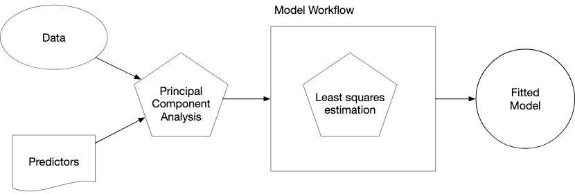

```{r setup}
library(tidymodels)
data(ames)
ames <- mutate(ames, Sale_Price = log10(Sale_Price))

set.seed(502)
ames_split <- initial_split(ames, prop = 0.80, strata = Sale_Price)
ames_train <- training(ames_split)
ames_test  <-  testing(ames_split)

lm_model <- linear_reg() %>% set_engine("lm")
```

# workflow




## workflow basics

The workflow package allows the user to bind modeling + pre processing objetcs together. Correct mental model of where model estimation occurs in the data analysis process

```{r}
lm_wflow <- 
  workflow() |> 
  add_model(lm_model)

lm_wflow
```

Notice that we have not yet specified how this workflow should preprocess the data (`Preprocessor: None`).

If your model is very simple, a standard R formula can be used as a `preprocesser`:

```{r}
lm_wflow <- 
  lm_wflow |> 
  add_formula(Sale_Price ~ Longitude + Latitude)

lm_wflow
```

Workflows have a `fit()` method that can be used to create the model.

```{r}
lm_fit <- fit(lm_wflow, ames_train)
lm_fit
```

We can also `predict()` on the fitted workflow that follows all of the same rules and naming conventions that we described for the `parsnip` package:

```{r}
predict(lm_fit, slice_head(ames_test, n=5))
```


Both the model and preprocessor can be removed or updated: 

```{r}
lm_fit |> 
  update_formula(Sale_Price ~ Longitude)
```

Note that, in this new object, the output shows that the previous fitted model was removed since the new formula is inconsistent with the previous model fit.

## Adding Raw Variables

There is another interface for passing data to the model, the `add_variables()` function, which uses a `dplyr`-like syntax for choosing variables. The function has two primary arguments: `outcomes` and `predictors`. These use a selection approach similar to the tidyselect backend of tidyverse packages to capture multiple selectors using `c()`.

```{r}
lm_wflow <-
  lm_wflow |> 
  remove_formula() |> 
  add_variables(outcomes = Sale_Price, predictors = c(Longitude, Latitude))

lm_wflow
```

When the model is fit, the specification assembles these data, unaltered, into a data frame and passes it to the underlying function:

```{r}
fit(lm_wflow, ames_train)
```

## Creating multiple workflows at once

In some situations, the data require numerous attempts to find an appropriate model. o address this problem, the workflowset package creates combinations of workflow components. A list of preprocessors (e.g., formulas, dplyr selectors, or feature engineering recipe objects discussed in the next chapter) can be combined with a list of model specifications, resulting in a set of workflows.

As an example, let’s say that we want to focus on the different ways that house location is represented in the Ames data. We can create a set of formulas that capture these predictors:

```{r}
# list of possible formules (names = formule)
locations <- list(
  longitude = Sale_Price ~ Longitude,
  latitude =  Sale_Price ~ Latitude,
  coords =  Sale_Price ~ Latitude + Longitude,
  neighborhood =  Sale_Price ~ Neighborhood
)
```

These representations can be crossed with one or more models using the `workflow_set() `function. We’ll just use the previous linear model specification to demonstrate:

```{r}
library(workflowsets)

location_models <- workflow_set(preproc = locations, models=list(lm=lm_model))

location_models
location_models$info[[1]]
extract_workflow(location_models, id="coords_lm")
```

Workflow sets are mostly designed to work with resampling. In the meantime, let’s create model fits for each formula and save them in a new column called fit. We’ll use basic dplyr and purrr operations:

```{r}
location_models <- 
  location_models |> 
  mutate( fit=map(info, ~fit(.x$workflow[[1]], ames_train)) )

location_models
location_models$fit[[1]]
```

# Evaluating the test set

Once you concluded your model development and have settled on a final model. There is a convenience function called `last_fit()` that will fit the model to the entire training set and evaluate id with the testing set.

```{r}
final_lm_res <- lm_wflow |> 
  last_fit(ames_split)

final_lm_res

```

```{r}
extract_workflow(final_lm_res)

collect_metrics(final_lm_res)
collect_predictions(final_lm_res) |> slice(1:5)
```

# Reference

All code and text came from Max Kuhn and Julia Silge`s book [Tidy Modeling with R](https://www.tmwr.org/workflows).
