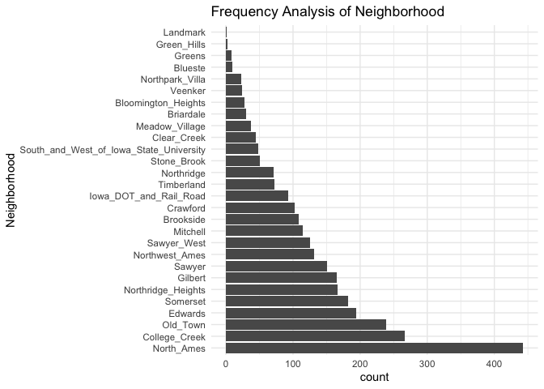
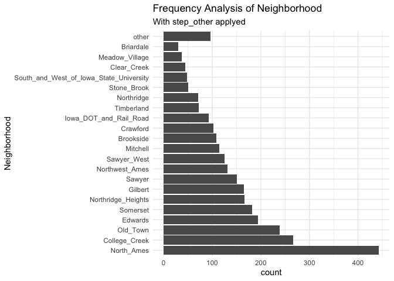
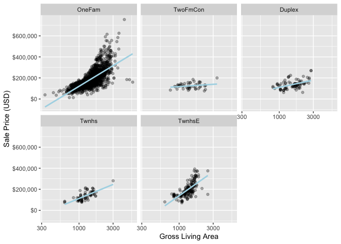
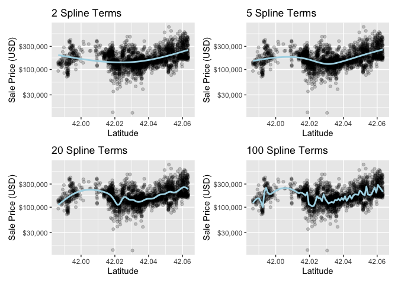

-   [Recipes](#recipes)
    -   [A Simple Recipe](#a-simple-recipe)
    -   [Using Recipes](#using-recipes)
    -   [Encoding Qualitative Data](#encoding-qualitative-data)
    -   [Extending Simple Recipe](#extending-simple-recipe)
    -   [Interaction Terms](#interaction-terms)
    -   [Spline functions](#spline-functions)
    -   [Tidy](#tidy)
-   [Reference](#reference)

# Recipes

    library(tidymodels)

    ## ── Attaching packages ────────────────────────────────────── tidymodels 1.0.0 ──

    ## ✔ broom        1.0.5     ✔ recipes      1.0.6
    ## ✔ dials        1.1.0     ✔ rsample      1.1.1
    ## ✔ dplyr        1.1.3     ✔ tibble       3.2.1
    ## ✔ ggplot2      3.4.0     ✔ tidyr        1.3.0
    ## ✔ infer        1.0.4     ✔ tune         1.1.1
    ## ✔ modeldata    1.0.1     ✔ workflows    1.1.2
    ## ✔ parsnip      1.1.0     ✔ workflowsets 1.0.0
    ## ✔ purrr        1.0.2     ✔ yardstick    1.1.0

    ## ── Conflicts ───────────────────────────────────────── tidymodels_conflicts() ──
    ## ✖ purrr::discard() masks scales::discard()
    ## ✖ dplyr::filter()  masks stats::filter()
    ## ✖ dplyr::lag()     masks stats::lag()
    ## ✖ recipes::step()  masks stats::step()
    ## • Dig deeper into tidy modeling with R at https://www.tmwr.org

    data(ames)

    ames <- mutate(ames, Sale_Price = log10(Sale_Price))

    set.seed(502)
    ames_split <- initial_split(ames, prop = 0.80, strata = Sale_Price)
    ames_train <- training(ames_split)
    ames_test  <-  testing(ames_split)

    lm_model <- linear_reg() %>% set_engine("lm")

    lm_wflow <- 
      workflow() %>% 
      add_model(lm_model) %>% 
      add_variables(outcome = Sale_Price, predictors = c(Longitude, Latitude))

    lm_fit <- fit(lm_wflow, ames_train)

## A Simple Recipe

we will focus on a small subset of the predictors available in the Ames
housing data:

-   The neighborhood (qualitative, with 29 neighborhoods in the training
    set)
-   The gross above-grade living area (continuous, named Gr\_Liv\_Area)
-   The year built (Year\_Built)
-   The type of building

Suppose that an initial ordinary linear regression model were fit to
these data. Recalling that, the sale prices were pre-logged, a standard
call to lm() might look like:

    lm(Sale_Price ~ Neighborhood + log10(Gr_Liv_Area) + Year_Built + Bldg_Type, data=ames) |> summary()

    ## 
    ## Call:
    ## lm(formula = Sale_Price ~ Neighborhood + log10(Gr_Liv_Area) + 
    ##     Year_Built + Bldg_Type, data = ames)
    ## 
    ## Residuals:
    ##      Min       1Q   Median       3Q      Max 
    ## -0.83789 -0.04051  0.00115  0.04245  0.39186 
    ## 
    ## Coefficients:
    ##                                                       Estimate Std. Error
    ## (Intercept)                                         -0.8551717  0.2066005
    ## NeighborhoodCollege_Creek                            0.0135485  0.0073316
    ## NeighborhoodOld_Town                                -0.0289607  0.0074746
    ## NeighborhoodEdwards                                 -0.0493174  0.0068010
    ## NeighborhoodSomerset                                 0.0499653  0.0086486
    ## NeighborhoodNorthridge_Heights                       0.1335758  0.0090287
    ## NeighborhoodGilbert                                 -0.0337334  0.0083591
    ## NeighborhoodSawyer                                  -0.0042779  0.0074500
    ## NeighborhoodNorthwest_Ames                           0.0004589  0.0081490
    ## NeighborhoodSawyer_West                             -0.0174582  0.0086299
    ## NeighborhoodMitchell                                 0.0004695  0.0085823
    ## NeighborhoodBrookside                               -0.0110205  0.0089257
    ## NeighborhoodCrawford                                 0.0914254  0.0089320
    ## NeighborhoodIowa_DOT_and_Rail_Road                  -0.0839821  0.0095969
    ## NeighborhoodTimberland                               0.0604062  0.0108034
    ## NeighborhoodNorthridge                               0.0845868  0.0113346
    ## NeighborhoodStone_Brook                              0.1459657  0.0128573
    ## NeighborhoodSouth_and_West_of_Iowa_State_University -0.0282535  0.0124617
    ## NeighborhoodClear_Creek                              0.0480071  0.0126039
    ## NeighborhoodMeadow_Village                          -0.0899124  0.0153282
    ## NeighborhoodBriardale                               -0.0465821  0.0175020
    ## NeighborhoodBloomington_Heights                      0.0402528  0.0169594
    ## NeighborhoodVeenker                                  0.0885538  0.0168252
    ## NeighborhoodNorthpark_Villa                          0.0262051  0.0183321
    ## NeighborhoodBlueste                                  0.0322372  0.0262466
    ## NeighborhoodGreens                                   0.1751507  0.0290318
    ## NeighborhoodGreen_Hills                              0.2229230  0.0562585
    ## NeighborhoodLandmark                                -0.0119925  0.0796196
    ## log10(Gr_Liv_Area)                                   0.6343996  0.0126012
    ## Year_Built                                           0.0020678  0.0001044
    ## Bldg_TypeTwoFmCon                                   -0.0312306  0.0104405
    ## Bldg_TypeDuplex                                     -0.1038443  0.0079704
    ## Bldg_TypeTwnhs                                      -0.0968859  0.0110076
    ## Bldg_TypeTwnhsE                                     -0.0414929  0.0068666
    ##                                                     t value Pr(>|t|)    
    ## (Intercept)                                          -4.139 3.58e-05 ***
    ## NeighborhoodCollege_Creek                             1.848 0.064710 .  
    ## NeighborhoodOld_Town                                 -3.875 0.000109 ***
    ## NeighborhoodEdwards                                  -7.251 5.27e-13 ***
    ## NeighborhoodSomerset                                  5.777 8.40e-09 ***
    ## NeighborhoodNorthridge_Heights                       14.795  < 2e-16 ***
    ## NeighborhoodGilbert                                  -4.036 5.59e-05 ***
    ## NeighborhoodSawyer                                   -0.574 0.565865    
    ## NeighborhoodNorthwest_Ames                            0.056 0.955100    
    ## NeighborhoodSawyer_West                              -2.023 0.043165 *  
    ## NeighborhoodMitchell                                  0.055 0.956374    
    ## NeighborhoodBrookside                                -1.235 0.217043    
    ## NeighborhoodCrawford                                 10.236  < 2e-16 ***
    ## NeighborhoodIowa_DOT_and_Rail_Road                   -8.751  < 2e-16 ***
    ## NeighborhoodTimberland                                5.591 2.46e-08 ***
    ## NeighborhoodNorthridge                                7.463 1.11e-13 ***
    ## NeighborhoodStone_Brook                              11.353  < 2e-16 ***
    ## NeighborhoodSouth_and_West_of_Iowa_State_University  -2.267 0.023450 *  
    ## NeighborhoodClear_Creek                               3.809 0.000142 ***
    ## NeighborhoodMeadow_Village                           -5.866 4.98e-09 ***
    ## NeighborhoodBriardale                                -2.662 0.007822 ** 
    ## NeighborhoodBloomington_Heights                       2.373 0.017686 *  
    ## NeighborhoodVeenker                                   5.263 1.52e-07 ***
    ## NeighborhoodNorthpark_Villa                           1.429 0.152979    
    ## NeighborhoodBlueste                                   1.228 0.219455    
    ## NeighborhoodGreens                                    6.033 1.81e-09 ***
    ## NeighborhoodGreen_Hills                               3.962 7.60e-05 ***
    ## NeighborhoodLandmark                                 -0.151 0.880284    
    ## log10(Gr_Liv_Area)                                   50.344  < 2e-16 ***
    ## Year_Built                                           19.805  < 2e-16 ***
    ## Bldg_TypeTwoFmCon                                    -2.991 0.002801 ** 
    ## Bldg_TypeDuplex                                     -13.029  < 2e-16 ***
    ## Bldg_TypeTwnhs                                       -8.802  < 2e-16 ***
    ## Bldg_TypeTwnhsE                                      -6.043 1.71e-09 ***
    ## ---
    ## Signif. codes:  0 '***' 0.001 '**' 0.01 '*' 0.05 '.' 0.1 ' ' 1
    ## 
    ## Residual standard error: 0.07872 on 2896 degrees of freedom
    ## Multiple R-squared:  0.8045, Adjusted R-squared:  0.8022 
    ## F-statistic:   361 on 33 and 2896 DF,  p-value: < 2.2e-16

What this formula does can be decomposed into a series of steps:

1.  Sale price is defined as the outcome while neighborhood, gross
    living area, the year built, and building type variables are all
    defined as predictors.
2.  A log transformation is applied to the gross living area predictor.
3.  The neighborhood and building type columns are converted from a
    non-numeric format to a numeric format (since least squares requires
    numeric predictors).

A recipe is also an object that defines a series of steps for data
processing. Unlike the formula method inside a modeling function, the
recipe defines the steps via step\_\*() functions without immediately
executing them; it is only a specification of what should be don

    simple_ames <- 
      recipe(Sale_Price ~ Neighborhood + Gr_Liv_Area + Year_Built + Bldg_Type, 
             data = ames_train) |> 
      step_log(Gr_Liv_Area, base=10) |> 
      step_dummy(all_nominal_predictors())

    simple_ames

    ## 

    ## ── Recipe ──────────────────────────────────────────────────────────────────────

    ## 

    ## ── Inputs

    ## Number of variables by role

    ## outcome:   1
    ## predictor: 4

    ## 

    ## ── Operations

    ## • Log transformation on: Gr_Liv_Area

    ## • Dummy variables from: all_nominal_predictors()

What is the advantage to using a recipe, over a formula or raw
predictors? There are a few, including:

1.  These computations can be recycled across models since they are not
    tightly coupled to the modeling function.
2.  A recipe enables a broader set of data processing choices than
    formulas can offer.
3.  The syntax can be very compact. For example,
    all\_nominal\_predictors() can be used to capture many variables for
    specific types of processing while a formula would require each to
    be explicitly listed.
4.  All data processing can be captured in a single R object instead of
    in scripts that are repeated, or even spread across different files.

## Using Recipes

Remove old pre processors and add a recipe

    lm_wflow <- 
      lm_wflow |> 
      remove_variables() |> 
      add_recipe(simple_ames)

    lm_wflow

    ## ══ Workflow ════════════════════════════════════════════════════════════════════
    ## Preprocessor: Recipe
    ## Model: linear_reg()
    ## 
    ## ── Preprocessor ────────────────────────────────────────────────────────────────
    ## 2 Recipe Steps
    ## 
    ## • step_log()
    ## • step_dummy()
    ## 
    ## ── Model ───────────────────────────────────────────────────────────────────────
    ## Linear Regression Model Specification (regression)
    ## 
    ## Computational engine: lm

Fit

    lm_fit <- fit(lm_wflow, ames_train)

    lm_fit |> 
      tidy() |> 
      slice(1:5)

    ## # A tibble: 5 × 5
    ##   term                       estimate std.error statistic   p.value
    ##   <chr>                         <dbl>     <dbl>     <dbl>     <dbl>
    ## 1 (Intercept)                -0.669    0.231        -2.90 3.80e-  3
    ## 2 Gr_Liv_Area                 0.620    0.0143       43.2  2.63e-299
    ## 3 Year_Built                  0.00200  0.000117     17.1  6.16e- 62
    ## 4 Neighborhood_College_Creek  0.0178   0.00819       2.17 3.02e-  2
    ## 5 Neighborhood_Old_Town      -0.0330   0.00838      -3.93 8.66e-  5

Predict

    predict(lm_fit, ames_test |> slice(1:5))

    ## Warning in predict.lm(object = object$fit, newdata = new_data, type =
    ## "response"): prediction from a rank-deficient fit may be misleading

    ## # A tibble: 5 × 1
    ##   .pred
    ##   <dbl>
    ## 1  5.08
    ## 2  5.32
    ## 3  5.28
    ## 4  5.34
    ## 5  5.31

Extracing model

    lm_fit |> 
      extract_recipe(estimated = T) # prepared

    ## 

    ## ── Recipe ──────────────────────────────────────────────────────────────────────

    ## 

    ## ── Inputs

    ## Number of variables by role

    ## outcome:   1
    ## predictor: 4

    ## 

    ## ── Training information

    ## Training data contained 2342 data points and no incomplete rows.

    ## 

    ## ── Operations

    ## • Log transformation on: Gr_Liv_Area | Trained

    ## • Dummy variables from: Neighborhood, Bldg_Type | Trained

    lm_fit |> 
      extract_fit_parsnip() |> 
      tidy() |> 
      slice(1:5)

    ## # A tibble: 5 × 5
    ##   term                       estimate std.error statistic   p.value
    ##   <chr>                         <dbl>     <dbl>     <dbl>     <dbl>
    ## 1 (Intercept)                -0.669    0.231        -2.90 3.80e-  3
    ## 2 Gr_Liv_Area                 0.620    0.0143       43.2  2.63e-299
    ## 3 Year_Built                  0.00200  0.000117     17.1  6.16e- 62
    ## 4 Neighborhood_College_Creek  0.0178   0.00819       2.17 3.02e-  2
    ## 5 Neighborhood_Old_Town      -0.0330   0.00838      -3.93 8.66e-  5

## Encoding Qualitative Data

One of the most common feature engineering tasks.

-   `step_unknow()` can be used to change missing values
-   `step_novel()` to anticipate a new factor level in future data
-   `step_other()` can be used to analyse frequencies

<!-- -->

    ames |> 
      count(Neighborhood, name = "count") |> 
      ggplot(aes(x=count, y=Neighborhood)) +
      geom_col(position = "dodge") +
      theme_minimal() +
      labs(title = "Frequency Analysis of Neighborhood")

Lumping low frequency Neighborhood

    ames |> 
      recipe(Sale_Price~Neighborhood, data=_) |> 
      step_other(all_nominal_predictors(), threshold = 0.01) |> 
      prep() |> 
      juice() |> 
      count(Neighborhood, name="count") |> 
      ggplot(aes(x=count, y=Neighborhood)) +
      geom_col(position = "dodge") +
      theme_minimal() +
      labs(title = "Frequency Analysis of Neighborhood",
           subtitle = "With step_other applyed")

## Extending Simple Recipe

    simple_ames <- 
      recipe(Sale_Price ~ Neighborhood + Gr_Liv_Area + Year_Built + Bldg_Type,
             data = ames_train) %>%
      step_log(Gr_Liv_Area, base = 10) %>% 
      step_other(Neighborhood, threshold = 0.01) %>% 
      step_dummy(all_nominal_predictors())

    simple_ames

    ## 

    ## ── Recipe ──────────────────────────────────────────────────────────────────────

    ## 

    ## ── Inputs

    ## Number of variables by role

    ## outcome:   1
    ## predictor: 4

    ## 

    ## ── Operations

    ## • Log transformation on: Gr_Liv_Area

    ## • Collapsing factor levels for: Neighborhood

    ## • Dummy variables from: all_nominal_predictors()

Many, but not all, underlying model calculations require predictor
values to be encoded as numbers. Notable exceptions include tree-based
models, rule-based models, and naive Bayes models.

The most common method for converting a factor predictor to a numeric
format is to create dummy or indicator variables.

    simple_ames |> 
      prep() |> 
      juice() |> 
      select(starts_with("Bldg_Type")) |> 
      slice(1:10) |> 
      bind_cols(
        ames_train |> 
          select(Orig_Value=Bldg_Type) |> 
          slice(1:10) 
      ) |> 
      select(Orig_Value, everything()) |> 
      (\(.x) set_names(.x, stringr::str_remove_all(names(.x), "Bldg_Type_")) )()

    ## # A tibble: 10 × 5
    ##    Orig_Value TwoFmCon Duplex Twnhs TwnhsE
    ##    <fct>         <dbl>  <dbl> <dbl>  <dbl>
    ##  1 OneFam            0      0     0      0
    ##  2 OneFam            0      0     0      0
    ##  3 Twnhs             0      0     1      0
    ##  4 Twnhs             0      0     1      0
    ##  5 TwnhsE            0      0     0      1
    ##  6 Twnhs             0      0     1      0
    ##  7 TwnhsE            0      0     0      1
    ##  8 OneFam            0      0     0      0
    ##  9 Duplex            0      1     0      0
    ## 10 OneFam            0      0     0      0

## Interaction Terms

Interaction effects involve two or more predictors. Such an effect
occurs when one predictor has an effect on the outcome that is
contingent on one or more other predictors.

    ames_train |> 
      ggplot(aes(Gr_Liv_Area, y=10^Sale_Price)) +
      geom_point(alpha=.3) +
      facet_wrap(~Bldg_Type) +
      geom_smooth(method=lm, formula=y~x, se=F, color="lightblue")+
      scale_x_log10() +
      scale_y_log10() +
      labs(x="Gross Living Area", y="Sale Price (USD)") +
      scale_y_continuous(labels = scales::label_dollar())

    ## Scale for y is already present.
    ## Adding another scale for y, which will replace the existing scale.

We might find that the regression slopes for the gross living area
differ for different building types. How are interactions specified in a
recipe? A base R formula would take an interaction using a `:`

    Sale_Price ~ Neighborhood + log10(Gr_Liv_Area) + Bldg_Type + 
      log10(Gr_Liv_Area):Bldg_Type
    # or
    Sale_Price ~ Neighborhood + log10(Gr_Liv_Area) * Bldg_Type 

Where `*` expands those columns to the main effects and interaction
term. Again, the formula method does many things simultaneously and
understands that a factor variable (such as Bldg\_Type) should be
expanded into dummy variables first and that the interaction should
involve all of the resulting binary columns.

Recipes are more explicit and sequential, and they give you more control

    simple_ames <- 
      recipe(Sale_Price ~ Neighborhood + Gr_Liv_Area + Year_Built + Bldg_Type,
             data = ames_train) %>%
      step_log(Gr_Liv_Area, base = 10) %>% 
      step_other(Neighborhood, threshold = 0.01) %>% 
      step_dummy(all_nominal_predictors()) %>% 
      # Gr_Liv_Area is on the log scale from a previous step
      step_interact( ~ Gr_Liv_Area:starts_with("Bldg_Type_") )

## Spline functions

When a predictor has a nonlinear relationship with the outcome, some
types of predictive models can adaptively approximate this relationship
during training. However, simpler is usually better and it is not
uncommon to try to use a simple model, such as a linear fit, and add in
specific nonlinear features for predictors that may need them, such as
longitude and latitude for the Ames housing data.

One common method for doing this is to use spline functions to represent
the data. Splines replace the existing numeric predictor with a set of
columns that allow a model to emulate a flexible, nonlinear relationship

    library(patchwork)
    library(splines)

    plot_smoother <- function(deg_free, ames_data) {
      ggplot(ames_data, aes(x = Latitude, y = 10 ^ Sale_Price)) +
        geom_point(alpha = .2) +
        scale_y_log10(labels=scales::label_dollar()) +
        geom_smooth(
          method = lm,
          formula = y ~ ns(x, df = deg_free),
          color = "lightblue",
          se = F
        ) +
        labs(title = paste(deg_free, "Spline Terms"), y = "Sale Price (USD)")
    }

    ( plot_smoother(2, ames_train) + plot_smoother(5, ames_train)) /
      (plot_smoother(20, ames_train) + plot_smoother(100, ames_train))

The ns() function in the splines package generates feature columns using
functions called natural splines.

Some panels in Figure clearly fit poorly; two terms underfit the data
while 100 terms overfit. The panels with five and twenty terms seem like
reasonably smooth fits that catch the main patterns of the data. This
indicates that the proper amount of “nonlinear-ness” matters. The number
of spline terms could then be considered a tuning parameter for this
model.

    ames_rec <-
      recipe(
        Sale_Price ~ Neighborhood + Gr_Liv_Area + Year_Built + Bldg_Type + Latitude + Longitude,
        data = ames_train
      ) |>
      step_log(Gr_Liv_Area, base = 10) |>
      step_other(Neighborhood, threshold = .01) |>
      step_dummy(all_nominal_predictors()) |>
      step_interact( ~ Gr_Liv_Area:starts_with("Bldg_Type_")) |>
      step_ns(Latitude, deg_free = 20)

## Tidy

Apply `tidy()` to a recipe

    ames_rec

    ## 

    ## ── Recipe ──────────────────────────────────────────────────────────────────────

    ## 

    ## ── Inputs

    ## Number of variables by role

    ## outcome:   1
    ## predictor: 6

    ## 

    ## ── Operations

    ## • Log transformation on: Gr_Liv_Area

    ## • Collapsing factor levels for: Neighborhood

    ## • Dummy variables from: all_nominal_predictors()

    ## • Interactions with: Gr_Liv_Area:starts_with("Bldg_Type_")

    ## • Natural splines on: Latitude

    tidy(ames_rec)

    ## # A tibble: 5 × 6
    ##   number operation type     trained skip  id            
    ##    <int> <chr>     <chr>    <lgl>   <lgl> <chr>         
    ## 1      1 step      log      FALSE   FALSE log_HMcZA     
    ## 2      2 step      other    FALSE   FALSE other_UkBd2   
    ## 3      3 step      dummy    FALSE   FALSE dummy_f8koT   
    ## 4      4 step      interact FALSE   FALSE interact_2r3ac
    ## 5      5 step      ns       FALSE   FALSE ns_0CwGV

We can specify the `id` of a step

    ames_rec <-
      recipe(
        Sale_Price ~ Neighborhood + Gr_Liv_Area + Year_Built + Bldg_Type + Latitude + Longitude,
        data = ames_train
      ) |>
      step_log(Gr_Liv_Area, base = 10) |>
      step_other(Neighborhood, threshold = .01, id="my_id") |>
      step_dummy(all_nominal_predictors(), id="dummy") |>
      step_interact( ~ Gr_Liv_Area:starts_with("Bldg_Type_")) |>
      step_ns(Latitude, deg_free = 20)

Fit the workflow

    lm_wflow <- 
      workflow() |> 
      add_model(lm_model) |> 
      add_recipe(ames_rec) 

    lm_fit <- fit(lm_wflow, ames_train)

The `tidy()` can be colled again along with the `id` to get our results
for a applying `step_other()`:

    estimated_recipe <- 
      lm_fit |> 
      extract_recipe(estimated=T)

    tidy(estimated_recipe, id="my_id")

    ## # A tibble: 22 × 3
    ##    terms        retained           id   
    ##    <chr>        <chr>              <chr>
    ##  1 Neighborhood North_Ames         my_id
    ##  2 Neighborhood College_Creek      my_id
    ##  3 Neighborhood Old_Town           my_id
    ##  4 Neighborhood Edwards            my_id
    ##  5 Neighborhood Somerset           my_id
    ##  6 Neighborhood Northridge_Heights my_id
    ##  7 Neighborhood Gilbert            my_id
    ##  8 Neighborhood Sawyer             my_id
    ##  9 Neighborhood Northwest_Ames     my_id
    ## 10 Neighborhood Sawyer_West        my_id
    ## # ℹ 12 more rows

    tidy(estimated_recipe, id="dummy")

    ## # A tibble: 26 × 3
    ##    terms        columns            id   
    ##    <chr>        <chr>              <chr>
    ##  1 Neighborhood College_Creek      dummy
    ##  2 Neighborhood Old_Town           dummy
    ##  3 Neighborhood Edwards            dummy
    ##  4 Neighborhood Somerset           dummy
    ##  5 Neighborhood Northridge_Heights dummy
    ##  6 Neighborhood Gilbert            dummy
    ##  7 Neighborhood Sawyer             dummy
    ##  8 Neighborhood Northwest_Ames     dummy
    ##  9 Neighborhood Sawyer_West        dummy
    ## 10 Neighborhood Mitchell           dummy
    ## # ℹ 16 more rows

# Reference

All code and text came from Max Kuhn and Julia Silge\`s book [Tidy
Modeling with R](https://www.tmwr.org/recipes).
