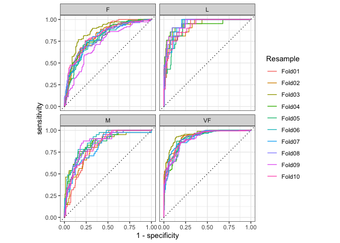

-   [Model Evaluation - Basics](#model-evaluation---basics)
    -   [Regression Metrics](#regression-metrics)
    -   [Binary Classification Metrics](#binary-classification-metrics)
        -   [ROC e AUC](#roc-e-auc)
    -   [MULTICLASS CLASSIFICATION
        METRICS](#multiclass-classification-metrics)

# Model Evaluation - Basics

This chapter will demonstrate the yardstick package, a core tidymodels
packages with the focus of measuring model performance.

    library(tidymodels)

    ## ── Attaching packages ────────────────────────────────────── tidymodels 1.0.0 ──

    ## ✔ broom        1.0.5     ✔ recipes      1.0.6
    ## ✔ dials        1.1.0     ✔ rsample      1.1.1
    ## ✔ dplyr        1.1.3     ✔ tibble       3.2.1
    ## ✔ ggplot2      3.4.0     ✔ tidyr        1.3.0
    ## ✔ infer        1.0.4     ✔ tune         1.1.1
    ## ✔ modeldata    1.0.1     ✔ workflows    1.1.2
    ## ✔ parsnip      1.1.0     ✔ workflowsets 1.0.0
    ## ✔ purrr        1.0.2     ✔ yardstick    1.1.0

    ## ── Conflicts ───────────────────────────────────────── tidymodels_conflicts() ──
    ## ✖ purrr::discard() masks scales::discard()
    ## ✖ dplyr::filter()  masks stats::filter()
    ## ✖ dplyr::lag()     masks stats::lag()
    ## ✖ recipes::step()  masks stats::step()
    ## • Use suppressPackageStartupMessages() to eliminate package startup messages

    data(ames)
    ames <- mutate(ames, Sale_Price = log10(Sale_Price))

    set.seed(502)
    ames_split <- initial_split(ames, prop = 0.80, strata = Sale_Price)
    ames_train <- training(ames_split)
    ames_test  <-  testing(ames_split)

    ames_rec <- 
      recipe(Sale_Price ~ Neighborhood + Gr_Liv_Area + Year_Built + Bldg_Type + 
               Latitude + Longitude, data = ames_train) %>%
      step_log(Gr_Liv_Area, base = 10) %>% 
      step_other(Neighborhood, threshold = 0.01) %>% 
      step_dummy(all_nominal_predictors()) %>% 
      step_interact( ~ Gr_Liv_Area:starts_with("Bldg_Type_") ) %>% 
      step_ns(Latitude, Longitude, deg_free = 20)
      
    lm_model <- linear_reg() %>% set_engine("lm")

    lm_wflow <- 
      workflow() %>% 
      add_model(lm_model) %>% 
      add_recipe(ames_rec)

    lm_fit <- fit(lm_wflow, ames_train)

## Regression Metrics

Tidymodels prediction functions produce tibbles with columns for the
predicted values. These columns have consistent names, and the functions
in the `yardstick` package that produce performance metrics have
consistent interfaces. The functions are data frame-based, as opposed to
vector-based, with the general syntax of:

    function(data, truth, ...)

Where `data` is a data frame or tibble and `truth` is the column with
the observed outcome values. The ellipses or other arguments are used to
specify the column(s) containing the predictions.

    ames_test_res <- predict(lm_fit, new_data = ames_test |> select(-Sale_Price))
    ames_test_res

    ## # A tibble: 588 × 1
    ##    .pred
    ##    <dbl>
    ##  1  5.07
    ##  2  5.31
    ##  3  5.28
    ##  4  5.33
    ##  5  5.30
    ##  6  5.24
    ##  7  5.67
    ##  8  5.52
    ##  9  5.34
    ## 10  5.00
    ## # ℹ 578 more rows

The predicted numeric outcome from the regression model is named
`.pred.` Let’s match the predicted values with their corresponding
observed outcome values

    ames_test_res <- bind_cols(ames_test_res, ames_test |> select(Sale_Price))
    ames_test_res

    ## # A tibble: 588 × 2
    ##    .pred Sale_Price
    ##    <dbl>      <dbl>
    ##  1  5.07       5.02
    ##  2  5.31       5.39
    ##  3  5.28       5.28
    ##  4  5.33       5.28
    ##  5  5.30       5.28
    ##  6  5.24       5.26
    ##  7  5.67       5.73
    ##  8  5.52       5.60
    ##  9  5.34       5.32
    ## 10  5.00       4.98
    ## # ℹ 578 more rows

We see that these values mostly look close, but we don’t yet have a
quantitative understanding of how the model is doing because we haven’t
computed any performance metrics. Note that both the predicted and
observed outcomes are in log-10 units. **It is best practice to analyze
the predictions on the transformed scale (if one were used)** even if
the predictions are reported using the original units.

    ames_test_res |> 
      ggplot(aes(x=Sale_Price, y=.pred)) +
      geom_abline(lty=2) +
      geom_point(alpha=.5) +
      labs(y="Predicted Sale Price (log10)", x="Sale Price (log10)") +
      coord_obs_pred()

There is one low-price property that is substantially over-predicted,
i.e., quite high above the dashed line. Let’s compute the root mean
squared error for this model using the `rmse()` function:

    rmse(ames_test_res, truth = Sale_Price, estimate=.pred)

    ## # A tibble: 1 × 3
    ##   .metric .estimator .estimate
    ##   <chr>   <chr>          <dbl>
    ## 1 rmse    standard      0.0736

To compute multiple metrics at once, we can create a *metric set*.

    ames_metrics <- metric_set(rmse, rsq, mae)
    ames_metrics(ames_test_res, truth=Sale_Price, estimate=.pred)

    ## # A tibble: 3 × 3
    ##   .metric .estimator .estimate
    ##   <chr>   <chr>          <dbl>
    ## 1 rmse    standard      0.0736
    ## 2 rsq     standard      0.836 
    ## 3 mae     standard      0.0549

## Binary Classification Metrics

We’ll swith a differente dataset to illustrate classification.

    data("two_class_example")
    tibble(two_class_example)

    ## # A tibble: 500 × 4
    ##    truth   Class1   Class2 predicted
    ##    <fct>    <dbl>    <dbl> <fct>    
    ##  1 Class2 0.00359 0.996    Class2   
    ##  2 Class1 0.679   0.321    Class1   
    ##  3 Class2 0.111   0.889    Class2   
    ##  4 Class1 0.735   0.265    Class1   
    ##  5 Class2 0.0162  0.984    Class2   
    ##  6 Class1 0.999   0.000725 Class1   
    ##  7 Class1 0.999   0.000799 Class1   
    ##  8 Class1 0.812   0.188    Class1   
    ##  9 Class2 0.457   0.543    Class2   
    ## 10 Class2 0.0976  0.902    Class2   
    ## # ℹ 490 more rows

The second and third columns are the predicted class probabilities for
the test set while `predicted` are the discrete predictions.

For the hard class predictions, a variety of `yardstick` functions are
helpful:

    conf_mat(two_class_example, truth = truth, estimate = predicted)

    ##           Truth
    ## Prediction Class1 Class2
    ##     Class1    227     50
    ##     Class2     31    192

    class_metrics <- metric_set(accuracy, precision, recall, sens, mcc, f_meas)
    class_metrics(two_class_example,truth = truth, estimate = predicted)

    ## # A tibble: 6 × 3
    ##   .metric   .estimator .estimate
    ##   <chr>     <chr>          <dbl>
    ## 1 accuracy  binary         0.838
    ## 2 precision binary         0.819
    ## 3 recall    binary         0.880
    ## 4 sens      binary         0.880
    ## 5 mcc       binary         0.677
    ## 6 f_meas    binary         0.849

The *Matthews correlation coefficient* and *F1 score* both summarize the
confusion matrix, but compared to `mcc()`, which measures the quality of
both positive and negative examples, the `f_meas()` metric emphasizes
the positive class, i.e., the event of interest.

There is no common convention on which factor level should automatically
be considered the “event” or “positive” result when computing binary
classification metrics. In `yardstick`, the default is to use the first
level, To alter this, change the argument `event_level` to “second” to
consider the last level of the factor the level of interest

    f_meas(two_class_example, truth, predicted, event_level = "second")

    ## # A tibble: 1 × 3
    ##   .metric .estimator .estimate
    ##   <chr>   <chr>          <dbl>
    ## 1 f_meas  binary         0.826

### ROC e AUC

There are two yardstick functions for this method: `roc_curve()`
computes the data points that make up the ROC curve and `roc_auc()`
computes the area under the curve.

    two_class_curve <- roc_curve(two_class_example, truth, Class1)

    ## Warning: Returning more (or less) than 1 row per `summarise()` group was deprecated in
    ## dplyr 1.1.0.
    ## ℹ Please use `reframe()` instead.
    ## ℹ When switching from `summarise()` to `reframe()`, remember that `reframe()`
    ##   always returns an ungrouped data frame and adjust accordingly.
    ## ℹ The deprecated feature was likely used in the yardstick package.
    ##   Please report the issue at <https://github.com/tidymodels/yardstick/issues>.
    ## This warning is displayed once every 8 hours.
    ## Call `lifecycle::last_lifecycle_warnings()` to see where this warning was
    ## generated.

    two_class_curve

    ## # A tibble: 502 × 3
    ##    .threshold specificity sensitivity
    ##         <dbl>       <dbl>       <dbl>
    ##  1 -Inf           0                 1
    ##  2    1.79e-7     0                 1
    ##  3    4.50e-6     0.00413           1
    ##  4    5.81e-6     0.00826           1
    ##  5    5.92e-6     0.0124            1
    ##  6    1.22e-5     0.0165            1
    ##  7    1.40e-5     0.0207            1
    ##  8    1.43e-5     0.0248            1
    ##  9    2.38e-5     0.0289            1
    ## 10    3.30e-5     0.0331            1
    ## # ℹ 492 more rows

    two_class_curve |> 
      mutate(specificity=1-specificity) |> 
      ggplot(aes(x=specificity, y=sensitivity)) +
      geom_line() +
      labs(x="1-specificity") +
      geom_abline(lty=2) +
      coord_obs_pred() +
      theme_light()

    # or...
    autoplot(two_class_curve)

    roc_auc(two_class_example, truth, Class1)

    ## # A tibble: 1 × 3
    ##   .metric .estimator .estimate
    ##   <chr>   <chr>          <dbl>
    ## 1 roc_auc binary         0.939

## MULTICLASS CLASSIFICATION METRICS

    data(hpc_cv)
    tibble(hpc_cv)

    ## # A tibble: 3,467 × 7
    ##    obs   pred     VF      F       M          L Resample
    ##    <fct> <fct> <dbl>  <dbl>   <dbl>      <dbl> <chr>   
    ##  1 VF    VF    0.914 0.0779 0.00848 0.0000199  Fold01  
    ##  2 VF    VF    0.938 0.0571 0.00482 0.0000101  Fold01  
    ##  3 VF    VF    0.947 0.0495 0.00316 0.00000500 Fold01  
    ##  4 VF    VF    0.929 0.0653 0.00579 0.0000156  Fold01  
    ##  5 VF    VF    0.942 0.0543 0.00381 0.00000729 Fold01  
    ##  6 VF    VF    0.951 0.0462 0.00272 0.00000384 Fold01  
    ##  7 VF    VF    0.914 0.0782 0.00767 0.0000354  Fold01  
    ##  8 VF    VF    0.918 0.0744 0.00726 0.0000157  Fold01  
    ##  9 VF    VF    0.843 0.128  0.0296  0.000192   Fold01  
    ## 10 VF    VF    0.920 0.0728 0.00703 0.0000147  Fold01  
    ## # ℹ 3,457 more rows

    hpc_cv |> 
      count(obs, pred) |> 
      pivot_wider(id_cols=obs, names_from = pred, values_from = n)

    ## # A tibble: 4 × 5
    ##   obs      VF     F     M     L
    ##   <fct> <int> <int> <int> <int>
    ## 1 VF     1620   141     6     2
    ## 2 F       371   647    24    36
    ## 3 M        64   219    79    50
    ## 4 L         9    60    28   111

    accuracy(hpc_cv, obs, pred)

    ## # A tibble: 1 × 3
    ##   .metric  .estimator .estimate
    ##   <chr>    <chr>          <dbl>
    ## 1 accuracy multiclass     0.709

    mcc(hpc_cv, obs, pred)

    ## # A tibble: 1 × 3
    ##   .metric .estimator .estimate
    ##   <chr>   <chr>          <dbl>
    ## 1 mcc     multiclass     0.515

There are methods for taking metrics designed to handle outcomes with
only two classes and extend them for outcomes with more than two
classes. For example, a metric such as sensitivity measures the true
positive rate which, by definition, is specific to two classes (i.e.,
“event” and “nonevent”)

There are wrapper methods that can be used to apply sensitivity to our
four-class outcome. These options are macro-averaging, macro-weighted
averaging, and micro-averaging:

-   Macro-averaging computes a set of one-versus-all metrics using the
    standard two-class statistics. These are averaged.
-   Macro-weighted averaging does the same but the average is weighted
    by the number of samples in each class.
-   Micro-averaging computes the contribution for each class, aggregates
    them, then computes a single metric from the aggregates.

The manual calculations for these averaging methods are:

    class_totals <- hpc_cv |> 
      count(obs, name="totals") |> 
      mutate(class_wts=totals/sum(totals))
    class_totals

    ##   obs totals  class_wts
    ## 1  VF   1769 0.51023940
    ## 2   F   1078 0.31093164
    ## 3   M    412 0.11883473
    ## 4   L    208 0.05999423

    cell_counts <- hpc_cv |> 
      group_by(obs, pred) |> 
      count() |> 
      ungroup()
    cell_counts

    ## # A tibble: 16 × 3
    ##    obs   pred      n
    ##    <fct> <fct> <int>
    ##  1 VF    VF     1620
    ##  2 VF    F       141
    ##  3 VF    M         6
    ##  4 VF    L         2
    ##  5 F     VF      371
    ##  6 F     F       647
    ##  7 F     M        24
    ##  8 F     L        36
    ##  9 M     VF       64
    ## 10 M     F       219
    ## 11 M     M        79
    ## 12 M     L        50
    ## 13 L     VF        9
    ## 14 L     F        60
    ## 15 L     M        28
    ## 16 L     L       111

    # compute sensitivities using 1 vs all
    one_versus_all <- cell_counts |> 
      filter(obs==pred) |> # true value
      full_join(class_totals, by="obs") |> 
      mutate( sens = n/totals)
    one_versus_all

    ## # A tibble: 4 × 6
    ##   obs   pred      n totals class_wts  sens
    ##   <fct> <fct> <int>  <int>     <dbl> <dbl>
    ## 1 VF    VF     1620   1769    0.510  0.916
    ## 2 F     F       647   1078    0.311  0.600
    ## 3 M     M        79    412    0.119  0.192
    ## 4 L     L       111    208    0.0600 0.534

    # Three different estimates
    one_versus_all |> 
      summarise(
        macro = mean(sens), 
        macro_wt=weighted.mean(sens, class_wts), 
        micro = sum(n)/sum(totals)
      )

    ## # A tibble: 1 × 3
    ##   macro macro_wt micro
    ##   <dbl>    <dbl> <dbl>
    ## 1 0.560    0.709 0.709

Thankfully, there is no need to manually implement these averaging
methods. Instead, `yardstick` functions can automatically apply these
methods via the `estimator` argument:

    sensitivity(hpc_cv, obs, pred, estimator = "macro")

    ## # A tibble: 1 × 3
    ##   .metric     .estimator .estimate
    ##   <chr>       <chr>          <dbl>
    ## 1 sensitivity macro          0.560

    sensitivity(hpc_cv, obs, pred, estimator = "macro_weighted")

    ## # A tibble: 1 × 3
    ##   .metric     .estimator     .estimate
    ##   <chr>       <chr>              <dbl>
    ## 1 sensitivity macro_weighted     0.709

    sensitivity(hpc_cv, obs, pred, estimator = "micro")

    ## # A tibble: 1 × 3
    ##   .metric     .estimator .estimate
    ##   <chr>       <chr>          <dbl>
    ## 1 sensitivity micro          0.709

When dealing with probability estimates, there are some metrics with
multiclass analogs.

    roc_auc(hpc_cv, obs, VF, F, M, L)

    ## # A tibble: 1 × 3
    ##   .metric .estimator .estimate
    ##   <chr>   <chr>          <dbl>
    ## 1 roc_auc hand_till      0.829

    roc_auc(hpc_cv, obs, VF, F, M, L, estimator="macro_weighted")

    ## # A tibble: 1 × 3
    ##   .metric .estimator     .estimate
    ##   <chr>   <chr>              <dbl>
    ## 1 roc_auc macro_weighted     0.868

Finally, all of these performance metrics can be computed using dplyr
groupings.

    hpc_cv |> 
      group_by(Resample) |> 
      accuracy(obs, pred)

    ## # A tibble: 10 × 4
    ##    Resample .metric  .estimator .estimate
    ##    <chr>    <chr>    <chr>          <dbl>
    ##  1 Fold01   accuracy multiclass     0.726
    ##  2 Fold02   accuracy multiclass     0.712
    ##  3 Fold03   accuracy multiclass     0.758
    ##  4 Fold04   accuracy multiclass     0.712
    ##  5 Fold05   accuracy multiclass     0.712
    ##  6 Fold06   accuracy multiclass     0.697
    ##  7 Fold07   accuracy multiclass     0.675
    ##  8 Fold08   accuracy multiclass     0.721
    ##  9 Fold09   accuracy multiclass     0.673
    ## 10 Fold10   accuracy multiclass     0.699

The groupings also translate to the autoplot() methods.

    hpc_cv |> 
      group_by(Resample) |> 
      roc_curve(obs, VF, F, M, L) |> 
      autoplot()

